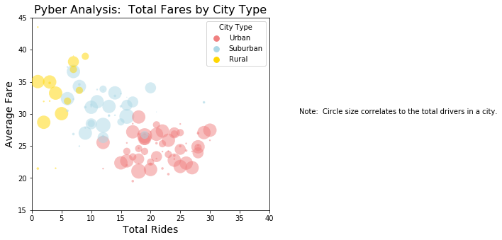
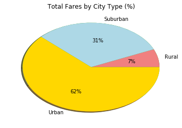
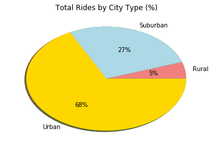
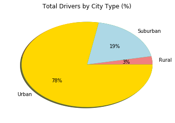

## Pyber Analysis and Plot


```python
import pandas as pd
import numpy as np
import matplotlib.pyplot as plt
from matplotlib.colors import ListedColormap
import seaborn as sns
    
```


```python
c_df = pd.read_csv("Resources/city_data.csv")
c_df.head()
```


<div>
<style scoped>
    .dataframe tbody tr th:only-of-type {
        vertical-align: middle;
    }

    .dataframe tbody tr th {
        vertical-align: top;
    }

    .dataframe thead th {
        text-align: right;
    }
</style>
<table border="1" class="dataframe">
  <thead>
    <tr style="text-align: right;">
      <th></th>
      <th>city</th>
      <th>driver_count</th>
      <th>type</th>
    </tr>
  </thead>
  <tbody>
    <tr>
      <th>0</th>
      <td>Kelseyland</td>
      <td>63</td>
      <td>Urban</td>
    </tr>
    <tr>
      <th>1</th>
      <td>Nguyenbury</td>
      <td>8</td>
      <td>Urban</td>
    </tr>
    <tr>
      <th>2</th>
      <td>East Douglas</td>
      <td>12</td>
      <td>Urban</td>
    </tr>
    <tr>
      <th>3</th>
      <td>West Dawnfurt</td>
      <td>34</td>
      <td>Urban</td>
    </tr>
    <tr>
      <th>4</th>
      <td>Rodriguezburgh</td>
      <td>52</td>
      <td>Urban</td>
    </tr>
  </tbody>
</table>
</div>


```python
r_df = pd.read_csv("Resources/ride_data.csv")
r_df.head()
```


<div>
<style scoped>
    .dataframe tbody tr th:only-of-type {
        vertical-align: middle;
    }

    .dataframe tbody tr th {
        vertical-align: top;
    }

    .dataframe thead th {
        text-align: right;
    }
</style>
<table border="1" class="dataframe">
  <thead>
    <tr style="text-align: right;">
      <th></th>
      <th>city</th>
      <th>date</th>
      <th>fare</th>
      <th>ride_id</th>
    </tr>
  </thead>
  <tbody>
    <tr>
      <th>0</th>
      <td>Sarabury</td>
      <td>2016-01-16 13:49:27</td>
      <td>38.35</td>
      <td>5403689035038</td>
    </tr>
    <tr>
      <th>1</th>
      <td>South Roy</td>
      <td>2016-01-02 18:42:34</td>
      <td>17.49</td>
      <td>4036272335942</td>
    </tr>
    <tr>
      <th>2</th>
      <td>Wiseborough</td>
      <td>2016-01-21 17:35:29</td>
      <td>44.18</td>
      <td>3645042422587</td>
    </tr>
    <tr>
      <th>3</th>
      <td>Spencertown</td>
      <td>2016-07-31 14:53:22</td>
      <td>6.87</td>
      <td>2242596575892</td>
    </tr>
    <tr>
      <th>4</th>
      <td>Nguyenbury</td>
      <td>2016-07-09 04:42:44</td>
      <td>6.28</td>
      <td>1543057793673</td>
    </tr>
  </tbody>
</table>
</div>


#### Define values
-  Average Fare ($) Per City
-  Total Number of Rides Per City
-  Total Number of Drivers Per City
-  City Type (Urban, Suburban, Rural)


```python
g_df = pd.DataFrame(r_df.groupby(by="city")["fare"].mean())
g_df.rename(columns={'fare': 'average_fare'},inplace=True)
g_df["Total Fare"] = r_df.groupby(by = 'city')["fare"].sum()
g_df["Total Rides"] = r_df.groupby(by= "city")["ride_id"].nunique()
g_df.reset_index(level = 0, inplace = True)


g_df.head()
```


<div>
<style scoped>
    .dataframe tbody tr th:only-of-type {
        vertical-align: middle;
    }

    .dataframe tbody tr th {
        vertical-align: top;
    }

    .dataframe thead th {
        text-align: right;
    }
</style>
<table border="1" class="dataframe">
  <thead>
    <tr style="text-align: right;">
      <th></th>
      <th>city</th>
      <th>average_fare</th>
      <th>Total Fare</th>
      <th>Total Rides</th>
    </tr>
  </thead>
  <tbody>
    <tr>
      <th>0</th>
      <td>Alvarezhaven</td>
      <td>23.928710</td>
      <td>741.79</td>
      <td>31</td>
    </tr>
    <tr>
      <th>1</th>
      <td>Alyssaberg</td>
      <td>20.609615</td>
      <td>535.85</td>
      <td>26</td>
    </tr>
    <tr>
      <th>2</th>
      <td>Anitamouth</td>
      <td>37.315556</td>
      <td>335.84</td>
      <td>9</td>
    </tr>
    <tr>
      <th>3</th>
      <td>Antoniomouth</td>
      <td>23.625000</td>
      <td>519.75</td>
      <td>22</td>
    </tr>
    <tr>
      <th>4</th>
      <td>Aprilchester</td>
      <td>21.981579</td>
      <td>417.65</td>
      <td>19</td>
    </tr>
  </tbody>
</table>
</div>


```python
# Put what I want to plot in a df.
plot_df = c_df.merge(g_df, how='inner', on='city')
plot_df.rename(columns={'type': 'City Type'},inplace=True)
plot_df.rename(columns={'city': 'City'},inplace=True)
plot_df.rename(columns={'driver_count': 'Total Drivers'},inplace=True)
plot_df.rename(columns={'average_fare': 'Average Fare'},inplace=True)

plot_df.head()
```


<div>
<style scoped>
    .dataframe tbody tr th:only-of-type {
        vertical-align: middle;
    }

    .dataframe tbody tr th {
        vertical-align: top;
    }

    .dataframe thead th {
        text-align: right;
    }
</style>
<table border="1" class="dataframe">
  <thead>
    <tr style="text-align: right;">
      <th></th>
      <th>City</th>
      <th>Total Drivers</th>
      <th>City Type</th>
      <th>Average Fare</th>
      <th>Total Fare</th>
      <th>Total Rides</th>
    </tr>
  </thead>
  <tbody>
    <tr>
      <th>0</th>
      <td>Kelseyland</td>
      <td>63</td>
      <td>Urban</td>
      <td>21.806429</td>
      <td>610.58</td>
      <td>28</td>
    </tr>
    <tr>
      <th>1</th>
      <td>Nguyenbury</td>
      <td>8</td>
      <td>Urban</td>
      <td>25.899615</td>
      <td>673.39</td>
      <td>26</td>
    </tr>
    <tr>
      <th>2</th>
      <td>East Douglas</td>
      <td>12</td>
      <td>Urban</td>
      <td>26.169091</td>
      <td>575.72</td>
      <td>22</td>
    </tr>
    <tr>
      <th>3</th>
      <td>West Dawnfurt</td>
      <td>34</td>
      <td>Urban</td>
      <td>22.330345</td>
      <td>647.58</td>
      <td>29</td>
    </tr>
    <tr>
      <th>4</th>
      <td>Rodriguezburgh</td>
      <td>52</td>
      <td>Urban</td>
      <td>21.332609</td>
      <td>490.65</td>
      <td>23</td>
    </tr>
  </tbody>
</table>
</div>


#### Build a Bubble Plot that showcases the relationship between the metrics collected.


```python
x_axis=np.arange(0,41,5)
y_axis=np.arange(15,50,5)
colors = ["lightcoral", "lightblue", "gold"]
sns.palplot(sns.color_palette(colors))

ax = sns.stripplot(x=plot_df["Total Rides"], y = plot_df["Average Fare"],hue=plot_df['City Type'],
                   edgecolor="black" ,palette=colors, s = plot_df["Total Drivers"]*.3, alpha = .50 )
                   
ax.set_title("Pyber Analysis:  Total Fares by City Type", fontsize=16)
ax.set_xlabel("Total Rides",fontsize=14)
ax.set_ylabel('Average Fare',fontsize=14)


ax.set_xlim(0,40)
ax.set_ylim(15,45)
ax.set_xticks(x_axis)
ax.set_xticklabels(x_axis)
ax.set_yticks(y_axis)
ax.set_yticklabels(y_axis)
ax.figure.set_size_inches(6,5)
plt.text(45, 30, r'Note:  Circle size correlates to the total drivers in a city.')

plt.show()


```





#### Observable Trend 1

Urban rides were clustered in the lower right area of the quadrant which means that while there were more rides they generally had smaller fares.  This is likely due to urban Pyber users likely are taking short trips.  On the other end of the spectrum are rural Pyber users that took much fewer rides but averaged higher fares.  There are fewer rides for rural drivers because most rural people have their own vehicles (personal observation) and if they do take a Pyber, they likely are taking longer trips (into town or on the way back from town).

#### Produce Pie Charts showing the following:
-  % of Total Fares by City Type
-  % of Total Rides by City Type
-  % of Total Drivers by City Type


```python
# % of Total Fares by City Type
total_fares = plot_df.groupby(by="City Type")["Total Fare"].sum()
print(total_fares)
labels = ['Rural','Suburban','Urban']

plt.pie(total_fares, shadow=True, startangle=180)
plt.pie(total_fares, colors=colors,autopct='%1.0f%%', labels=labels,shadow=True)
plt.title("Total Fares by City Type (%)")
plt.show()

```

    City Type
    Rural        4255.09
    Suburban    20335.69
    Urban       40078.34
    Name: Total Fare, dtype: float64
    





#### Observable Trend 2
As expected fares follow population.  While urban Pyber users _averaged_ a smaller fare, they took many more rides.  Both the population as well as the number of drivers contribute of this.


```python
# % of Total Rides by City Type
total_rides = plot_df.groupby(by="City Type")["Total Rides"].sum()
print(total_rides)

plt.pie(total_rides, shadow=True, startangle=90)
plt.pie(total_rides, colors=colors,autopct='%1.0f%%', labels=labels,shadow=True)
plt.title("Total Rides by City Type (%)")
plt.show()
```

    City Type
    Rural        125
    Suburban     657
    Urban       1625
    Name: Total Rides, dtype: int64
    





#### Observable Trend 3
Urban riders took 39% more rides than suburban riders.  This is due to population, availability of drivers, and the fact that people living outside of the urban areas typically have their own vehicles.  


```python
# % of Total Drivers by City Type
total_drivers = plot_df.groupby(by="City Type")["Total Drivers"].sum()
print(total_drivers)

plt.pie(total_drivers, shadow=True, startangle=90)
plt.pie(total_drivers, colors=colors,autopct='%1.0f%%', labels=labels,shadow=True)
plt.title("Total Drivers by City Type (%)")
plt.show()
```

    City Type
    Rural        104
    Suburban     638
    Urban       2607
    Name: Total Drivers, dtype: int64
    




