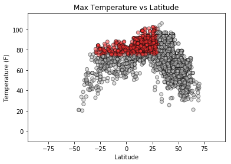
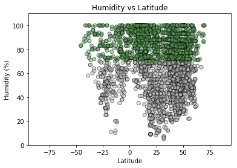
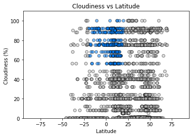
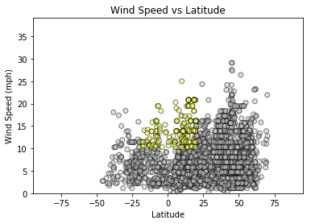

# WeatherPy


```python
#Install citipy 0.0.5
#!pip install citipy 
```

Create a Python script to visualize the weather of 500+ cities across the world of varying distance from the equator. 

Requirements:
 - Use OpenWeatherAPI
 - Use CitiPy
 - Use Matplotlib and Seaborn Libaries


```python
import json
import requests
from citipy import citipy
import pandas as pd
import matplotlib.pyplot as plt
import seaborn as sns
import numpy as np

#OpenWeatherAPI Key
from config import api_key
```

### City Dictionary and DataFrame


```python
# Create dictionary of citipy.citipy objects using citiPy library
coordinates = citipy.WORLD_CITIES_DICT
```


```python
# create dataframe from dictionary 
wc_df = pd.DataFrame.from_dict(coordinates, orient='index')
wc_df = wc_df.reset_index(inplace = False)
wc_df = wc_df.rename(columns={'index': 'Coordinates'})
wc_df.head()
```


<div>
<style scoped>
    .dataframe tbody tr th:only-of-type {
        vertical-align: middle;
    }

    .dataframe tbody tr th {
        vertical-align: top;
    }

    .dataframe thead th {
        text-align: right;
    }
</style>
<table border="1" class="dataframe">
  <thead>
    <tr style="text-align: right;">
      <th></th>
      <th>Coordinates</th>
      <th>0</th>
    </tr>
  </thead>
  <tbody>
    <tr>
      <th>0</th>
      <td>(42.5, 1.5166667)</td>
      <td>&lt;citipy.citipy.City object at 0x00000291DA97F400&gt;</td>
    </tr>
    <tr>
      <th>1</th>
      <td>(42.5666667, 1.6)</td>
      <td>&lt;citipy.citipy.City object at 0x00000291DA97F550&gt;</td>
    </tr>
    <tr>
      <th>2</th>
      <td>(42.5333333, 1.5833333)</td>
      <td>&lt;citipy.citipy.City object at 0x00000291DA97F5F8&gt;</td>
    </tr>
    <tr>
      <th>3</th>
      <td>(42.55, 1.5166667)</td>
      <td>&lt;citipy.citipy.City object at 0x00000291DA97F6D8&gt;</td>
    </tr>
    <tr>
      <th>4</th>
      <td>(42.5, 1.5333333)</td>
      <td>&lt;citipy.citipy.City object at 0x00000291DA97F780&gt;</td>
    </tr>
  </tbody>
</table>
</div>


```python
# split values from Coordinates tuple into series.
wc_df[['lat', 'lng']] = wc_df['Coordinates'].apply(pd.Series)
wc_df.head()
```


<div>
<style scoped>
    .dataframe tbody tr th:only-of-type {
        vertical-align: middle;
    }

    .dataframe tbody tr th {
        vertical-align: top;
    }

    .dataframe thead th {
        text-align: right;
    }
</style>
<table border="1" class="dataframe">
  <thead>
    <tr style="text-align: right;">
      <th></th>
      <th>Coordinates</th>
      <th>0</th>
      <th>lat</th>
      <th>lng</th>
    </tr>
  </thead>
  <tbody>
    <tr>
      <th>0</th>
      <td>(42.5, 1.5166667)</td>
      <td>&lt;citipy.citipy.City object at 0x00000291DA97F400&gt;</td>
      <td>42.500000</td>
      <td>1.516667</td>
    </tr>
    <tr>
      <th>1</th>
      <td>(42.5666667, 1.6)</td>
      <td>&lt;citipy.citipy.City object at 0x00000291DA97F550&gt;</td>
      <td>42.566667</td>
      <td>1.600000</td>
    </tr>
    <tr>
      <th>2</th>
      <td>(42.5333333, 1.5833333)</td>
      <td>&lt;citipy.citipy.City object at 0x00000291DA97F5F8&gt;</td>
      <td>42.533333</td>
      <td>1.583333</td>
    </tr>
    <tr>
      <th>3</th>
      <td>(42.55, 1.5166667)</td>
      <td>&lt;citipy.citipy.City object at 0x00000291DA97F6D8&gt;</td>
      <td>42.550000</td>
      <td>1.516667</td>
    </tr>
    <tr>
      <th>4</th>
      <td>(42.5, 1.5333333)</td>
      <td>&lt;citipy.citipy.City object at 0x00000291DA97F780&gt;</td>
      <td>42.500000</td>
      <td>1.533333</td>
    </tr>
  </tbody>
</table>
</div>


```python
# Take a sample of at least 500 cities.
cities_df = wc_df.sample(n=4000)
cities_df.head()
```


<div>
<style scoped>
    .dataframe tbody tr th:only-of-type {
        vertical-align: middle;
    }

    .dataframe tbody tr th {
        vertical-align: top;
    }

    .dataframe thead th {
        text-align: right;
    }
</style>
<table border="1" class="dataframe">
  <thead>
    <tr style="text-align: right;">
      <th></th>
      <th>Coordinates</th>
      <th>0</th>
      <th>lat</th>
      <th>lng</th>
    </tr>
  </thead>
  <tbody>
    <tr>
      <th>6881</th>
      <td>(3.724614, -76.266749)</td>
      <td>&lt;citipy.citipy.City object at 0x00000291DAD89E80&gt;</td>
      <td>3.724614</td>
      <td>-76.266749</td>
    </tr>
    <tr>
      <th>19008</th>
      <td>(26.233333, 79.85)</td>
      <td>&lt;citipy.citipy.City object at 0x00000291DB4A9CF8&gt;</td>
      <td>26.233333</td>
      <td>79.850000</td>
    </tr>
    <tr>
      <th>15031</th>
      <td>(15.3166667, -83.8666667)</td>
      <td>&lt;citipy.citipy.City object at 0x00000291DB254470&gt;</td>
      <td>15.316667</td>
      <td>-83.866667</td>
    </tr>
    <tr>
      <th>17765</th>
      <td>(27.116667, 79.716667)</td>
      <td>&lt;citipy.citipy.City object at 0x00000291DB3F02B0&gt;</td>
      <td>27.116667</td>
      <td>79.716667</td>
    </tr>
    <tr>
      <th>36171</th>
      <td>(44.4258, 39.5362)</td>
      <td>&lt;citipy.citipy.City object at 0x00000291DC00E160&gt;</td>
      <td>44.425800</td>
      <td>39.536200</td>
    </tr>
  </tbody>
</table>
</div>


### Set up Parameters and Call loop to OpenWeather API


```python
# set up params
params = {
    "appid": api_key
    
}

base_url = " http://api.openweathermap.org/data/2.5/weather?units=Imperial&"

# Counter and lists for holding data
row_count = 0
cityname = []
humidity = []
temp = []
max_temp = []
cloudiness = []
wind_speed = []
latitude=[]

for index, row in cities_df.iterrows():

    # update params with coordinates each loop    
    lat = row['lat']
    lng = row['lng']
    
   
    # Build query URL
    query_url = base_url + "appid=" + api_key + "&lat=" + str(lat) + "&lon=" + str(lng)
    
    # Print log to ensure loop is working correctly
    print(f"Now retrieving city #{row_count}")
    row_count += 1

    # Run requests to grab the JSON at the requested URL
    response = requests.get(query_url)
    weather = response.json()
    print(response.url)
        
    # Append the lat/lng to the appropriate columns
    latitude.append(weather['coord']['lat'])
    cityname.append(weather['name'])
    humidity.append(weather['main']['humidity'])
    temp.append(weather['main']['temp'])
    max_temp.append(weather['main']['temp_max'])
    cloudiness.append(weather['clouds']['all'])
    wind_speed.append(weather['wind']['speed'])

```

    Now retrieving city #0
    http://api.openweathermap.org/data/2.5/weather?units=Imperial&appid=8174be074e02b14b682ba914d2119cb4&lat=3.724614&lon=-76.266749
    Now retrieving city #1
    http://api.openweathermap.org/data/2.5/weather?units=Imperial&appid=8174be074e02b14b682ba914d2119cb4&lat=26.233333&lon=79.85
    Now retrieving city #2
    http://api.openweathermap.org/data/2.5/weather?units=Imperial&appid=8174be074e02b14b682ba914d2119cb4&lat=15.3166667&lon=-83.8666667
    Now retrieving city #3
    http://api.openweathermap.org/data/2.5/weather?units=Imperial&appid=8174be074e02b14b682ba914d2119cb4&lat=27.116667&lon=79.716667
    Now retrieving city #4
    http://api.openweathermap.org/data/2.5/weather?units=Imperial&appid=8174be074e02b14b682ba914d2119cb4&lat=44.4258&lon=39.5362
    Now retrieving city #5
    http://api.openweathermap.org/data/2.5/weather?units=Imperial&appid=8174be074e02b14b682ba914d2119cb4&lat=27.1&lon=83.283333
    Now retrieving city #6
    http://api.openweathermap.org/data/2.5/weather?units=Imperial&appid=8174be074e02b14b682ba914d2119cb4&lat=44.8994444&lon=-97.1147222
    Now retrieving city #7
    http://api.openweathermap.org/data/2.5/weather?units=Imperial&appid=8174be074e02b14b682ba914d2119cb4&lat=33.340585&lon=129.69504
    Now retrieving city #8
    http://api.openweathermap.org/data/2.5/weather?units=Imperial&appid=8174be074e02b14b682ba914d2119cb4&lat=41.7836111&lon=19.6436111
    Now retrieving city #9
    http://api.openweathermap.org/data/2.5/weather?units=Imperial&appid=8174be074e02b14b682ba914d2119cb4&lat=54.433333&lon=113.6
    Now retrieving city #10
    http://api.openweathermap.org/data/2.5/weather?units=Imperial&appid=8174be074e02b14b682ba914d2119cb4&lat=48.316667&lon=11.666667
    Now retrieving city #11
    http://api.openweathermap.org/data/2.5/weather?units=Imperial&appid=8174be074e02b14b682ba914d2119cb4&lat=26.882511&lon=88.27729
    Now retrieving city #12
    http://api.openweathermap.org/data/2.5/weather?units=Imperial&appid=8174be074e02b14b682ba914d2119cb4&lat=23.216667&lon=81.533333
    Now retrieving city #13
    http://api.openweathermap.org/data/2.5/weather?units=Imperial&appid=8174be074e02b14b682ba914d2119cb4&lat=8.3166667&lon=-81.2166667
    Now retrieving city #14
    http://api.openweathermap.org/data/2.5/weather?units=Imperial&appid=8174be074e02b14b682ba914d2119cb4&lat=26.882513&lon=67.680695
    Now retrieving city #15
    http://api.openweathermap.org/data/2.5/weather?units=Imperial&appid=8174be074e02b14b682ba914d2119cb4&lat=-28.775417&lon=32.054005
    Now retrieving city #16
    http://api.openweathermap.org/data/2.5/weather?units=Imperial&appid=8174be074e02b14b682ba914d2119cb4&lat=46.716667&lon=26.833333
    Now retrieving city #17
    http://api.openweathermap.org/data/2.5/weather?units=Imperial&appid=8174be074e02b14b682ba914d2119cb4&lat=31.5783333&lon=-84.1558333
    Now retrieving city #18
    http://api.openweathermap.org/data/2.5/weather?units=Imperial&appid=8174be074e02b14b682ba914d2119cb4&lat=61.622833&lon=50.7573
    Now retrieving city #19
    http://api.openweathermap.org/data/2.5/weather?units=Imperial&appid=8174be074e02b14b682ba914d2119cb4&lat=55.983333&lon=-3.4
    Now retrieving city #20
    http://api.openweathermap.org/data/2.5/weather?units=Imperial&appid=8174be074e02b14b682ba914d2119cb4&lat=53.718862&lon=46.071182
    Now retrieving city #21
    http://api.openweathermap.org/data/2.5/weather?units=Imperial&appid=8174be074e02b14b682ba914d2119cb4&lat=58.909656&lon=53.269066
    Now retrieving city #22
    http://api.openweathermap.org/data/2.5/weather?units=Imperial&appid=8174be074e02b14b682ba914d2119cb4&lat=44.13&lon=18.5827778
    Now retrieving city #23
    http://api.openweathermap.org/data/2.5/weather?units=Imperial&appid=8174be074e02b14b682ba914d2119cb4&lat=38.1333333&lon=23.8833333
    Now retrieving city #24
    http://api.openweathermap.org/data/2.5/weather?units=Imperial&appid=8174be074e02b14b682ba914d2119cb4&lat=48.320197&lon=0.820593
    Now retrieving city #25
    http://api.openweathermap.org/data/2.5/weather?units=Imperial&appid=8174be074e02b14b682ba914d2119cb4&lat=61.133333&lon=10.5
    Now retrieving city #26
    http://api.openweathermap.org/data/2.5/weather?units=Imperial&appid=8174be074e02b14b682ba914d2119cb4&lat=50.983333&lon=4.466667
    Now retrieving city #27
    http://api.openweathermap.org/data/2.5/weather?units=Imperial&appid=8174be074e02b14b682ba914d2119cb4&lat=-29.683333&lon=-53.8
    Now retrieving city #28
    http://api.openweathermap.org/data/2.5/weather?units=Imperial&appid=8174be074e02b14b682ba914d2119cb4&lat=-21.7&lon=-45.266667
    Now retrieving city #29
    http://api.openweathermap.org/data/2.5/weather?units=Imperial&appid=8174be074e02b14b682ba914d2119cb4&lat=55.495673&lon=38.650636
    Now retrieving city #30
    http://api.openweathermap.org/data/2.5/weather?units=Imperial&appid=8174be074e02b14b682ba914d2119cb4&lat=52.9492&lon=108.2217
    Now retrieving city #31
    http://api.openweathermap.org/data/2.5/weather?units=Imperial&appid=8174be074e02b14b682ba914d2119cb4&lat=34.0638889&lon=-80.9583333
    Now retrieving city #32
    http://api.openweathermap.org/data/2.5/weather?units=Imperial&appid=8174be074e02b14b682ba914d2119cb4&lat=44.900833&lon=22.366944
    Now retrieving city #33
    http://api.openweathermap.org/data/2.5/weather?units=Imperial&appid=8174be074e02b14b682ba914d2119cb4&lat=50.133333&lon=-97.316667
    Now retrieving city #34
    http://api.openweathermap.org/data/2.5/weather?units=Imperial&appid=8174be074e02b14b682ba914d2119cb4&lat=48.066667&lon=24.233333
    Now retrieving city #35
    http://api.openweathermap.org/data/2.5/weather?units=Imperial&appid=8174be074e02b14b682ba914d2119cb4&lat=36.595299&lon=-4.639861
    Now retrieving city #36
    http://api.openweathermap.org/data/2.5/weather?units=Imperial&appid=8174be074e02b14b682ba914d2119cb4&lat=44.117222&lon=41.475556
    Now retrieving city #37
    http://api.openweathermap.org/data/2.5/weather?units=Imperial&appid=8174be074e02b14b682ba914d2119cb4&lat=-20.4286111&lon=57.6530556
    Now retrieving city #38
    http://api.openweathermap.org/data/2.5/weather?units=Imperial&appid=8174be074e02b14b682ba914d2119cb4&lat=32.815556&lon=34.989167
    Now retrieving city #39
    http://api.openweathermap.org/data/2.5/weather?units=Imperial&appid=8174be074e02b14b682ba914d2119cb4&lat=40.916667&lon=14.3
    Now retrieving city #40
    http://api.openweathermap.org/data/2.5/weather?units=Imperial&appid=8174be074e02b14b682ba914d2119cb4&lat=-10.65&lon=-68.516667
    Now retrieving city #41
    http://api.openweathermap.org/data/2.5/weather?units=Imperial&appid=8174be074e02b14b682ba914d2119cb4&lat=45.183333&lon=28.666667
    Now retrieving city #42
    http://api.openweathermap.org/data/2.5/weather?units=Imperial&appid=8174be074e02b14b682ba914d2119cb4&lat=47.199358&lon=18.139543
    Now retrieving city #43
    http://api.openweathermap.org/data/2.5/weather?units=Imperial&appid=8174be074e02b14b682ba914d2119cb4&lat=58.663982&lon=37.260403
    Now retrieving city #44
    http://api.openweathermap.org/data/2.5/weather?units=Imperial&appid=8174be074e02b14b682ba914d2119cb4&lat=22.3&lon=72.616667
    Now retrieving city #45
    http://api.openweathermap.org/data/2.5/weather?units=Imperial&appid=8174be074e02b14b682ba914d2119cb4&lat=47.533333&lon=25.5
    Now retrieving city #46
    http://api.openweathermap.org/data/2.5/weather?units=Imperial&appid=8174be074e02b14b682ba914d2119cb4&lat=63.6&lon=-135.916667
    Now retrieving city #47
    http://api.openweathermap.org/data/2.5/weather?units=Imperial&appid=8174be074e02b14b682ba914d2119cb4&lat=10.701111&lon=122.6275
    Now retrieving city #48
    http://api.openweathermap.org/data/2.5/weather?units=Imperial&appid=8174be074e02b14b682ba914d2119cb4&lat=50.366759&lon=14.961847
    Now retrieving city #49
    http://api.openweathermap.org/data/2.5/weather?units=Imperial&appid=8174be074e02b14b682ba914d2119cb4&lat=43.745556&lon=43.200278
    Now retrieving city #50
    http://api.openweathermap.org/data/2.5/weather?units=Imperial&appid=8174be074e02b14b682ba914d2119cb4&lat=45.55&lon=27.05
    Now retrieving city #51
    http://api.openweathermap.org/data/2.5/weather?units=Imperial&appid=8174be074e02b14b682ba914d2119cb4&lat=59.583333&lon=151.283333
    Now retrieving city #52
    http://api.openweathermap.org/data/2.5/weather?units=Imperial&appid=8174be074e02b14b682ba914d2119cb4&lat=50.783333&lon=7.883333
    Now retrieving city #53
    http://api.openweathermap.org/data/2.5/weather?units=Imperial&appid=8174be074e02b14b682ba914d2119cb4&lat=41.95&lon=24.2166667
    Now retrieving city #54
    http://api.openweathermap.org/data/2.5/weather?units=Imperial&appid=8174be074e02b14b682ba914d2119cb4&lat=-8.833333&lon=-36.033333
    Now retrieving city #55
    http://api.openweathermap.org/data/2.5/weather?units=Imperial&appid=8174be074e02b14b682ba914d2119cb4&lat=18.416667&lon=-98.016667
    Now retrieving city #56
    http://api.openweathermap.org/data/2.5/weather?units=Imperial&appid=8174be074e02b14b682ba914d2119cb4&lat=23.053325&lon=113.512148
    Now retrieving city #57
    http://api.openweathermap.org/data/2.5/weather?units=Imperial&appid=8174be074e02b14b682ba914d2119cb4&lat=46.783333&lon=24.133333
    Now retrieving city #58
    http://api.openweathermap.org/data/2.5/weather?units=Imperial&appid=8174be074e02b14b682ba914d2119cb4&lat=21.833333&lon=-105.066667
    Now retrieving city #59
    http://api.openweathermap.org/data/2.5/weather?units=Imperial&appid=8174be074e02b14b682ba914d2119cb4&lat=45.8641667&lon=-122.8052778
    Now retrieving city #60
    http://api.openweathermap.org/data/2.5/weather?units=Imperial&appid=8174be074e02b14b682ba914d2119cb4&lat=-37.8&lon=174.883333
    Now retrieving city #61
    http://api.openweathermap.org/data/2.5/weather?units=Imperial&appid=8174be074e02b14b682ba914d2119cb4&lat=55.783333&lon=-4.633333
    Now retrieving city #62
    http://api.openweathermap.org/data/2.5/weather?units=Imperial&appid=8174be074e02b14b682ba914d2119cb4&lat=12.1508333&lon=-86.2683333
    Now retrieving city #63
    http://api.openweathermap.org/data/2.5/weather?units=Imperial&appid=8174be074e02b14b682ba914d2119cb4&lat=38.2486111&lon=22.0819444
    Now retrieving city #64
    http://api.openweathermap.org/data/2.5/weather?units=Imperial&appid=8174be074e02b14b682ba914d2119cb4&lat=22.816667&lon=70.833333
    Now retrieving city #65
    http://api.openweathermap.org/data/2.5/weather?units=Imperial&appid=8174be074e02b14b682ba914d2119cb4&lat=47.2&lon=23.05
    Now retrieving city #66
    http://api.openweathermap.org/data/2.5/weather?units=Imperial&appid=8174be074e02b14b682ba914d2119cb4&lat=0.5172222&lon=42.0711111
    Now retrieving city #67
    http://api.openweathermap.org/data/2.5/weather?units=Imperial&appid=8174be074e02b14b682ba914d2119cb4&lat=7.909028&lon=98.333195
    Now retrieving city #68
    http://api.openweathermap.org/data/2.5/weather?units=Imperial&appid=8174be074e02b14b682ba914d2119cb4&lat=56.05017&lon=51.967584
    Now retrieving city #69
    http://api.openweathermap.org/data/2.5/weather?units=Imperial&appid=8174be074e02b14b682ba914d2119cb4&lat=-34.921454&lon=-57.954533
    Now retrieving city #70
    http://api.openweathermap.org/data/2.5/weather?units=Imperial&appid=8174be074e02b14b682ba914d2119cb4&lat=36.0769444&lon=-87.3877778
    Now retrieving city #71
    http://api.openweathermap.org/data/2.5/weather?units=Imperial&appid=8174be074e02b14b682ba914d2119cb4&lat=18.983333&lon=75.766667
    Now retrieving city #72
    http://api.openweathermap.org/data/2.5/weather?units=Imperial&appid=8174be074e02b14b682ba914d2119cb4&lat=47.252851&lon=8.690581
    Now retrieving city #73
    http://api.openweathermap.org/data/2.5/weather?units=Imperial&appid=8174be074e02b14b682ba914d2119cb4&lat=-18.2833333&lon=-59.8166667
    Now retrieving city #74
    http://api.openweathermap.org/data/2.5/weather?units=Imperial&appid=8174be074e02b14b682ba914d2119cb4&lat=6.087222&lon=125.702222
    Now retrieving city #75
    http://api.openweathermap.org/data/2.5/weather?units=Imperial&appid=8174be074e02b14b682ba914d2119cb4&lat=8.878333&lon=125.038889
    Now retrieving city #76
    http://api.openweathermap.org/data/2.5/weather?units=Imperial&appid=8174be074e02b14b682ba914d2119cb4&lat=10.2983333&lon=-67.7161111
    Now retrieving city #77
    http://api.openweathermap.org/data/2.5/weather?units=Imperial&appid=8174be074e02b14b682ba914d2119cb4&lat=46.916667&lon=27.683333
    Now retrieving city #78
    http://api.openweathermap.org/data/2.5/weather?units=Imperial&appid=8174be074e02b14b682ba914d2119cb4&lat=1.094727&lon=-77.394821
    Now retrieving city #79
    http://api.openweathermap.org/data/2.5/weather?units=Imperial&appid=8174be074e02b14b682ba914d2119cb4&lat=22.7&lon=90.3666667
    Now retrieving city #80
    http://api.openweathermap.org/data/2.5/weather?units=Imperial&appid=8174be074e02b14b682ba914d2119cb4&lat=28.6697222&lon=-81.2083333
    Now retrieving city #81
    http://api.openweathermap.org/data/2.5/weather?units=Imperial&appid=8174be074e02b14b682ba914d2119cb4&lat=56.739341&lon=38.856259
    Now retrieving city #82
    http://api.openweathermap.org/data/2.5/weather?units=Imperial&appid=8174be074e02b14b682ba914d2119cb4&lat=-7.783333&lon=-39.916667
    Now retrieving city #83
    http://api.openweathermap.org/data/2.5/weather?units=Imperial&appid=8174be074e02b14b682ba914d2119cb4&lat=60.542222&lon=5.288333
    Now retrieving city #84
    http://api.openweathermap.org/data/2.5/weather?units=Imperial&appid=8174be074e02b14b682ba914d2119cb4&lat=47.370719&lon=8.639834
    Now retrieving city #85
    http://api.openweathermap.org/data/2.5/weather?units=Imperial&appid=8174be074e02b14b682ba914d2119cb4&lat=40.416667&lon=15.083333
    Now retrieving city #86
    http://api.openweathermap.org/data/2.5/weather?units=Imperial&appid=8174be074e02b14b682ba914d2119cb4&lat=37.65&lon=139.05
    Now retrieving city #87
    http://api.openweathermap.org/data/2.5/weather?units=Imperial&appid=8174be074e02b14b682ba914d2119cb4&lat=20.616667&lon=-87.066667
    Now retrieving city #88
    http://api.openweathermap.org/data/2.5/weather?units=Imperial&appid=8174be074e02b14b682ba914d2119cb4&lat=36.383333&lon=140.266667
    Now retrieving city #89
    http://api.openweathermap.org/data/2.5/weather?units=Imperial&appid=8174be074e02b14b682ba914d2119cb4&lat=-28.166784&lon=30.233707
    Now retrieving city #90
    http://api.openweathermap.org/data/2.5/weather?units=Imperial&appid=8174be074e02b14b682ba914d2119cb4&lat=54.630233&lon=43.214833
    Now retrieving city #91
    http://api.openweathermap.org/data/2.5/weather?units=Imperial&appid=8174be074e02b14b682ba914d2119cb4&lat=40.4263889&lon=71.4955556
    Now retrieving city #92
    http://api.openweathermap.org/data/2.5/weather?units=Imperial&appid=8174be074e02b14b682ba914d2119cb4&lat=45.716667&lon=8.266667
    Now retrieving city #93
    http://api.openweathermap.org/data/2.5/weather?units=Imperial&appid=8174be074e02b14b682ba914d2119cb4&lat=21.466667&lon=-103.483333
    Now retrieving city #94
    http://api.openweathermap.org/data/2.5/weather?units=Imperial&appid=8174be074e02b14b682ba914d2119cb4&lat=19.215278&lon=-98.238889
    Now retrieving city #95
    http://api.openweathermap.org/data/2.5/weather?units=Imperial&appid=8174be074e02b14b682ba914d2119cb4&lat=21.935&lon=86.721389
    Now retrieving city #96
    http://api.openweathermap.org/data/2.5/weather?units=Imperial&appid=8174be074e02b14b682ba914d2119cb4&lat=48.3833333&lon=20.0333333
    Now retrieving city #97
    http://api.openweathermap.org/data/2.5/weather?units=Imperial&appid=8174be074e02b14b682ba914d2119cb4&lat=40.9333333&lon=24.3
    Now retrieving city #98
    http://api.openweathermap.org/data/2.5/weather?units=Imperial&appid=8174be074e02b14b682ba914d2119cb4&lat=43.535833&lon=22.082222
    Now retrieving city #99
    http://api.openweathermap.org/data/2.5/weather?units=Imperial&appid=8174be074e02b14b682ba914d2119cb4&lat=-7.7913889&lon=-79.2216667
    Now retrieving city #100
    http://api.openweathermap.org/data/2.5/weather?units=Imperial&appid=8174be074e02b14b682ba914d2119cb4&lat=-24.6333333&lon=17.9666667
    Now retrieving city #101
    http://api.openweathermap.org/data/2.5/weather?units=Imperial&appid=8174be074e02b14b682ba914d2119cb4&lat=47.122092&lon=19.93714
    Now retrieving city #102
    http://api.openweathermap.org/data/2.5/weather?units=Imperial&appid=8174be074e02b14b682ba914d2119cb4&lat=-27.316667&lon=-56.35
    Now retrieving city #103
    http://api.openweathermap.org/data/2.5/weather?units=Imperial&appid=8174be074e02b14b682ba914d2119cb4&lat=7.030833&lon=124.304167
    Now retrieving city #104
    http://api.openweathermap.org/data/2.5/weather?units=Imperial&appid=8174be074e02b14b682ba914d2119cb4&lat=25.214167&lon=50.807222
    Now retrieving city #105
    http://api.openweathermap.org/data/2.5/weather?units=Imperial&appid=8174be074e02b14b682ba914d2119cb4&lat=24.533333&lon=-104.333333
    Now retrieving city #106
    http://api.openweathermap.org/data/2.5/weather?units=Imperial&appid=8174be074e02b14b682ba914d2119cb4&lat=38.35&lon=15.85
    Now retrieving city #107
    http://api.openweathermap.org/data/2.5/weather?units=Imperial&appid=8174be074e02b14b682ba914d2119cb4&lat=25.916667&lon=73.666667
    Now retrieving city #108
    http://api.openweathermap.org/data/2.5/weather?units=Imperial&appid=8174be074e02b14b682ba914d2119cb4&lat=51.233333&lon=4.533333
    Now retrieving city #109
    http://api.openweathermap.org/data/2.5/weather?units=Imperial&appid=8174be074e02b14b682ba914d2119cb4&lat=49.601944&lon=8.471944
    Now retrieving city #110
    http://api.openweathermap.org/data/2.5/weather?units=Imperial&appid=8174be074e02b14b682ba914d2119cb4&lat=-9.583333&lon=-36.233333
    Now retrieving city #111
    http://api.openweathermap.org/data/2.5/weather?units=Imperial&appid=8174be074e02b14b682ba914d2119cb4&lat=-29.14003&lon=-59.262564
    Now retrieving city #112
    http://api.openweathermap.org/data/2.5/weather?units=Imperial&appid=8174be074e02b14b682ba914d2119cb4&lat=50.05&lon=9.7
    Now retrieving city #113
    http://api.openweathermap.org/data/2.5/weather?units=Imperial&appid=8174be074e02b14b682ba914d2119cb4&lat=1.6561&lon=103.6032
    Now retrieving city #114
    http://api.openweathermap.org/data/2.5/weather?units=Imperial&appid=8174be074e02b14b682ba914d2119cb4&lat=-8.466667&lon=140.333333
    Now retrieving city #115
    http://api.openweathermap.org/data/2.5/weather?units=Imperial&appid=8174be074e02b14b682ba914d2119cb4&lat=45.1&lon=25.766667
    Now retrieving city #116
    http://api.openweathermap.org/data/2.5/weather?units=Imperial&appid=8174be074e02b14b682ba914d2119cb4&lat=19.4833333&lon=-70.6
    Now retrieving city #117
    http://api.openweathermap.org/data/2.5/weather?units=Imperial&appid=8174be074e02b14b682ba914d2119cb4&lat=41.540328&lon=2.26524
    Now retrieving city #118
    http://api.openweathermap.org/data/2.5/weather?units=Imperial&appid=8174be074e02b14b682ba914d2119cb4&lat=15.5232&lon=120.7925
    Now retrieving city #119
    http://api.openweathermap.org/data/2.5/weather?units=Imperial&appid=8174be074e02b14b682ba914d2119cb4&lat=21.733333&lon=81.933333
    Now retrieving city #120
    http://api.openweathermap.org/data/2.5/weather?units=Imperial&appid=8174be074e02b14b682ba914d2119cb4&lat=48.2&lon=14.466667
    Now retrieving city #121
    http://api.openweathermap.org/data/2.5/weather?units=Imperial&appid=8174be074e02b14b682ba914d2119cb4&lat=53.6355&lon=38.2002
    Now retrieving city #122
    http://api.openweathermap.org/data/2.5/weather?units=Imperial&appid=8174be074e02b14b682ba914d2119cb4&lat=50.983333&lon=4.633333
    Now retrieving city #123
    http://api.openweathermap.org/data/2.5/weather?units=Imperial&appid=8174be074e02b14b682ba914d2119cb4&lat=27.466667&lon=77.333333
    Now retrieving city #124
    http://api.openweathermap.org/data/2.5/weather?units=Imperial&appid=8174be074e02b14b682ba914d2119cb4&lat=12.75&lon=78.366667
    Now retrieving city #125
    http://api.openweathermap.org/data/2.5/weather?units=Imperial&appid=8174be074e02b14b682ba914d2119cb4&lat=15.4166667&lon=-88.1833333
    Now retrieving city #126
    http://api.openweathermap.org/data/2.5/weather?units=Imperial&appid=8174be074e02b14b682ba914d2119cb4&lat=48.139892&lon=37.742549
    Now retrieving city #127
    http://api.openweathermap.org/data/2.5/weather?units=Imperial&appid=8174be074e02b14b682ba914d2119cb4&lat=39.033333&lon=16.983333
    Now retrieving city #128
    http://api.openweathermap.org/data/2.5/weather?units=Imperial&appid=8174be074e02b14b682ba914d2119cb4&lat=39.216667&lon=9.116667
    Now retrieving city #129
    http://api.openweathermap.org/data/2.5/weather?units=Imperial&appid=8174be074e02b14b682ba914d2119cb4&lat=-8.9&lon=-36.483333
    Now retrieving city #130
    http://api.openweathermap.org/data/2.5/weather?units=Imperial&appid=8174be074e02b14b682ba914d2119cb4&lat=13.5&lon=-88.8666667
    Now retrieving city #131
    http://api.openweathermap.org/data/2.5/weather?units=Imperial&appid=8174be074e02b14b682ba914d2119cb4&lat=-22.133333&lon=-56.516667
    Now retrieving city #132
    http://api.openweathermap.org/data/2.5/weather?units=Imperial&appid=8174be074e02b14b682ba914d2119cb4&lat=69.383333&lon=178.416667
    Now retrieving city #133
    http://api.openweathermap.org/data/2.5/weather?units=Imperial&appid=8174be074e02b14b682ba914d2119cb4&lat=55.608889&lon=64.9375
    Now retrieving city #134
    http://api.openweathermap.org/data/2.5/weather?units=Imperial&appid=8174be074e02b14b682ba914d2119cb4&lat=69.45&lon=25.5
    Now retrieving city #135
    http://api.openweathermap.org/data/2.5/weather?units=Imperial&appid=8174be074e02b14b682ba914d2119cb4&lat=47.7&lon=23.4
    Now retrieving city #136
    http://api.openweathermap.org/data/2.5/weather?units=Imperial&appid=8174be074e02b14b682ba914d2119cb4&lat=48.734217&lon=7.056016
    Now retrieving city #137
    http://api.openweathermap.org/data/2.5/weather?units=Imperial&appid=8174be074e02b14b682ba914d2119cb4&lat=8.287222&lon=124.945556
    Now retrieving city #138
    http://api.openweathermap.org/data/2.5/weather?units=Imperial&appid=8174be074e02b14b682ba914d2119cb4&lat=18.216389&lon=42.505278
    Now retrieving city #139
    http://api.openweathermap.org/data/2.5/weather?units=Imperial&appid=8174be074e02b14b682ba914d2119cb4&lat=6.035556&lon=125.298056
    Now retrieving city #140
    http://api.openweathermap.org/data/2.5/weather?units=Imperial&appid=8174be074e02b14b682ba914d2119cb4&lat=43.833333&lon=10.483333
    Now retrieving city #141
    http://api.openweathermap.org/data/2.5/weather?units=Imperial&appid=8174be074e02b14b682ba914d2119cb4&lat=48.857747&lon=36.555046
    Now retrieving city #142
    http://api.openweathermap.org/data/2.5/weather?units=Imperial&appid=8174be074e02b14b682ba914d2119cb4&lat=52.033333&lon=6.833333
    Now retrieving city #143
    http://api.openweathermap.org/data/2.5/weather?units=Imperial&appid=8174be074e02b14b682ba914d2119cb4&lat=32.985414&lon=70.602701
    Now retrieving city #144
    http://api.openweathermap.org/data/2.5/weather?units=Imperial&appid=8174be074e02b14b682ba914d2119cb4&lat=63.683333&lon=9.683333
    Now retrieving city #145
    http://api.openweathermap.org/data/2.5/weather?units=Imperial&appid=8174be074e02b14b682ba914d2119cb4&lat=52.016667&lon=8.7
    Now retrieving city #146
    http://api.openweathermap.org/data/2.5/weather?units=Imperial&appid=8174be074e02b14b682ba914d2119cb4&lat=15.633333&lon=76.016667
    Now retrieving city #147
    http://api.openweathermap.org/data/2.5/weather?units=Imperial&appid=8174be074e02b14b682ba914d2119cb4&lat=9.704134&lon=-73.279298
    Now retrieving city #148
    http://api.openweathermap.org/data/2.5/weather?units=Imperial&appid=8174be074e02b14b682ba914d2119cb4&lat=41.1838889&lon=-96.0308333
    Now retrieving city #149
    http://api.openweathermap.org/data/2.5/weather?units=Imperial&appid=8174be074e02b14b682ba914d2119cb4&lat=51.266667&lon=-0.733333
    Now retrieving city #150
    http://api.openweathermap.org/data/2.5/weather?units=Imperial&appid=8174be074e02b14b682ba914d2119cb4&lat=45.966667&lon=27.75
    Now retrieving city #151
    http://api.openweathermap.org/data/2.5/weather?units=Imperial&appid=8174be074e02b14b682ba914d2119cb4&lat=45.792674&lon=39.370648
    Now retrieving city #152
    http://api.openweathermap.org/data/2.5/weather?units=Imperial&appid=8174be074e02b14b682ba914d2119cb4&lat=10.5667&lon=124.7645
    Now retrieving city #153
    http://api.openweathermap.org/data/2.5/weather?units=Imperial&appid=8174be074e02b14b682ba914d2119cb4&lat=-34.185509&lon=142.162506
    Now retrieving city #154
    http://api.openweathermap.org/data/2.5/weather?units=Imperial&appid=8174be074e02b14b682ba914d2119cb4&lat=18.526167&lon=98.939361
    Now retrieving city #155
    http://api.openweathermap.org/data/2.5/weather?units=Imperial&appid=8174be074e02b14b682ba914d2119cb4&lat=38.8666667&lon=23.4
    Now retrieving city #156
    http://api.openweathermap.org/data/2.5/weather?units=Imperial&appid=8174be074e02b14b682ba914d2119cb4&lat=39.9927778&lon=-74.7880556
    Now retrieving city #157
    http://api.openweathermap.org/data/2.5/weather?units=Imperial&appid=8174be074e02b14b682ba914d2119cb4&lat=44.35237&lon=2.572616
    Now retrieving city #158
    http://api.openweathermap.org/data/2.5/weather?units=Imperial&appid=8174be074e02b14b682ba914d2119cb4&lat=60.34&lon=102.279722
    Now retrieving city #159
    http://api.openweathermap.org/data/2.5/weather?units=Imperial&appid=8174be074e02b14b682ba914d2119cb4&lat=50.983333&lon=12.45
    Now retrieving city #160
    http://api.openweathermap.org/data/2.5/weather?units=Imperial&appid=8174be074e02b14b682ba914d2119cb4&lat=47.920189&lon=19.698287
    Now retrieving city #161
    http://api.openweathermap.org/data/2.5/weather?units=Imperial&appid=8174be074e02b14b682ba914d2119cb4&lat=17.916667&lon=73.816667
    Now retrieving city #162
    http://api.openweathermap.org/data/2.5/weather?units=Imperial&appid=8174be074e02b14b682ba914d2119cb4&lat=11.9333333&lon=-86.1166667
    Now retrieving city #163
    http://api.openweathermap.org/data/2.5/weather?units=Imperial&appid=8174be074e02b14b682ba914d2119cb4&lat=15.275962&lon=120.566331
    Now retrieving city #164
    http://api.openweathermap.org/data/2.5/weather?units=Imperial&appid=8174be074e02b14b682ba914d2119cb4&lat=22.5666667&lon=59.5288889
    Now retrieving city #165
    http://api.openweathermap.org/data/2.5/weather?units=Imperial&appid=8174be074e02b14b682ba914d2119cb4&lat=50.349199&lon=15.920442
    Now retrieving city #166
    http://api.openweathermap.org/data/2.5/weather?units=Imperial&appid=8174be074e02b14b682ba914d2119cb4&lat=49.6163889&lon=5.9902778
    Now retrieving city #167
    http://api.openweathermap.org/data/2.5/weather?units=Imperial&appid=8174be074e02b14b682ba914d2119cb4&lat=-5.916667&lon=-35.75
    Now retrieving city #168
    http://api.openweathermap.org/data/2.5/weather?units=Imperial&appid=8174be074e02b14b682ba914d2119cb4&lat=7.5833333&lon=-1.9333333
    Now retrieving city #169
    http://api.openweathermap.org/data/2.5/weather?units=Imperial&appid=8174be074e02b14b682ba914d2119cb4&lat=43.845&lon=19.898611
    Now retrieving city #170
    http://api.openweathermap.org/data/2.5/weather?units=Imperial&appid=8174be074e02b14b682ba914d2119cb4&lat=18.916667&lon=-100.4
    Now retrieving city #171
    http://api.openweathermap.org/data/2.5/weather?units=Imperial&appid=8174be074e02b14b682ba914d2119cb4&lat=19.183333&lon=-100.133333
    Now retrieving city #172
    http://api.openweathermap.org/data/2.5/weather?units=Imperial&appid=8174be074e02b14b682ba914d2119cb4&lat=45.483333&lon=10.85
    Now retrieving city #173
    http://api.openweathermap.org/data/2.5/weather?units=Imperial&appid=8174be074e02b14b682ba914d2119cb4&lat=47.547905&lon=18.828165
    Now retrieving city #174
    http://api.openweathermap.org/data/2.5/weather?units=Imperial&appid=8174be074e02b14b682ba914d2119cb4&lat=58.5&lon=13.166667
    Now retrieving city #175
    http://api.openweathermap.org/data/2.5/weather?units=Imperial&appid=8174be074e02b14b682ba914d2119cb4&lat=45.583333&lon=25.45
    Now retrieving city #176
    http://api.openweathermap.org/data/2.5/weather?units=Imperial&appid=8174be074e02b14b682ba914d2119cb4&lat=15.1511&lon=120.6886
    Now retrieving city #177
    http://api.openweathermap.org/data/2.5/weather?units=Imperial&appid=8174be074e02b14b682ba914d2119cb4&lat=54.753056&lon=58.195556
    Now retrieving city #178
    http://api.openweathermap.org/data/2.5/weather?units=Imperial&appid=8174be074e02b14b682ba914d2119cb4&lat=45.383333&lon=-72.733333
    Now retrieving city #179
    http://api.openweathermap.org/data/2.5/weather?units=Imperial&appid=8174be074e02b14b682ba914d2119cb4&lat=49.2166667&lon=18.7333333
    Now retrieving city #180
    http://api.openweathermap.org/data/2.5/weather?units=Imperial&appid=8174be074e02b14b682ba914d2119cb4&lat=49.631497&lon=13.310957
    Now retrieving city #181
    http://api.openweathermap.org/data/2.5/weather?units=Imperial&appid=8174be074e02b14b682ba914d2119cb4&lat=60.801007&lon=33.72378
    Now retrieving city #182
    http://api.openweathermap.org/data/2.5/weather?units=Imperial&appid=8174be074e02b14b682ba914d2119cb4&lat=35.0886111&lon=-92.4419444
    Now retrieving city #183
    http://api.openweathermap.org/data/2.5/weather?units=Imperial&appid=8174be074e02b14b682ba914d2119cb4&lat=53.940033&lon=38.26872
    Now retrieving city #184
    http://api.openweathermap.org/data/2.5/weather?units=Imperial&appid=8174be074e02b14b682ba914d2119cb4&lat=14.4833333&lon=-60.9
    Now retrieving city #185
    http://api.openweathermap.org/data/2.5/weather?units=Imperial&appid=8174be074e02b14b682ba914d2119cb4&lat=51.05&lon=3.4
    Now retrieving city #186
    http://api.openweathermap.org/data/2.5/weather?units=Imperial&appid=8174be074e02b14b682ba914d2119cb4&lat=-34.551048&lon=146.404831
    Now retrieving city #187
    http://api.openweathermap.org/data/2.5/weather?units=Imperial&appid=8174be074e02b14b682ba914d2119cb4&lat=35.7825&lon=-80.8875
    Now retrieving city #188
    http://api.openweathermap.org/data/2.5/weather?units=Imperial&appid=8174be074e02b14b682ba914d2119cb4&lat=22.8066667&lon=-80.0755556
    Now retrieving city #189
    http://api.openweathermap.org/data/2.5/weather?units=Imperial&appid=8174be074e02b14b682ba914d2119cb4&lat=22.7691667&lon=-81.0188889
    Now retrieving city #190
    http://api.openweathermap.org/data/2.5/weather?units=Imperial&appid=8174be074e02b14b682ba914d2119cb4&lat=13.15&lon=-14.1166667
    Now retrieving city #191
    http://api.openweathermap.org/data/2.5/weather?units=Imperial&appid=8174be074e02b14b682ba914d2119cb4&lat=39.9555556&lon=-86.0138889
    Now retrieving city #192
    http://api.openweathermap.org/data/2.5/weather?units=Imperial&appid=8174be074e02b14b682ba914d2119cb4&lat=-21.033333&lon=-57.9
    Now retrieving city #193
    http://api.openweathermap.org/data/2.5/weather?units=Imperial&appid=8174be074e02b14b682ba914d2119cb4&lat=41.7333333&lon=23.15
    Now retrieving city #194
    http://api.openweathermap.org/data/2.5/weather?units=Imperial&appid=8174be074e02b14b682ba914d2119cb4&lat=40.8861111&lon=-73.2577778
    Now retrieving city #195
    http://api.openweathermap.org/data/2.5/weather?units=Imperial&appid=8174be074e02b14b682ba914d2119cb4&lat=50.85&lon=2.716667
    Now retrieving city #196
    http://api.openweathermap.org/data/2.5/weather?units=Imperial&appid=8174be074e02b14b682ba914d2119cb4&lat=47.616667&lon=13.15
    Now retrieving city #197
    http://api.openweathermap.org/data/2.5/weather?units=Imperial&appid=8174be074e02b14b682ba914d2119cb4&lat=45.678611&lon=13.386944
    Now retrieving city #198
    http://api.openweathermap.org/data/2.5/weather?units=Imperial&appid=8174be074e02b14b682ba914d2119cb4&lat=50.383333&lon=3.866667
    Now retrieving city #199
    http://api.openweathermap.org/data/2.5/weather?units=Imperial&appid=8174be074e02b14b682ba914d2119cb4&lat=13.814357&lon=120.200221
    Now retrieving city #200
    http://api.openweathermap.org/data/2.5/weather?units=Imperial&appid=8174be074e02b14b682ba914d2119cb4&lat=19.783333&lon=-98.55
    Now retrieving city #201
    http://api.openweathermap.org/data/2.5/weather?units=Imperial&appid=8174be074e02b14b682ba914d2119cb4&lat=22.673811&lon=113.231874
    Now retrieving city #202
    http://api.openweathermap.org/data/2.5/weather?units=Imperial&appid=8174be074e02b14b682ba914d2119cb4&lat=67.419523&lon=32.536585
    Now retrieving city #203
    http://api.openweathermap.org/data/2.5/weather?units=Imperial&appid=8174be074e02b14b682ba914d2119cb4&lat=26.333442&lon=90.109048
    Now retrieving city #204
    http://api.openweathermap.org/data/2.5/weather?units=Imperial&appid=8174be074e02b14b682ba914d2119cb4&lat=55.195671&lon=38.360019
    Now retrieving city #205
    http://api.openweathermap.org/data/2.5/weather?units=Imperial&appid=8174be074e02b14b682ba914d2119cb4&lat=46.433333&lon=27.066667
    Now retrieving city #206
    http://api.openweathermap.org/data/2.5/weather?units=Imperial&appid=8174be074e02b14b682ba914d2119cb4&lat=39.269922&lon=-2.601185
    Now retrieving city #207
    http://api.openweathermap.org/data/2.5/weather?units=Imperial&appid=8174be074e02b14b682ba914d2119cb4&lat=37.7166667&lon=22.8833333
    Now retrieving city #208
    http://api.openweathermap.org/data/2.5/weather?units=Imperial&appid=8174be074e02b14b682ba914d2119cb4&lat=50.174915&lon=20.990776
    Now retrieving city #209
    http://api.openweathermap.org/data/2.5/weather?units=Imperial&appid=8174be074e02b14b682ba914d2119cb4&lat=-11.066667&lon=-37.733333
    Now retrieving city #210
    http://api.openweathermap.org/data/2.5/weather?units=Imperial&appid=8174be074e02b14b682ba914d2119cb4&lat=44.938212&lon=35.158002
    Now retrieving city #211
    http://api.openweathermap.org/data/2.5/weather?units=Imperial&appid=8174be074e02b14b682ba914d2119cb4&lat=46.011699&lon=18.621176
    Now retrieving city #212
    http://api.openweathermap.org/data/2.5/weather?units=Imperial&appid=8174be074e02b14b682ba914d2119cb4&lat=43.6605556&lon=-72.3388889
    Now retrieving city #213
    http://api.openweathermap.org/data/2.5/weather?units=Imperial&appid=8174be074e02b14b682ba914d2119cb4&lat=43.903889&lon=43.215556
    Now retrieving city #214
    http://api.openweathermap.org/data/2.5/weather?units=Imperial&appid=8174be074e02b14b682ba914d2119cb4&lat=50.1&lon=-108.483333
    Now retrieving city #215
    http://api.openweathermap.org/data/2.5/weather?units=Imperial&appid=8174be074e02b14b682ba914d2119cb4&lat=-17.083333&lon=-40.95
    Now retrieving city #216
    http://api.openweathermap.org/data/2.5/weather?units=Imperial&appid=8174be074e02b14b682ba914d2119cb4&lat=18.3&lon=73.25
    Now retrieving city #217
    http://api.openweathermap.org/data/2.5/weather?units=Imperial&appid=8174be074e02b14b682ba914d2119cb4&lat=18.0797222&lon=-66.9608333
    Now retrieving city #218
    http://api.openweathermap.org/data/2.5/weather?units=Imperial&appid=8174be074e02b14b682ba914d2119cb4&lat=41.1166667&lon=23.3
    Now retrieving city #219
    http://api.openweathermap.org/data/2.5/weather?units=Imperial&appid=8174be074e02b14b682ba914d2119cb4&lat=43.0333333&lon=25.6166667
    Now retrieving city #220
    http://api.openweathermap.org/data/2.5/weather?units=Imperial&appid=8174be074e02b14b682ba914d2119cb4&lat=46.6472222&lon=16.0441667
    Now retrieving city #221
    http://api.openweathermap.org/data/2.5/weather?units=Imperial&appid=8174be074e02b14b682ba914d2119cb4&lat=34.666667&lon=137.266667
    Now retrieving city #222
    http://api.openweathermap.org/data/2.5/weather?units=Imperial&appid=8174be074e02b14b682ba914d2119cb4&lat=53.5166667&lon=-8.85
    Now retrieving city #223
    http://api.openweathermap.org/data/2.5/weather?units=Imperial&appid=8174be074e02b14b682ba914d2119cb4&lat=24.433333&lon=85.516667
    Now retrieving city #224
    http://api.openweathermap.org/data/2.5/weather?units=Imperial&appid=8174be074e02b14b682ba914d2119cb4&lat=50.55&lon=8.983333
    Now retrieving city #225
    http://api.openweathermap.org/data/2.5/weather?units=Imperial&appid=8174be074e02b14b682ba914d2119cb4&lat=44.5461111&lon=15.3747222
    Now retrieving city #226
    http://api.openweathermap.org/data/2.5/weather?units=Imperial&appid=8174be074e02b14b682ba914d2119cb4&lat=19.50489&lon=99.992415
    Now retrieving city #227
    http://api.openweathermap.org/data/2.5/weather?units=Imperial&appid=8174be074e02b14b682ba914d2119cb4&lat=55.933333&lon=-3.05
    Now retrieving city #228
    http://api.openweathermap.org/data/2.5/weather?units=Imperial&appid=8174be074e02b14b682ba914d2119cb4&lat=10.6363889&lon=30.3797222
    Now retrieving city #229
    http://api.openweathermap.org/data/2.5/weather?units=Imperial&appid=8174be074e02b14b682ba914d2119cb4&lat=48.716667&lon=16.383333
    Now retrieving city #230
    http://api.openweathermap.org/data/2.5/weather?units=Imperial&appid=8174be074e02b14b682ba914d2119cb4&lat=36.9786111&lon=-76.4283333
    Now retrieving city #231
    http://api.openweathermap.org/data/2.5/weather?units=Imperial&appid=8174be074e02b14b682ba914d2119cb4&lat=30.8325&lon=-83.2786111
    Now retrieving city #232
    http://api.openweathermap.org/data/2.5/weather?units=Imperial&appid=8174be074e02b14b682ba914d2119cb4&lat=9.4628&lon=123.3001
    Now retrieving city #233
    http://api.openweathermap.org/data/2.5/weather?units=Imperial&appid=8174be074e02b14b682ba914d2119cb4&lat=-20.0430556&lon=57.5786111
    Now retrieving city #234
    http://api.openweathermap.org/data/2.5/weather?units=Imperial&appid=8174be074e02b14b682ba914d2119cb4&lat=-24.700034&lon=-48.004445
    Now retrieving city #235
    http://api.openweathermap.org/data/2.5/weather?units=Imperial&appid=8174be074e02b14b682ba914d2119cb4&lat=27.95&lon=78.166667
    Now retrieving city #236
    http://api.openweathermap.org/data/2.5/weather?units=Imperial&appid=8174be074e02b14b682ba914d2119cb4&lat=38.69543&lon=-9.294057
    Now retrieving city #237
    http://api.openweathermap.org/data/2.5/weather?units=Imperial&appid=8174be074e02b14b682ba914d2119cb4&lat=13.8833333&lon=-16.3666667
    Now retrieving city #238
    http://api.openweathermap.org/data/2.5/weather?units=Imperial&appid=8174be074e02b14b682ba914d2119cb4&lat=42.05&lon=24.4666667
    Now retrieving city #239
    http://api.openweathermap.org/data/2.5/weather?units=Imperial&appid=8174be074e02b14b682ba914d2119cb4&lat=49.85&lon=5.25
    Now retrieving city #240
    http://api.openweathermap.org/data/2.5/weather?units=Imperial&appid=8174be074e02b14b682ba914d2119cb4&lat=-2.55&lon=-78.9333333
    Now retrieving city #241
    http://api.openweathermap.org/data/2.5/weather?units=Imperial&appid=8174be074e02b14b682ba914d2119cb4&lat=46.65&lon=25.816667
    Now retrieving city #242
    http://api.openweathermap.org/data/2.5/weather?units=Imperial&appid=8174be074e02b14b682ba914d2119cb4&lat=47.75&lon=11.383333
    Now retrieving city #243
    http://api.openweathermap.org/data/2.5/weather?units=Imperial&appid=8174be074e02b14b682ba914d2119cb4&lat=13.8&lon=121.35
    Now retrieving city #244
    http://api.openweathermap.org/data/2.5/weather?units=Imperial&appid=8174be074e02b14b682ba914d2119cb4&lat=14.4719&lon=121.4286
    Now retrieving city #245
    http://api.openweathermap.org/data/2.5/weather?units=Imperial&appid=8174be074e02b14b682ba914d2119cb4&lat=-11.95&lon=-75.25
    Now retrieving city #246
    http://api.openweathermap.org/data/2.5/weather?units=Imperial&appid=8174be074e02b14b682ba914d2119cb4&lat=46.5&lon=21.033333
    Now retrieving city #247
    http://api.openweathermap.org/data/2.5/weather?units=Imperial&appid=8174be074e02b14b682ba914d2119cb4&lat=35.666667&lon=10.883333
    Now retrieving city #248
    http://api.openweathermap.org/data/2.5/weather?units=Imperial&appid=8174be074e02b14b682ba914d2119cb4&lat=4.0786111&lon=9.3680556
    Now retrieving city #249
    http://api.openweathermap.org/data/2.5/weather?units=Imperial&appid=8174be074e02b14b682ba914d2119cb4&lat=-27.166667&lon=-56.516667
    Now retrieving city #250
    http://api.openweathermap.org/data/2.5/weather?units=Imperial&appid=8174be074e02b14b682ba914d2119cb4&lat=9.143338&lon=-74.223844
    Now retrieving city #251
    http://api.openweathermap.org/data/2.5/weather?units=Imperial&appid=8174be074e02b14b682ba914d2119cb4&lat=55.8166667&lon=21.2
    Now retrieving city #252
    http://api.openweathermap.org/data/2.5/weather?units=Imperial&appid=8174be074e02b14b682ba914d2119cb4&lat=44.8727778&lon=18.8083333
    Now retrieving city #253
    http://api.openweathermap.org/data/2.5/weather?units=Imperial&appid=8174be074e02b14b682ba914d2119cb4&lat=27.8161111&lon=-80.4708333
    Now retrieving city #254
    http://api.openweathermap.org/data/2.5/weather?units=Imperial&appid=8174be074e02b14b682ba914d2119cb4&lat=26.483333&lon=89.566667
    Now retrieving city #255
    http://api.openweathermap.org/data/2.5/weather?units=Imperial&appid=8174be074e02b14b682ba914d2119cb4&lat=50.586392&lon=3.043938
    Now retrieving city #256
    http://api.openweathermap.org/data/2.5/weather?units=Imperial&appid=8174be074e02b14b682ba914d2119cb4&lat=47.75&lon=22.466667
    Now retrieving city #257
    http://api.openweathermap.org/data/2.5/weather?units=Imperial&appid=8174be074e02b14b682ba914d2119cb4&lat=52.2576&lon=87.1224
    Now retrieving city #258
    http://api.openweathermap.org/data/2.5/weather?units=Imperial&appid=8174be074e02b14b682ba914d2119cb4&lat=53.694167&lon=88.060278
    Now retrieving city #259
    http://api.openweathermap.org/data/2.5/weather?units=Imperial&appid=8174be074e02b14b682ba914d2119cb4&lat=15.435&lon=119.9045
    Now retrieving city #260
    http://api.openweathermap.org/data/2.5/weather?units=Imperial&appid=8174be074e02b14b682ba914d2119cb4&lat=44.45&lon=26.183333
    Now retrieving city #261
    http://api.openweathermap.org/data/2.5/weather?units=Imperial&appid=8174be074e02b14b682ba914d2119cb4&lat=52.35&lon=-110.266667
    Now retrieving city #262
    http://api.openweathermap.org/data/2.5/weather?units=Imperial&appid=8174be074e02b14b682ba914d2119cb4&lat=49.7361111&lon=6.0230556
    Now retrieving city #263
    http://api.openweathermap.org/data/2.5/weather?units=Imperial&appid=8174be074e02b14b682ba914d2119cb4&lat=38.631057&lon=-8.913764
    Now retrieving city #264
    http://api.openweathermap.org/data/2.5/weather?units=Imperial&appid=8174be074e02b14b682ba914d2119cb4&lat=55.334722&lon=42.421389
    Now retrieving city #265
    http://api.openweathermap.org/data/2.5/weather?units=Imperial&appid=8174be074e02b14b682ba914d2119cb4&lat=50.15&lon=8.95
    Now retrieving city #266
    http://api.openweathermap.org/data/2.5/weather?units=Imperial&appid=8174be074e02b14b682ba914d2119cb4&lat=34.0202778&lon=-117.8644444
    Now retrieving city #267
    http://api.openweathermap.org/data/2.5/weather?units=Imperial&appid=8174be074e02b14b682ba914d2119cb4&lat=18.983333&lon=73.266667
    Now retrieving city #268
    http://api.openweathermap.org/data/2.5/weather?units=Imperial&appid=8174be074e02b14b682ba914d2119cb4&lat=34.866667&lon=138.333333
    Now retrieving city #269
    http://api.openweathermap.org/data/2.5/weather?units=Imperial&appid=8174be074e02b14b682ba914d2119cb4&lat=56.466667&lon=-4.316667
    Now retrieving city #270
    http://api.openweathermap.org/data/2.5/weather?units=Imperial&appid=8174be074e02b14b682ba914d2119cb4&lat=41.883333&lon=140.683333
    Now retrieving city #271
    http://api.openweathermap.org/data/2.5/weather?units=Imperial&appid=8174be074e02b14b682ba914d2119cb4&lat=40.6227778&lon=22.9711111
    Now retrieving city #272
    http://api.openweathermap.org/data/2.5/weather?units=Imperial&appid=8174be074e02b14b682ba914d2119cb4&lat=41.094229&lon=45.471616
    Now retrieving city #273
    http://api.openweathermap.org/data/2.5/weather?units=Imperial&appid=8174be074e02b14b682ba914d2119cb4&lat=50.883333&lon=3.066667
    Now retrieving city #274
    http://api.openweathermap.org/data/2.5/weather?units=Imperial&appid=8174be074e02b14b682ba914d2119cb4&lat=19.916667&lon=-103.033333
    Now retrieving city #275
    http://api.openweathermap.org/data/2.5/weather?units=Imperial&appid=8174be074e02b14b682ba914d2119cb4&lat=-22.526111&lon=-43.724722
    Now retrieving city #276
    http://api.openweathermap.org/data/2.5/weather?units=Imperial&appid=8174be074e02b14b682ba914d2119cb4&lat=12.416667&lon=75.733333
    Now retrieving city #277
    http://api.openweathermap.org/data/2.5/weather?units=Imperial&appid=8174be074e02b14b682ba914d2119cb4&lat=34.8&lon=137.783333
    Now retrieving city #278
    http://api.openweathermap.org/data/2.5/weather?units=Imperial&appid=8174be074e02b14b682ba914d2119cb4&lat=20.183333&lon=-102.4
    Now retrieving city #279
    http://api.openweathermap.org/data/2.5/weather?units=Imperial&appid=8174be074e02b14b682ba914d2119cb4&lat=51.5223&lon=59.9396
    Now retrieving city #280
    http://api.openweathermap.org/data/2.5/weather?units=Imperial&appid=8174be074e02b14b682ba914d2119cb4&lat=-22.2833333&lon=166.5833333
    Now retrieving city #281
    http://api.openweathermap.org/data/2.5/weather?units=Imperial&appid=8174be074e02b14b682ba914d2119cb4&lat=-16.9166667&lon=35.2666667
    Now retrieving city #282
    http://api.openweathermap.org/data/2.5/weather?units=Imperial&appid=8174be074e02b14b682ba914d2119cb4&lat=55.424185&lon=37.554717
    Now retrieving city #283
    http://api.openweathermap.org/data/2.5/weather?units=Imperial&appid=8174be074e02b14b682ba914d2119cb4&lat=45.083333&lon=25.933333
    Now retrieving city #284
    http://api.openweathermap.org/data/2.5/weather?units=Imperial&appid=8174be074e02b14b682ba914d2119cb4&lat=54.7666667&lon=23.5
    Now retrieving city #285
    http://api.openweathermap.org/data/2.5/weather?units=Imperial&appid=8174be074e02b14b682ba914d2119cb4&lat=-4.883333&lon=-44.883333
    Now retrieving city #286
    http://api.openweathermap.org/data/2.5/weather?units=Imperial&appid=8174be074e02b14b682ba914d2119cb4&lat=46.886555&lon=18.619464
    Now retrieving city #287
    http://api.openweathermap.org/data/2.5/weather?units=Imperial&appid=8174be074e02b14b682ba914d2119cb4&lat=41.791172&lon=0.810942
    Now retrieving city #288
    http://api.openweathermap.org/data/2.5/weather?units=Imperial&appid=8174be074e02b14b682ba914d2119cb4&lat=-0.22019&lon=100.630781
    Now retrieving city #289
    http://api.openweathermap.org/data/2.5/weather?units=Imperial&appid=8174be074e02b14b682ba914d2119cb4&lat=6.238687&lon=-6.171465
    Now retrieving city #290
    http://api.openweathermap.org/data/2.5/weather?units=Imperial&appid=8174be074e02b14b682ba914d2119cb4&lat=51.933333&lon=113.633333
    Now retrieving city #291
    http://api.openweathermap.org/data/2.5/weather?units=Imperial&appid=8174be074e02b14b682ba914d2119cb4&lat=14.8&lon=-88.6
    Now retrieving city #292
    http://api.openweathermap.org/data/2.5/weather?units=Imperial&appid=8174be074e02b14b682ba914d2119cb4&lat=-21.533333&lon=-42.183333
    Now retrieving city #293
    http://api.openweathermap.org/data/2.5/weather?units=Imperial&appid=8174be074e02b14b682ba914d2119cb4&lat=-26.45&lon=31.95
    Now retrieving city #294
    http://api.openweathermap.org/data/2.5/weather?units=Imperial&appid=8174be074e02b14b682ba914d2119cb4&lat=46.383333&lon=27.883333
    Now retrieving city #295
    http://api.openweathermap.org/data/2.5/weather?units=Imperial&appid=8174be074e02b14b682ba914d2119cb4&lat=49.216667&lon=1.166667
    Now retrieving city #296
    http://api.openweathermap.org/data/2.5/weather?units=Imperial&appid=8174be074e02b14b682ba914d2119cb4&lat=12.984167&lon=37.765
    Now retrieving city #297
    http://api.openweathermap.org/data/2.5/weather?units=Imperial&appid=8174be074e02b14b682ba914d2119cb4&lat=41.6166667&lon=26.4333333
    Now retrieving city #298
    http://api.openweathermap.org/data/2.5/weather?units=Imperial&appid=8174be074e02b14b682ba914d2119cb4&lat=13.4894444&lon=-16.0911111
    Now retrieving city #299
    http://api.openweathermap.org/data/2.5/weather?units=Imperial&appid=8174be074e02b14b682ba914d2119cb4&lat=26.8&lon=84.5
    Now retrieving city #300
    http://api.openweathermap.org/data/2.5/weather?units=Imperial&appid=8174be074e02b14b682ba914d2119cb4&lat=23.083333&lon=88.283333
    Now retrieving city #301
    http://api.openweathermap.org/data/2.5/weather?units=Imperial&appid=8174be074e02b14b682ba914d2119cb4&lat=49.574825&lon=13.328597
    Now retrieving city #302
    http://api.openweathermap.org/data/2.5/weather?units=Imperial&appid=8174be074e02b14b682ba914d2119cb4&lat=45.083333&lon=-73.366667
    Now retrieving city #303
    http://api.openweathermap.org/data/2.5/weather?units=Imperial&appid=8174be074e02b14b682ba914d2119cb4&lat=49.192778&lon=9.226111
    Now retrieving city #304
    http://api.openweathermap.org/data/2.5/weather?units=Imperial&appid=8174be074e02b14b682ba914d2119cb4&lat=45.117&lon=41.0267
    Now retrieving city #305
    http://api.openweathermap.org/data/2.5/weather?units=Imperial&appid=8174be074e02b14b682ba914d2119cb4&lat=13.721442&lon=101.208136
    Now retrieving city #306
    http://api.openweathermap.org/data/2.5/weather?units=Imperial&appid=8174be074e02b14b682ba914d2119cb4&lat=6.0536111&lon=80.2116667
    Now retrieving city #307
    http://api.openweathermap.org/data/2.5/weather?units=Imperial&appid=8174be074e02b14b682ba914d2119cb4&lat=14.1166667&lon=-86.8666667
    Now retrieving city #308
    http://api.openweathermap.org/data/2.5/weather?units=Imperial&appid=8174be074e02b14b682ba914d2119cb4&lat=18.4666667&lon=-77.9166667
    Now retrieving city #309
    http://api.openweathermap.org/data/2.5/weather?units=Imperial&appid=8174be074e02b14b682ba914d2119cb4&lat=47.343285&lon=19.236984
    Now retrieving city #310
    http://api.openweathermap.org/data/2.5/weather?units=Imperial&appid=8174be074e02b14b682ba914d2119cb4&lat=48.35&lon=10.983333
    Now retrieving city #311
    http://api.openweathermap.org/data/2.5/weather?units=Imperial&appid=8174be074e02b14b682ba914d2119cb4&lat=43.413333&lon=22.121111
    Now retrieving city #312
    http://api.openweathermap.org/data/2.5/weather?units=Imperial&appid=8174be074e02b14b682ba914d2119cb4&lat=8.827778&lon=125.099722
    Now retrieving city #313
    http://api.openweathermap.org/data/2.5/weather?units=Imperial&appid=8174be074e02b14b682ba914d2119cb4&lat=48.989722&lon=24.7075
    Now retrieving city #314
    http://api.openweathermap.org/data/2.5/weather?units=Imperial&appid=8174be074e02b14b682ba914d2119cb4&lat=-28.64201&lon=153.611938
    Now retrieving city #315
    http://api.openweathermap.org/data/2.5/weather?units=Imperial&appid=8174be074e02b14b682ba914d2119cb4&lat=15.485278&lon=-91.034167
    Now retrieving city #316
    http://api.openweathermap.org/data/2.5/weather?units=Imperial&appid=8174be074e02b14b682ba914d2119cb4&lat=-12.416667&lon=-41.766667
    Now retrieving city #317
    http://api.openweathermap.org/data/2.5/weather?units=Imperial&appid=8174be074e02b14b682ba914d2119cb4&lat=10.0475&lon=124.5151
    Now retrieving city #318
    http://api.openweathermap.org/data/2.5/weather?units=Imperial&appid=8174be074e02b14b682ba914d2119cb4&lat=46.673333&lon=141.863333
    Now retrieving city #319
    http://api.openweathermap.org/data/2.5/weather?units=Imperial&appid=8174be074e02b14b682ba914d2119cb4&lat=58.9&lon=34.533333
    Now retrieving city #320
    http://api.openweathermap.org/data/2.5/weather?units=Imperial&appid=8174be074e02b14b682ba914d2119cb4&lat=27.8927&lon=79.1965
    Now retrieving city #321
    http://api.openweathermap.org/data/2.5/weather?units=Imperial&appid=8174be074e02b14b682ba914d2119cb4&lat=60.816667&lon=9.566667
    Now retrieving city #322
    http://api.openweathermap.org/data/2.5/weather?units=Imperial&appid=8174be074e02b14b682ba914d2119cb4&lat=19.416667&lon=80.066667
    Now retrieving city #323
    http://api.openweathermap.org/data/2.5/weather?units=Imperial&appid=8174be074e02b14b682ba914d2119cb4&lat=57.216065&lon=42.334772
    Now retrieving city #324
    http://api.openweathermap.org/data/2.5/weather?units=Imperial&appid=8174be074e02b14b682ba914d2119cb4&lat=-10.1308333&lon=-76.2047222
    Now retrieving city #325
    http://api.openweathermap.org/data/2.5/weather?units=Imperial&appid=8174be074e02b14b682ba914d2119cb4&lat=4.922778&lon=119.793889
    Now retrieving city #326
    http://api.openweathermap.org/data/2.5/weather?units=Imperial&appid=8174be074e02b14b682ba914d2119cb4&lat=-27.3&lon=-55.966667
    Now retrieving city #327
    http://api.openweathermap.org/data/2.5/weather?units=Imperial&appid=8174be074e02b14b682ba914d2119cb4&lat=24.783333&lon=81.783333
    Now retrieving city #328
    http://api.openweathermap.org/data/2.5/weather?units=Imperial&appid=8174be074e02b14b682ba914d2119cb4&lat=44.666667&lon=24.0
    Now retrieving city #329
    http://api.openweathermap.org/data/2.5/weather?units=Imperial&appid=8174be074e02b14b682ba914d2119cb4&lat=48.889925&lon=24.062929
    Now retrieving city #330
    http://api.openweathermap.org/data/2.5/weather?units=Imperial&appid=8174be074e02b14b682ba914d2119cb4&lat=22.433333&lon=70.6
    Now retrieving city #331
    http://api.openweathermap.org/data/2.5/weather?units=Imperial&appid=8174be074e02b14b682ba914d2119cb4&lat=41.9388889&lon=21.615
    Now retrieving city #332
    http://api.openweathermap.org/data/2.5/weather?units=Imperial&appid=8174be074e02b14b682ba914d2119cb4&lat=46.05&lon=20.666667
    Now retrieving city #333
    http://api.openweathermap.org/data/2.5/weather?units=Imperial&appid=8174be074e02b14b682ba914d2119cb4&lat=27.416667&lon=-110.233333
    Now retrieving city #334
    http://api.openweathermap.org/data/2.5/weather?units=Imperial&appid=8174be074e02b14b682ba914d2119cb4&lat=46.566667&lon=24.9
    Now retrieving city #335
    http://api.openweathermap.org/data/2.5/weather?units=Imperial&appid=8174be074e02b14b682ba914d2119cb4&lat=60.616667&lon=16.766667
    Now retrieving city #336
    http://api.openweathermap.org/data/2.5/weather?units=Imperial&appid=8174be074e02b14b682ba914d2119cb4&lat=52.5874&lon=34.2692
    Now retrieving city #337
    http://api.openweathermap.org/data/2.5/weather?units=Imperial&appid=8174be074e02b14b682ba914d2119cb4&lat=46.983333&lon=27.016667
    Now retrieving city #338
    http://api.openweathermap.org/data/2.5/weather?units=Imperial&appid=8174be074e02b14b682ba914d2119cb4&lat=31.8425&lon=74.758889
    Now retrieving city #339
    http://api.openweathermap.org/data/2.5/weather?units=Imperial&appid=8174be074e02b14b682ba914d2119cb4&lat=-16.5166667&lon=-151.7333333
    Now retrieving city #340
    http://api.openweathermap.org/data/2.5/weather?units=Imperial&appid=8174be074e02b14b682ba914d2119cb4&lat=46.551775&lon=6.668288
    Now retrieving city #341
    http://api.openweathermap.org/data/2.5/weather?units=Imperial&appid=8174be074e02b14b682ba914d2119cb4&lat=38.1666667&lon=21.6666667
    Now retrieving city #342
    http://api.openweathermap.org/data/2.5/weather?units=Imperial&appid=8174be074e02b14b682ba914d2119cb4&lat=41.0241667&lon=-80.6630556
    Now retrieving city #343
    http://api.openweathermap.org/data/2.5/weather?units=Imperial&appid=8174be074e02b14b682ba914d2119cb4&lat=49.945435&lon=35.932904
    Now retrieving city #344
    http://api.openweathermap.org/data/2.5/weather?units=Imperial&appid=8174be074e02b14b682ba914d2119cb4&lat=48.15&lon=20.25
    Now retrieving city #345
    http://api.openweathermap.org/data/2.5/weather?units=Imperial&appid=8174be074e02b14b682ba914d2119cb4&lat=42.8719444&lon=18.4297222
    Now retrieving city #346
    http://api.openweathermap.org/data/2.5/weather?units=Imperial&appid=8174be074e02b14b682ba914d2119cb4&lat=36.316667&lon=138.9
    Now retrieving city #347
    http://api.openweathermap.org/data/2.5/weather?units=Imperial&appid=8174be074e02b14b682ba914d2119cb4&lat=-27.116667&lon=-55.783333
    Now retrieving city #348
    http://api.openweathermap.org/data/2.5/weather?units=Imperial&appid=8174be074e02b14b682ba914d2119cb4&lat=27.9655556&lon=-82.8002778
    Now retrieving city #349
    http://api.openweathermap.org/data/2.5/weather?units=Imperial&appid=8174be074e02b14b682ba914d2119cb4&lat=33.747336&lon=73.511066
    Now retrieving city #350
    http://api.openweathermap.org/data/2.5/weather?units=Imperial&appid=8174be074e02b14b682ba914d2119cb4&lat=14.4833333&lon=-88.8
    Now retrieving city #351
    http://api.openweathermap.org/data/2.5/weather?units=Imperial&appid=8174be074e02b14b682ba914d2119cb4&lat=26.466667&lon=90.4
    Now retrieving city #352
    http://api.openweathermap.org/data/2.5/weather?units=Imperial&appid=8174be074e02b14b682ba914d2119cb4&lat=38.8119444&lon=-94.5316667
    Now retrieving city #353
    http://api.openweathermap.org/data/2.5/weather?units=Imperial&appid=8174be074e02b14b682ba914d2119cb4&lat=18.16358&lon=121.652752
    Now retrieving city #354
    http://api.openweathermap.org/data/2.5/weather?units=Imperial&appid=8174be074e02b14b682ba914d2119cb4&lat=46.5058333&lon=15.6972222
    Now retrieving city #355
    http://api.openweathermap.org/data/2.5/weather?units=Imperial&appid=8174be074e02b14b682ba914d2119cb4&lat=40.1333333&lon=63.45
    Now retrieving city #356
    http://api.openweathermap.org/data/2.5/weather?units=Imperial&appid=8174be074e02b14b682ba914d2119cb4&lat=50.616667&lon=5.683333
    Now retrieving city #357
    http://api.openweathermap.org/data/2.5/weather?units=Imperial&appid=8174be074e02b14b682ba914d2119cb4&lat=41.2666667&lon=23.3833333
    Now retrieving city #358
    http://api.openweathermap.org/data/2.5/weather?units=Imperial&appid=8174be074e02b14b682ba914d2119cb4&lat=15.883333&lon=120.65
    Now retrieving city #359
    http://api.openweathermap.org/data/2.5/weather?units=Imperial&appid=8174be074e02b14b682ba914d2119cb4&lat=37.033333&lon=138.85
    Now retrieving city #360
    http://api.openweathermap.org/data/2.5/weather?units=Imperial&appid=8174be074e02b14b682ba914d2119cb4&lat=55.328917&lon=38.895093
    Now retrieving city #361
    http://api.openweathermap.org/data/2.5/weather?units=Imperial&appid=8174be074e02b14b682ba914d2119cb4&lat=42.611745&lon=-5.616709
    Now retrieving city #362
    http://api.openweathermap.org/data/2.5/weather?units=Imperial&appid=8174be074e02b14b682ba914d2119cb4&lat=24.144722&lon=67.449722
    Now retrieving city #363
    http://api.openweathermap.org/data/2.5/weather?units=Imperial&appid=8174be074e02b14b682ba914d2119cb4&lat=35.1427778&lon=-120.6402778
    Now retrieving city #364
    http://api.openweathermap.org/data/2.5/weather?units=Imperial&appid=8174be074e02b14b682ba914d2119cb4&lat=58.216667&lon=-6.366667
    Now retrieving city #365
    http://api.openweathermap.org/data/2.5/weather?units=Imperial&appid=8174be074e02b14b682ba914d2119cb4&lat=43.0361111&lon=-71.1838889
    Now retrieving city #366
    http://api.openweathermap.org/data/2.5/weather?units=Imperial&appid=8174be074e02b14b682ba914d2119cb4&lat=22.033333&lon=75.05
    Now retrieving city #367
    http://api.openweathermap.org/data/2.5/weather?units=Imperial&appid=8174be074e02b14b682ba914d2119cb4&lat=39.0483333&lon=-95.6777778
    Now retrieving city #368
    http://api.openweathermap.org/data/2.5/weather?units=Imperial&appid=8174be074e02b14b682ba914d2119cb4&lat=41.571646&lon=1.637509
    Now retrieving city #369
    http://api.openweathermap.org/data/2.5/weather?units=Imperial&appid=8174be074e02b14b682ba914d2119cb4&lat=43.163543&lon=45.472379
    Now retrieving city #370
    http://api.openweathermap.org/data/2.5/weather?units=Imperial&appid=8174be074e02b14b682ba914d2119cb4&lat=30.812709&lon=56.563993
    Now retrieving city #371
    http://api.openweathermap.org/data/2.5/weather?units=Imperial&appid=8174be074e02b14b682ba914d2119cb4&lat=55.737222&lon=37.973611
    Now retrieving city #372
    http://api.openweathermap.org/data/2.5/weather?units=Imperial&appid=8174be074e02b14b682ba914d2119cb4&lat=33.8980556&lon=-84.2833333
    Now retrieving city #373
    http://api.openweathermap.org/data/2.5/weather?units=Imperial&appid=8174be074e02b14b682ba914d2119cb4&lat=43.9&lon=131.95
    Now retrieving city #374
    http://api.openweathermap.org/data/2.5/weather?units=Imperial&appid=8174be074e02b14b682ba914d2119cb4&lat=48.20805&lon=34.872076
    Now retrieving city #375
    http://api.openweathermap.org/data/2.5/weather?units=Imperial&appid=8174be074e02b14b682ba914d2119cb4&lat=56.201667&lon=95.7175
    Now retrieving city #376
    http://api.openweathermap.org/data/2.5/weather?units=Imperial&appid=8174be074e02b14b682ba914d2119cb4&lat=45.033333&lon=25.633333
    Now retrieving city #377
    http://api.openweathermap.org/data/2.5/weather?units=Imperial&appid=8174be074e02b14b682ba914d2119cb4&lat=28.5025&lon=-81.3308333
    Now retrieving city #378
    http://api.openweathermap.org/data/2.5/weather?units=Imperial&appid=8174be074e02b14b682ba914d2119cb4&lat=41.3077778&lon=22.435
    Now retrieving city #379
    http://api.openweathermap.org/data/2.5/weather?units=Imperial&appid=8174be074e02b14b682ba914d2119cb4&lat=29.983333&lon=76.583333
    Now retrieving city #380
    http://api.openweathermap.org/data/2.5/weather?units=Imperial&appid=8174be074e02b14b682ba914d2119cb4&lat=10.4719&lon=124.0132
    Now retrieving city #381
    http://api.openweathermap.org/data/2.5/weather?units=Imperial&appid=8174be074e02b14b682ba914d2119cb4&lat=50.660169&lon=3.040672
    Now retrieving city #382
    http://api.openweathermap.org/data/2.5/weather?units=Imperial&appid=8174be074e02b14b682ba914d2119cb4&lat=39.3994444&lon=-84.5613889
    Now retrieving city #383
    http://api.openweathermap.org/data/2.5/weather?units=Imperial&appid=8174be074e02b14b682ba914d2119cb4&lat=48.65&lon=9.45
    Now retrieving city #384
    http://api.openweathermap.org/data/2.5/weather?units=Imperial&appid=8174be074e02b14b682ba914d2119cb4&lat=50.016667&lon=-125.25
    Now retrieving city #385
    http://api.openweathermap.org/data/2.5/weather?units=Imperial&appid=8174be074e02b14b682ba914d2119cb4&lat=39.601987&lon=-8.409242
    Now retrieving city #386
    http://api.openweathermap.org/data/2.5/weather?units=Imperial&appid=8174be074e02b14b682ba914d2119cb4&lat=-26.190851&lon=28.311338
    Now retrieving city #387
    http://api.openweathermap.org/data/2.5/weather?units=Imperial&appid=8174be074e02b14b682ba914d2119cb4&lat=-24.966667&lon=-54.9
    Now retrieving city #388
    http://api.openweathermap.org/data/2.5/weather?units=Imperial&appid=8174be074e02b14b682ba914d2119cb4&lat=-4.6&lon=34.35
    Now retrieving city #389
    http://api.openweathermap.org/data/2.5/weather?units=Imperial&appid=8174be074e02b14b682ba914d2119cb4&lat=13.996791&lon=120.654086
    Now retrieving city #390
    http://api.openweathermap.org/data/2.5/weather?units=Imperial&appid=8174be074e02b14b682ba914d2119cb4&lat=13.65&lon=79.416667
    Now retrieving city #391
    http://api.openweathermap.org/data/2.5/weather?units=Imperial&appid=8174be074e02b14b682ba914d2119cb4&lat=8.1166667&lon=-80.6666667
    Now retrieving city #392
    http://api.openweathermap.org/data/2.5/weather?units=Imperial&appid=8174be074e02b14b682ba914d2119cb4&lat=7.7897&lon=5.5106
    Now retrieving city #393
    http://api.openweathermap.org/data/2.5/weather?units=Imperial&appid=8174be074e02b14b682ba914d2119cb4&lat=18.166667&lon=74.8
    Now retrieving city #394
    http://api.openweathermap.org/data/2.5/weather?units=Imperial&appid=8174be074e02b14b682ba914d2119cb4&lat=22.166667&lon=111.783333
    Now retrieving city #395
    http://api.openweathermap.org/data/2.5/weather?units=Imperial&appid=8174be074e02b14b682ba914d2119cb4&lat=48.4&lon=21.666667
    Now retrieving city #396
    http://api.openweathermap.org/data/2.5/weather?units=Imperial&appid=8174be074e02b14b682ba914d2119cb4&lat=15.0&lon=-89.566667
    Now retrieving city #397
    http://api.openweathermap.org/data/2.5/weather?units=Imperial&appid=8174be074e02b14b682ba914d2119cb4&lat=57.6843&lon=59.3585
    Now retrieving city #398
    http://api.openweathermap.org/data/2.5/weather?units=Imperial&appid=8174be074e02b14b682ba914d2119cb4&lat=47.23617&lon=38.896878
    Now retrieving city #399
    http://api.openweathermap.org/data/2.5/weather?units=Imperial&appid=8174be074e02b14b682ba914d2119cb4&lat=50.85&lon=-0.983333
    Now retrieving city #400
    http://api.openweathermap.org/data/2.5/weather?units=Imperial&appid=8174be074e02b14b682ba914d2119cb4&lat=16.45&lon=80.983333
    Now retrieving city #401
    http://api.openweathermap.org/data/2.5/weather?units=Imperial&appid=8174be074e02b14b682ba914d2119cb4&lat=49.733452&lon=18.290601
    Now retrieving city #402
    http://api.openweathermap.org/data/2.5/weather?units=Imperial&appid=8174be074e02b14b682ba914d2119cb4&lat=44.583333&lon=129.416667
    Now retrieving city #403
    http://api.openweathermap.org/data/2.5/weather?units=Imperial&appid=8174be074e02b14b682ba914d2119cb4&lat=-8.4&lon=-35.45
    Now retrieving city #404
    http://api.openweathermap.org/data/2.5/weather?units=Imperial&appid=8174be074e02b14b682ba914d2119cb4&lat=60.033333&lon=11.133333
    Now retrieving city #405
    http://api.openweathermap.org/data/2.5/weather?units=Imperial&appid=8174be074e02b14b682ba914d2119cb4&lat=41.5&lon=13.816667
    Now retrieving city #406
    http://api.openweathermap.org/data/2.5/weather?units=Imperial&appid=8174be074e02b14b682ba914d2119cb4&lat=33.4908333&lon=-86.9702778
    Now retrieving city #407
    http://api.openweathermap.org/data/2.5/weather?units=Imperial&appid=8174be074e02b14b682ba914d2119cb4&lat=32.5447222&lon=-94.3672222
    Now retrieving city #408
    http://api.openweathermap.org/data/2.5/weather?units=Imperial&appid=8174be074e02b14b682ba914d2119cb4&lat=17.374927&lon=121.549346
    Now retrieving city #409
    http://api.openweathermap.org/data/2.5/weather?units=Imperial&appid=8174be074e02b14b682ba914d2119cb4&lat=5.1608&lon=120.0426
    Now retrieving city #410
    http://api.openweathermap.org/data/2.5/weather?units=Imperial&appid=8174be074e02b14b682ba914d2119cb4&lat=40.6686111&lon=-73.5275
    Now retrieving city #411
    http://api.openweathermap.org/data/2.5/weather?units=Imperial&appid=8174be074e02b14b682ba914d2119cb4&lat=48.45&lon=9.233333
    Now retrieving city #412
    http://api.openweathermap.org/data/2.5/weather?units=Imperial&appid=8174be074e02b14b682ba914d2119cb4&lat=42.8330556&lon=-108.73
    Now retrieving city #413
    http://api.openweathermap.org/data/2.5/weather?units=Imperial&appid=8174be074e02b14b682ba914d2119cb4&lat=-18.783333&lon=-46.4
    Now retrieving city #414
    http://api.openweathermap.org/data/2.5/weather?units=Imperial&appid=8174be074e02b14b682ba914d2119cb4&lat=43.916667&lon=24.4
    Now retrieving city #415
    http://api.openweathermap.org/data/2.5/weather?units=Imperial&appid=8174be074e02b14b682ba914d2119cb4&lat=15.0337&lon=120.6651
    Now retrieving city #416
    http://api.openweathermap.org/data/2.5/weather?units=Imperial&appid=8174be074e02b14b682ba914d2119cb4&lat=52.3491667&lon=-7.4130556
    Now retrieving city #417
    http://api.openweathermap.org/data/2.5/weather?units=Imperial&appid=8174be074e02b14b682ba914d2119cb4&lat=54.4253&lon=119.9327
    Now retrieving city #418
    http://api.openweathermap.org/data/2.5/weather?units=Imperial&appid=8174be074e02b14b682ba914d2119cb4&lat=4.762881&lon=-73.610905
    Now retrieving city #419
    http://api.openweathermap.org/data/2.5/weather?units=Imperial&appid=8174be074e02b14b682ba914d2119cb4&lat=51.1249&lon=38.0788
    Now retrieving city #420
    http://api.openweathermap.org/data/2.5/weather?units=Imperial&appid=8174be074e02b14b682ba914d2119cb4&lat=33.538327&lon=70.346156
    Now retrieving city #421
    http://api.openweathermap.org/data/2.5/weather?units=Imperial&appid=8174be074e02b14b682ba914d2119cb4&lat=18.4333333&lon=-65.8805556
    Now retrieving city #422
    http://api.openweathermap.org/data/2.5/weather?units=Imperial&appid=8174be074e02b14b682ba914d2119cb4&lat=50.942078&lon=17.299643
    Now retrieving city #423
    http://api.openweathermap.org/data/2.5/weather?units=Imperial&appid=8174be074e02b14b682ba914d2119cb4&lat=43.966667&lon=-78.166667
    Now retrieving city #424
    http://api.openweathermap.org/data/2.5/weather?units=Imperial&appid=8174be074e02b14b682ba914d2119cb4&lat=43.8&lon=11.283333
    Now retrieving city #425
    http://api.openweathermap.org/data/2.5/weather?units=Imperial&appid=8174be074e02b14b682ba914d2119cb4&lat=51.452778&lon=-2.508333
    Now retrieving city #426
    http://api.openweathermap.org/data/2.5/weather?units=Imperial&appid=8174be074e02b14b682ba914d2119cb4&lat=10.766667&lon=79.416667
    Now retrieving city #427
    http://api.openweathermap.org/data/2.5/weather?units=Imperial&appid=8174be074e02b14b682ba914d2119cb4&lat=55.2961111&lon=21.3133333
    Now retrieving city #428
    http://api.openweathermap.org/data/2.5/weather?units=Imperial&appid=8174be074e02b14b682ba914d2119cb4&lat=47.281224&lon=8.45346
    Now retrieving city #429
    http://api.openweathermap.org/data/2.5/weather?units=Imperial&appid=8174be074e02b14b682ba914d2119cb4&lat=37.700239&lon=-5.281208
    Now retrieving city #430
    http://api.openweathermap.org/data/2.5/weather?units=Imperial&appid=8174be074e02b14b682ba914d2119cb4&lat=54.287683&lon=37.459257
    Now retrieving city #431
    http://api.openweathermap.org/data/2.5/weather?units=Imperial&appid=8174be074e02b14b682ba914d2119cb4&lat=34.016667&lon=113.816667
    Now retrieving city #432
    http://api.openweathermap.org/data/2.5/weather?units=Imperial&appid=8174be074e02b14b682ba914d2119cb4&lat=12.500556&lon=76.673333
    Now retrieving city #433
    http://api.openweathermap.org/data/2.5/weather?units=Imperial&appid=8174be074e02b14b682ba914d2119cb4&lat=20.166667&lon=-103.066667
    Now retrieving city #434
    http://api.openweathermap.org/data/2.5/weather?units=Imperial&appid=8174be074e02b14b682ba914d2119cb4&lat=48.35&lon=16.333333
    Now retrieving city #435
    http://api.openweathermap.org/data/2.5/weather?units=Imperial&appid=8174be074e02b14b682ba914d2119cb4&lat=44.55&lon=10.783333
    Now retrieving city #436
    http://api.openweathermap.org/data/2.5/weather?units=Imperial&appid=8174be074e02b14b682ba914d2119cb4&lat=40.218757&lon=29.194872
    Now retrieving city #437
    http://api.openweathermap.org/data/2.5/weather?units=Imperial&appid=8174be074e02b14b682ba914d2119cb4&lat=6.144444&lon=125.700833
    Now retrieving city #438
    http://api.openweathermap.org/data/2.5/weather?units=Imperial&appid=8174be074e02b14b682ba914d2119cb4&lat=37.75&lon=138.883333
    Now retrieving city #439
    http://api.openweathermap.org/data/2.5/weather?units=Imperial&appid=8174be074e02b14b682ba914d2119cb4&lat=55.404642&lon=49.550373
    Now retrieving city #440
    http://api.openweathermap.org/data/2.5/weather?units=Imperial&appid=8174be074e02b14b682ba914d2119cb4&lat=4.921795&lon=-75.062317
    Now retrieving city #441
    http://api.openweathermap.org/data/2.5/weather?units=Imperial&appid=8174be074e02b14b682ba914d2119cb4&lat=22.383333&lon=88.266667
    Now retrieving city #442
    http://api.openweathermap.org/data/2.5/weather?units=Imperial&appid=8174be074e02b14b682ba914d2119cb4&lat=46.066667&lon=26.15
    Now retrieving city #443
    http://api.openweathermap.org/data/2.5/weather?units=Imperial&appid=8174be074e02b14b682ba914d2119cb4&lat=53.276567&lon=36.573337
    Now retrieving city #444
    http://api.openweathermap.org/data/2.5/weather?units=Imperial&appid=8174be074e02b14b682ba914d2119cb4&lat=13.3899&lon=123.3735
    Now retrieving city #445
    http://api.openweathermap.org/data/2.5/weather?units=Imperial&appid=8174be074e02b14b682ba914d2119cb4&lat=9.9804&lon=122.4814
    Now retrieving city #446
    http://api.openweathermap.org/data/2.5/weather?units=Imperial&appid=8174be074e02b14b682ba914d2119cb4&lat=50.25&lon=12.033333
    Now retrieving city #447
    http://api.openweathermap.org/data/2.5/weather?units=Imperial&appid=8174be074e02b14b682ba914d2119cb4&lat=48.4&lon=-71.683333
    Now retrieving city #448
    http://api.openweathermap.org/data/2.5/weather?units=Imperial&appid=8174be074e02b14b682ba914d2119cb4&lat=40.3413889&lon=44.2736111
    Now retrieving city #449
    http://api.openweathermap.org/data/2.5/weather?units=Imperial&appid=8174be074e02b14b682ba914d2119cb4&lat=37.575112&lon=-6.75432
    Now retrieving city #450
    http://api.openweathermap.org/data/2.5/weather?units=Imperial&appid=8174be074e02b14b682ba914d2119cb4&lat=-13.633333&lon=-41.316667
    Now retrieving city #451
    http://api.openweathermap.org/data/2.5/weather?units=Imperial&appid=8174be074e02b14b682ba914d2119cb4&lat=50.632778&lon=81.905556
    Now retrieving city #452
    http://api.openweathermap.org/data/2.5/weather?units=Imperial&appid=8174be074e02b14b682ba914d2119cb4&lat=52.3&lon=-1.533333
    Now retrieving city #453
    http://api.openweathermap.org/data/2.5/weather?units=Imperial&appid=8174be074e02b14b682ba914d2119cb4&lat=44.966667&lon=25.133333
    Now retrieving city #454
    http://api.openweathermap.org/data/2.5/weather?units=Imperial&appid=8174be074e02b14b682ba914d2119cb4&lat=38.3&lon=23.9
    Now retrieving city #455
    http://api.openweathermap.org/data/2.5/weather?units=Imperial&appid=8174be074e02b14b682ba914d2119cb4&lat=14.0333333&lon=-87.1666667
    Now retrieving city #456
    http://api.openweathermap.org/data/2.5/weather?units=Imperial&appid=8174be074e02b14b682ba914d2119cb4&lat=6.7666667&lon=80.9666667
    Now retrieving city #457
    http://api.openweathermap.org/data/2.5/weather?units=Imperial&appid=8174be074e02b14b682ba914d2119cb4&lat=35.162778&lon=112.865
    Now retrieving city #458
    http://api.openweathermap.org/data/2.5/weather?units=Imperial&appid=8174be074e02b14b682ba914d2119cb4&lat=46.533333&lon=25.966667
    Now retrieving city #459
    http://api.openweathermap.org/data/2.5/weather?units=Imperial&appid=8174be074e02b14b682ba914d2119cb4&lat=48.606034&lon=2.487571
    Now retrieving city #460
    http://api.openweathermap.org/data/2.5/weather?units=Imperial&appid=8174be074e02b14b682ba914d2119cb4&lat=47.8&lon=22.883333
    Now retrieving city #461
    http://api.openweathermap.org/data/2.5/weather?units=Imperial&appid=8174be074e02b14b682ba914d2119cb4&lat=33.597439&lon=69.225922
    Now retrieving city #462
    http://api.openweathermap.org/data/2.5/weather?units=Imperial&appid=8174be074e02b14b682ba914d2119cb4&lat=14.070632&lon=120.763331
    Now retrieving city #463
    http://api.openweathermap.org/data/2.5/weather?units=Imperial&appid=8174be074e02b14b682ba914d2119cb4&lat=11.7666667&lon=-15.1666667
    Now retrieving city #464
    http://api.openweathermap.org/data/2.5/weather?units=Imperial&appid=8174be074e02b14b682ba914d2119cb4&lat=15.733333&lon=120.416667
    Now retrieving city #465
    http://api.openweathermap.org/data/2.5/weather?units=Imperial&appid=8174be074e02b14b682ba914d2119cb4&lat=40.6644444&lon=-74.2647222
    Now retrieving city #466
    http://api.openweathermap.org/data/2.5/weather?units=Imperial&appid=8174be074e02b14b682ba914d2119cb4&lat=31.7605556&lon=-93.0861111
    Now retrieving city #467
    http://api.openweathermap.org/data/2.5/weather?units=Imperial&appid=8174be074e02b14b682ba914d2119cb4&lat=23.026771&lon=113.131483
    Now retrieving city #468
    http://api.openweathermap.org/data/2.5/weather?units=Imperial&appid=8174be074e02b14b682ba914d2119cb4&lat=52.046616&lon=39.728796
    Now retrieving city #469
    http://api.openweathermap.org/data/2.5/weather?units=Imperial&appid=8174be074e02b14b682ba914d2119cb4&lat=32.9183333&lon=-80.0222222
    Now retrieving city #470
    http://api.openweathermap.org/data/2.5/weather?units=Imperial&appid=8174be074e02b14b682ba914d2119cb4&lat=12.0741&lon=123.9706
    Now retrieving city #471
    http://api.openweathermap.org/data/2.5/weather?units=Imperial&appid=8174be074e02b14b682ba914d2119cb4&lat=-22.761995&lon=-43.404654
    Now retrieving city #472
    http://api.openweathermap.org/data/2.5/weather?units=Imperial&appid=8174be074e02b14b682ba914d2119cb4&lat=60.103688&lon=30.20683
    Now retrieving city #473
    http://api.openweathermap.org/data/2.5/weather?units=Imperial&appid=8174be074e02b14b682ba914d2119cb4&lat=-42.516667&lon=172.816667
    Now retrieving city #474
    http://api.openweathermap.org/data/2.5/weather?units=Imperial&appid=8174be074e02b14b682ba914d2119cb4&lat=11.8613889&lon=3.3858333
    Now retrieving city #475
    http://api.openweathermap.org/data/2.5/weather?units=Imperial&appid=8174be074e02b14b682ba914d2119cb4&lat=47.361733&lon=18.981191
    Now retrieving city #476
    http://api.openweathermap.org/data/2.5/weather?units=Imperial&appid=8174be074e02b14b682ba914d2119cb4&lat=7.4108333&lon=-11.5422222
    Now retrieving city #477
    http://api.openweathermap.org/data/2.5/weather?units=Imperial&appid=8174be074e02b14b682ba914d2119cb4&lat=51.35&lon=4.633333
    Now retrieving city #478
    http://api.openweathermap.org/data/2.5/weather?units=Imperial&appid=8174be074e02b14b682ba914d2119cb4&lat=47.817099&lon=6.364997
    Now retrieving city #479
    http://api.openweathermap.org/data/2.5/weather?units=Imperial&appid=8174be074e02b14b682ba914d2119cb4&lat=13.933333&lon=121.466667
    Now retrieving city #480
    http://api.openweathermap.org/data/2.5/weather?units=Imperial&appid=8174be074e02b14b682ba914d2119cb4&lat=49.4405&lon=136.5481
    Now retrieving city #481
    http://api.openweathermap.org/data/2.5/weather?units=Imperial&appid=8174be074e02b14b682ba914d2119cb4&lat=-10.333333&lon=-67.183333
    Now retrieving city #482
    http://api.openweathermap.org/data/2.5/weather?units=Imperial&appid=8174be074e02b14b682ba914d2119cb4&lat=-26.983333&lon=-55.883333
    Now retrieving city #483
    http://api.openweathermap.org/data/2.5/weather?units=Imperial&appid=8174be074e02b14b682ba914d2119cb4&lat=57.879444&lon=34.9925
    Now retrieving city #484
    http://api.openweathermap.org/data/2.5/weather?units=Imperial&appid=8174be074e02b14b682ba914d2119cb4&lat=47.383333&lon=20.066667
    Now retrieving city #485
    http://api.openweathermap.org/data/2.5/weather?units=Imperial&appid=8174be074e02b14b682ba914d2119cb4&lat=34.866667&lon=134.55
    Now retrieving city #486
    http://api.openweathermap.org/data/2.5/weather?units=Imperial&appid=8174be074e02b14b682ba914d2119cb4&lat=15.976111&lon=120.571111
    Now retrieving city #487
    http://api.openweathermap.org/data/2.5/weather?units=Imperial&appid=8174be074e02b14b682ba914d2119cb4&lat=50.862222&lon=40.455556
    Now retrieving city #488
    http://api.openweathermap.org/data/2.5/weather?units=Imperial&appid=8174be074e02b14b682ba914d2119cb4&lat=45.781801&lon=4.920852
    Now retrieving city #489
    http://api.openweathermap.org/data/2.5/weather?units=Imperial&appid=8174be074e02b14b682ba914d2119cb4&lat=46.666667&lon=23.95
    Now retrieving city #490
    http://api.openweathermap.org/data/2.5/weather?units=Imperial&appid=8174be074e02b14b682ba914d2119cb4&lat=-21.7&lon=-47.266667
    Now retrieving city #491
    http://api.openweathermap.org/data/2.5/weather?units=Imperial&appid=8174be074e02b14b682ba914d2119cb4&lat=45.383333&lon=27.05
    Now retrieving city #492
    http://api.openweathermap.org/data/2.5/weather?units=Imperial&appid=8174be074e02b14b682ba914d2119cb4&lat=56.166667&lon=-3.15
    Now retrieving city #493
    http://api.openweathermap.org/data/2.5/weather?units=Imperial&appid=8174be074e02b14b682ba914d2119cb4&lat=45.738792&lon=4.772185
    Now retrieving city #494
    http://api.openweathermap.org/data/2.5/weather?units=Imperial&appid=8174be074e02b14b682ba914d2119cb4&lat=27.9&lon=80.8
    Now retrieving city #495
    http://api.openweathermap.org/data/2.5/weather?units=Imperial&appid=8174be074e02b14b682ba914d2119cb4&lat=51.283333&lon=7.283333
    Now retrieving city #496
    http://api.openweathermap.org/data/2.5/weather?units=Imperial&appid=8174be074e02b14b682ba914d2119cb4&lat=8.825&lon=125.193056
    Now retrieving city #497
    http://api.openweathermap.org/data/2.5/weather?units=Imperial&appid=8174be074e02b14b682ba914d2119cb4&lat=42.600031&lon=-5.570316
    Now retrieving city #498
    http://api.openweathermap.org/data/2.5/weather?units=Imperial&appid=8174be074e02b14b682ba914d2119cb4&lat=47.366667&lon=23.133333
    Now retrieving city #499
    http://api.openweathermap.org/data/2.5/weather?units=Imperial&appid=8174be074e02b14b682ba914d2119cb4&lat=58.1033333&lon=25.5627778
    Now retrieving city #500
    http://api.openweathermap.org/data/2.5/weather?units=Imperial&appid=8174be074e02b14b682ba914d2119cb4&lat=50.540171&lon=15.730411
    Now retrieving city #501
    http://api.openweathermap.org/data/2.5/weather?units=Imperial&appid=8174be074e02b14b682ba914d2119cb4&lat=22.85&lon=69.733333
    Now retrieving city #502
    http://api.openweathermap.org/data/2.5/weather?units=Imperial&appid=8174be074e02b14b682ba914d2119cb4&lat=-30.183333&lon=-50.2
    Now retrieving city #503
    http://api.openweathermap.org/data/2.5/weather?units=Imperial&appid=8174be074e02b14b682ba914d2119cb4&lat=52.2333333&lon=-9.4666667
    Now retrieving city #504
    http://api.openweathermap.org/data/2.5/weather?units=Imperial&appid=8174be074e02b14b682ba914d2119cb4&lat=55.3343&lon=41.6295
    Now retrieving city #505
    http://api.openweathermap.org/data/2.5/weather?units=Imperial&appid=8174be074e02b14b682ba914d2119cb4&lat=61.705323&lon=30.691781
    Now retrieving city #506
    http://api.openweathermap.org/data/2.5/weather?units=Imperial&appid=8174be074e02b14b682ba914d2119cb4&lat=19.1&lon=-97.516667
    Now retrieving city #507
    http://api.openweathermap.org/data/2.5/weather?units=Imperial&appid=8174be074e02b14b682ba914d2119cb4&lat=19.95&lon=-97.266667
    Now retrieving city #508
    http://api.openweathermap.org/data/2.5/weather?units=Imperial&appid=8174be074e02b14b682ba914d2119cb4&lat=19.356111&lon=-99.6625
    Now retrieving city #509
    http://api.openweathermap.org/data/2.5/weather?units=Imperial&appid=8174be074e02b14b682ba914d2119cb4&lat=-3.1&lon=-45.033333
    Now retrieving city #510
    http://api.openweathermap.org/data/2.5/weather?units=Imperial&appid=8174be074e02b14b682ba914d2119cb4&lat=6.173579&lon=-75.336208
    Now retrieving city #511
    http://api.openweathermap.org/data/2.5/weather?units=Imperial&appid=8174be074e02b14b682ba914d2119cb4&lat=52.447891&lon=15.581652
    Now retrieving city #512
    http://api.openweathermap.org/data/2.5/weather?units=Imperial&appid=8174be074e02b14b682ba914d2119cb4&lat=52.683333&lon=-1.816667
    Now retrieving city #513
    http://api.openweathermap.org/data/2.5/weather?units=Imperial&appid=8174be074e02b14b682ba914d2119cb4&lat=50.783333&lon=5.466667
    Now retrieving city #514
    http://api.openweathermap.org/data/2.5/weather?units=Imperial&appid=8174be074e02b14b682ba914d2119cb4&lat=15.3166667&lon=-88.0
    Now retrieving city #515
    http://api.openweathermap.org/data/2.5/weather?units=Imperial&appid=8174be074e02b14b682ba914d2119cb4&lat=-37.016667&lon=-73.133333
    Now retrieving city #516
    http://api.openweathermap.org/data/2.5/weather?units=Imperial&appid=8174be074e02b14b682ba914d2119cb4&lat=9.03&lon=-79.905
    Now retrieving city #517
    http://api.openweathermap.org/data/2.5/weather?units=Imperial&appid=8174be074e02b14b682ba914d2119cb4&lat=46.983333&lon=22.633333
    Now retrieving city #518
    http://api.openweathermap.org/data/2.5/weather?units=Imperial&appid=8174be074e02b14b682ba914d2119cb4&lat=62.2333333&lon=-6.6
    Now retrieving city #519
    http://api.openweathermap.org/data/2.5/weather?units=Imperial&appid=8174be074e02b14b682ba914d2119cb4&lat=50.266667&lon=-119.266667
    Now retrieving city #520
    http://api.openweathermap.org/data/2.5/weather?units=Imperial&appid=8174be074e02b14b682ba914d2119cb4&lat=42.5875&lon=-72.6
    Now retrieving city #521
    http://api.openweathermap.org/data/2.5/weather?units=Imperial&appid=8174be074e02b14b682ba914d2119cb4&lat=16.493&lon=120.4954
    Now retrieving city #522
    http://api.openweathermap.org/data/2.5/weather?units=Imperial&appid=8174be074e02b14b682ba914d2119cb4&lat=38.5669444&lon=-121.3558333
    Now retrieving city #523
    http://api.openweathermap.org/data/2.5/weather?units=Imperial&appid=8174be074e02b14b682ba914d2119cb4&lat=55.022635&lon=43.81543
    Now retrieving city #524
    http://api.openweathermap.org/data/2.5/weather?units=Imperial&appid=8174be074e02b14b682ba914d2119cb4&lat=44.6636111&lon=19.0202778
    Now retrieving city #525
    http://api.openweathermap.org/data/2.5/weather?units=Imperial&appid=8174be074e02b14b682ba914d2119cb4&lat=55.516667&lon=-4.05
    Now retrieving city #526
    http://api.openweathermap.org/data/2.5/weather?units=Imperial&appid=8174be074e02b14b682ba914d2119cb4&lat=70.239167&lon=22.371389
    Now retrieving city #527
    http://api.openweathermap.org/data/2.5/weather?units=Imperial&appid=8174be074e02b14b682ba914d2119cb4&lat=26.25&lon=-98.833333
    Now retrieving city #528
    http://api.openweathermap.org/data/2.5/weather?units=Imperial&appid=8174be074e02b14b682ba914d2119cb4&lat=23.266667&lon=69.666667
    Now retrieving city #529
    http://api.openweathermap.org/data/2.5/weather?units=Imperial&appid=8174be074e02b14b682ba914d2119cb4&lat=26.333333&lon=88.766667
    Now retrieving city #530
    http://api.openweathermap.org/data/2.5/weather?units=Imperial&appid=8174be074e02b14b682ba914d2119cb4&lat=45.128333&lon=19.226389
    Now retrieving city #531
    http://api.openweathermap.org/data/2.5/weather?units=Imperial&appid=8174be074e02b14b682ba914d2119cb4&lat=43.114272&lon=47.082547
    Now retrieving city #532
    http://api.openweathermap.org/data/2.5/weather?units=Imperial&appid=8174be074e02b14b682ba914d2119cb4&lat=40.7986111&lon=44.1072222
    Now retrieving city #533
    http://api.openweathermap.org/data/2.5/weather?units=Imperial&appid=8174be074e02b14b682ba914d2119cb4&lat=50.659444&lon=128.010556
    Now retrieving city #534
    http://api.openweathermap.org/data/2.5/weather?units=Imperial&appid=8174be074e02b14b682ba914d2119cb4&lat=42.801305&lon=46.291618
    Now retrieving city #535
    http://api.openweathermap.org/data/2.5/weather?units=Imperial&appid=8174be074e02b14b682ba914d2119cb4&lat=41.4783333&lon=19.7177778
    Now retrieving city #536
    http://api.openweathermap.org/data/2.5/weather?units=Imperial&appid=8174be074e02b14b682ba914d2119cb4&lat=53.858333&lon=32.424167
    Now retrieving city #537
    http://api.openweathermap.org/data/2.5/weather?units=Imperial&appid=8174be074e02b14b682ba914d2119cb4&lat=6.6827778&lon=80.3991667
    Now retrieving city #538
    http://api.openweathermap.org/data/2.5/weather?units=Imperial&appid=8174be074e02b14b682ba914d2119cb4&lat=28.883333&lon=77.533333
    Now retrieving city #539
    http://api.openweathermap.org/data/2.5/weather?units=Imperial&appid=8174be074e02b14b682ba914d2119cb4&lat=52.633333&lon=126.75
    Now retrieving city #540
    http://api.openweathermap.org/data/2.5/weather?units=Imperial&appid=8174be074e02b14b682ba914d2119cb4&lat=1.1&lon=44.05
    Now retrieving city #541
    http://api.openweathermap.org/data/2.5/weather?units=Imperial&appid=8174be074e02b14b682ba914d2119cb4&lat=9.970833&lon=123.616389
    Now retrieving city #542
    http://api.openweathermap.org/data/2.5/weather?units=Imperial&appid=8174be074e02b14b682ba914d2119cb4&lat=11.4174&lon=122.8825
    Now retrieving city #543
    http://api.openweathermap.org/data/2.5/weather?units=Imperial&appid=8174be074e02b14b682ba914d2119cb4&lat=-5.4833333&lon=143.7
    Now retrieving city #544
    http://api.openweathermap.org/data/2.5/weather?units=Imperial&appid=8174be074e02b14b682ba914d2119cb4&lat=5.876376&lon=-73.572843
    Now retrieving city #545
    http://api.openweathermap.org/data/2.5/weather?units=Imperial&appid=8174be074e02b14b682ba914d2119cb4&lat=13.867&lon=123.302
    Now retrieving city #546
    http://api.openweathermap.org/data/2.5/weather?units=Imperial&appid=8174be074e02b14b682ba914d2119cb4&lat=40.2736111&lon=-76.8847222
    Now retrieving city #547
    http://api.openweathermap.org/data/2.5/weather?units=Imperial&appid=8174be074e02b14b682ba914d2119cb4&lat=42.4330556&lon=-82.9241667
    Now retrieving city #548
    http://api.openweathermap.org/data/2.5/weather?units=Imperial&appid=8174be074e02b14b682ba914d2119cb4&lat=49.822449&lon=19.046863
    Now retrieving city #549
    http://api.openweathermap.org/data/2.5/weather?units=Imperial&appid=8174be074e02b14b682ba914d2119cb4&lat=15.9179&lon=120.4496
    Now retrieving city #550
    http://api.openweathermap.org/data/2.5/weather?units=Imperial&appid=8174be074e02b14b682ba914d2119cb4&lat=9.104722&lon=123.019444
    Now retrieving city #551
    http://api.openweathermap.org/data/2.5/weather?units=Imperial&appid=8174be074e02b14b682ba914d2119cb4&lat=34.1477778&lon=-119.1941667
    Now retrieving city #552
    http://api.openweathermap.org/data/2.5/weather?units=Imperial&appid=8174be074e02b14b682ba914d2119cb4&lat=-32.927792&lon=151.784485
    Now retrieving city #553
    http://api.openweathermap.org/data/2.5/weather?units=Imperial&appid=8174be074e02b14b682ba914d2119cb4&lat=41.5755556&lon=26.2305556
    Now retrieving city #554
    http://api.openweathermap.org/data/2.5/weather?units=Imperial&appid=8174be074e02b14b682ba914d2119cb4&lat=24.383333&lon=74.7
    Now retrieving city #555
    http://api.openweathermap.org/data/2.5/weather?units=Imperial&appid=8174be074e02b14b682ba914d2119cb4&lat=53.9908333&lon=-7.3605556
    Now retrieving city #556
    http://api.openweathermap.org/data/2.5/weather?units=Imperial&appid=8174be074e02b14b682ba914d2119cb4&lat=39.027781&lon=48.670276
    Now retrieving city #557
    http://api.openweathermap.org/data/2.5/weather?units=Imperial&appid=8174be074e02b14b682ba914d2119cb4&lat=22.55&lon=120.5388889
    Now retrieving city #558
    http://api.openweathermap.org/data/2.5/weather?units=Imperial&appid=8174be074e02b14b682ba914d2119cb4&lat=8.258611&lon=124.323333
    Now retrieving city #559
    http://api.openweathermap.org/data/2.5/weather?units=Imperial&appid=8174be074e02b14b682ba914d2119cb4&lat=41.2427778&lon=-73.2011111
    Now retrieving city #560
    http://api.openweathermap.org/data/2.5/weather?units=Imperial&appid=8174be074e02b14b682ba914d2119cb4&lat=21.616667&lon=71.233333
    Now retrieving city #561
    http://api.openweathermap.org/data/2.5/weather?units=Imperial&appid=8174be074e02b14b682ba914d2119cb4&lat=16.8034&lon=120.4344
    Now retrieving city #562
    http://api.openweathermap.org/data/2.5/weather?units=Imperial&appid=8174be074e02b14b682ba914d2119cb4&lat=40.7319444&lon=-73.1861111
    Now retrieving city #563
    http://api.openweathermap.org/data/2.5/weather?units=Imperial&appid=8174be074e02b14b682ba914d2119cb4&lat=22.207222&lon=69.668333
    Now retrieving city #564
    http://api.openweathermap.org/data/2.5/weather?units=Imperial&appid=8174be074e02b14b682ba914d2119cb4&lat=21.866667&lon=75.95
    Now retrieving city #565
    http://api.openweathermap.org/data/2.5/weather?units=Imperial&appid=8174be074e02b14b682ba914d2119cb4&lat=37.9975&lon=-121.7113889
    Now retrieving city #566
    http://api.openweathermap.org/data/2.5/weather?units=Imperial&appid=8174be074e02b14b682ba914d2119cb4&lat=15.333333&lon=76.333333
    Now retrieving city #567
    http://api.openweathermap.org/data/2.5/weather?units=Imperial&appid=8174be074e02b14b682ba914d2119cb4&lat=7.436366&lon=-72.638082
    Now retrieving city #568
    http://api.openweathermap.org/data/2.5/weather?units=Imperial&appid=8174be074e02b14b682ba914d2119cb4&lat=52.666667&lon=13.583333
    Now retrieving city #569
    http://api.openweathermap.org/data/2.5/weather?units=Imperial&appid=8174be074e02b14b682ba914d2119cb4&lat=25.9808333&lon=-80.1486111
    Now retrieving city #570
    http://api.openweathermap.org/data/2.5/weather?units=Imperial&appid=8174be074e02b14b682ba914d2119cb4&lat=-5.0166667&lon=32.8
    Now retrieving city #571
    http://api.openweathermap.org/data/2.5/weather?units=Imperial&appid=8174be074e02b14b682ba914d2119cb4&lat=58.1613889&lon=22.2622222
    Now retrieving city #572
    http://api.openweathermap.org/data/2.5/weather?units=Imperial&appid=8174be074e02b14b682ba914d2119cb4&lat=-7.733333&lon=-35.6
    Now retrieving city #573
    http://api.openweathermap.org/data/2.5/weather?units=Imperial&appid=8174be074e02b14b682ba914d2119cb4&lat=5.15&lon=-54.3333333
    Now retrieving city #574
    http://api.openweathermap.org/data/2.5/weather?units=Imperial&appid=8174be074e02b14b682ba914d2119cb4&lat=40.5833333&lon=21.4833333
    Now retrieving city #575
    http://api.openweathermap.org/data/2.5/weather?units=Imperial&appid=8174be074e02b14b682ba914d2119cb4&lat=52.683333&lon=115.233333
    Now retrieving city #576
    http://api.openweathermap.org/data/2.5/weather?units=Imperial&appid=8174be074e02b14b682ba914d2119cb4&lat=21.05&lon=-77.35
    Now retrieving city #577
    http://api.openweathermap.org/data/2.5/weather?units=Imperial&appid=8174be074e02b14b682ba914d2119cb4&lat=60.444984&lon=50.996802
    Now retrieving city #578
    http://api.openweathermap.org/data/2.5/weather?units=Imperial&appid=8174be074e02b14b682ba914d2119cb4&lat=-6.8333333&lon=155.7333333
    Now retrieving city #579
    http://api.openweathermap.org/data/2.5/weather?units=Imperial&appid=8174be074e02b14b682ba914d2119cb4&lat=51.984858&lon=42.261474
    Now retrieving city #580
    http://api.openweathermap.org/data/2.5/weather?units=Imperial&appid=8174be074e02b14b682ba914d2119cb4&lat=42.8166667&lon=25.4666667
    Now retrieving city #581
    http://api.openweathermap.org/data/2.5/weather?units=Imperial&appid=8174be074e02b14b682ba914d2119cb4&lat=35.908611&lon=139.485278
    Now retrieving city #582
    http://api.openweathermap.org/data/2.5/weather?units=Imperial&appid=8174be074e02b14b682ba914d2119cb4&lat=34.1&lon=131.4
    Now retrieving city #583
    http://api.openweathermap.org/data/2.5/weather?units=Imperial&appid=8174be074e02b14b682ba914d2119cb4&lat=11.5456&lon=122.3764
    Now retrieving city #584
    http://api.openweathermap.org/data/2.5/weather?units=Imperial&appid=8174be074e02b14b682ba914d2119cb4&lat=45.25&lon=26.3
    Now retrieving city #585
    http://api.openweathermap.org/data/2.5/weather?units=Imperial&appid=8174be074e02b14b682ba914d2119cb4&lat=36.55&lon=136.866667
    Now retrieving city #586
    http://api.openweathermap.org/data/2.5/weather?units=Imperial&appid=8174be074e02b14b682ba914d2119cb4&lat=41.927226&lon=8.734619
    Now retrieving city #587
    http://api.openweathermap.org/data/2.5/weather?units=Imperial&appid=8174be074e02b14b682ba914d2119cb4&lat=-27.425734&lon=29.165854
    Now retrieving city #588
    http://api.openweathermap.org/data/2.5/weather?units=Imperial&appid=8174be074e02b14b682ba914d2119cb4&lat=18.975&lon=72.825833
    Now retrieving city #589
    http://api.openweathermap.org/data/2.5/weather?units=Imperial&appid=8174be074e02b14b682ba914d2119cb4&lat=27.033333&lon=81.166667
    Now retrieving city #590
    http://api.openweathermap.org/data/2.5/weather?units=Imperial&appid=8174be074e02b14b682ba914d2119cb4&lat=43.35&lon=12.583333
    Now retrieving city #591
    http://api.openweathermap.org/data/2.5/weather?units=Imperial&appid=8174be074e02b14b682ba914d2119cb4&lat=45.158003&lon=1.535048
    Now retrieving city #592
    http://api.openweathermap.org/data/2.5/weather?units=Imperial&appid=8174be074e02b14b682ba914d2119cb4&lat=24.7&lon=83.066667
    Now retrieving city #593
    http://api.openweathermap.org/data/2.5/weather?units=Imperial&appid=8174be074e02b14b682ba914d2119cb4&lat=27.9&lon=-0.2833333
    Now retrieving city #594
    http://api.openweathermap.org/data/2.5/weather?units=Imperial&appid=8174be074e02b14b682ba914d2119cb4&lat=15.6653&lon=120.6406
    Now retrieving city #595
    http://api.openweathermap.org/data/2.5/weather?units=Imperial&appid=8174be074e02b14b682ba914d2119cb4&lat=31.6&lon=117.866667
    Now retrieving city #596
    http://api.openweathermap.org/data/2.5/weather?units=Imperial&appid=8174be074e02b14b682ba914d2119cb4&lat=53.833333&lon=-2.2
    Now retrieving city #597
    http://api.openweathermap.org/data/2.5/weather?units=Imperial&appid=8174be074e02b14b682ba914d2119cb4&lat=40.1805556&lon=45.7283333
    Now retrieving city #598
    http://api.openweathermap.org/data/2.5/weather?units=Imperial&appid=8174be074e02b14b682ba914d2119cb4&lat=49.296247&lon=19.956785
    Now retrieving city #599
    http://api.openweathermap.org/data/2.5/weather?units=Imperial&appid=8174be074e02b14b682ba914d2119cb4&lat=38.7933333&lon=-77.2719444
    Now retrieving city #600
    http://api.openweathermap.org/data/2.5/weather?units=Imperial&appid=8174be074e02b14b682ba914d2119cb4&lat=32.9344444&lon=-97.2513889
    Now retrieving city #601
    http://api.openweathermap.org/data/2.5/weather?units=Imperial&appid=8174be074e02b14b682ba914d2119cb4&lat=-29.8166667&lon=27.25
    Now retrieving city #602
    http://api.openweathermap.org/data/2.5/weather?units=Imperial&appid=8174be074e02b14b682ba914d2119cb4&lat=9.9384&lon=124.0942
    Now retrieving city #603
    http://api.openweathermap.org/data/2.5/weather?units=Imperial&appid=8174be074e02b14b682ba914d2119cb4&lat=15.0166667&lon=-88.9
    Now retrieving city #604
    http://api.openweathermap.org/data/2.5/weather?units=Imperial&appid=8174be074e02b14b682ba914d2119cb4&lat=1.7472222&lon=40.0688889
    Now retrieving city #605
    http://api.openweathermap.org/data/2.5/weather?units=Imperial&appid=8174be074e02b14b682ba914d2119cb4&lat=26.633333&lon=80.283333
    Now retrieving city #606
    http://api.openweathermap.org/data/2.5/weather?units=Imperial&appid=8174be074e02b14b682ba914d2119cb4&lat=36.5575&lon=116.727222
    Now retrieving city #607
    http://api.openweathermap.org/data/2.5/weather?units=Imperial&appid=8174be074e02b14b682ba914d2119cb4&lat=46.733333&lon=22.35
    Now retrieving city #608
    http://api.openweathermap.org/data/2.5/weather?units=Imperial&appid=8174be074e02b14b682ba914d2119cb4&lat=-3.4&lon=37.6833333
    Now retrieving city #609
    http://api.openweathermap.org/data/2.5/weather?units=Imperial&appid=8174be074e02b14b682ba914d2119cb4&lat=54.067804&lon=56.40803
    Now retrieving city #610
    http://api.openweathermap.org/data/2.5/weather?units=Imperial&appid=8174be074e02b14b682ba914d2119cb4&lat=56.133333&lon=-3.25
    Now retrieving city #611
    http://api.openweathermap.org/data/2.5/weather?units=Imperial&appid=8174be074e02b14b682ba914d2119cb4&lat=62.6&lon=9.666667
    Now retrieving city #612
    http://api.openweathermap.org/data/2.5/weather?units=Imperial&appid=8174be074e02b14b682ba914d2119cb4&lat=-38.25&lon=-72.683333
    Now retrieving city #613
    http://api.openweathermap.org/data/2.5/weather?units=Imperial&appid=8174be074e02b14b682ba914d2119cb4&lat=13.1969444&lon=-88.0544444
    Now retrieving city #614
    http://api.openweathermap.org/data/2.5/weather?units=Imperial&appid=8174be074e02b14b682ba914d2119cb4&lat=20.116667&lon=-98.883333
    Now retrieving city #615
    http://api.openweathermap.org/data/2.5/weather?units=Imperial&appid=8174be074e02b14b682ba914d2119cb4&lat=35.5155556&lon=-98.9669444
    Now retrieving city #616
    http://api.openweathermap.org/data/2.5/weather?units=Imperial&appid=8174be074e02b14b682ba914d2119cb4&lat=1.51&lon=103.5141
    Now retrieving city #617
    http://api.openweathermap.org/data/2.5/weather?units=Imperial&appid=8174be074e02b14b682ba914d2119cb4&lat=46.266667&lon=21.3
    Now retrieving city #618
    http://api.openweathermap.org/data/2.5/weather?units=Imperial&appid=8174be074e02b14b682ba914d2119cb4&lat=11.0809&lon=123.9381
    Now retrieving city #619
    http://api.openweathermap.org/data/2.5/weather?units=Imperial&appid=8174be074e02b14b682ba914d2119cb4&lat=45.168284&lon=35.376581
    Now retrieving city #620
    http://api.openweathermap.org/data/2.5/weather?units=Imperial&appid=8174be074e02b14b682ba914d2119cb4&lat=9.7956&lon=118.7483
    Now retrieving city #621
    http://api.openweathermap.org/data/2.5/weather?units=Imperial&appid=8174be074e02b14b682ba914d2119cb4&lat=46.05&lon=24.716667
    Now retrieving city #622
    http://api.openweathermap.org/data/2.5/weather?units=Imperial&appid=8174be074e02b14b682ba914d2119cb4&lat=37.1166667&lon=25.2333333
    Now retrieving city #623
    http://api.openweathermap.org/data/2.5/weather?units=Imperial&appid=8174be074e02b14b682ba914d2119cb4&lat=11.5833333&lon=-11.9
    Now retrieving city #624
    http://api.openweathermap.org/data/2.5/weather?units=Imperial&appid=8174be074e02b14b682ba914d2119cb4&lat=47.166667&lon=-67.916667
    Now retrieving city #625
    http://api.openweathermap.org/data/2.5/weather?units=Imperial&appid=8174be074e02b14b682ba914d2119cb4&lat=49.983333&lon=4.933333
    Now retrieving city #626
    http://api.openweathermap.org/data/2.5/weather?units=Imperial&appid=8174be074e02b14b682ba914d2119cb4&lat=61.216667&lon=26.033333
    Now retrieving city #627
    http://api.openweathermap.org/data/2.5/weather?units=Imperial&appid=8174be074e02b14b682ba914d2119cb4&lat=40.3958333&lon=-80.0333333
    Now retrieving city #628
    http://api.openweathermap.org/data/2.5/weather?units=Imperial&appid=8174be074e02b14b682ba914d2119cb4&lat=10.1459&lon=122.9431
    Now retrieving city #629
    http://api.openweathermap.org/data/2.5/weather?units=Imperial&appid=8174be074e02b14b682ba914d2119cb4&lat=24.1122222&lon=120.4977778
    Now retrieving city #630
    http://api.openweathermap.org/data/2.5/weather?units=Imperial&appid=8174be074e02b14b682ba914d2119cb4&lat=69.3535&lon=88.2027
    Now retrieving city #631
    http://api.openweathermap.org/data/2.5/weather?units=Imperial&appid=8174be074e02b14b682ba914d2119cb4&lat=34.0658333&lon=-84.6769444
    Now retrieving city #632
    http://api.openweathermap.org/data/2.5/weather?units=Imperial&appid=8174be074e02b14b682ba914d2119cb4&lat=26.516667&lon=87.016667
    Now retrieving city #633
    http://api.openweathermap.org/data/2.5/weather?units=Imperial&appid=8174be074e02b14b682ba914d2119cb4&lat=9.9996&lon=122.758
    Now retrieving city #634
    http://api.openweathermap.org/data/2.5/weather?units=Imperial&appid=8174be074e02b14b682ba914d2119cb4&lat=-25.3&lon=45.4833333
    Now retrieving city #635
    http://api.openweathermap.org/data/2.5/weather?units=Imperial&appid=8174be074e02b14b682ba914d2119cb4&lat=42.65&lon=27.7333333
    Now retrieving city #636
    http://api.openweathermap.org/data/2.5/weather?units=Imperial&appid=8174be074e02b14b682ba914d2119cb4&lat=14.245556&lon=120.794722
    Now retrieving city #637
    http://api.openweathermap.org/data/2.5/weather?units=Imperial&appid=8174be074e02b14b682ba914d2119cb4&lat=53.733333&lon=12.783333
    Now retrieving city #638
    http://api.openweathermap.org/data/2.5/weather?units=Imperial&appid=8174be074e02b14b682ba914d2119cb4&lat=49.758&lon=129.523
    Now retrieving city #639
    http://api.openweathermap.org/data/2.5/weather?units=Imperial&appid=8174be074e02b14b682ba914d2119cb4&lat=0.3833333&lon=9.45
    Now retrieving city #640
    http://api.openweathermap.org/data/2.5/weather?units=Imperial&appid=8174be074e02b14b682ba914d2119cb4&lat=59.3772222&lon=28.1902778
    Now retrieving city #641
    http://api.openweathermap.org/data/2.5/weather?units=Imperial&appid=8174be074e02b14b682ba914d2119cb4&lat=-2.2&lon=-79.4166667
    Now retrieving city #642
    http://api.openweathermap.org/data/2.5/weather?units=Imperial&appid=8174be074e02b14b682ba914d2119cb4&lat=37.459167&lon=30.595
    Now retrieving city #643
    http://api.openweathermap.org/data/2.5/weather?units=Imperial&appid=8174be074e02b14b682ba914d2119cb4&lat=9.8039&lon=125.4409
    Now retrieving city #644
    http://api.openweathermap.org/data/2.5/weather?units=Imperial&appid=8174be074e02b14b682ba914d2119cb4&lat=46.4455&lon=41.6149
    Now retrieving city #645
    http://api.openweathermap.org/data/2.5/weather?units=Imperial&appid=8174be074e02b14b682ba914d2119cb4&lat=53.4230556&lon=-6.1375
    Now retrieving city #646
    http://api.openweathermap.org/data/2.5/weather?units=Imperial&appid=8174be074e02b14b682ba914d2119cb4&lat=19.4&lon=-101.6
    Now retrieving city #647
    http://api.openweathermap.org/data/2.5/weather?units=Imperial&appid=8174be074e02b14b682ba914d2119cb4&lat=59.814722&lon=5.268056
    Now retrieving city #648
    http://api.openweathermap.org/data/2.5/weather?units=Imperial&appid=8174be074e02b14b682ba914d2119cb4&lat=51.95&lon=-102.666667
    Now retrieving city #649
    http://api.openweathermap.org/data/2.5/weather?units=Imperial&appid=8174be074e02b14b682ba914d2119cb4&lat=44.883333&lon=28.366667
    Now retrieving city #650
    http://api.openweathermap.org/data/2.5/weather?units=Imperial&appid=8174be074e02b14b682ba914d2119cb4&lat=50.816667&lon=4.516667
    Now retrieving city #651
    http://api.openweathermap.org/data/2.5/weather?units=Imperial&appid=8174be074e02b14b682ba914d2119cb4&lat=45.0097222&lon=-93.3488889
    Now retrieving city #652
    http://api.openweathermap.org/data/2.5/weather?units=Imperial&appid=8174be074e02b14b682ba914d2119cb4&lat=36.0688889&lon=-79.4008333
    Now retrieving city #653
    http://api.openweathermap.org/data/2.5/weather?units=Imperial&appid=8174be074e02b14b682ba914d2119cb4&lat=46.716667&lon=11.65
    Now retrieving city #654
    http://api.openweathermap.org/data/2.5/weather?units=Imperial&appid=8174be074e02b14b682ba914d2119cb4&lat=37.1&lon=22.0
    Now retrieving city #655
    http://api.openweathermap.org/data/2.5/weather?units=Imperial&appid=8174be074e02b14b682ba914d2119cb4&lat=44.9902778&lon=-123.025
    Now retrieving city #656
    http://api.openweathermap.org/data/2.5/weather?units=Imperial&appid=8174be074e02b14b682ba914d2119cb4&lat=39.0561111&lon=65.4211111
    Now retrieving city #657
    http://api.openweathermap.org/data/2.5/weather?units=Imperial&appid=8174be074e02b14b682ba914d2119cb4&lat=42.4222222&lon=-88.6136111
    Now retrieving city #658
    http://api.openweathermap.org/data/2.5/weather?units=Imperial&appid=8174be074e02b14b682ba914d2119cb4&lat=-19.8&lon=-45.666667
    Now retrieving city #659
    http://api.openweathermap.org/data/2.5/weather?units=Imperial&appid=8174be074e02b14b682ba914d2119cb4&lat=38.016935&lon=-8.69475
    Now retrieving city #660
    http://api.openweathermap.org/data/2.5/weather?units=Imperial&appid=8174be074e02b14b682ba914d2119cb4&lat=40.6219444&lon=-74.245
    Now retrieving city #661
    http://api.openweathermap.org/data/2.5/weather?units=Imperial&appid=8174be074e02b14b682ba914d2119cb4&lat=51.1&lon=8.1
    Now retrieving city #662
    http://api.openweathermap.org/data/2.5/weather?units=Imperial&appid=8174be074e02b14b682ba914d2119cb4&lat=40.683333&lon=14.516667
    Now retrieving city #663
    http://api.openweathermap.org/data/2.5/weather?units=Imperial&appid=8174be074e02b14b682ba914d2119cb4&lat=44.2266667&lon=17.6705556
    Now retrieving city #664
    http://api.openweathermap.org/data/2.5/weather?units=Imperial&appid=8174be074e02b14b682ba914d2119cb4&lat=54.989785&lon=9.871742
    Now retrieving city #665
    http://api.openweathermap.org/data/2.5/weather?units=Imperial&appid=8174be074e02b14b682ba914d2119cb4&lat=-0.1666667&lon=35.6
    Now retrieving city #666
    http://api.openweathermap.org/data/2.5/weather?units=Imperial&appid=8174be074e02b14b682ba914d2119cb4&lat=45.516667&lon=27.05
    Now retrieving city #667
    http://api.openweathermap.org/data/2.5/weather?units=Imperial&appid=8174be074e02b14b682ba914d2119cb4&lat=48.668316&lon=22.753276
    Now retrieving city #668
    http://api.openweathermap.org/data/2.5/weather?units=Imperial&appid=8174be074e02b14b682ba914d2119cb4&lat=40.95&lon=14.3
    Now retrieving city #669
    http://api.openweathermap.org/data/2.5/weather?units=Imperial&appid=8174be074e02b14b682ba914d2119cb4&lat=56.242044&lon=51.14425
    Now retrieving city #670
    http://api.openweathermap.org/data/2.5/weather?units=Imperial&appid=8174be074e02b14b682ba914d2119cb4&lat=9.2393&lon=124.6578
    Now retrieving city #671
    http://api.openweathermap.org/data/2.5/weather?units=Imperial&appid=8174be074e02b14b682ba914d2119cb4&lat=22.35&lon=82.683333
    Now retrieving city #672
    http://api.openweathermap.org/data/2.5/weather?units=Imperial&appid=8174be074e02b14b682ba914d2119cb4&lat=8.4833333&lon=-82.7833333
    Now retrieving city #673
    http://api.openweathermap.org/data/2.5/weather?units=Imperial&appid=8174be074e02b14b682ba914d2119cb4&lat=43.75&lon=11.316667
    Now retrieving city #674
    http://api.openweathermap.org/data/2.5/weather?units=Imperial&appid=8174be074e02b14b682ba914d2119cb4&lat=21.666667&lon=-103.333333
    Now retrieving city #675
    http://api.openweathermap.org/data/2.5/weather?units=Imperial&appid=8174be074e02b14b682ba914d2119cb4&lat=50.033333&lon=4.166667
    Now retrieving city #676
    http://api.openweathermap.org/data/2.5/weather?units=Imperial&appid=8174be074e02b14b682ba914d2119cb4&lat=14.0245&lon=120.7139
    Now retrieving city #677
    http://api.openweathermap.org/data/2.5/weather?units=Imperial&appid=8174be074e02b14b682ba914d2119cb4&lat=9.578056&lon=123.745833
    Now retrieving city #678
    http://api.openweathermap.org/data/2.5/weather?units=Imperial&appid=8174be074e02b14b682ba914d2119cb4&lat=-24.716667&lon=-47.883333
    Now retrieving city #679
    http://api.openweathermap.org/data/2.5/weather?units=Imperial&appid=8174be074e02b14b682ba914d2119cb4&lat=60.387778&lon=5.770556
    Now retrieving city #680
    http://api.openweathermap.org/data/2.5/weather?units=Imperial&appid=8174be074e02b14b682ba914d2119cb4&lat=46.85&lon=23.983333
    Now retrieving city #681
    http://api.openweathermap.org/data/2.5/weather?units=Imperial&appid=8174be074e02b14b682ba914d2119cb4&lat=40.5752778&lon=-74.3227778
    Now retrieving city #682
    http://api.openweathermap.org/data/2.5/weather?units=Imperial&appid=8174be074e02b14b682ba914d2119cb4&lat=-29.633333&lon=-51.0
    Now retrieving city #683
    http://api.openweathermap.org/data/2.5/weather?units=Imperial&appid=8174be074e02b14b682ba914d2119cb4&lat=29.1&lon=77.266667
    Now retrieving city #684
    http://api.openweathermap.org/data/2.5/weather?units=Imperial&appid=8174be074e02b14b682ba914d2119cb4&lat=38.233333&lon=139.483333
    Now retrieving city #685
    http://api.openweathermap.org/data/2.5/weather?units=Imperial&appid=8174be074e02b14b682ba914d2119cb4&lat=47.204167&lon=27.795833
    Now retrieving city #686
    http://api.openweathermap.org/data/2.5/weather?units=Imperial&appid=8174be074e02b14b682ba914d2119cb4&lat=50.516667&lon=4.6
    Now retrieving city #687
    http://api.openweathermap.org/data/2.5/weather?units=Imperial&appid=8174be074e02b14b682ba914d2119cb4&lat=-1.3333333&lon=-80.5833333
    Now retrieving city #688
    http://api.openweathermap.org/data/2.5/weather?units=Imperial&appid=8174be074e02b14b682ba914d2119cb4&lat=37.7397222&lon=-121.4241667
    Now retrieving city #689
    http://api.openweathermap.org/data/2.5/weather?units=Imperial&appid=8174be074e02b14b682ba914d2119cb4&lat=7.105556&lon=125.694444
    Now retrieving city #690
    http://api.openweathermap.org/data/2.5/weather?units=Imperial&appid=8174be074e02b14b682ba914d2119cb4&lat=2.15&lon=11.3333333
    Now retrieving city #691
    http://api.openweathermap.org/data/2.5/weather?units=Imperial&appid=8174be074e02b14b682ba914d2119cb4&lat=47.2530556&lon=-122.4430556
    Now retrieving city #692
    http://api.openweathermap.org/data/2.5/weather?units=Imperial&appid=8174be074e02b14b682ba914d2119cb4&lat=43.183333&lon=13.8
    Now retrieving city #693
    http://api.openweathermap.org/data/2.5/weather?units=Imperial&appid=8174be074e02b14b682ba914d2119cb4&lat=14.683333&lon=-91.016667
    Now retrieving city #694
    http://api.openweathermap.org/data/2.5/weather?units=Imperial&appid=8174be074e02b14b682ba914d2119cb4&lat=12.0666667&lon=-85.0833333
    Now retrieving city #695
    http://api.openweathermap.org/data/2.5/weather?units=Imperial&appid=8174be074e02b14b682ba914d2119cb4&lat=44.019722&lon=43.569722
    Now retrieving city #696
    http://api.openweathermap.org/data/2.5/weather?units=Imperial&appid=8174be074e02b14b682ba914d2119cb4&lat=6.314192&lon=-73.949684
    Now retrieving city #697
    http://api.openweathermap.org/data/2.5/weather?units=Imperial&appid=8174be074e02b14b682ba914d2119cb4&lat=11.2603&lon=124.0373
    Now retrieving city #698
    http://api.openweathermap.org/data/2.5/weather?units=Imperial&appid=8174be074e02b14b682ba914d2119cb4&lat=0.5166667&lon=35.2833333
    Now retrieving city #699
    http://api.openweathermap.org/data/2.5/weather?units=Imperial&appid=8174be074e02b14b682ba914d2119cb4&lat=-7.366667&lon=-35.233333
    Now retrieving city #700
    http://api.openweathermap.org/data/2.5/weather?units=Imperial&appid=8174be074e02b14b682ba914d2119cb4&lat=46.953056&lon=15.888333
    Now retrieving city #701
    http://api.openweathermap.org/data/2.5/weather?units=Imperial&appid=8174be074e02b14b682ba914d2119cb4&lat=54.2833333&lon=30.9911111
    Now retrieving city #702
    http://api.openweathermap.org/data/2.5/weather?units=Imperial&appid=8174be074e02b14b682ba914d2119cb4&lat=45.7&lon=9.316667
    Now retrieving city #703
    http://api.openweathermap.org/data/2.5/weather?units=Imperial&appid=8174be074e02b14b682ba914d2119cb4&lat=42.0713889&lon=-70.8097222
    Now retrieving city #704
    http://api.openweathermap.org/data/2.5/weather?units=Imperial&appid=8174be074e02b14b682ba914d2119cb4&lat=20.2172222&lon=-75.9988889
    Now retrieving city #705
    http://api.openweathermap.org/data/2.5/weather?units=Imperial&appid=8174be074e02b14b682ba914d2119cb4&lat=8.7833333&lon=-82.8333333
    Now retrieving city #706
    http://api.openweathermap.org/data/2.5/weather?units=Imperial&appid=8174be074e02b14b682ba914d2119cb4&lat=49.715321&lon=23.912951
    Now retrieving city #707
    http://api.openweathermap.org/data/2.5/weather?units=Imperial&appid=8174be074e02b14b682ba914d2119cb4&lat=15.4166667&lon=-84.4333333
    Now retrieving city #708
    http://api.openweathermap.org/data/2.5/weather?units=Imperial&appid=8174be074e02b14b682ba914d2119cb4&lat=45.752809&lon=127.479863
    Now retrieving city #709
    http://api.openweathermap.org/data/2.5/weather?units=Imperial&appid=8174be074e02b14b682ba914d2119cb4&lat=44.030556&lon=145.855556
    Now retrieving city #710
    http://api.openweathermap.org/data/2.5/weather?units=Imperial&appid=8174be074e02b14b682ba914d2119cb4&lat=49.590958&lon=18.117846
    Now retrieving city #711
    http://api.openweathermap.org/data/2.5/weather?units=Imperial&appid=8174be074e02b14b682ba914d2119cb4&lat=48.716736&lon=2.249106
    Now retrieving city #712
    http://api.openweathermap.org/data/2.5/weather?units=Imperial&appid=8174be074e02b14b682ba914d2119cb4&lat=50.735924&lon=2.735944
    Now retrieving city #713
    http://api.openweathermap.org/data/2.5/weather?units=Imperial&appid=8174be074e02b14b682ba914d2119cb4&lat=20.083333&lon=-101.5
    Now retrieving city #714
    http://api.openweathermap.org/data/2.5/weather?units=Imperial&appid=8174be074e02b14b682ba914d2119cb4&lat=41.6794444&lon=41.6983333
    Now retrieving city #715
    http://api.openweathermap.org/data/2.5/weather?units=Imperial&appid=8174be074e02b14b682ba914d2119cb4&lat=19.4&lon=-100.366667
    Now retrieving city #716
    http://api.openweathermap.org/data/2.5/weather?units=Imperial&appid=8174be074e02b14b682ba914d2119cb4&lat=15.3&lon=-88.7
    Now retrieving city #717
    http://api.openweathermap.org/data/2.5/weather?units=Imperial&appid=8174be074e02b14b682ba914d2119cb4&lat=49.45&lon=10.95
    Now retrieving city #718
    http://api.openweathermap.org/data/2.5/weather?units=Imperial&appid=8174be074e02b14b682ba914d2119cb4&lat=-22.25&lon=-47.816667
    Now retrieving city #719
    http://api.openweathermap.org/data/2.5/weather?units=Imperial&appid=8174be074e02b14b682ba914d2119cb4&lat=-11.683333&lon=-41.766667
    Now retrieving city #720
    http://api.openweathermap.org/data/2.5/weather?units=Imperial&appid=8174be074e02b14b682ba914d2119cb4&lat=49.104411&lon=25.910256
    Now retrieving city #721
    http://api.openweathermap.org/data/2.5/weather?units=Imperial&appid=8174be074e02b14b682ba914d2119cb4&lat=0.35&lon=37.5833333
    Now retrieving city #722
    http://api.openweathermap.org/data/2.5/weather?units=Imperial&appid=8174be074e02b14b682ba914d2119cb4&lat=36.59952&lon=-6.227507
    Now retrieving city #723
    http://api.openweathermap.org/data/2.5/weather?units=Imperial&appid=8174be074e02b14b682ba914d2119cb4&lat=40.5016667&lon=44.7547222
    Now retrieving city #724
    http://api.openweathermap.org/data/2.5/weather?units=Imperial&appid=8174be074e02b14b682ba914d2119cb4&lat=53.4171&lon=87.278
    Now retrieving city #725
    http://api.openweathermap.org/data/2.5/weather?units=Imperial&appid=8174be074e02b14b682ba914d2119cb4&lat=35.55&lon=23.7833333
    Now retrieving city #726
    http://api.openweathermap.org/data/2.5/weather?units=Imperial&appid=8174be074e02b14b682ba914d2119cb4&lat=-25.666667&lon=-56.916667
    Now retrieving city #727
    http://api.openweathermap.org/data/2.5/weather?units=Imperial&appid=8174be074e02b14b682ba914d2119cb4&lat=43.650746&lon=45.311725
    Now retrieving city #728
    http://api.openweathermap.org/data/2.5/weather?units=Imperial&appid=8174be074e02b14b682ba914d2119cb4&lat=59.741782&lon=52.248214
    Now retrieving city #729
    http://api.openweathermap.org/data/2.5/weather?units=Imperial&appid=8174be074e02b14b682ba914d2119cb4&lat=41.88&lon=-88.0077778
    Now retrieving city #730
    http://api.openweathermap.org/data/2.5/weather?units=Imperial&appid=8174be074e02b14b682ba914d2119cb4&lat=28.816667&lon=78.15
    Now retrieving city #731
    http://api.openweathermap.org/data/2.5/weather?units=Imperial&appid=8174be074e02b14b682ba914d2119cb4&lat=55.5113&lon=41.0811
    Now retrieving city #732
    http://api.openweathermap.org/data/2.5/weather?units=Imperial&appid=8174be074e02b14b682ba914d2119cb4&lat=25.15&lon=86.683333
    Now retrieving city #733
    http://api.openweathermap.org/data/2.5/weather?units=Imperial&appid=8174be074e02b14b682ba914d2119cb4&lat=44.938333&lon=22.113333
    Now retrieving city #734
    http://api.openweathermap.org/data/2.5/weather?units=Imperial&appid=8174be074e02b14b682ba914d2119cb4&lat=11.3068&lon=122.6408
    Now retrieving city #735
    http://api.openweathermap.org/data/2.5/weather?units=Imperial&appid=8174be074e02b14b682ba914d2119cb4&lat=47.45&lon=23.133333
    Now retrieving city #736
    http://api.openweathermap.org/data/2.5/weather?units=Imperial&appid=8174be074e02b14b682ba914d2119cb4&lat=61.075994&lon=46.502381
    Now retrieving city #737
    http://api.openweathermap.org/data/2.5/weather?units=Imperial&appid=8174be074e02b14b682ba914d2119cb4&lat=45.433333&lon=10.833333
    Now retrieving city #738
    http://api.openweathermap.org/data/2.5/weather?units=Imperial&appid=8174be074e02b14b682ba914d2119cb4&lat=40.591667&lon=36.951667
    Now retrieving city #739
    http://api.openweathermap.org/data/2.5/weather?units=Imperial&appid=8174be074e02b14b682ba914d2119cb4&lat=11.272916&lon=122.046607
    Now retrieving city #740
    http://api.openweathermap.org/data/2.5/weather?units=Imperial&appid=8174be074e02b14b682ba914d2119cb4&lat=30.332222&lon=76.607222
    Now retrieving city #741
    http://api.openweathermap.org/data/2.5/weather?units=Imperial&appid=8174be074e02b14b682ba914d2119cb4&lat=-25.966667&lon=-55.183333
    Now retrieving city #742
    http://api.openweathermap.org/data/2.5/weather?units=Imperial&appid=8174be074e02b14b682ba914d2119cb4&lat=51.983333&lon=-0.733333
    Now retrieving city #743
    http://api.openweathermap.org/data/2.5/weather?units=Imperial&appid=8174be074e02b14b682ba914d2119cb4&lat=19.066667&lon=-97.033333
    Now retrieving city #744
    http://api.openweathermap.org/data/2.5/weather?units=Imperial&appid=8174be074e02b14b682ba914d2119cb4&lat=44.333333&lon=23.683333
    Now retrieving city #745
    http://api.openweathermap.org/data/2.5/weather?units=Imperial&appid=8174be074e02b14b682ba914d2119cb4&lat=50.316667&lon=4.666667
    Now retrieving city #746
    http://api.openweathermap.org/data/2.5/weather?units=Imperial&appid=8174be074e02b14b682ba914d2119cb4&lat=26.566667&lon=85.516667
    Now retrieving city #747
    http://api.openweathermap.org/data/2.5/weather?units=Imperial&appid=8174be074e02b14b682ba914d2119cb4&lat=45.25&lon=11.116667
    Now retrieving city #748
    http://api.openweathermap.org/data/2.5/weather?units=Imperial&appid=8174be074e02b14b682ba914d2119cb4&lat=9.983333&lon=-84.183333
    Now retrieving city #749
    http://api.openweathermap.org/data/2.5/weather?units=Imperial&appid=8174be074e02b14b682ba914d2119cb4&lat=40.5308333&lon=-112.2975
    Now retrieving city #750
    http://api.openweathermap.org/data/2.5/weather?units=Imperial&appid=8174be074e02b14b682ba914d2119cb4&lat=9.0333333&lon=-79.6333333
    Now retrieving city #751
    http://api.openweathermap.org/data/2.5/weather?units=Imperial&appid=8174be074e02b14b682ba914d2119cb4&lat=46.811093&lon=18.477891
    Now retrieving city #752
    http://api.openweathermap.org/data/2.5/weather?units=Imperial&appid=8174be074e02b14b682ba914d2119cb4&lat=55.171111&lon=59.650833
    Now retrieving city #753
    http://api.openweathermap.org/data/2.5/weather?units=Imperial&appid=8174be074e02b14b682ba914d2119cb4&lat=5.467794&lon=-3.207111
    Now retrieving city #754
    http://api.openweathermap.org/data/2.5/weather?units=Imperial&appid=8174be074e02b14b682ba914d2119cb4&lat=13.1&lon=123.716667
    Now retrieving city #755
    http://api.openweathermap.org/data/2.5/weather?units=Imperial&appid=8174be074e02b14b682ba914d2119cb4&lat=46.166667&lon=-77.566667
    Now retrieving city #756
    http://api.openweathermap.org/data/2.5/weather?units=Imperial&appid=8174be074e02b14b682ba914d2119cb4&lat=48.866667&lon=2.083333
    Now retrieving city #757
    http://api.openweathermap.org/data/2.5/weather?units=Imperial&appid=8174be074e02b14b682ba914d2119cb4&lat=49.45&lon=7.75
    Now retrieving city #758
    http://api.openweathermap.org/data/2.5/weather?units=Imperial&appid=8174be074e02b14b682ba914d2119cb4&lat=39.5547222&lon=46.4758333
    Now retrieving city #759
    http://api.openweathermap.org/data/2.5/weather?units=Imperial&appid=8174be074e02b14b682ba914d2119cb4&lat=47.014847&lon=18.453426
    Now retrieving city #760
    http://api.openweathermap.org/data/2.5/weather?units=Imperial&appid=8174be074e02b14b682ba914d2119cb4&lat=55.866667&lon=-4.033333
    Now retrieving city #761
    http://api.openweathermap.org/data/2.5/weather?units=Imperial&appid=8174be074e02b14b682ba914d2119cb4&lat=51.6514&lon=117.5599
    Now retrieving city #762
    http://api.openweathermap.org/data/2.5/weather?units=Imperial&appid=8174be074e02b14b682ba914d2119cb4&lat=37.224321&lon=-3.686515
    Now retrieving city #763
    http://api.openweathermap.org/data/2.5/weather?units=Imperial&appid=8174be074e02b14b682ba914d2119cb4&lat=35.850556&lon=139.891389
    Now retrieving city #764
    http://api.openweathermap.org/data/2.5/weather?units=Imperial&appid=8174be074e02b14b682ba914d2119cb4&lat=48.828488&lon=30.039566
    Now retrieving city #765
    http://api.openweathermap.org/data/2.5/weather?units=Imperial&appid=8174be074e02b14b682ba914d2119cb4&lat=44.483333&lon=26.283333
    Now retrieving city #766
    http://api.openweathermap.org/data/2.5/weather?units=Imperial&appid=8174be074e02b14b682ba914d2119cb4&lat=48.561008&lon=23.031459
    Now retrieving city #767
    http://api.openweathermap.org/data/2.5/weather?units=Imperial&appid=8174be074e02b14b682ba914d2119cb4&lat=22.9333333&lon=121.1
    Now retrieving city #768
    http://api.openweathermap.org/data/2.5/weather?units=Imperial&appid=8174be074e02b14b682ba914d2119cb4&lat=32.720056&lon=72.984861
    Now retrieving city #769
    http://api.openweathermap.org/data/2.5/weather?units=Imperial&appid=8174be074e02b14b682ba914d2119cb4&lat=31.14607&lon=118.57069
    Now retrieving city #770
    http://api.openweathermap.org/data/2.5/weather?units=Imperial&appid=8174be074e02b14b682ba914d2119cb4&lat=-3.966667&lon=-38.616667
    Now retrieving city #771
    http://api.openweathermap.org/data/2.5/weather?units=Imperial&appid=8174be074e02b14b682ba914d2119cb4&lat=44.2405&lon=41.7387
    Now retrieving city #772
    http://api.openweathermap.org/data/2.5/weather?units=Imperial&appid=8174be074e02b14b682ba914d2119cb4&lat=13.366667&lon=123.7
    Now retrieving city #773
    http://api.openweathermap.org/data/2.5/weather?units=Imperial&appid=8174be074e02b14b682ba914d2119cb4&lat=-4.85&lon=21.566667
    Now retrieving city #774
    http://api.openweathermap.org/data/2.5/weather?units=Imperial&appid=8174be074e02b14b682ba914d2119cb4&lat=-8.738611&lon=24.990556
    Now retrieving city #775
    http://api.openweathermap.org/data/2.5/weather?units=Imperial&appid=8174be074e02b14b682ba914d2119cb4&lat=38.2544444&lon=-104.6086111
    Now retrieving city #776
    http://api.openweathermap.org/data/2.5/weather?units=Imperial&appid=8174be074e02b14b682ba914d2119cb4&lat=-21.133333&lon=-48.966667
    Now retrieving city #777
    http://api.openweathermap.org/data/2.5/weather?units=Imperial&appid=8174be074e02b14b682ba914d2119cb4&lat=21.133333&lon=-98.416667
    Now retrieving city #778
    http://api.openweathermap.org/data/2.5/weather?units=Imperial&appid=8174be074e02b14b682ba914d2119cb4&lat=12.2589&lon=122.0544
    Now retrieving city #779
    http://api.openweathermap.org/data/2.5/weather?units=Imperial&appid=8174be074e02b14b682ba914d2119cb4&lat=44.916667&lon=7.85
    Now retrieving city #780
    http://api.openweathermap.org/data/2.5/weather?units=Imperial&appid=8174be074e02b14b682ba914d2119cb4&lat=45.116667&lon=10.033333
    Now retrieving city #781
    http://api.openweathermap.org/data/2.5/weather?units=Imperial&appid=8174be074e02b14b682ba914d2119cb4&lat=-33.304216&lon=26.53276
    Now retrieving city #782
    http://api.openweathermap.org/data/2.5/weather?units=Imperial&appid=8174be074e02b14b682ba914d2119cb4&lat=15.8&lon=-84.2833333
    Now retrieving city #783
    http://api.openweathermap.org/data/2.5/weather?units=Imperial&appid=8174be074e02b14b682ba914d2119cb4&lat=38.193828&lon=41.488526
    Now retrieving city #784
    http://api.openweathermap.org/data/2.5/weather?units=Imperial&appid=8174be074e02b14b682ba914d2119cb4&lat=28.083333&lon=78.75
    Now retrieving city #785
    http://api.openweathermap.org/data/2.5/weather?units=Imperial&appid=8174be074e02b14b682ba914d2119cb4&lat=-12.8463889&lon=45.1361111
    Now retrieving city #786
    http://api.openweathermap.org/data/2.5/weather?units=Imperial&appid=8174be074e02b14b682ba914d2119cb4&lat=42.9072222&lon=-85.7919444
    Now retrieving city #787
    http://api.openweathermap.org/data/2.5/weather?units=Imperial&appid=8174be074e02b14b682ba914d2119cb4&lat=15.754&lon=120.9517
    Now retrieving city #788
    http://api.openweathermap.org/data/2.5/weather?units=Imperial&appid=8174be074e02b14b682ba914d2119cb4&lat=46.666667&lon=24.933333
    Now retrieving city #789
    http://api.openweathermap.org/data/2.5/weather?units=Imperial&appid=8174be074e02b14b682ba914d2119cb4&lat=51.711111&lon=46.748611
    Now retrieving city #790
    http://api.openweathermap.org/data/2.5/weather?units=Imperial&appid=8174be074e02b14b682ba914d2119cb4&lat=7.5609&lon=125.9298
    Now retrieving city #791
    http://api.openweathermap.org/data/2.5/weather?units=Imperial&appid=8174be074e02b14b682ba914d2119cb4&lat=41.1053&lon=-7.320971
    Now retrieving city #792
    http://api.openweathermap.org/data/2.5/weather?units=Imperial&appid=8174be074e02b14b682ba914d2119cb4&lat=51.7376&lon=40.1388
    Now retrieving city #793
    http://api.openweathermap.org/data/2.5/weather?units=Imperial&appid=8174be074e02b14b682ba914d2119cb4&lat=40.900956&lon=-8.499744
    Now retrieving city #794
    http://api.openweathermap.org/data/2.5/weather?units=Imperial&appid=8174be074e02b14b682ba914d2119cb4&lat=44.518921&lon=34.185931
    Now retrieving city #795
    http://api.openweathermap.org/data/2.5/weather?units=Imperial&appid=8174be074e02b14b682ba914d2119cb4&lat=15.9957&lon=120.3406
    Now retrieving city #796
    http://api.openweathermap.org/data/2.5/weather?units=Imperial&appid=8174be074e02b14b682ba914d2119cb4&lat=10.584&lon=125.1852
    Now retrieving city #797
    http://api.openweathermap.org/data/2.5/weather?units=Imperial&appid=8174be074e02b14b682ba914d2119cb4&lat=41.0666667&lon=23.45
    Now retrieving city #798
    http://api.openweathermap.org/data/2.5/weather?units=Imperial&appid=8174be074e02b14b682ba914d2119cb4&lat=8.6&lon=-80.45
    Now retrieving city #799
    http://api.openweathermap.org/data/2.5/weather?units=Imperial&appid=8174be074e02b14b682ba914d2119cb4&lat=31.7666667&lon=13.9833333
    Now retrieving city #800
    http://api.openweathermap.org/data/2.5/weather?units=Imperial&appid=8174be074e02b14b682ba914d2119cb4&lat=46.066667&lon=20.05
    Now retrieving city #801
    http://api.openweathermap.org/data/2.5/weather?units=Imperial&appid=8174be074e02b14b682ba914d2119cb4&lat=6.187147&lon=-72.472597
    Now retrieving city #802
    http://api.openweathermap.org/data/2.5/weather?units=Imperial&appid=8174be074e02b14b682ba914d2119cb4&lat=20.448649&lon=121.970172
    Now retrieving city #803
    http://api.openweathermap.org/data/2.5/weather?units=Imperial&appid=8174be074e02b14b682ba914d2119cb4&lat=20.616667&lon=-103.233333
    Now retrieving city #804
    http://api.openweathermap.org/data/2.5/weather?units=Imperial&appid=8174be074e02b14b682ba914d2119cb4&lat=44.4&lon=11.25
    Now retrieving city #805
    http://api.openweathermap.org/data/2.5/weather?units=Imperial&appid=8174be074e02b14b682ba914d2119cb4&lat=40.95&lon=24.6333333
    Now retrieving city #806
    http://api.openweathermap.org/data/2.5/weather?units=Imperial&appid=8174be074e02b14b682ba914d2119cb4&lat=60.2225&lon=5.155556
    Now retrieving city #807
    http://api.openweathermap.org/data/2.5/weather?units=Imperial&appid=8174be074e02b14b682ba914d2119cb4&lat=48.813807&lon=2.235
    Now retrieving city #808
    http://api.openweathermap.org/data/2.5/weather?units=Imperial&appid=8174be074e02b14b682ba914d2119cb4&lat=44.628749&lon=-1.140591
    Now retrieving city #809
    http://api.openweathermap.org/data/2.5/weather?units=Imperial&appid=8174be074e02b14b682ba914d2119cb4&lat=50.9297&lon=38.6817
    Now retrieving city #810
    http://api.openweathermap.org/data/2.5/weather?units=Imperial&appid=8174be074e02b14b682ba914d2119cb4&lat=38.05&lon=23.8333333
    Now retrieving city #811
    http://api.openweathermap.org/data/2.5/weather?units=Imperial&appid=8174be074e02b14b682ba914d2119cb4&lat=14.270303&lon=120.788398
    Now retrieving city #812
    http://api.openweathermap.org/data/2.5/weather?units=Imperial&appid=8174be074e02b14b682ba914d2119cb4&lat=55.780713&lon=38.654475
    Now retrieving city #813
    http://api.openweathermap.org/data/2.5/weather?units=Imperial&appid=8174be074e02b14b682ba914d2119cb4&lat=54.732274&lon=37.405386
    Now retrieving city #814
    http://api.openweathermap.org/data/2.5/weather?units=Imperial&appid=8174be074e02b14b682ba914d2119cb4&lat=40.8047222&lon=-73.3366667
    Now retrieving city #815
    http://api.openweathermap.org/data/2.5/weather?units=Imperial&appid=8174be074e02b14b682ba914d2119cb4&lat=-34.313499&lon=148.301071
    Now retrieving city #816
    http://api.openweathermap.org/data/2.5/weather?units=Imperial&appid=8174be074e02b14b682ba914d2119cb4&lat=15.2062&lon=120.7983
    Now retrieving city #817
    http://api.openweathermap.org/data/2.5/weather?units=Imperial&appid=8174be074e02b14b682ba914d2119cb4&lat=30.737604&lon=35.607747
    Now retrieving city #818
    http://api.openweathermap.org/data/2.5/weather?units=Imperial&appid=8174be074e02b14b682ba914d2119cb4&lat=42.8886111&lon=-88.0383333
    Now retrieving city #819
    http://api.openweathermap.org/data/2.5/weather?units=Imperial&appid=8174be074e02b14b682ba914d2119cb4&lat=40.6333333&lon=24.5833333
    Now retrieving city #820
    http://api.openweathermap.org/data/2.5/weather?units=Imperial&appid=8174be074e02b14b682ba914d2119cb4&lat=46.833333&lon=26.433333
    Now retrieving city #821
    http://api.openweathermap.org/data/2.5/weather?units=Imperial&appid=8174be074e02b14b682ba914d2119cb4&lat=26.65&lon=86.2
    Now retrieving city #822
    http://api.openweathermap.org/data/2.5/weather?units=Imperial&appid=8174be074e02b14b682ba914d2119cb4&lat=58.284064&lon=35.515843
    Now retrieving city #823
    http://api.openweathermap.org/data/2.5/weather?units=Imperial&appid=8174be074e02b14b682ba914d2119cb4&lat=30.15&lon=74.183333
    Now retrieving city #824
    http://api.openweathermap.org/data/2.5/weather?units=Imperial&appid=8174be074e02b14b682ba914d2119cb4&lat=53.933236&lon=42.979056
    Now retrieving city #825
    http://api.openweathermap.org/data/2.5/weather?units=Imperial&appid=8174be074e02b14b682ba914d2119cb4&lat=6.983333&lon=35.583333
    Now retrieving city #826
    http://api.openweathermap.org/data/2.5/weather?units=Imperial&appid=8174be074e02b14b682ba914d2119cb4&lat=45.8&lon=8.883333
    Now retrieving city #827
    http://api.openweathermap.org/data/2.5/weather?units=Imperial&appid=8174be074e02b14b682ba914d2119cb4&lat=49.5105556&lon=6.2572222
    Now retrieving city #828
    http://api.openweathermap.org/data/2.5/weather?units=Imperial&appid=8174be074e02b14b682ba914d2119cb4&lat=17.900794&lon=121.85065
    Now retrieving city #829
    http://api.openweathermap.org/data/2.5/weather?units=Imperial&appid=8174be074e02b14b682ba914d2119cb4&lat=-13.65&lon=-41.833333
    Now retrieving city #830
    http://api.openweathermap.org/data/2.5/weather?units=Imperial&appid=8174be074e02b14b682ba914d2119cb4&lat=59.383333&lon=143.3
    Now retrieving city #831
    http://api.openweathermap.org/data/2.5/weather?units=Imperial&appid=8174be074e02b14b682ba914d2119cb4&lat=50.314244&lon=24.817569
    Now retrieving city #832
    http://api.openweathermap.org/data/2.5/weather?units=Imperial&appid=8174be074e02b14b682ba914d2119cb4&lat=37.6775&lon=-113.0611111
    Now retrieving city #833
    http://api.openweathermap.org/data/2.5/weather?units=Imperial&appid=8174be074e02b14b682ba914d2119cb4&lat=30.583333&lon=114.033333
    Now retrieving city #834
    http://api.openweathermap.org/data/2.5/weather?units=Imperial&appid=8174be074e02b14b682ba914d2119cb4&lat=53.083333&lon=8.8
    Now retrieving city #835
    http://api.openweathermap.org/data/2.5/weather?units=Imperial&appid=8174be074e02b14b682ba914d2119cb4&lat=53.433333&lon=-3.066667
    Now retrieving city #836
    http://api.openweathermap.org/data/2.5/weather?units=Imperial&appid=8174be074e02b14b682ba914d2119cb4&lat=40.7394444&lon=-74.3044444
    Now retrieving city #837
    http://api.openweathermap.org/data/2.5/weather?units=Imperial&appid=8174be074e02b14b682ba914d2119cb4&lat=44.776944&lon=41.172222
    Now retrieving city #838
    http://api.openweathermap.org/data/2.5/weather?units=Imperial&appid=8174be074e02b14b682ba914d2119cb4&lat=-23.45068&lon=-46.526175
    Now retrieving city #839
    http://api.openweathermap.org/data/2.5/weather?units=Imperial&appid=8174be074e02b14b682ba914d2119cb4&lat=2.938333&lon=-73.208333
    Now retrieving city #840
    http://api.openweathermap.org/data/2.5/weather?units=Imperial&appid=8174be074e02b14b682ba914d2119cb4&lat=47.583333&lon=22.3
    Now retrieving city #841
    http://api.openweathermap.org/data/2.5/weather?units=Imperial&appid=8174be074e02b14b682ba914d2119cb4&lat=0.5666667&lon=34.5666667
    Now retrieving city #842
    http://api.openweathermap.org/data/2.5/weather?units=Imperial&appid=8174be074e02b14b682ba914d2119cb4&lat=45.566667&lon=10.0
    Now retrieving city #843
    http://api.openweathermap.org/data/2.5/weather?units=Imperial&appid=8174be074e02b14b682ba914d2119cb4&lat=35.889167&lon=14.532778
    Now retrieving city #844
    http://api.openweathermap.org/data/2.5/weather?units=Imperial&appid=8174be074e02b14b682ba914d2119cb4&lat=27.3666667&lon=87.2166667
    Now retrieving city #845
    http://api.openweathermap.org/data/2.5/weather?units=Imperial&appid=8174be074e02b14b682ba914d2119cb4&lat=8.1075&lon=126.026389
    Now retrieving city #846
    http://api.openweathermap.org/data/2.5/weather?units=Imperial&appid=8174be074e02b14b682ba914d2119cb4&lat=44.816667&lon=24.733333
    Now retrieving city #847
    http://api.openweathermap.org/data/2.5/weather?units=Imperial&appid=8174be074e02b14b682ba914d2119cb4&lat=44.383333&lon=11.9
    Now retrieving city #848
    http://api.openweathermap.org/data/2.5/weather?units=Imperial&appid=8174be074e02b14b682ba914d2119cb4&lat=42.7222222&lon=-84.4275
    Now retrieving city #849
    http://api.openweathermap.org/data/2.5/weather?units=Imperial&appid=8174be074e02b14b682ba914d2119cb4&lat=-0.7833333&lon=35.35
    Now retrieving city #850
    http://api.openweathermap.org/data/2.5/weather?units=Imperial&appid=8174be074e02b14b682ba914d2119cb4&lat=46.916667&lon=22.9
    Now retrieving city #851
    http://api.openweathermap.org/data/2.5/weather?units=Imperial&appid=8174be074e02b14b682ba914d2119cb4&lat=47.270949&lon=-1.621902
    Now retrieving city #852
    http://api.openweathermap.org/data/2.5/weather?units=Imperial&appid=8174be074e02b14b682ba914d2119cb4&lat=42.0166667&lon=23.1
    Now retrieving city #853
    http://api.openweathermap.org/data/2.5/weather?units=Imperial&appid=8174be074e02b14b682ba914d2119cb4&lat=26.1875&lon=-81.6952778
    Now retrieving city #854
    http://api.openweathermap.org/data/2.5/weather?units=Imperial&appid=8174be074e02b14b682ba914d2119cb4&lat=40.6&lon=-80.225
    Now retrieving city #855
    http://api.openweathermap.org/data/2.5/weather?units=Imperial&appid=8174be074e02b14b682ba914d2119cb4&lat=49.0&lon=20.75
    Now retrieving city #856
    http://api.openweathermap.org/data/2.5/weather?units=Imperial&appid=8174be074e02b14b682ba914d2119cb4&lat=59.415189&lon=56.812371
    Now retrieving city #857
    http://api.openweathermap.org/data/2.5/weather?units=Imperial&appid=8174be074e02b14b682ba914d2119cb4&lat=55.0881&lon=82.6551
    Now retrieving city #858
    http://api.openweathermap.org/data/2.5/weather?units=Imperial&appid=8174be074e02b14b682ba914d2119cb4&lat=17.5982&lon=120.6155
    Now retrieving city #859
    http://api.openweathermap.org/data/2.5/weather?units=Imperial&appid=8174be074e02b14b682ba914d2119cb4&lat=39.0166667&lon=-84.6008333
    Now retrieving city #860
    http://api.openweathermap.org/data/2.5/weather?units=Imperial&appid=8174be074e02b14b682ba914d2119cb4&lat=43.16148&lon=-5.623441
    Now retrieving city #861
    http://api.openweathermap.org/data/2.5/weather?units=Imperial&appid=8174be074e02b14b682ba914d2119cb4&lat=50.983333&lon=3.016667
    Now retrieving city #862
    http://api.openweathermap.org/data/2.5/weather?units=Imperial&appid=8174be074e02b14b682ba914d2119cb4&lat=-9.4&lon=-36.233333
    Now retrieving city #863
    http://api.openweathermap.org/data/2.5/weather?units=Imperial&appid=8174be074e02b14b682ba914d2119cb4&lat=44.7569444&lon=14.7608333
    Now retrieving city #864
    http://api.openweathermap.org/data/2.5/weather?units=Imperial&appid=8174be074e02b14b682ba914d2119cb4&lat=30.85&lon=77.3
    Now retrieving city #865
    http://api.openweathermap.org/data/2.5/weather?units=Imperial&appid=8174be074e02b14b682ba914d2119cb4&lat=50.583333&lon=5.866667
    Now retrieving city #866
    http://api.openweathermap.org/data/2.5/weather?units=Imperial&appid=8174be074e02b14b682ba914d2119cb4&lat=49.462699&lon=36.859508
    Now retrieving city #867
    http://api.openweathermap.org/data/2.5/weather?units=Imperial&appid=8174be074e02b14b682ba914d2119cb4&lat=44.684722&lon=26.013889
    Now retrieving city #868
    http://api.openweathermap.org/data/2.5/weather?units=Imperial&appid=8174be074e02b14b682ba914d2119cb4&lat=14.65&lon=-91.583333
    Now retrieving city #869
    http://api.openweathermap.org/data/2.5/weather?units=Imperial&appid=8174be074e02b14b682ba914d2119cb4&lat=49.116667&lon=142.15
    Now retrieving city #870
    http://api.openweathermap.org/data/2.5/weather?units=Imperial&appid=8174be074e02b14b682ba914d2119cb4&lat=44.1511111&lon=-72.6569444
    Now retrieving city #871
    http://api.openweathermap.org/data/2.5/weather?units=Imperial&appid=8174be074e02b14b682ba914d2119cb4&lat=7.826937&lon=124.103445
    Now retrieving city #872
    http://api.openweathermap.org/data/2.5/weather?units=Imperial&appid=8174be074e02b14b682ba914d2119cb4&lat=54.630556&lon=22.571389
    Now retrieving city #873
    http://api.openweathermap.org/data/2.5/weather?units=Imperial&appid=8174be074e02b14b682ba914d2119cb4&lat=43.800965&lon=87.600459
    Now retrieving city #874
    http://api.openweathermap.org/data/2.5/weather?units=Imperial&appid=8174be074e02b14b682ba914d2119cb4&lat=9.6531&lon=123.4344
    Now retrieving city #875
    http://api.openweathermap.org/data/2.5/weather?units=Imperial&appid=8174be074e02b14b682ba914d2119cb4&lat=10.681&lon=124.9595
    Now retrieving city #876
    http://api.openweathermap.org/data/2.5/weather?units=Imperial&appid=8174be074e02b14b682ba914d2119cb4&lat=40.577205&lon=-8.444418
    Now retrieving city #877
    http://api.openweathermap.org/data/2.5/weather?units=Imperial&appid=8174be074e02b14b682ba914d2119cb4&lat=30.05&lon=31.25
    Now retrieving city #878
    http://api.openweathermap.org/data/2.5/weather?units=Imperial&appid=8174be074e02b14b682ba914d2119cb4&lat=50.063542&lon=36.165641
    Now retrieving city #879
    http://api.openweathermap.org/data/2.5/weather?units=Imperial&appid=8174be074e02b14b682ba914d2119cb4&lat=43.333333&lon=77.05
    Now retrieving city #880
    http://api.openweathermap.org/data/2.5/weather?units=Imperial&appid=8174be074e02b14b682ba914d2119cb4&lat=50.816667&lon=10.233333
    Now retrieving city #881
    http://api.openweathermap.org/data/2.5/weather?units=Imperial&appid=8174be074e02b14b682ba914d2119cb4&lat=38.75071&lon=40.560354
    Now retrieving city #882
    http://api.openweathermap.org/data/2.5/weather?units=Imperial&appid=8174be074e02b14b682ba914d2119cb4&lat=7.7&lon=28.0
    Now retrieving city #883
    http://api.openweathermap.org/data/2.5/weather?units=Imperial&appid=8174be074e02b14b682ba914d2119cb4&lat=45.586388&lon=38.37494
    Now retrieving city #884
    http://api.openweathermap.org/data/2.5/weather?units=Imperial&appid=8174be074e02b14b682ba914d2119cb4&lat=46.866667&lon=20.483333
    Now retrieving city #885
    http://api.openweathermap.org/data/2.5/weather?units=Imperial&appid=8174be074e02b14b682ba914d2119cb4&lat=51.433333&lon=0.366667
    Now retrieving city #886
    http://api.openweathermap.org/data/2.5/weather?units=Imperial&appid=8174be074e02b14b682ba914d2119cb4&lat=19.523306&lon=100.3
    Now retrieving city #887
    http://api.openweathermap.org/data/2.5/weather?units=Imperial&appid=8174be074e02b14b682ba914d2119cb4&lat=-19.0333333&lon=29.7833333
    Now retrieving city #888
    http://api.openweathermap.org/data/2.5/weather?units=Imperial&appid=8174be074e02b14b682ba914d2119cb4&lat=35.5608333&lon=-97.5511111
    Now retrieving city #889
    http://api.openweathermap.org/data/2.5/weather?units=Imperial&appid=8174be074e02b14b682ba914d2119cb4&lat=57.3666667&lon=22.5833333
    Now retrieving city #890
    http://api.openweathermap.org/data/2.5/weather?units=Imperial&appid=8174be074e02b14b682ba914d2119cb4&lat=52.03129&lon=23.121418
    Now retrieving city #891
    http://api.openweathermap.org/data/2.5/weather?units=Imperial&appid=8174be074e02b14b682ba914d2119cb4&lat=5.008643&lon=-73.54115
    Now retrieving city #892
    http://api.openweathermap.org/data/2.5/weather?units=Imperial&appid=8174be074e02b14b682ba914d2119cb4&lat=-7.583333&lon=-35.1
    Now retrieving city #893
    http://api.openweathermap.org/data/2.5/weather?units=Imperial&appid=8174be074e02b14b682ba914d2119cb4&lat=44.4775&lon=-88.0161111
    Now retrieving city #894
    http://api.openweathermap.org/data/2.5/weather?units=Imperial&appid=8174be074e02b14b682ba914d2119cb4&lat=51.454722&lon=56.633611
    Now retrieving city #895
    http://api.openweathermap.org/data/2.5/weather?units=Imperial&appid=8174be074e02b14b682ba914d2119cb4&lat=23.183333&lon=-102.483333
    Now retrieving city #896
    http://api.openweathermap.org/data/2.5/weather?units=Imperial&appid=8174be074e02b14b682ba914d2119cb4&lat=35.05&lon=36.35
    Now retrieving city #897
    http://api.openweathermap.org/data/2.5/weather?units=Imperial&appid=8174be074e02b14b682ba914d2119cb4&lat=7.2641667&lon=-12.1225
    Now retrieving city #898
    http://api.openweathermap.org/data/2.5/weather?units=Imperial&appid=8174be074e02b14b682ba914d2119cb4&lat=22.477547&lon=112.845784
    Now retrieving city #899
    http://api.openweathermap.org/data/2.5/weather?units=Imperial&appid=8174be074e02b14b682ba914d2119cb4&lat=-5.5&lon=-41.333333
    Now retrieving city #900
    http://api.openweathermap.org/data/2.5/weather?units=Imperial&appid=8174be074e02b14b682ba914d2119cb4&lat=2.112485&lon=-75.82419
    Now retrieving city #901
    http://api.openweathermap.org/data/2.5/weather?units=Imperial&appid=8174be074e02b14b682ba914d2119cb4&lat=-25.45&lon=-56.85
    Now retrieving city #902
    http://api.openweathermap.org/data/2.5/weather?units=Imperial&appid=8174be074e02b14b682ba914d2119cb4&lat=35.3061111&lon=-78.6091667
    Now retrieving city #903
    http://api.openweathermap.org/data/2.5/weather?units=Imperial&appid=8174be074e02b14b682ba914d2119cb4&lat=50.824097&lon=5.817101
    Now retrieving city #904
    http://api.openweathermap.org/data/2.5/weather?units=Imperial&appid=8174be074e02b14b682ba914d2119cb4&lat=40.3833333&lon=23.05
    Now retrieving city #905
    http://api.openweathermap.org/data/2.5/weather?units=Imperial&appid=8174be074e02b14b682ba914d2119cb4&lat=37.759&lon=45.9783
    Now retrieving city #906
    http://api.openweathermap.org/data/2.5/weather?units=Imperial&appid=8174be074e02b14b682ba914d2119cb4&lat=28.6775&lon=-81.3280556
    Now retrieving city #907
    http://api.openweathermap.org/data/2.5/weather?units=Imperial&appid=8174be074e02b14b682ba914d2119cb4&lat=1.0333333&lon=10.6666667
    Now retrieving city #908
    http://api.openweathermap.org/data/2.5/weather?units=Imperial&appid=8174be074e02b14b682ba914d2119cb4&lat=38.412726&lon=27.138376
    Now retrieving city #909
    http://api.openweathermap.org/data/2.5/weather?units=Imperial&appid=8174be074e02b14b682ba914d2119cb4&lat=46.983333&lon=24.65
    Now retrieving city #910
    http://api.openweathermap.org/data/2.5/weather?units=Imperial&appid=8174be074e02b14b682ba914d2119cb4&lat=12.948611&lon=123.882222
    Now retrieving city #911
    http://api.openweathermap.org/data/2.5/weather?units=Imperial&appid=8174be074e02b14b682ba914d2119cb4&lat=18.3902778&lon=-66.2486111
    Now retrieving city #912
    http://api.openweathermap.org/data/2.5/weather?units=Imperial&appid=8174be074e02b14b682ba914d2119cb4&lat=36.185278&lon=117.12
    Now retrieving city #913
    http://api.openweathermap.org/data/2.5/weather?units=Imperial&appid=8174be074e02b14b682ba914d2119cb4&lat=4.3&lon=18.55
    Now retrieving city #914
    http://api.openweathermap.org/data/2.5/weather?units=Imperial&appid=8174be074e02b14b682ba914d2119cb4&lat=6.155149&lon=-75.373708
    Now retrieving city #915
    http://api.openweathermap.org/data/2.5/weather?units=Imperial&appid=8174be074e02b14b682ba914d2119cb4&lat=29.845047&lon=112.951441
    Now retrieving city #916
    http://api.openweathermap.org/data/2.5/weather?units=Imperial&appid=8174be074e02b14b682ba914d2119cb4&lat=39.8380556&lon=-75.1530556
    Now retrieving city #917
    http://api.openweathermap.org/data/2.5/weather?units=Imperial&appid=8174be074e02b14b682ba914d2119cb4&lat=-12.8666667&lon=-72.7166667
    Now retrieving city #918
    http://api.openweathermap.org/data/2.5/weather?units=Imperial&appid=8174be074e02b14b682ba914d2119cb4&lat=47.546681&lon=18.320805
    Now retrieving city #919
    http://api.openweathermap.org/data/2.5/weather?units=Imperial&appid=8174be074e02b14b682ba914d2119cb4&lat=47.935278&lon=132.624167
    Now retrieving city #920
    http://api.openweathermap.org/data/2.5/weather?units=Imperial&appid=8174be074e02b14b682ba914d2119cb4&lat=54.656111&lon=88.687222
    Now retrieving city #921
    http://api.openweathermap.org/data/2.5/weather?units=Imperial&appid=8174be074e02b14b682ba914d2119cb4&lat=44.831111&lon=12.114167
    Now retrieving city #922
    http://api.openweathermap.org/data/2.5/weather?units=Imperial&appid=8174be074e02b14b682ba914d2119cb4&lat=62.55&lon=155.55
    Now retrieving city #923
    http://api.openweathermap.org/data/2.5/weather?units=Imperial&appid=8174be074e02b14b682ba914d2119cb4&lat=14.35&lon=3.3166667
    Now retrieving city #924
    http://api.openweathermap.org/data/2.5/weather?units=Imperial&appid=8174be074e02b14b682ba914d2119cb4&lat=43.4577778&lon=-88.8372222
    Now retrieving city #925
    http://api.openweathermap.org/data/2.5/weather?units=Imperial&appid=8174be074e02b14b682ba914d2119cb4&lat=16.766667&lon=77.133333
    Now retrieving city #926
    http://api.openweathermap.org/data/2.5/weather?units=Imperial&appid=8174be074e02b14b682ba914d2119cb4&lat=24.6997&lon=70.177
    Now retrieving city #927
    http://api.openweathermap.org/data/2.5/weather?units=Imperial&appid=8174be074e02b14b682ba914d2119cb4&lat=33.940337&lon=71.545547
    Now retrieving city #928
    http://api.openweathermap.org/data/2.5/weather?units=Imperial&appid=8174be074e02b14b682ba914d2119cb4&lat=-7.033056&lon=107.518333
    Now retrieving city #929
    http://api.openweathermap.org/data/2.5/weather?units=Imperial&appid=8174be074e02b14b682ba914d2119cb4&lat=13.6028&lon=122.3687
    Now retrieving city #930
    http://api.openweathermap.org/data/2.5/weather?units=Imperial&appid=8174be074e02b14b682ba914d2119cb4&lat=49.766667&lon=5.783333
    Now retrieving city #931
    http://api.openweathermap.org/data/2.5/weather?units=Imperial&appid=8174be074e02b14b682ba914d2119cb4&lat=12.2675&lon=-86.5652778
    Now retrieving city #932
    http://api.openweathermap.org/data/2.5/weather?units=Imperial&appid=8174be074e02b14b682ba914d2119cb4&lat=35.5166667&lon=24.15
    Now retrieving city #933
    http://api.openweathermap.org/data/2.5/weather?units=Imperial&appid=8174be074e02b14b682ba914d2119cb4&lat=47.216667&lon=21.55
    Now retrieving city #934
    http://api.openweathermap.org/data/2.5/weather?units=Imperial&appid=8174be074e02b14b682ba914d2119cb4&lat=41.716667&lon=15.633333
    Now retrieving city #935
    http://api.openweathermap.org/data/2.5/weather?units=Imperial&appid=8174be074e02b14b682ba914d2119cb4&lat=40.5247222&lon=-111.8630556
    Now retrieving city #936
    http://api.openweathermap.org/data/2.5/weather?units=Imperial&appid=8174be074e02b14b682ba914d2119cb4&lat=6.643611&lon=122.1575
    Now retrieving city #937
    http://api.openweathermap.org/data/2.5/weather?units=Imperial&appid=8174be074e02b14b682ba914d2119cb4&lat=5.7166667&lon=10.9166667
    Now retrieving city #938
    http://api.openweathermap.org/data/2.5/weather?units=Imperial&appid=8174be074e02b14b682ba914d2119cb4&lat=48.898203&lon=2.579128
    Now retrieving city #939
    http://api.openweathermap.org/data/2.5/weather?units=Imperial&appid=8174be074e02b14b682ba914d2119cb4&lat=20.15&lon=74.233333
    Now retrieving city #940
    http://api.openweathermap.org/data/2.5/weather?units=Imperial&appid=8174be074e02b14b682ba914d2119cb4&lat=7.933333&lon=38.716667
    Now retrieving city #941
    http://api.openweathermap.org/data/2.5/weather?units=Imperial&appid=8174be074e02b14b682ba914d2119cb4&lat=15.7666667&lon=-85.9166667
    Now retrieving city #942
    http://api.openweathermap.org/data/2.5/weather?units=Imperial&appid=8174be074e02b14b682ba914d2119cb4&lat=47.316667&lon=23.466667
    Now retrieving city #943
    http://api.openweathermap.org/data/2.5/weather?units=Imperial&appid=8174be074e02b14b682ba914d2119cb4&lat=55.531326&lon=11.492499
    Now retrieving city #944
    http://api.openweathermap.org/data/2.5/weather?units=Imperial&appid=8174be074e02b14b682ba914d2119cb4&lat=38.9333333&lon=23.0666667
    Now retrieving city #945
    http://api.openweathermap.org/data/2.5/weather?units=Imperial&appid=8174be074e02b14b682ba914d2119cb4&lat=23.1858333&lon=120.2463889
    Now retrieving city #946
    http://api.openweathermap.org/data/2.5/weather?units=Imperial&appid=8174be074e02b14b682ba914d2119cb4&lat=10.092499&lon=-84.729783
    Now retrieving city #947
    http://api.openweathermap.org/data/2.5/weather?units=Imperial&appid=8174be074e02b14b682ba914d2119cb4&lat=50.306355&lon=18.783333
    Now retrieving city #948
    http://api.openweathermap.org/data/2.5/weather?units=Imperial&appid=8174be074e02b14b682ba914d2119cb4&lat=56.170146&lon=9.565162
    Now retrieving city #949
    http://api.openweathermap.org/data/2.5/weather?units=Imperial&appid=8174be074e02b14b682ba914d2119cb4&lat=-21.3&lon=47.6333333
    Now retrieving city #950
    http://api.openweathermap.org/data/2.5/weather?units=Imperial&appid=8174be074e02b14b682ba914d2119cb4&lat=26.6&lon=85.483333
    Now retrieving city #951
    http://api.openweathermap.org/data/2.5/weather?units=Imperial&appid=8174be074e02b14b682ba914d2119cb4&lat=48.745175&lon=-0.018062
    Now retrieving city #952
    http://api.openweathermap.org/data/2.5/weather?units=Imperial&appid=8174be074e02b14b682ba914d2119cb4&lat=38.8402778&lon=-77.4291667
    Now retrieving city #953
    http://api.openweathermap.org/data/2.5/weather?units=Imperial&appid=8174be074e02b14b682ba914d2119cb4&lat=45.0941667&lon=-93.3561111
    Now retrieving city #954
    http://api.openweathermap.org/data/2.5/weather?units=Imperial&appid=8174be074e02b14b682ba914d2119cb4&lat=40.8333333&lon=21.5
    Now retrieving city #955
    http://api.openweathermap.org/data/2.5/weather?units=Imperial&appid=8174be074e02b14b682ba914d2119cb4&lat=14.65&lon=-87.0333333
    Now retrieving city #956
    http://api.openweathermap.org/data/2.5/weather?units=Imperial&appid=8174be074e02b14b682ba914d2119cb4&lat=10.5967&lon=124.2821
    Now retrieving city #957
    http://api.openweathermap.org/data/2.5/weather?units=Imperial&appid=8174be074e02b14b682ba914d2119cb4&lat=-2.625&lon=30.4819444
    Now retrieving city #958
    http://api.openweathermap.org/data/2.5/weather?units=Imperial&appid=8174be074e02b14b682ba914d2119cb4&lat=24.7&lon=-77.7666667
    Now retrieving city #959
    http://api.openweathermap.org/data/2.5/weather?units=Imperial&appid=8174be074e02b14b682ba914d2119cb4&lat=31.029167&lon=75.784167
    Now retrieving city #960
    http://api.openweathermap.org/data/2.5/weather?units=Imperial&appid=8174be074e02b14b682ba914d2119cb4&lat=13.8147222&lon=-89.2313889
    Now retrieving city #961
    http://api.openweathermap.org/data/2.5/weather?units=Imperial&appid=8174be074e02b14b682ba914d2119cb4&lat=13.6666667&lon=1.7833333
    Now retrieving city #962
    http://api.openweathermap.org/data/2.5/weather?units=Imperial&appid=8174be074e02b14b682ba914d2119cb4&lat=24.2&lon=83.033333
    Now retrieving city #963
    http://api.openweathermap.org/data/2.5/weather?units=Imperial&appid=8174be074e02b14b682ba914d2119cb4&lat=51.416667&lon=9.933333
    Now retrieving city #964
    http://api.openweathermap.org/data/2.5/weather?units=Imperial&appid=8174be074e02b14b682ba914d2119cb4&lat=8.200556&lon=125.040556
    Now retrieving city #965
    http://api.openweathermap.org/data/2.5/weather?units=Imperial&appid=8174be074e02b14b682ba914d2119cb4&lat=45.7386111&lon=14.7275
    Now retrieving city #966
    http://api.openweathermap.org/data/2.5/weather?units=Imperial&appid=8174be074e02b14b682ba914d2119cb4&lat=38.7877778&lon=-90.2158333
    Now retrieving city #967
    http://api.openweathermap.org/data/2.5/weather?units=Imperial&appid=8174be074e02b14b682ba914d2119cb4&lat=-23.6&lon=25.8333333
    Now retrieving city #968
    http://api.openweathermap.org/data/2.5/weather?units=Imperial&appid=8174be074e02b14b682ba914d2119cb4&lat=44.283333&lon=23.416667
    Now retrieving city #969
    http://api.openweathermap.org/data/2.5/weather?units=Imperial&appid=8174be074e02b14b682ba914d2119cb4&lat=41.7363889&lon=45.3302778
    Now retrieving city #970
    http://api.openweathermap.org/data/2.5/weather?units=Imperial&appid=8174be074e02b14b682ba914d2119cb4&lat=33.526111&lon=130.487032
    Now retrieving city #971
    http://api.openweathermap.org/data/2.5/weather?units=Imperial&appid=8174be074e02b14b682ba914d2119cb4&lat=39.7797222&lon=-84.1241667
    Now retrieving city #972
    http://api.openweathermap.org/data/2.5/weather?units=Imperial&appid=8174be074e02b14b682ba914d2119cb4&lat=50.166667&lon=5.216667
    Now retrieving city #973
    http://api.openweathermap.org/data/2.5/weather?units=Imperial&appid=8174be074e02b14b682ba914d2119cb4&lat=7.694722&lon=126.550278
    Now retrieving city #974
    http://api.openweathermap.org/data/2.5/weather?units=Imperial&appid=8174be074e02b14b682ba914d2119cb4&lat=20.55&lon=-104.033333
    Now retrieving city #975
    http://api.openweathermap.org/data/2.5/weather?units=Imperial&appid=8174be074e02b14b682ba914d2119cb4&lat=34.616667&lon=135.6
    Now retrieving city #976
    http://api.openweathermap.org/data/2.5/weather?units=Imperial&appid=8174be074e02b14b682ba914d2119cb4&lat=50.283333&lon=-107.766667
    Now retrieving city #977
    http://api.openweathermap.org/data/2.5/weather?units=Imperial&appid=8174be074e02b14b682ba914d2119cb4&lat=53.6679&lon=87.4362
    Now retrieving city #978
    http://api.openweathermap.org/data/2.5/weather?units=Imperial&appid=8174be074e02b14b682ba914d2119cb4&lat=57.2&lon=-2.3
    Now retrieving city #979
    http://api.openweathermap.org/data/2.5/weather?units=Imperial&appid=8174be074e02b14b682ba914d2119cb4&lat=-16.4&lon=-67.5166667
    Now retrieving city #980
    http://api.openweathermap.org/data/2.5/weather?units=Imperial&appid=8174be074e02b14b682ba914d2119cb4&lat=28.9172222&lon=-81.9230556
    Now retrieving city #981
    http://api.openweathermap.org/data/2.5/weather?units=Imperial&appid=8174be074e02b14b682ba914d2119cb4&lat=44.613889&lon=44.089444
    Now retrieving city #982
    http://api.openweathermap.org/data/2.5/weather?units=Imperial&appid=8174be074e02b14b682ba914d2119cb4&lat=44.178056&lon=43.501944
    Now retrieving city #983
    http://api.openweathermap.org/data/2.5/weather?units=Imperial&appid=8174be074e02b14b682ba914d2119cb4&lat=29.711389&lon=118.3125
    Now retrieving city #984
    http://api.openweathermap.org/data/2.5/weather?units=Imperial&appid=8174be074e02b14b682ba914d2119cb4&lat=40.1797222&lon=-76.1791667
    Now retrieving city #985
    http://api.openweathermap.org/data/2.5/weather?units=Imperial&appid=8174be074e02b14b682ba914d2119cb4&lat=5.1166667&lon=9.95
    Now retrieving city #986
    http://api.openweathermap.org/data/2.5/weather?units=Imperial&appid=8174be074e02b14b682ba914d2119cb4&lat=8.4475&lon=125.840278
    Now retrieving city #987
    http://api.openweathermap.org/data/2.5/weather?units=Imperial&appid=8174be074e02b14b682ba914d2119cb4&lat=46.812479&lon=1.693623
    Now retrieving city #988
    http://api.openweathermap.org/data/2.5/weather?units=Imperial&appid=8174be074e02b14b682ba914d2119cb4&lat=29.833333&lon=76.916667
    Now retrieving city #989
    http://api.openweathermap.org/data/2.5/weather?units=Imperial&appid=8174be074e02b14b682ba914d2119cb4&lat=38.7475&lon=-77.0833333
    Now retrieving city #990
    http://api.openweathermap.org/data/2.5/weather?units=Imperial&appid=8174be074e02b14b682ba914d2119cb4&lat=51.566667&lon=13.0
    Now retrieving city #991
    http://api.openweathermap.org/data/2.5/weather?units=Imperial&appid=8174be074e02b14b682ba914d2119cb4&lat=56.1643&lon=97.2065
    Now retrieving city #992
    http://api.openweathermap.org/data/2.5/weather?units=Imperial&appid=8174be074e02b14b682ba914d2119cb4&lat=-22.833333&lon=-42.216667
    Now retrieving city #993
    http://api.openweathermap.org/data/2.5/weather?units=Imperial&appid=8174be074e02b14b682ba914d2119cb4&lat=38.175&lon=-122.2597222
    Now retrieving city #994
    http://api.openweathermap.org/data/2.5/weather?units=Imperial&appid=8174be074e02b14b682ba914d2119cb4&lat=12.2666667&lon=-85.0833333
    Now retrieving city #995
    http://api.openweathermap.org/data/2.5/weather?units=Imperial&appid=8174be074e02b14b682ba914d2119cb4&lat=40.7061111&lon=-73.3066667
    Now retrieving city #996
    http://api.openweathermap.org/data/2.5/weather?units=Imperial&appid=8174be074e02b14b682ba914d2119cb4&lat=36.784444&lon=119.946389
    Now retrieving city #997
    http://api.openweathermap.org/data/2.5/weather?units=Imperial&appid=8174be074e02b14b682ba914d2119cb4&lat=15.1166667&lon=-88.1
    Now retrieving city #998
    http://api.openweathermap.org/data/2.5/weather?units=Imperial&appid=8174be074e02b14b682ba914d2119cb4&lat=37.6333333&lon=22.7333333
    Now retrieving city #999
    http://api.openweathermap.org/data/2.5/weather?units=Imperial&appid=8174be074e02b14b682ba914d2119cb4&lat=50.716667&lon=-127.5
    Now retrieving city #1000
    http://api.openweathermap.org/data/2.5/weather?units=Imperial&appid=8174be074e02b14b682ba914d2119cb4&lat=57.266667&lon=-2.366667
    Now retrieving city #1001
    http://api.openweathermap.org/data/2.5/weather?units=Imperial&appid=8174be074e02b14b682ba914d2119cb4&lat=42.9&lon=71.366667
    Now retrieving city #1002
    http://api.openweathermap.org/data/2.5/weather?units=Imperial&appid=8174be074e02b14b682ba914d2119cb4&lat=23.833333&lon=73.716667
    Now retrieving city #1003
    http://api.openweathermap.org/data/2.5/weather?units=Imperial&appid=8174be074e02b14b682ba914d2119cb4&lat=35.663338&lon=139.908548
    Now retrieving city #1004
    http://api.openweathermap.org/data/2.5/weather?units=Imperial&appid=8174be074e02b14b682ba914d2119cb4&lat=55.383333&lon=-4.0
    Now retrieving city #1005
    http://api.openweathermap.org/data/2.5/weather?units=Imperial&appid=8174be074e02b14b682ba914d2119cb4&lat=-26.483333&lon=-56.35
    Now retrieving city #1006
    http://api.openweathermap.org/data/2.5/weather?units=Imperial&appid=8174be074e02b14b682ba914d2119cb4&lat=44.516667&lon=24.15
    Now retrieving city #1007
    http://api.openweathermap.org/data/2.5/weather?units=Imperial&appid=8174be074e02b14b682ba914d2119cb4&lat=51.713238&lon=54.801463
    Now retrieving city #1008
    http://api.openweathermap.org/data/2.5/weather?units=Imperial&appid=8174be074e02b14b682ba914d2119cb4&lat=-27.161131&lon=152.959442
    Now retrieving city #1009
    http://api.openweathermap.org/data/2.5/weather?units=Imperial&appid=8174be074e02b14b682ba914d2119cb4&lat=8.318611&lon=124.293889
    Now retrieving city #1010
    http://api.openweathermap.org/data/2.5/weather?units=Imperial&appid=8174be074e02b14b682ba914d2119cb4&lat=47.414288&lon=19.527622
    Now retrieving city #1011
    http://api.openweathermap.org/data/2.5/weather?units=Imperial&appid=8174be074e02b14b682ba914d2119cb4&lat=51.833333&lon=143.166667
    Now retrieving city #1012
    http://api.openweathermap.org/data/2.5/weather?units=Imperial&appid=8174be074e02b14b682ba914d2119cb4&lat=10.033333&lon=105.783333
    Now retrieving city #1013
    http://api.openweathermap.org/data/2.5/weather?units=Imperial&appid=8174be074e02b14b682ba914d2119cb4&lat=-21.4333333&lon=15.9333333
    Now retrieving city #1014
    http://api.openweathermap.org/data/2.5/weather?units=Imperial&appid=8174be074e02b14b682ba914d2119cb4&lat=8.279722&lon=125.001389
    Now retrieving city #1015
    http://api.openweathermap.org/data/2.5/weather?units=Imperial&appid=8174be074e02b14b682ba914d2119cb4&lat=25.0&lon=121.4961111
    Now retrieving city #1016
    http://api.openweathermap.org/data/2.5/weather?units=Imperial&appid=8174be074e02b14b682ba914d2119cb4&lat=22.2&lon=78.583333
    Now retrieving city #1017
    http://api.openweathermap.org/data/2.5/weather?units=Imperial&appid=8174be074e02b14b682ba914d2119cb4&lat=52.500573&lon=36.319965
    Now retrieving city #1018
    http://api.openweathermap.org/data/2.5/weather?units=Imperial&appid=8174be074e02b14b682ba914d2119cb4&lat=-12.9025&lon=45.0761111
    Now retrieving city #1019
    http://api.openweathermap.org/data/2.5/weather?units=Imperial&appid=8174be074e02b14b682ba914d2119cb4&lat=47.533333&lon=21.633333
    Now retrieving city #1020
    http://api.openweathermap.org/data/2.5/weather?units=Imperial&appid=8174be074e02b14b682ba914d2119cb4&lat=10.8794&lon=122.5967
    Now retrieving city #1021
    http://api.openweathermap.org/data/2.5/weather?units=Imperial&appid=8174be074e02b14b682ba914d2119cb4&lat=50.466667&lon=5.583333
    Now retrieving city #1022
    http://api.openweathermap.org/data/2.5/weather?units=Imperial&appid=8174be074e02b14b682ba914d2119cb4&lat=51.971776&lon=6.719631
    Now retrieving city #1023
    http://api.openweathermap.org/data/2.5/weather?units=Imperial&appid=8174be074e02b14b682ba914d2119cb4&lat=47.433333&lon=24.033333
    Now retrieving city #1024
    http://api.openweathermap.org/data/2.5/weather?units=Imperial&appid=8174be074e02b14b682ba914d2119cb4&lat=43.85&lon=23.8
    Now retrieving city #1025
    http://api.openweathermap.org/data/2.5/weather?units=Imperial&appid=8174be074e02b14b682ba914d2119cb4&lat=50.502756&lon=31.784917
    Now retrieving city #1026
    http://api.openweathermap.org/data/2.5/weather?units=Imperial&appid=8174be074e02b14b682ba914d2119cb4&lat=47.012538&lon=29.671707
    Now retrieving city #1027
    http://api.openweathermap.org/data/2.5/weather?units=Imperial&appid=8174be074e02b14b682ba914d2119cb4&lat=4.084656&lon=-76.19536
    Now retrieving city #1028
    http://api.openweathermap.org/data/2.5/weather?units=Imperial&appid=8174be074e02b14b682ba914d2119cb4&lat=48.75&lon=21.9333333
    Now retrieving city #1029
    http://api.openweathermap.org/data/2.5/weather?units=Imperial&appid=8174be074e02b14b682ba914d2119cb4&lat=42.0333333&lon=-87.8833333
    Now retrieving city #1030
    http://api.openweathermap.org/data/2.5/weather?units=Imperial&appid=8174be074e02b14b682ba914d2119cb4&lat=34.316667&lon=133.85
    Now retrieving city #1031
    http://api.openweathermap.org/data/2.5/weather?units=Imperial&appid=8174be074e02b14b682ba914d2119cb4&lat=32.9911111&lon=-117.2702778
    Now retrieving city #1032
    http://api.openweathermap.org/data/2.5/weather?units=Imperial&appid=8174be074e02b14b682ba914d2119cb4&lat=10.017035&lon=-84.055565
    Now retrieving city #1033
    http://api.openweathermap.org/data/2.5/weather?units=Imperial&appid=8174be074e02b14b682ba914d2119cb4&lat=42.9363889&lon=-71.0538889
    Now retrieving city #1034
    http://api.openweathermap.org/data/2.5/weather?units=Imperial&appid=8174be074e02b14b682ba914d2119cb4&lat=7.112778&lon=125.429167
    Now retrieving city #1035
    http://api.openweathermap.org/data/2.5/weather?units=Imperial&appid=8174be074e02b14b682ba914d2119cb4&lat=59.1263889&lon=26.25
    Now retrieving city #1036
    http://api.openweathermap.org/data/2.5/weather?units=Imperial&appid=8174be074e02b14b682ba914d2119cb4&lat=52.2666667&lon=-9.7166667
    Now retrieving city #1037
    http://api.openweathermap.org/data/2.5/weather?units=Imperial&appid=8174be074e02b14b682ba914d2119cb4&lat=50.15&lon=-96.883333
    Now retrieving city #1038
    http://api.openweathermap.org/data/2.5/weather?units=Imperial&appid=8174be074e02b14b682ba914d2119cb4&lat=41.8177778&lon=-88.1733333
    Now retrieving city #1039
    http://api.openweathermap.org/data/2.5/weather?units=Imperial&appid=8174be074e02b14b682ba914d2119cb4&lat=59.4302778&lon=24.5330556
    Now retrieving city #1040
    http://api.openweathermap.org/data/2.5/weather?units=Imperial&appid=8174be074e02b14b682ba914d2119cb4&lat=56.357222&lon=41.319167
    Now retrieving city #1041
    http://api.openweathermap.org/data/2.5/weather?units=Imperial&appid=8174be074e02b14b682ba914d2119cb4&lat=-25.58&lon=-48.354167
    Now retrieving city #1042
    http://api.openweathermap.org/data/2.5/weather?units=Imperial&appid=8174be074e02b14b682ba914d2119cb4&lat=59.4&lon=31.133333
    Now retrieving city #1043
    http://api.openweathermap.org/data/2.5/weather?units=Imperial&appid=8174be074e02b14b682ba914d2119cb4&lat=52.283333&lon=7.45
    Now retrieving city #1044
    http://api.openweathermap.org/data/2.5/weather?units=Imperial&appid=8174be074e02b14b682ba914d2119cb4&lat=29.452&lon=55.6814
    Now retrieving city #1045
    http://api.openweathermap.org/data/2.5/weather?units=Imperial&appid=8174be074e02b14b682ba914d2119cb4&lat=44.050993&lon=2.15795
    Now retrieving city #1046
    http://api.openweathermap.org/data/2.5/weather?units=Imperial&appid=8174be074e02b14b682ba914d2119cb4&lat=56.7069444&lon=24.3519444
    Now retrieving city #1047
    http://api.openweathermap.org/data/2.5/weather?units=Imperial&appid=8174be074e02b14b682ba914d2119cb4&lat=51.493056&lon=-2.508611
    Now retrieving city #1048
    http://api.openweathermap.org/data/2.5/weather?units=Imperial&appid=8174be074e02b14b682ba914d2119cb4&lat=12.285539&lon=123.72281
    Now retrieving city #1049
    http://api.openweathermap.org/data/2.5/weather?units=Imperial&appid=8174be074e02b14b682ba914d2119cb4&lat=5.043333&lon=-76.016667
    Now retrieving city #1050
    http://api.openweathermap.org/data/2.5/weather?units=Imperial&appid=8174be074e02b14b682ba914d2119cb4&lat=-0.72&lon=31.4838889
    Now retrieving city #1051
    http://api.openweathermap.org/data/2.5/weather?units=Imperial&appid=8174be074e02b14b682ba914d2119cb4&lat=9.75&lon=-63.1766667
    Now retrieving city #1052
    http://api.openweathermap.org/data/2.5/weather?units=Imperial&appid=8174be074e02b14b682ba914d2119cb4&lat=43.55&lon=131.916667
    Now retrieving city #1053
    http://api.openweathermap.org/data/2.5/weather?units=Imperial&appid=8174be074e02b14b682ba914d2119cb4&lat=40.5291667&lon=-74.3163889
    Now retrieving city #1054
    http://api.openweathermap.org/data/2.5/weather?units=Imperial&appid=8174be074e02b14b682ba914d2119cb4&lat=38.35&lon=22.9166667
    Now retrieving city #1055
    http://api.openweathermap.org/data/2.5/weather?units=Imperial&appid=8174be074e02b14b682ba914d2119cb4&lat=42.7977778&lon=-83.705
    Now retrieving city #1056
    http://api.openweathermap.org/data/2.5/weather?units=Imperial&appid=8174be074e02b14b682ba914d2119cb4&lat=44.0805556&lon=-103.2305556
    Now retrieving city #1057
    http://api.openweathermap.org/data/2.5/weather?units=Imperial&appid=8174be074e02b14b682ba914d2119cb4&lat=10.4082&lon=122.9898
    Now retrieving city #1058
    http://api.openweathermap.org/data/2.5/weather?units=Imperial&appid=8174be074e02b14b682ba914d2119cb4&lat=56.033333&lon=-3.466667
    Now retrieving city #1059
    http://api.openweathermap.org/data/2.5/weather?units=Imperial&appid=8174be074e02b14b682ba914d2119cb4&lat=47.65&lon=26.366667
    Now retrieving city #1060
    http://api.openweathermap.org/data/2.5/weather?units=Imperial&appid=8174be074e02b14b682ba914d2119cb4&lat=9.1166667&lon=-12.9166667
    Now retrieving city #1061
    http://api.openweathermap.org/data/2.5/weather?units=Imperial&appid=8174be074e02b14b682ba914d2119cb4&lat=14.6666667&lon=-16.25
    Now retrieving city #1062
    http://api.openweathermap.org/data/2.5/weather?units=Imperial&appid=8174be074e02b14b682ba914d2119cb4&lat=40.7338889&lon=22.1358333
    Now retrieving city #1063
    http://api.openweathermap.org/data/2.5/weather?units=Imperial&appid=8174be074e02b14b682ba914d2119cb4&lat=24.766667&lon=86.366667
    Now retrieving city #1064
    http://api.openweathermap.org/data/2.5/weather?units=Imperial&appid=8174be074e02b14b682ba914d2119cb4&lat=22.175833&lon=88.417778
    Now retrieving city #1065
    http://api.openweathermap.org/data/2.5/weather?units=Imperial&appid=8174be074e02b14b682ba914d2119cb4&lat=26.45&lon=74.633333
    Now retrieving city #1066
    http://api.openweathermap.org/data/2.5/weather?units=Imperial&appid=8174be074e02b14b682ba914d2119cb4&lat=57.8338889&lon=27.0194444
    Now retrieving city #1067
    http://api.openweathermap.org/data/2.5/weather?units=Imperial&appid=8174be074e02b14b682ba914d2119cb4&lat=50.233333&lon=-117.8
    Now retrieving city #1068
    http://api.openweathermap.org/data/2.5/weather?units=Imperial&appid=8174be074e02b14b682ba914d2119cb4&lat=9.7&lon=78.1
    Now retrieving city #1069
    http://api.openweathermap.org/data/2.5/weather?units=Imperial&appid=8174be074e02b14b682ba914d2119cb4&lat=36.1&lon=139.783333
    Now retrieving city #1070
    http://api.openweathermap.org/data/2.5/weather?units=Imperial&appid=8174be074e02b14b682ba914d2119cb4&lat=15.4&lon=-88.05
    Now retrieving city #1071
    http://api.openweathermap.org/data/2.5/weather?units=Imperial&appid=8174be074e02b14b682ba914d2119cb4&lat=55.95&lon=-3.2
    Now retrieving city #1072
    http://api.openweathermap.org/data/2.5/weather?units=Imperial&appid=8174be074e02b14b682ba914d2119cb4&lat=33.8311111&lon=-87.2775
    Now retrieving city #1073
    http://api.openweathermap.org/data/2.5/weather?units=Imperial&appid=8174be074e02b14b682ba914d2119cb4&lat=49.982273&lon=36.384183
    Now retrieving city #1074
    http://api.openweathermap.org/data/2.5/weather?units=Imperial&appid=8174be074e02b14b682ba914d2119cb4&lat=5.019405&lon=-75.622424
    Now retrieving city #1075
    http://api.openweathermap.org/data/2.5/weather?units=Imperial&appid=8174be074e02b14b682ba914d2119cb4&lat=46.066667&lon=27.116667
    Now retrieving city #1076
    http://api.openweathermap.org/data/2.5/weather?units=Imperial&appid=8174be074e02b14b682ba914d2119cb4&lat=43.95&lon=-77.35
    Now retrieving city #1077
    http://api.openweathermap.org/data/2.5/weather?units=Imperial&appid=8174be074e02b14b682ba914d2119cb4&lat=46.183333&lon=23.566667
    Now retrieving city #1078
    http://api.openweathermap.org/data/2.5/weather?units=Imperial&appid=8174be074e02b14b682ba914d2119cb4&lat=36.587185&lon=36.173468
    Now retrieving city #1079
    http://api.openweathermap.org/data/2.5/weather?units=Imperial&appid=8174be074e02b14b682ba914d2119cb4&lat=33.7091667&lon=-117.1963889
    Now retrieving city #1080
    http://api.openweathermap.org/data/2.5/weather?units=Imperial&appid=8174be074e02b14b682ba914d2119cb4&lat=24.116667&lon=79.6
    Now retrieving city #1081
    http://api.openweathermap.org/data/2.5/weather?units=Imperial&appid=8174be074e02b14b682ba914d2119cb4&lat=31.116667&lon=76.133333
    Now retrieving city #1082
    http://api.openweathermap.org/data/2.5/weather?units=Imperial&appid=8174be074e02b14b682ba914d2119cb4&lat=-17.8833333&lon=30.7
    Now retrieving city #1083
    http://api.openweathermap.org/data/2.5/weather?units=Imperial&appid=8174be074e02b14b682ba914d2119cb4&lat=5.006189&lon=-73.472736
    Now retrieving city #1084
    http://api.openweathermap.org/data/2.5/weather?units=Imperial&appid=8174be074e02b14b682ba914d2119cb4&lat=23.216667&lon=-106.416667
    Now retrieving city #1085
    http://api.openweathermap.org/data/2.5/weather?units=Imperial&appid=8174be074e02b14b682ba914d2119cb4&lat=-4.25&lon=-42.3
    Now retrieving city #1086
    http://api.openweathermap.org/data/2.5/weather?units=Imperial&appid=8174be074e02b14b682ba914d2119cb4&lat=25.85&lon=83.85
    Now retrieving city #1087
    http://api.openweathermap.org/data/2.5/weather?units=Imperial&appid=8174be074e02b14b682ba914d2119cb4&lat=45.35&lon=10.133333
    Now retrieving city #1088
    http://api.openweathermap.org/data/2.5/weather?units=Imperial&appid=8174be074e02b14b682ba914d2119cb4&lat=6.280456&lon=-75.443537
    Now retrieving city #1089
    http://api.openweathermap.org/data/2.5/weather?units=Imperial&appid=8174be074e02b14b682ba914d2119cb4&lat=-24.6269444&lon=25.8655556
    Now retrieving city #1090
    http://api.openweathermap.org/data/2.5/weather?units=Imperial&appid=8174be074e02b14b682ba914d2119cb4&lat=12.2005556&lon=-86.0938889
    Now retrieving city #1091
    http://api.openweathermap.org/data/2.5/weather?units=Imperial&appid=8174be074e02b14b682ba914d2119cb4&lat=36.716111&lon=37.115
    Now retrieving city #1092
    http://api.openweathermap.org/data/2.5/weather?units=Imperial&appid=8174be074e02b14b682ba914d2119cb4&lat=6.900694&lon=-73.283472
    Now retrieving city #1093
    http://api.openweathermap.org/data/2.5/weather?units=Imperial&appid=8174be074e02b14b682ba914d2119cb4&lat=56.090105&lon=10.11937
    Now retrieving city #1094
    http://api.openweathermap.org/data/2.5/weather?units=Imperial&appid=8174be074e02b14b682ba914d2119cb4&lat=51.210062&lon=16.161898
    Now retrieving city #1095
    http://api.openweathermap.org/data/2.5/weather?units=Imperial&appid=8174be074e02b14b682ba914d2119cb4&lat=36.598941&lon=10.500316
    Now retrieving city #1096
    http://api.openweathermap.org/data/2.5/weather?units=Imperial&appid=8174be074e02b14b682ba914d2119cb4&lat=37.2975&lon=120.825556
    Now retrieving city #1097
    http://api.openweathermap.org/data/2.5/weather?units=Imperial&appid=8174be074e02b14b682ba914d2119cb4&lat=52.15&lon=8.05
    Now retrieving city #1098
    http://api.openweathermap.org/data/2.5/weather?units=Imperial&appid=8174be074e02b14b682ba914d2119cb4&lat=41.4152778&lon=-81.5661111
    Now retrieving city #1099
    http://api.openweathermap.org/data/2.5/weather?units=Imperial&appid=8174be074e02b14b682ba914d2119cb4&lat=43.316667&lon=10.516667
    Now retrieving city #1100
    http://api.openweathermap.org/data/2.5/weather?units=Imperial&appid=8174be074e02b14b682ba914d2119cb4&lat=40.3380556&lon=-79.9791667
    Now retrieving city #1101
    http://api.openweathermap.org/data/2.5/weather?units=Imperial&appid=8174be074e02b14b682ba914d2119cb4&lat=49.6205556&lon=6.0733333
    Now retrieving city #1102
    http://api.openweathermap.org/data/2.5/weather?units=Imperial&appid=8174be074e02b14b682ba914d2119cb4&lat=59.371549&lon=28.216251
    Now retrieving city #1103
    http://api.openweathermap.org/data/2.5/weather?units=Imperial&appid=8174be074e02b14b682ba914d2119cb4&lat=41.2166667&lon=23.0833333
    Now retrieving city #1104
    http://api.openweathermap.org/data/2.5/weather?units=Imperial&appid=8174be074e02b14b682ba914d2119cb4&lat=-4.8&lon=38.2166667
    Now retrieving city #1105
    http://api.openweathermap.org/data/2.5/weather?units=Imperial&appid=8174be074e02b14b682ba914d2119cb4&lat=37.755025&lon=39.316667
    Now retrieving city #1106
    http://api.openweathermap.org/data/2.5/weather?units=Imperial&appid=8174be074e02b14b682ba914d2119cb4&lat=36.541781&lon=9.663341
    Now retrieving city #1107
    http://api.openweathermap.org/data/2.5/weather?units=Imperial&appid=8174be074e02b14b682ba914d2119cb4&lat=-23.1833333&lon=27.5
    Now retrieving city #1108
    http://api.openweathermap.org/data/2.5/weather?units=Imperial&appid=8174be074e02b14b682ba914d2119cb4&lat=8.117222&lon=124.218611
    Now retrieving city #1109
    http://api.openweathermap.org/data/2.5/weather?units=Imperial&appid=8174be074e02b14b682ba914d2119cb4&lat=26.533333&lon=-100.5
    Now retrieving city #1110
    http://api.openweathermap.org/data/2.5/weather?units=Imperial&appid=8174be074e02b14b682ba914d2119cb4&lat=11.4&lon=79.416667
    Now retrieving city #1111
    http://api.openweathermap.org/data/2.5/weather?units=Imperial&appid=8174be074e02b14b682ba914d2119cb4&lat=-24.633333&lon=-50.866667
    Now retrieving city #1112
    http://api.openweathermap.org/data/2.5/weather?units=Imperial&appid=8174be074e02b14b682ba914d2119cb4&lat=-21.716667&lon=-48.116667
    Now retrieving city #1113
    http://api.openweathermap.org/data/2.5/weather?units=Imperial&appid=8174be074e02b14b682ba914d2119cb4&lat=-23.171382&lon=-49.991453
    Now retrieving city #1114
    http://api.openweathermap.org/data/2.5/weather?units=Imperial&appid=8174be074e02b14b682ba914d2119cb4&lat=43.5780556&lon=-70.3222222
    Now retrieving city #1115
    http://api.openweathermap.org/data/2.5/weather?units=Imperial&appid=8174be074e02b14b682ba914d2119cb4&lat=41.35&lon=26.4333333
    Now retrieving city #1116
    http://api.openweathermap.org/data/2.5/weather?units=Imperial&appid=8174be074e02b14b682ba914d2119cb4&lat=48.510998&lon=38.672218
    Now retrieving city #1117
    http://api.openweathermap.org/data/2.5/weather?units=Imperial&appid=8174be074e02b14b682ba914d2119cb4&lat=41.439063&lon=-8.40846
    Now retrieving city #1118
    http://api.openweathermap.org/data/2.5/weather?units=Imperial&appid=8174be074e02b14b682ba914d2119cb4&lat=46.649681&lon=38.397825
    Now retrieving city #1119
    http://api.openweathermap.org/data/2.5/weather?units=Imperial&appid=8174be074e02b14b682ba914d2119cb4&lat=53.0913889&lon=-7.9133333
    Now retrieving city #1120
    http://api.openweathermap.org/data/2.5/weather?units=Imperial&appid=8174be074e02b14b682ba914d2119cb4&lat=48.383333&lon=-64.5
    Now retrieving city #1121
    http://api.openweathermap.org/data/2.5/weather?units=Imperial&appid=8174be074e02b14b682ba914d2119cb4&lat=40.3355556&lon=-75.9272222
    Now retrieving city #1122
    http://api.openweathermap.org/data/2.5/weather?units=Imperial&appid=8174be074e02b14b682ba914d2119cb4&lat=14.997007&lon=102.647463
    Now retrieving city #1123
    http://api.openweathermap.org/data/2.5/weather?units=Imperial&appid=8174be074e02b14b682ba914d2119cb4&lat=40.2794444&lon=-86.5108333
    Now retrieving city #1124
    http://api.openweathermap.org/data/2.5/weather?units=Imperial&appid=8174be074e02b14b682ba914d2119cb4&lat=0.225&lon=32.3136111
    Now retrieving city #1125
    http://api.openweathermap.org/data/2.5/weather?units=Imperial&appid=8174be074e02b14b682ba914d2119cb4&lat=-20.683333&lon=-44.816667
    Now retrieving city #1126
    http://api.openweathermap.org/data/2.5/weather?units=Imperial&appid=8174be074e02b14b682ba914d2119cb4&lat=51.997778&lon=70.934167
    Now retrieving city #1127
    http://api.openweathermap.org/data/2.5/weather?units=Imperial&appid=8174be074e02b14b682ba914d2119cb4&lat=55.579569&lon=36.703919
    Now retrieving city #1128
    http://api.openweathermap.org/data/2.5/weather?units=Imperial&appid=8174be074e02b14b682ba914d2119cb4&lat=15.8057&lon=120.3431
    Now retrieving city #1129
    http://api.openweathermap.org/data/2.5/weather?units=Imperial&appid=8174be074e02b14b682ba914d2119cb4&lat=7.6004&lon=6.2014
    Now retrieving city #1130
    http://api.openweathermap.org/data/2.5/weather?units=Imperial&appid=8174be074e02b14b682ba914d2119cb4&lat=42.0027778&lon=-71.5152778
    Now retrieving city #1131
    http://api.openweathermap.org/data/2.5/weather?units=Imperial&appid=8174be074e02b14b682ba914d2119cb4&lat=39.4736111&lon=-118.7763889
    Now retrieving city #1132
    http://api.openweathermap.org/data/2.5/weather?units=Imperial&appid=8174be074e02b14b682ba914d2119cb4&lat=13.6813&lon=123.4733
    Now retrieving city #1133
    http://api.openweathermap.org/data/2.5/weather?units=Imperial&appid=8174be074e02b14b682ba914d2119cb4&lat=4.3&lon=101.15
    Now retrieving city #1134
    http://api.openweathermap.org/data/2.5/weather?units=Imperial&appid=8174be074e02b14b682ba914d2119cb4&lat=21.096389&lon=77.058611
    Now retrieving city #1135
    http://api.openweathermap.org/data/2.5/weather?units=Imperial&appid=8174be074e02b14b682ba914d2119cb4&lat=11.034722&lon=122.941667
    Now retrieving city #1136
    http://api.openweathermap.org/data/2.5/weather?units=Imperial&appid=8174be074e02b14b682ba914d2119cb4&lat=46.7216667&lon=-92.4591667
    Now retrieving city #1137
    http://api.openweathermap.org/data/2.5/weather?units=Imperial&appid=8174be074e02b14b682ba914d2119cb4&lat=20.983333&lon=-98.65
    Now retrieving city #1138
    http://api.openweathermap.org/data/2.5/weather?units=Imperial&appid=8174be074e02b14b682ba914d2119cb4&lat=41.5322222&lon=-87.255
    Now retrieving city #1139
    http://api.openweathermap.org/data/2.5/weather?units=Imperial&appid=8174be074e02b14b682ba914d2119cb4&lat=40.633333&lon=14.883333
    Now retrieving city #1140
    http://api.openweathermap.org/data/2.5/weather?units=Imperial&appid=8174be074e02b14b682ba914d2119cb4&lat=9.789&lon=125.495
    Now retrieving city #1141
    http://api.openweathermap.org/data/2.5/weather?units=Imperial&appid=8174be074e02b14b682ba914d2119cb4&lat=26.926667&lon=83.715278
    Now retrieving city #1142
    http://api.openweathermap.org/data/2.5/weather?units=Imperial&appid=8174be074e02b14b682ba914d2119cb4&lat=18.608333&lon=-97.416667
    Now retrieving city #1143
    http://api.openweathermap.org/data/2.5/weather?units=Imperial&appid=8174be074e02b14b682ba914d2119cb4&lat=22.233333&lon=-102.1
    Now retrieving city #1144
    http://api.openweathermap.org/data/2.5/weather?units=Imperial&appid=8174be074e02b14b682ba914d2119cb4&lat=45.15&lon=7.666667
    Now retrieving city #1145
    http://api.openweathermap.org/data/2.5/weather?units=Imperial&appid=8174be074e02b14b682ba914d2119cb4&lat=40.8&lon=14.683333
    Now retrieving city #1146
    http://api.openweathermap.org/data/2.5/weather?units=Imperial&appid=8174be074e02b14b682ba914d2119cb4&lat=44.6&lon=-65.75
    Now retrieving city #1147
    http://api.openweathermap.org/data/2.5/weather?units=Imperial&appid=8174be074e02b14b682ba914d2119cb4&lat=56.486241&lon=8.60442
    Now retrieving city #1148
    http://api.openweathermap.org/data/2.5/weather?units=Imperial&appid=8174be074e02b14b682ba914d2119cb4&lat=10.668169&lon=119.570505
    Now retrieving city #1149
    http://api.openweathermap.org/data/2.5/weather?units=Imperial&appid=8174be074e02b14b682ba914d2119cb4&lat=50.583333&lon=5.416667
    Now retrieving city #1150
    http://api.openweathermap.org/data/2.5/weather?units=Imperial&appid=8174be074e02b14b682ba914d2119cb4&lat=41.5647222&lon=-87.5388889
    Now retrieving city #1151
    http://api.openweathermap.org/data/2.5/weather?units=Imperial&appid=8174be074e02b14b682ba914d2119cb4&lat=55.065&lon=59.9894
    Now retrieving city #1152
    http://api.openweathermap.org/data/2.5/weather?units=Imperial&appid=8174be074e02b14b682ba914d2119cb4&lat=48.039618&lon=25.66232
    Now retrieving city #1153
    http://api.openweathermap.org/data/2.5/weather?units=Imperial&appid=8174be074e02b14b682ba914d2119cb4&lat=-9.85&lon=-76.9333333
    Now retrieving city #1154
    http://api.openweathermap.org/data/2.5/weather?units=Imperial&appid=8174be074e02b14b682ba914d2119cb4&lat=34.107375&lon=64.305199
    Now retrieving city #1155
    http://api.openweathermap.org/data/2.5/weather?units=Imperial&appid=8174be074e02b14b682ba914d2119cb4&lat=26.0625&lon=-80.2333333
    Now retrieving city #1156
    http://api.openweathermap.org/data/2.5/weather?units=Imperial&appid=8174be074e02b14b682ba914d2119cb4&lat=48.325645&lon=21.970694
    Now retrieving city #1157
    http://api.openweathermap.org/data/2.5/weather?units=Imperial&appid=8174be074e02b14b682ba914d2119cb4&lat=32.2977778&lon=-110.9180556
    Now retrieving city #1158
    http://api.openweathermap.org/data/2.5/weather?units=Imperial&appid=8174be074e02b14b682ba914d2119cb4&lat=55.8166667&lon=23.5333333
    Now retrieving city #1159
    http://api.openweathermap.org/data/2.5/weather?units=Imperial&appid=8174be074e02b14b682ba914d2119cb4&lat=11.2161&lon=123.1073
    Now retrieving city #1160
    http://api.openweathermap.org/data/2.5/weather?units=Imperial&appid=8174be074e02b14b682ba914d2119cb4&lat=57.778163&lon=37.157074
    Now retrieving city #1161
    http://api.openweathermap.org/data/2.5/weather?units=Imperial&appid=8174be074e02b14b682ba914d2119cb4&lat=43.11&lon=44.5125
    Now retrieving city #1162
    http://api.openweathermap.org/data/2.5/weather?units=Imperial&appid=8174be074e02b14b682ba914d2119cb4&lat=46.816667&lon=27.15
    Now retrieving city #1163
    http://api.openweathermap.org/data/2.5/weather?units=Imperial&appid=8174be074e02b14b682ba914d2119cb4&lat=50.4&lon=3.783333
    Now retrieving city #1164
    http://api.openweathermap.org/data/2.5/weather?units=Imperial&appid=8174be074e02b14b682ba914d2119cb4&lat=41.454227&lon=-8.167998
    Now retrieving city #1165
    http://api.openweathermap.org/data/2.5/weather?units=Imperial&appid=8174be074e02b14b682ba914d2119cb4&lat=-20.1638889&lon=57.6466667
    Now retrieving city #1166
    http://api.openweathermap.org/data/2.5/weather?units=Imperial&appid=8174be074e02b14b682ba914d2119cb4&lat=8.4&lon=-80.2666667
    Now retrieving city #1167
    http://api.openweathermap.org/data/2.5/weather?units=Imperial&appid=8174be074e02b14b682ba914d2119cb4&lat=45.95&lon=22.483333
    Now retrieving city #1168
    http://api.openweathermap.org/data/2.5/weather?units=Imperial&appid=8174be074e02b14b682ba914d2119cb4&lat=57.013162&lon=35.918967
    Now retrieving city #1169
    http://api.openweathermap.org/data/2.5/weather?units=Imperial&appid=8174be074e02b14b682ba914d2119cb4&lat=25.9&lon=93.733333
    Now retrieving city #1170
    http://api.openweathermap.org/data/2.5/weather?units=Imperial&appid=8174be074e02b14b682ba914d2119cb4&lat=52.316667&lon=9.75
    Now retrieving city #1171
    http://api.openweathermap.org/data/2.5/weather?units=Imperial&appid=8174be074e02b14b682ba914d2119cb4&lat=55.806722&lon=38.961782
    Now retrieving city #1172
    http://api.openweathermap.org/data/2.5/weather?units=Imperial&appid=8174be074e02b14b682ba914d2119cb4&lat=23.883333&lon=79.05
    Now retrieving city #1173
    http://api.openweathermap.org/data/2.5/weather?units=Imperial&appid=8174be074e02b14b682ba914d2119cb4&lat=42.555&lon=21.992222
    Now retrieving city #1174
    http://api.openweathermap.org/data/2.5/weather?units=Imperial&appid=8174be074e02b14b682ba914d2119cb4&lat=47.683333&lon=22.466667
    Now retrieving city #1175
    http://api.openweathermap.org/data/2.5/weather?units=Imperial&appid=8174be074e02b14b682ba914d2119cb4&lat=-28.272758&lon=29.129462
    Now retrieving city #1176
    http://api.openweathermap.org/data/2.5/weather?units=Imperial&appid=8174be074e02b14b682ba914d2119cb4&lat=41.0166667&lon=24.3833333
    Now retrieving city #1177
    http://api.openweathermap.org/data/2.5/weather?units=Imperial&appid=8174be074e02b14b682ba914d2119cb4&lat=55.768128&lon=47.172438
    Now retrieving city #1178
    http://api.openweathermap.org/data/2.5/weather?units=Imperial&appid=8174be074e02b14b682ba914d2119cb4&lat=-43.316667&lon=172.666667
    Now retrieving city #1179
    http://api.openweathermap.org/data/2.5/weather?units=Imperial&appid=8174be074e02b14b682ba914d2119cb4&lat=23.2472222&lon=91.1425
    Now retrieving city #1180
    http://api.openweathermap.org/data/2.5/weather?units=Imperial&appid=8174be074e02b14b682ba914d2119cb4&lat=7.983333&lon=126.133333
    Now retrieving city #1181
    http://api.openweathermap.org/data/2.5/weather?units=Imperial&appid=8174be074e02b14b682ba914d2119cb4&lat=13.2833333&lon=-61.25
    Now retrieving city #1182
    http://api.openweathermap.org/data/2.5/weather?units=Imperial&appid=8174be074e02b14b682ba914d2119cb4&lat=44.6116667&lon=17.9872222
    Now retrieving city #1183
    http://api.openweathermap.org/data/2.5/weather?units=Imperial&appid=8174be074e02b14b682ba914d2119cb4&lat=9.9005&lon=122.434
    Now retrieving city #1184
    http://api.openweathermap.org/data/2.5/weather?units=Imperial&appid=8174be074e02b14b682ba914d2119cb4&lat=53.1031&lon=57.4423
    Now retrieving city #1185
    http://api.openweathermap.org/data/2.5/weather?units=Imperial&appid=8174be074e02b14b682ba914d2119cb4&lat=-35.316667&lon=173.783333
    Now retrieving city #1186
    http://api.openweathermap.org/data/2.5/weather?units=Imperial&appid=8174be074e02b14b682ba914d2119cb4&lat=33.4486111&lon=-84.455
    Now retrieving city #1187
    http://api.openweathermap.org/data/2.5/weather?units=Imperial&appid=8174be074e02b14b682ba914d2119cb4&lat=51.766667&lon=9.383333
    Now retrieving city #1188
    http://api.openweathermap.org/data/2.5/weather?units=Imperial&appid=8174be074e02b14b682ba914d2119cb4&lat=19.95&lon=73.833333
    Now retrieving city #1189
    http://api.openweathermap.org/data/2.5/weather?units=Imperial&appid=8174be074e02b14b682ba914d2119cb4&lat=46.05&lon=25.266667
    Now retrieving city #1190
    http://api.openweathermap.org/data/2.5/weather?units=Imperial&appid=8174be074e02b14b682ba914d2119cb4&lat=-26.783333&lon=-51.0
    Now retrieving city #1191
    http://api.openweathermap.org/data/2.5/weather?units=Imperial&appid=8174be074e02b14b682ba914d2119cb4&lat=45.166667&lon=27.166667
    Now retrieving city #1192
    http://api.openweathermap.org/data/2.5/weather?units=Imperial&appid=8174be074e02b14b682ba914d2119cb4&lat=36.8655556&lon=-87.4886111
    Now retrieving city #1193
    http://api.openweathermap.org/data/2.5/weather?units=Imperial&appid=8174be074e02b14b682ba914d2119cb4&lat=42.833333&lon=-80.3
    Now retrieving city #1194
    http://api.openweathermap.org/data/2.5/weather?units=Imperial&appid=8174be074e02b14b682ba914d2119cb4&lat=52.187959&lon=20.840462
    Now retrieving city #1195
    http://api.openweathermap.org/data/2.5/weather?units=Imperial&appid=8174be074e02b14b682ba914d2119cb4&lat=47.475281&lon=8.520368
    Now retrieving city #1196
    http://api.openweathermap.org/data/2.5/weather?units=Imperial&appid=8174be074e02b14b682ba914d2119cb4&lat=-36.833333&lon=-73.05
    Now retrieving city #1197
    http://api.openweathermap.org/data/2.5/weather?units=Imperial&appid=8174be074e02b14b682ba914d2119cb4&lat=45.65&lon=-74.333333
    Now retrieving city #1198
    http://api.openweathermap.org/data/2.5/weather?units=Imperial&appid=8174be074e02b14b682ba914d2119cb4&lat=40.008511&lon=-3.00731
    Now retrieving city #1199
    http://api.openweathermap.org/data/2.5/weather?units=Imperial&appid=8174be074e02b14b682ba914d2119cb4&lat=-0.9575&lon=29.7897222
    Now retrieving city #1200
    http://api.openweathermap.org/data/2.5/weather?units=Imperial&appid=8174be074e02b14b682ba914d2119cb4&lat=40.6786111&lon=-73.5894444
    Now retrieving city #1201
    http://api.openweathermap.org/data/2.5/weather?units=Imperial&appid=8174be074e02b14b682ba914d2119cb4&lat=13.8072222&lon=-89.1791667
    Now retrieving city #1202
    http://api.openweathermap.org/data/2.5/weather?units=Imperial&appid=8174be074e02b14b682ba914d2119cb4&lat=45.483333&lon=26.583333
    Now retrieving city #1203
    http://api.openweathermap.org/data/2.5/weather?units=Imperial&appid=8174be074e02b14b682ba914d2119cb4&lat=11.033333&lon=77.133333
    Now retrieving city #1204
    http://api.openweathermap.org/data/2.5/weather?units=Imperial&appid=8174be074e02b14b682ba914d2119cb4&lat=-17.5166667&lon=-149.5
    Now retrieving city #1205
    http://api.openweathermap.org/data/2.5/weather?units=Imperial&appid=8174be074e02b14b682ba914d2119cb4&lat=44.383333&lon=26.9
    Now retrieving city #1206
    http://api.openweathermap.org/data/2.5/weather?units=Imperial&appid=8174be074e02b14b682ba914d2119cb4&lat=-23.0&lon=-44.3
    Now retrieving city #1207
    http://api.openweathermap.org/data/2.5/weather?units=Imperial&appid=8174be074e02b14b682ba914d2119cb4&lat=9.766667&lon=78.666667
    Now retrieving city #1208
    http://api.openweathermap.org/data/2.5/weather?units=Imperial&appid=8174be074e02b14b682ba914d2119cb4&lat=56.2&lon=22.7
    Now retrieving city #1209
    http://api.openweathermap.org/data/2.5/weather?units=Imperial&appid=8174be074e02b14b682ba914d2119cb4&lat=-4.865&lon=-81.0733333
    Now retrieving city #1210
    http://api.openweathermap.org/data/2.5/weather?units=Imperial&appid=8174be074e02b14b682ba914d2119cb4&lat=-35.85&lon=-71.6
    Now retrieving city #1211
    http://api.openweathermap.org/data/2.5/weather?units=Imperial&appid=8174be074e02b14b682ba914d2119cb4&lat=7.384167&lon=125.66
    Now retrieving city #1212
    http://api.openweathermap.org/data/2.5/weather?units=Imperial&appid=8174be074e02b14b682ba914d2119cb4&lat=48.833333&lon=9.3
    Now retrieving city #1213
    http://api.openweathermap.org/data/2.5/weather?units=Imperial&appid=8174be074e02b14b682ba914d2119cb4&lat=37.516667&lon=15.0
    Now retrieving city #1214
    http://api.openweathermap.org/data/2.5/weather?units=Imperial&appid=8174be074e02b14b682ba914d2119cb4&lat=39.733333&lon=118.416667
    Now retrieving city #1215
    http://api.openweathermap.org/data/2.5/weather?units=Imperial&appid=8174be074e02b14b682ba914d2119cb4&lat=44.283333&lon=28.166667
    Now retrieving city #1216
    http://api.openweathermap.org/data/2.5/weather?units=Imperial&appid=8174be074e02b14b682ba914d2119cb4&lat=-28.65&lon=-56.0
    Now retrieving city #1217
    http://api.openweathermap.org/data/2.5/weather?units=Imperial&appid=8174be074e02b14b682ba914d2119cb4&lat=18.1647222&lon=-66.7225
    Now retrieving city #1218
    http://api.openweathermap.org/data/2.5/weather?units=Imperial&appid=8174be074e02b14b682ba914d2119cb4&lat=41.45&lon=69.166667
    Now retrieving city #1219
    http://api.openweathermap.org/data/2.5/weather?units=Imperial&appid=8174be074e02b14b682ba914d2119cb4&lat=42.035&lon=20.9155556
    Now retrieving city #1220
    http://api.openweathermap.org/data/2.5/weather?units=Imperial&appid=8174be074e02b14b682ba914d2119cb4&lat=13.2548&lon=121.1366
    Now retrieving city #1221
    http://api.openweathermap.org/data/2.5/weather?units=Imperial&appid=8174be074e02b14b682ba914d2119cb4&lat=51.644725&lon=31.564965
    Now retrieving city #1222
    http://api.openweathermap.org/data/2.5/weather?units=Imperial&appid=8174be074e02b14b682ba914d2119cb4&lat=6.673153&lon=-72.808749
    Now retrieving city #1223
    http://api.openweathermap.org/data/2.5/weather?units=Imperial&appid=8174be074e02b14b682ba914d2119cb4&lat=51.3&lon=12.066667
    Now retrieving city #1224
    http://api.openweathermap.org/data/2.5/weather?units=Imperial&appid=8174be074e02b14b682ba914d2119cb4&lat=2.350169&lon=-76.683413
    Now retrieving city #1225
    http://api.openweathermap.org/data/2.5/weather?units=Imperial&appid=8174be074e02b14b682ba914d2119cb4&lat=39.4627778&lon=46.4152778
    Now retrieving city #1226
    http://api.openweathermap.org/data/2.5/weather?units=Imperial&appid=8174be074e02b14b682ba914d2119cb4&lat=43.88&lon=125.322778
    Now retrieving city #1227
    http://api.openweathermap.org/data/2.5/weather?units=Imperial&appid=8174be074e02b14b682ba914d2119cb4&lat=22.3030556&lon=91.9783333
    Now retrieving city #1228
    http://api.openweathermap.org/data/2.5/weather?units=Imperial&appid=8174be074e02b14b682ba914d2119cb4&lat=47.866667&lon=11.466667
    Now retrieving city #1229
    http://api.openweathermap.org/data/2.5/weather?units=Imperial&appid=8174be074e02b14b682ba914d2119cb4&lat=-23.927482&lon=-47.069543
    Now retrieving city #1230
    http://api.openweathermap.org/data/2.5/weather?units=Imperial&appid=8174be074e02b14b682ba914d2119cb4&lat=7.626&lon=125.9741
    Now retrieving city #1231
    http://api.openweathermap.org/data/2.5/weather?units=Imperial&appid=8174be074e02b14b682ba914d2119cb4&lat=26.9922222&lon=31.4152778
    Now retrieving city #1232
    http://api.openweathermap.org/data/2.5/weather?units=Imperial&appid=8174be074e02b14b682ba914d2119cb4&lat=46.316667&lon=21.8
    Now retrieving city #1233
    http://api.openweathermap.org/data/2.5/weather?units=Imperial&appid=8174be074e02b14b682ba914d2119cb4&lat=10.911944&lon=122.637778
    Now retrieving city #1234
    http://api.openweathermap.org/data/2.5/weather?units=Imperial&appid=8174be074e02b14b682ba914d2119cb4&lat=48.527725&lon=2.011133
    Now retrieving city #1235
    http://api.openweathermap.org/data/2.5/weather?units=Imperial&appid=8174be074e02b14b682ba914d2119cb4&lat=14.7069&lon=121.1306
    Now retrieving city #1236
    http://api.openweathermap.org/data/2.5/weather?units=Imperial&appid=8174be074e02b14b682ba914d2119cb4&lat=45.924067&lon=47.047386
    Now retrieving city #1237
    http://api.openweathermap.org/data/2.5/weather?units=Imperial&appid=8174be074e02b14b682ba914d2119cb4&lat=5.339573&lon=-75.730184
    Now retrieving city #1238
    http://api.openweathermap.org/data/2.5/weather?units=Imperial&appid=8174be074e02b14b682ba914d2119cb4&lat=22.471667&lon=88.113611
    Now retrieving city #1239
    http://api.openweathermap.org/data/2.5/weather?units=Imperial&appid=8174be074e02b14b682ba914d2119cb4&lat=55.9&lon=-4.4
    Now retrieving city #1240
    http://api.openweathermap.org/data/2.5/weather?units=Imperial&appid=8174be074e02b14b682ba914d2119cb4&lat=50.8497&lon=40.1719
    Now retrieving city #1241
    http://api.openweathermap.org/data/2.5/weather?units=Imperial&appid=8174be074e02b14b682ba914d2119cb4&lat=49.052141&lon=-1.438687
    Now retrieving city #1242
    http://api.openweathermap.org/data/2.5/weather?units=Imperial&appid=8174be074e02b14b682ba914d2119cb4&lat=44.392222&lon=25.815556
    Now retrieving city #1243
    http://api.openweathermap.org/data/2.5/weather?units=Imperial&appid=8174be074e02b14b682ba914d2119cb4&lat=52.505&lon=35.1464
    Now retrieving city #1244
    http://api.openweathermap.org/data/2.5/weather?units=Imperial&appid=8174be074e02b14b682ba914d2119cb4&lat=24.8047222&lon=120.9713889
    Now retrieving city #1245
    http://api.openweathermap.org/data/2.5/weather?units=Imperial&appid=8174be074e02b14b682ba914d2119cb4&lat=58.731005&lon=45.024041
    Now retrieving city #1246
    http://api.openweathermap.org/data/2.5/weather?units=Imperial&appid=8174be074e02b14b682ba914d2119cb4&lat=-3.2194444&lon=30.5527778
    Now retrieving city #1247
    http://api.openweathermap.org/data/2.5/weather?units=Imperial&appid=8174be074e02b14b682ba914d2119cb4&lat=58.080158&lon=55.75411
    Now retrieving city #1248
    http://api.openweathermap.org/data/2.5/weather?units=Imperial&appid=8174be074e02b14b682ba914d2119cb4&lat=13.327&lon=123.3167
    Now retrieving city #1249
    http://api.openweathermap.org/data/2.5/weather?units=Imperial&appid=8174be074e02b14b682ba914d2119cb4&lat=52.141642&lon=5.584486
    Now retrieving city #1250
    http://api.openweathermap.org/data/2.5/weather?units=Imperial&appid=8174be074e02b14b682ba914d2119cb4&lat=4.898056&lon=-74.436944
    Now retrieving city #1251
    http://api.openweathermap.org/data/2.5/weather?units=Imperial&appid=8174be074e02b14b682ba914d2119cb4&lat=38.6533333&lon=-94.3486111
    Now retrieving city #1252
    http://api.openweathermap.org/data/2.5/weather?units=Imperial&appid=8174be074e02b14b682ba914d2119cb4&lat=50.137167&lon=18.96641
    Now retrieving city #1253
    http://api.openweathermap.org/data/2.5/weather?units=Imperial&appid=8174be074e02b14b682ba914d2119cb4&lat=48.889087&lon=26.856362
    Now retrieving city #1254
    http://api.openweathermap.org/data/2.5/weather?units=Imperial&appid=8174be074e02b14b682ba914d2119cb4&lat=15.8807&lon=120.389
    Now retrieving city #1255
    http://api.openweathermap.org/data/2.5/weather?units=Imperial&appid=8174be074e02b14b682ba914d2119cb4&lat=43.433333&lon=13.35
    Now retrieving city #1256
    http://api.openweathermap.org/data/2.5/weather?units=Imperial&appid=8174be074e02b14b682ba914d2119cb4&lat=14.4333333&lon=-89.1833333
    Now retrieving city #1257
    http://api.openweathermap.org/data/2.5/weather?units=Imperial&appid=8174be074e02b14b682ba914d2119cb4&lat=59.833333&lon=11.166667
    Now retrieving city #1258
    http://api.openweathermap.org/data/2.5/weather?units=Imperial&appid=8174be074e02b14b682ba914d2119cb4&lat=-16.6227778&lon=-72.7111111
    Now retrieving city #1259
    http://api.openweathermap.org/data/2.5/weather?units=Imperial&appid=8174be074e02b14b682ba914d2119cb4&lat=37.879167&lon=114.651667
    Now retrieving city #1260
    http://api.openweathermap.org/data/2.5/weather?units=Imperial&appid=8174be074e02b14b682ba914d2119cb4&lat=41.466667&lon=12.866667
    Now retrieving city #1261
    http://api.openweathermap.org/data/2.5/weather?units=Imperial&appid=8174be074e02b14b682ba914d2119cb4&lat=41.8902778&lon=23.4791667
    Now retrieving city #1262
    http://api.openweathermap.org/data/2.5/weather?units=Imperial&appid=8174be074e02b14b682ba914d2119cb4&lat=48.151882&lon=40.179251
    Now retrieving city #1263
    http://api.openweathermap.org/data/2.5/weather?units=Imperial&appid=8174be074e02b14b682ba914d2119cb4&lat=18.733333&lon=76.383333
    Now retrieving city #1264
    http://api.openweathermap.org/data/2.5/weather?units=Imperial&appid=8174be074e02b14b682ba914d2119cb4&lat=-23.783333&lon=-52.25
    Now retrieving city #1265
    http://api.openweathermap.org/data/2.5/weather?units=Imperial&appid=8174be074e02b14b682ba914d2119cb4&lat=46.533333&lon=26.833333
    Now retrieving city #1266
    http://api.openweathermap.org/data/2.5/weather?units=Imperial&appid=8174be074e02b14b682ba914d2119cb4&lat=18.4&lon=-77.9333333
    Now retrieving city #1267
    http://api.openweathermap.org/data/2.5/weather?units=Imperial&appid=8174be074e02b14b682ba914d2119cb4&lat=6.210095&lon=7.074115
    Now retrieving city #1268
    http://api.openweathermap.org/data/2.5/weather?units=Imperial&appid=8174be074e02b14b682ba914d2119cb4&lat=34.033333&lon=75.333333
    Now retrieving city #1269
    http://api.openweathermap.org/data/2.5/weather?units=Imperial&appid=8174be074e02b14b682ba914d2119cb4&lat=18.483333&lon=-99.266667
    Now retrieving city #1270
    http://api.openweathermap.org/data/2.5/weather?units=Imperial&appid=8174be074e02b14b682ba914d2119cb4&lat=34.1072222&lon=-118.0569444
    Now retrieving city #1271
    http://api.openweathermap.org/data/2.5/weather?units=Imperial&appid=8174be074e02b14b682ba914d2119cb4&lat=40.1513889&lon=44.2663889
    Now retrieving city #1272
    http://api.openweathermap.org/data/2.5/weather?units=Imperial&appid=8174be074e02b14b682ba914d2119cb4&lat=42.7258333&lon=-92.4752778
    Now retrieving city #1273
    http://api.openweathermap.org/data/2.5/weather?units=Imperial&appid=8174be074e02b14b682ba914d2119cb4&lat=35.180198&lon=136.906739
    Now retrieving city #1274
    http://api.openweathermap.org/data/2.5/weather?units=Imperial&appid=8174be074e02b14b682ba914d2119cb4&lat=23.983333&lon=85.35
    Now retrieving city #1275
    http://api.openweathermap.org/data/2.5/weather?units=Imperial&appid=8174be074e02b14b682ba914d2119cb4&lat=10.483333&lon=79.4
    Now retrieving city #1276
    http://api.openweathermap.org/data/2.5/weather?units=Imperial&appid=8174be074e02b14b682ba914d2119cb4&lat=36.6244444&lon=-119.3127778
    Now retrieving city #1277
    http://api.openweathermap.org/data/2.5/weather?units=Imperial&appid=8174be074e02b14b682ba914d2119cb4&lat=44.445&lon=15.0575
    Now retrieving city #1278
    http://api.openweathermap.org/data/2.5/weather?units=Imperial&appid=8174be074e02b14b682ba914d2119cb4&lat=18.7&lon=-97.783333
    Now retrieving city #1279
    http://api.openweathermap.org/data/2.5/weather?units=Imperial&appid=8174be074e02b14b682ba914d2119cb4&lat=29.7&lon=75.25
    Now retrieving city #1280
    http://api.openweathermap.org/data/2.5/weather?units=Imperial&appid=8174be074e02b14b682ba914d2119cb4&lat=48.679661&lon=28.286305
    Now retrieving city #1281
    http://api.openweathermap.org/data/2.5/weather?units=Imperial&appid=8174be074e02b14b682ba914d2119cb4&lat=21.166667&lon=-97.833333
    Now retrieving city #1282
    http://api.openweathermap.org/data/2.5/weather?units=Imperial&appid=8174be074e02b14b682ba914d2119cb4&lat=56.530118&lon=42.163202
    Now retrieving city #1283
    http://api.openweathermap.org/data/2.5/weather?units=Imperial&appid=8174be074e02b14b682ba914d2119cb4&lat=39.8813889&lon=-83.0930556
    Now retrieving city #1284
    http://api.openweathermap.org/data/2.5/weather?units=Imperial&appid=8174be074e02b14b682ba914d2119cb4&lat=17.05&lon=82.183333
    Now retrieving city #1285
    http://api.openweathermap.org/data/2.5/weather?units=Imperial&appid=8174be074e02b14b682ba914d2119cb4&lat=47.04722&lon=8.369489
    Now retrieving city #1286
    http://api.openweathermap.org/data/2.5/weather?units=Imperial&appid=8174be074e02b14b682ba914d2119cb4&lat=48.804542&lon=44.47439
    Now retrieving city #1287
    http://api.openweathermap.org/data/2.5/weather?units=Imperial&appid=8174be074e02b14b682ba914d2119cb4&lat=41.7061111&lon=-71.5236111
    Now retrieving city #1288
    http://api.openweathermap.org/data/2.5/weather?units=Imperial&appid=8174be074e02b14b682ba914d2119cb4&lat=39.9522222&lon=-75.1641667
    Now retrieving city #1289
    http://api.openweathermap.org/data/2.5/weather?units=Imperial&appid=8174be074e02b14b682ba914d2119cb4&lat=14.7666667&lon=-85.95
    Now retrieving city #1290
    http://api.openweathermap.org/data/2.5/weather?units=Imperial&appid=8174be074e02b14b682ba914d2119cb4&lat=5.6333333&lon=10.25
    Now retrieving city #1291
    http://api.openweathermap.org/data/2.5/weather?units=Imperial&appid=8174be074e02b14b682ba914d2119cb4&lat=55.15&lon=-3.0
    Now retrieving city #1292
    http://api.openweathermap.org/data/2.5/weather?units=Imperial&appid=8174be074e02b14b682ba914d2119cb4&lat=36.816667&lon=117.816667
    Now retrieving city #1293
    http://api.openweathermap.org/data/2.5/weather?units=Imperial&appid=8174be074e02b14b682ba914d2119cb4&lat=36.25&lon=138.9
    Now retrieving city #1294
    http://api.openweathermap.org/data/2.5/weather?units=Imperial&appid=8174be074e02b14b682ba914d2119cb4&lat=13.255115&lon=121.941492
    Now retrieving city #1295
    http://api.openweathermap.org/data/2.5/weather?units=Imperial&appid=8174be074e02b14b682ba914d2119cb4&lat=53.283056&lon=92.400278
    Now retrieving city #1296
    http://api.openweathermap.org/data/2.5/weather?units=Imperial&appid=8174be074e02b14b682ba914d2119cb4&lat=9.8166667&lon=80.2333333
    Now retrieving city #1297
    http://api.openweathermap.org/data/2.5/weather?units=Imperial&appid=8174be074e02b14b682ba914d2119cb4&lat=51.304588&lon=22.883235
    Now retrieving city #1298
    http://api.openweathermap.org/data/2.5/weather?units=Imperial&appid=8174be074e02b14b682ba914d2119cb4&lat=44.1794444&lon=16.3638889
    Now retrieving city #1299
    http://api.openweathermap.org/data/2.5/weather?units=Imperial&appid=8174be074e02b14b682ba914d2119cb4&lat=53.066111&lon=105.513889
    Now retrieving city #1300
    http://api.openweathermap.org/data/2.5/weather?units=Imperial&appid=8174be074e02b14b682ba914d2119cb4&lat=-18.716667&lon=-40.4
    Now retrieving city #1301
    http://api.openweathermap.org/data/2.5/weather?units=Imperial&appid=8174be074e02b14b682ba914d2119cb4&lat=56.2&lon=-2.766667
    Now retrieving city #1302
    http://api.openweathermap.org/data/2.5/weather?units=Imperial&appid=8174be074e02b14b682ba914d2119cb4&lat=31.216667&lon=72.983333
    Now retrieving city #1303
    http://api.openweathermap.org/data/2.5/weather?units=Imperial&appid=8174be074e02b14b682ba914d2119cb4&lat=7.573889&lon=126.56
    Now retrieving city #1304
    http://api.openweathermap.org/data/2.5/weather?units=Imperial&appid=8174be074e02b14b682ba914d2119cb4&lat=-3.566667&lon=-41.083333
    Now retrieving city #1305
    http://api.openweathermap.org/data/2.5/weather?units=Imperial&appid=8174be074e02b14b682ba914d2119cb4&lat=14.607778&lon=-90.803056
    Now retrieving city #1306
    http://api.openweathermap.org/data/2.5/weather?units=Imperial&appid=8174be074e02b14b682ba914d2119cb4&lat=18.0666667&lon=-63.0833333
    Now retrieving city #1307
    http://api.openweathermap.org/data/2.5/weather?units=Imperial&appid=8174be074e02b14b682ba914d2119cb4&lat=51.278425&lon=17.985831
    Now retrieving city #1308
    http://api.openweathermap.org/data/2.5/weather?units=Imperial&appid=8174be074e02b14b682ba914d2119cb4&lat=7.5333333&lon=-80.0333333
    Now retrieving city #1309
    http://api.openweathermap.org/data/2.5/weather?units=Imperial&appid=8174be074e02b14b682ba914d2119cb4&lat=47.033333&lon=23.066667
    Now retrieving city #1310
    http://api.openweathermap.org/data/2.5/weather?units=Imperial&appid=8174be074e02b14b682ba914d2119cb4&lat=35.6869444&lon=-105.9372222
    Now retrieving city #1311
    http://api.openweathermap.org/data/2.5/weather?units=Imperial&appid=8174be074e02b14b682ba914d2119cb4&lat=14.1833333&lon=-89.05
    Now retrieving city #1312
    http://api.openweathermap.org/data/2.5/weather?units=Imperial&appid=8174be074e02b14b682ba914d2119cb4&lat=59.250886&lon=59.508019
    Now retrieving city #1313
    http://api.openweathermap.org/data/2.5/weather?units=Imperial&appid=8174be074e02b14b682ba914d2119cb4&lat=47.697457&lon=21.918782
    Now retrieving city #1314
    http://api.openweathermap.org/data/2.5/weather?units=Imperial&appid=8174be074e02b14b682ba914d2119cb4&lat=-21.7166667&lon=165.8166667
    Now retrieving city #1315
    http://api.openweathermap.org/data/2.5/weather?units=Imperial&appid=8174be074e02b14b682ba914d2119cb4&lat=-45.75&lon=170.566667
    Now retrieving city #1316
    http://api.openweathermap.org/data/2.5/weather?units=Imperial&appid=8174be074e02b14b682ba914d2119cb4&lat=47.716667&lon=24.433333
    Now retrieving city #1317
    http://api.openweathermap.org/data/2.5/weather?units=Imperial&appid=8174be074e02b14b682ba914d2119cb4&lat=51.1886&lon=41.0202
    Now retrieving city #1318
    http://api.openweathermap.org/data/2.5/weather?units=Imperial&appid=8174be074e02b14b682ba914d2119cb4&lat=43.316667&lon=13.316667
    Now retrieving city #1319
    http://api.openweathermap.org/data/2.5/weather?units=Imperial&appid=8174be074e02b14b682ba914d2119cb4&lat=57.481354&lon=33.702108
    Now retrieving city #1320
    http://api.openweathermap.org/data/2.5/weather?units=Imperial&appid=8174be074e02b14b682ba914d2119cb4&lat=12.32134&lon=124.343413
    Now retrieving city #1321
    http://api.openweathermap.org/data/2.5/weather?units=Imperial&appid=8174be074e02b14b682ba914d2119cb4&lat=45.683333&lon=22.783333
    Now retrieving city #1322
    http://api.openweathermap.org/data/2.5/weather?units=Imperial&appid=8174be074e02b14b682ba914d2119cb4&lat=13.6232&lon=123.1841
    Now retrieving city #1323
    http://api.openweathermap.org/data/2.5/weather?units=Imperial&appid=8174be074e02b14b682ba914d2119cb4&lat=43.05958&lon=47.33732
    Now retrieving city #1324
    http://api.openweathermap.org/data/2.5/weather?units=Imperial&appid=8174be074e02b14b682ba914d2119cb4&lat=20.466667&lon=-100.15
    Now retrieving city #1325
    http://api.openweathermap.org/data/2.5/weather?units=Imperial&appid=8174be074e02b14b682ba914d2119cb4&lat=7.833333&lon=98.383333
    Now retrieving city #1326
    http://api.openweathermap.org/data/2.5/weather?units=Imperial&appid=8174be074e02b14b682ba914d2119cb4&lat=43.8&lon=26.5
    Now retrieving city #1327
    http://api.openweathermap.org/data/2.5/weather?units=Imperial&appid=8174be074e02b14b682ba914d2119cb4&lat=47.424076&lon=-0.524165
    Now retrieving city #1328
    http://api.openweathermap.org/data/2.5/weather?units=Imperial&appid=8174be074e02b14b682ba914d2119cb4&lat=47.147216&lon=18.188329
    Now retrieving city #1329
    http://api.openweathermap.org/data/2.5/weather?units=Imperial&appid=8174be074e02b14b682ba914d2119cb4&lat=46.9748&lon=40.0402
    Now retrieving city #1330
    http://api.openweathermap.org/data/2.5/weather?units=Imperial&appid=8174be074e02b14b682ba914d2119cb4&lat=47.266667&lon=15.316667
    Now retrieving city #1331
    http://api.openweathermap.org/data/2.5/weather?units=Imperial&appid=8174be074e02b14b682ba914d2119cb4&lat=45.583333&lon=9.116667
    Now retrieving city #1332
    http://api.openweathermap.org/data/2.5/weather?units=Imperial&appid=8174be074e02b14b682ba914d2119cb4&lat=51.5151&lon=104.1402
    Now retrieving city #1333
    http://api.openweathermap.org/data/2.5/weather?units=Imperial&appid=8174be074e02b14b682ba914d2119cb4&lat=-8.933333&lon=-35.566667
    Now retrieving city #1334
    http://api.openweathermap.org/data/2.5/weather?units=Imperial&appid=8174be074e02b14b682ba914d2119cb4&lat=45.033333&lon=26.783333
    Now retrieving city #1335
    http://api.openweathermap.org/data/2.5/weather?units=Imperial&appid=8174be074e02b14b682ba914d2119cb4&lat=46.533333&lon=25.75
    Now retrieving city #1336
    http://api.openweathermap.org/data/2.5/weather?units=Imperial&appid=8174be074e02b14b682ba914d2119cb4&lat=46.7&lon=25.5
    Now retrieving city #1337
    http://api.openweathermap.org/data/2.5/weather?units=Imperial&appid=8174be074e02b14b682ba914d2119cb4&lat=18.4608333&lon=-66.2680556
    Now retrieving city #1338
    http://api.openweathermap.org/data/2.5/weather?units=Imperial&appid=8174be074e02b14b682ba914d2119cb4&lat=55.637935&lon=9.648225
    Now retrieving city #1339
    http://api.openweathermap.org/data/2.5/weather?units=Imperial&appid=8174be074e02b14b682ba914d2119cb4&lat=18.2205556&lon=-66.5919444
    Now retrieving city #1340
    http://api.openweathermap.org/data/2.5/weather?units=Imperial&appid=8174be074e02b14b682ba914d2119cb4&lat=14.6&lon=-87.2833333
    Now retrieving city #1341
    http://api.openweathermap.org/data/2.5/weather?units=Imperial&appid=8174be074e02b14b682ba914d2119cb4&lat=41.85&lon=-88.3125
    Now retrieving city #1342
    http://api.openweathermap.org/data/2.5/weather?units=Imperial&appid=8174be074e02b14b682ba914d2119cb4&lat=36.03&lon=14.233333
    Now retrieving city #1343
    http://api.openweathermap.org/data/2.5/weather?units=Imperial&appid=8174be074e02b14b682ba914d2119cb4&lat=14.483333&lon=79.983333
    Now retrieving city #1344
    http://api.openweathermap.org/data/2.5/weather?units=Imperial&appid=8174be074e02b14b682ba914d2119cb4&lat=59.85&lon=31.483333
    Now retrieving city #1345
    http://api.openweathermap.org/data/2.5/weather?units=Imperial&appid=8174be074e02b14b682ba914d2119cb4&lat=-22.166667&lon=-57.916667
    Now retrieving city #1346
    http://api.openweathermap.org/data/2.5/weather?units=Imperial&appid=8174be074e02b14b682ba914d2119cb4&lat=-4.7333333&lon=38.1
    Now retrieving city #1347
    http://api.openweathermap.org/data/2.5/weather?units=Imperial&appid=8174be074e02b14b682ba914d2119cb4&lat=45.216667&lon=24.666667
    Now retrieving city #1348
    http://api.openweathermap.org/data/2.5/weather?units=Imperial&appid=8174be074e02b14b682ba914d2119cb4&lat=53.516667&lon=-2.466667
    Now retrieving city #1349
    http://api.openweathermap.org/data/2.5/weather?units=Imperial&appid=8174be074e02b14b682ba914d2119cb4&lat=17.85&lon=-93.383333
    Now retrieving city #1350
    http://api.openweathermap.org/data/2.5/weather?units=Imperial&appid=8174be074e02b14b682ba914d2119cb4&lat=35.9938889&lon=-78.8988889
    Now retrieving city #1351
    http://api.openweathermap.org/data/2.5/weather?units=Imperial&appid=8174be074e02b14b682ba914d2119cb4&lat=49.001318&lon=2.353607
    Now retrieving city #1352
    http://api.openweathermap.org/data/2.5/weather?units=Imperial&appid=8174be074e02b14b682ba914d2119cb4&lat=40.5825&lon=22.9502778
    Now retrieving city #1353
    http://api.openweathermap.org/data/2.5/weather?units=Imperial&appid=8174be074e02b14b682ba914d2119cb4&lat=3.2333333&lon=10.7333333
    Now retrieving city #1354
    http://api.openweathermap.org/data/2.5/weather?units=Imperial&appid=8174be074e02b14b682ba914d2119cb4&lat=40.05&lon=70.55
    Now retrieving city #1355
    http://api.openweathermap.org/data/2.5/weather?units=Imperial&appid=8174be074e02b14b682ba914d2119cb4&lat=24.716667&lon=80.983333
    Now retrieving city #1356
    http://api.openweathermap.org/data/2.5/weather?units=Imperial&appid=8174be074e02b14b682ba914d2119cb4&lat=25.6&lon=-109.05
    Now retrieving city #1357
    http://api.openweathermap.org/data/2.5/weather?units=Imperial&appid=8174be074e02b14b682ba914d2119cb4&lat=55.677193&lon=37.893217
    Now retrieving city #1358
    http://api.openweathermap.org/data/2.5/weather?units=Imperial&appid=8174be074e02b14b682ba914d2119cb4&lat=14.748248&lon=121.618405
    Now retrieving city #1359
    http://api.openweathermap.org/data/2.5/weather?units=Imperial&appid=8174be074e02b14b682ba914d2119cb4&lat=14.7666667&lon=-16.7
    Now retrieving city #1360
    http://api.openweathermap.org/data/2.5/weather?units=Imperial&appid=8174be074e02b14b682ba914d2119cb4&lat=9.160948&lon=-75.048108
    Now retrieving city #1361
    http://api.openweathermap.org/data/2.5/weather?units=Imperial&appid=8174be074e02b14b682ba914d2119cb4&lat=33.4502778&lon=-88.8183333
    Now retrieving city #1362
    http://api.openweathermap.org/data/2.5/weather?units=Imperial&appid=8174be074e02b14b682ba914d2119cb4&lat=47.7&lon=21.0
    Now retrieving city #1363
    http://api.openweathermap.org/data/2.5/weather?units=Imperial&appid=8174be074e02b14b682ba914d2119cb4&lat=15.8113&lon=121.1443
    Now retrieving city #1364
    http://api.openweathermap.org/data/2.5/weather?units=Imperial&appid=8174be074e02b14b682ba914d2119cb4&lat=35.1958333&lon=-85.1847222
    Now retrieving city #1365
    http://api.openweathermap.org/data/2.5/weather?units=Imperial&appid=8174be074e02b14b682ba914d2119cb4&lat=13.6&lon=122.533333
    Now retrieving city #1366
    http://api.openweathermap.org/data/2.5/weather?units=Imperial&appid=8174be074e02b14b682ba914d2119cb4&lat=51.016667&lon=13.65
    Now retrieving city #1367
    http://api.openweathermap.org/data/2.5/weather?units=Imperial&appid=8174be074e02b14b682ba914d2119cb4&lat=54.1465&lon=86.6044
    Now retrieving city #1368
    http://api.openweathermap.org/data/2.5/weather?units=Imperial&appid=8174be074e02b14b682ba914d2119cb4&lat=8.635849&lon=99.366595
    Now retrieving city #1369
    http://api.openweathermap.org/data/2.5/weather?units=Imperial&appid=8174be074e02b14b682ba914d2119cb4&lat=41.288611&lon=123.765
    Now retrieving city #1370
    http://api.openweathermap.org/data/2.5/weather?units=Imperial&appid=8174be074e02b14b682ba914d2119cb4&lat=43.983333&lon=24.15
    Now retrieving city #1371
    http://api.openweathermap.org/data/2.5/weather?units=Imperial&appid=8174be074e02b14b682ba914d2119cb4&lat=43.345287&lon=3.222374
    Now retrieving city #1372
    http://api.openweathermap.org/data/2.5/weather?units=Imperial&appid=8174be074e02b14b682ba914d2119cb4&lat=51.416667&lon=21.966667
    Now retrieving city #1373
    http://api.openweathermap.org/data/2.5/weather?units=Imperial&appid=8174be074e02b14b682ba914d2119cb4&lat=-3.6666667&lon=-80.6666667
    Now retrieving city #1374
    http://api.openweathermap.org/data/2.5/weather?units=Imperial&appid=8174be074e02b14b682ba914d2119cb4&lat=40.7166667&lon=24.7333333
    Now retrieving city #1375
    http://api.openweathermap.org/data/2.5/weather?units=Imperial&appid=8174be074e02b14b682ba914d2119cb4&lat=50.098331&lon=45.416013
    Now retrieving city #1376
    http://api.openweathermap.org/data/2.5/weather?units=Imperial&appid=8174be074e02b14b682ba914d2119cb4&lat=62.15&lon=6.1
    Now retrieving city #1377
    http://api.openweathermap.org/data/2.5/weather?units=Imperial&appid=8174be074e02b14b682ba914d2119cb4&lat=26.316667&lon=77.616667
    Now retrieving city #1378
    http://api.openweathermap.org/data/2.5/weather?units=Imperial&appid=8174be074e02b14b682ba914d2119cb4&lat=-22.6833333&lon=27.5833333
    Now retrieving city #1379
    http://api.openweathermap.org/data/2.5/weather?units=Imperial&appid=8174be074e02b14b682ba914d2119cb4&lat=39.816667&lon=15.783333
    Now retrieving city #1380
    http://api.openweathermap.org/data/2.5/weather?units=Imperial&appid=8174be074e02b14b682ba914d2119cb4&lat=45.520556&lon=21.659722
    Now retrieving city #1381
    http://api.openweathermap.org/data/2.5/weather?units=Imperial&appid=8174be074e02b14b682ba914d2119cb4&lat=14.4166667&lon=-89.2
    Now retrieving city #1382
    http://api.openweathermap.org/data/2.5/weather?units=Imperial&appid=8174be074e02b14b682ba914d2119cb4&lat=8.9819444&lon=-78.0583333
    Now retrieving city #1383
    http://api.openweathermap.org/data/2.5/weather?units=Imperial&appid=8174be074e02b14b682ba914d2119cb4&lat=-19.833333&lon=-43.133333
    Now retrieving city #1384
    http://api.openweathermap.org/data/2.5/weather?units=Imperial&appid=8174be074e02b14b682ba914d2119cb4&lat=37.495833&lon=121.258056
    Now retrieving city #1385
    http://api.openweathermap.org/data/2.5/weather?units=Imperial&appid=8174be074e02b14b682ba914d2119cb4&lat=31.669256&lon=34.57149
    Now retrieving city #1386
    http://api.openweathermap.org/data/2.5/weather?units=Imperial&appid=8174be074e02b14b682ba914d2119cb4&lat=10.866667&lon=78.833333
    Now retrieving city #1387
    http://api.openweathermap.org/data/2.5/weather?units=Imperial&appid=8174be074e02b14b682ba914d2119cb4&lat=24.1&lon=77.7
    Now retrieving city #1388
    http://api.openweathermap.org/data/2.5/weather?units=Imperial&appid=8174be074e02b14b682ba914d2119cb4&lat=-32.75&lon=151.75
    Now retrieving city #1389
    http://api.openweathermap.org/data/2.5/weather?units=Imperial&appid=8174be074e02b14b682ba914d2119cb4&lat=15.405833&lon=-91.146111
    Now retrieving city #1390
    http://api.openweathermap.org/data/2.5/weather?units=Imperial&appid=8174be074e02b14b682ba914d2119cb4&lat=-27.266667&lon=28.483333
    Now retrieving city #1391
    http://api.openweathermap.org/data/2.5/weather?units=Imperial&appid=8174be074e02b14b682ba914d2119cb4&lat=52.113739&lon=19.948742
    Now retrieving city #1392
    http://api.openweathermap.org/data/2.5/weather?units=Imperial&appid=8174be074e02b14b682ba914d2119cb4&lat=28.5491667&lon=-81.7730556
    Now retrieving city #1393
    http://api.openweathermap.org/data/2.5/weather?units=Imperial&appid=8174be074e02b14b682ba914d2119cb4&lat=56.5593&lon=40.121
    Now retrieving city #1394
    http://api.openweathermap.org/data/2.5/weather?units=Imperial&appid=8174be074e02b14b682ba914d2119cb4&lat=39.8775&lon=-84.3022222
    Now retrieving city #1395
    http://api.openweathermap.org/data/2.5/weather?units=Imperial&appid=8174be074e02b14b682ba914d2119cb4&lat=45.333333&lon=131.066667
    Now retrieving city #1396
    http://api.openweathermap.org/data/2.5/weather?units=Imperial&appid=8174be074e02b14b682ba914d2119cb4&lat=-29.766667&lon=-50.016667
    Now retrieving city #1397
    http://api.openweathermap.org/data/2.5/weather?units=Imperial&appid=8174be074e02b14b682ba914d2119cb4&lat=27.883333&lon=-101.516667
    Now retrieving city #1398
    http://api.openweathermap.org/data/2.5/weather?units=Imperial&appid=8174be074e02b14b682ba914d2119cb4&lat=45.016667&lon=-74.733333
    Now retrieving city #1399
    http://api.openweathermap.org/data/2.5/weather?units=Imperial&appid=8174be074e02b14b682ba914d2119cb4&lat=44.55&lon=28.566667
    Now retrieving city #1400
    http://api.openweathermap.org/data/2.5/weather?units=Imperial&appid=8174be074e02b14b682ba914d2119cb4&lat=32.348311&lon=35.939496
    Now retrieving city #1401
    http://api.openweathermap.org/data/2.5/weather?units=Imperial&appid=8174be074e02b14b682ba914d2119cb4&lat=9.466667&lon=78.45
    Now retrieving city #1402
    http://api.openweathermap.org/data/2.5/weather?units=Imperial&appid=8174be074e02b14b682ba914d2119cb4&lat=40.2680556&lon=-96.7466667
    Now retrieving city #1403
    http://api.openweathermap.org/data/2.5/weather?units=Imperial&appid=8174be074e02b14b682ba914d2119cb4&lat=40.5841667&lon=44.6913889
    Now retrieving city #1404
    http://api.openweathermap.org/data/2.5/weather?units=Imperial&appid=8174be074e02b14b682ba914d2119cb4&lat=10.3666667&lon=-13.35
    Now retrieving city #1405
    http://api.openweathermap.org/data/2.5/weather?units=Imperial&appid=8174be074e02b14b682ba914d2119cb4&lat=54.727742&lon=39.517314
    Now retrieving city #1406
    http://api.openweathermap.org/data/2.5/weather?units=Imperial&appid=8174be074e02b14b682ba914d2119cb4&lat=43.808365&lon=4.63946
    Now retrieving city #1407
    http://api.openweathermap.org/data/2.5/weather?units=Imperial&appid=8174be074e02b14b682ba914d2119cb4&lat=59.1&lon=9.566667
    Now retrieving city #1408
    http://api.openweathermap.org/data/2.5/weather?units=Imperial&appid=8174be074e02b14b682ba914d2119cb4&lat=14.9274&lon=120.4894
    Now retrieving city #1409
    http://api.openweathermap.org/data/2.5/weather?units=Imperial&appid=8174be074e02b14b682ba914d2119cb4&lat=14.693375&lon=121.719168
    Now retrieving city #1410
    http://api.openweathermap.org/data/2.5/weather?units=Imperial&appid=8174be074e02b14b682ba914d2119cb4&lat=12.4833333&lon=-13.3
    Now retrieving city #1411
    http://api.openweathermap.org/data/2.5/weather?units=Imperial&appid=8174be074e02b14b682ba914d2119cb4&lat=45.6722222&lon=-118.7875
    Now retrieving city #1412
    http://api.openweathermap.org/data/2.5/weather?units=Imperial&appid=8174be074e02b14b682ba914d2119cb4&lat=-17.833333&lon=-40.35
    Now retrieving city #1413
    http://api.openweathermap.org/data/2.5/weather?units=Imperial&appid=8174be074e02b14b682ba914d2119cb4&lat=15.7166667&lon=-87.2
    Now retrieving city #1414
    http://api.openweathermap.org/data/2.5/weather?units=Imperial&appid=8174be074e02b14b682ba914d2119cb4&lat=52.727783&lon=47.617878
    Now retrieving city #1415
    http://api.openweathermap.org/data/2.5/weather?units=Imperial&appid=8174be074e02b14b682ba914d2119cb4&lat=25.2884&lon=79.3347
    Now retrieving city #1416
    http://api.openweathermap.org/data/2.5/weather?units=Imperial&appid=8174be074e02b14b682ba914d2119cb4&lat=17.35&lon=82.55
    Now retrieving city #1417
    http://api.openweathermap.org/data/2.5/weather?units=Imperial&appid=8174be074e02b14b682ba914d2119cb4&lat=47.866667&lon=-3.55
    Now retrieving city #1418
    http://api.openweathermap.org/data/2.5/weather?units=Imperial&appid=8174be074e02b14b682ba914d2119cb4&lat=44.955279&lon=39.588938
    Now retrieving city #1419
    http://api.openweathermap.org/data/2.5/weather?units=Imperial&appid=8174be074e02b14b682ba914d2119cb4&lat=1.4313889&lon=33.7772222
    Now retrieving city #1420
    http://api.openweathermap.org/data/2.5/weather?units=Imperial&appid=8174be074e02b14b682ba914d2119cb4&lat=46.466667&lon=26.533333
    Now retrieving city #1421
    http://api.openweathermap.org/data/2.5/weather?units=Imperial&appid=8174be074e02b14b682ba914d2119cb4&lat=55.908185&lon=52.290472
    Now retrieving city #1422
    http://api.openweathermap.org/data/2.5/weather?units=Imperial&appid=8174be074e02b14b682ba914d2119cb4&lat=44.916667&lon=23.666667
    Now retrieving city #1423
    http://api.openweathermap.org/data/2.5/weather?units=Imperial&appid=8174be074e02b14b682ba914d2119cb4&lat=57.6&lon=-4.45
    Now retrieving city #1424
    http://api.openweathermap.org/data/2.5/weather?units=Imperial&appid=8174be074e02b14b682ba914d2119cb4&lat=46.1627778&lon=16.8275
    Now retrieving city #1425
    http://api.openweathermap.org/data/2.5/weather?units=Imperial&appid=8174be074e02b14b682ba914d2119cb4&lat=49.433333&lon=10.95
    Now retrieving city #1426
    http://api.openweathermap.org/data/2.5/weather?units=Imperial&appid=8174be074e02b14b682ba914d2119cb4&lat=52.3&lon=76.95
    Now retrieving city #1427
    http://api.openweathermap.org/data/2.5/weather?units=Imperial&appid=8174be074e02b14b682ba914d2119cb4&lat=28.216667&lon=79.55
    Now retrieving city #1428
    http://api.openweathermap.org/data/2.5/weather?units=Imperial&appid=8174be074e02b14b682ba914d2119cb4&lat=-37.831799&lon=140.77919
    Now retrieving city #1429
    http://api.openweathermap.org/data/2.5/weather?units=Imperial&appid=8174be074e02b14b682ba914d2119cb4&lat=22.983333&lon=72.383333
    Now retrieving city #1430
    http://api.openweathermap.org/data/2.5/weather?units=Imperial&appid=8174be074e02b14b682ba914d2119cb4&lat=44.9133333&lon=-93.5030556
    Now retrieving city #1431
    http://api.openweathermap.org/data/2.5/weather?units=Imperial&appid=8174be074e02b14b682ba914d2119cb4&lat=35.884722&lon=14.484444
    Now retrieving city #1432
    http://api.openweathermap.org/data/2.5/weather?units=Imperial&appid=8174be074e02b14b682ba914d2119cb4&lat=10.309396&lon=119.012803
    Now retrieving city #1433
    http://api.openweathermap.org/data/2.5/weather?units=Imperial&appid=8174be074e02b14b682ba914d2119cb4&lat=47.233333&lon=21.2
    Now retrieving city #1434
    http://api.openweathermap.org/data/2.5/weather?units=Imperial&appid=8174be074e02b14b682ba914d2119cb4&lat=41.118889&lon=45.453889
    Now retrieving city #1435
    http://api.openweathermap.org/data/2.5/weather?units=Imperial&appid=8174be074e02b14b682ba914d2119cb4&lat=57.7004&lon=93.2809
    Now retrieving city #1436
    http://api.openweathermap.org/data/2.5/weather?units=Imperial&appid=8174be074e02b14b682ba914d2119cb4&lat=32.6730556&lon=-97.4602778
    Now retrieving city #1437
    http://api.openweathermap.org/data/2.5/weather?units=Imperial&appid=8174be074e02b14b682ba914d2119cb4&lat=38.2833333&lon=23.8666667
    Now retrieving city #1438
    http://api.openweathermap.org/data/2.5/weather?units=Imperial&appid=8174be074e02b14b682ba914d2119cb4&lat=14.203056&lon=-90.848056
    Now retrieving city #1439
    http://api.openweathermap.org/data/2.5/weather?units=Imperial&appid=8174be074e02b14b682ba914d2119cb4&lat=52.95&lon=9.316667
    Now retrieving city #1440
    http://api.openweathermap.org/data/2.5/weather?units=Imperial&appid=8174be074e02b14b682ba914d2119cb4&lat=19.470833&lon=-99.591111
    Now retrieving city #1441
    http://api.openweathermap.org/data/2.5/weather?units=Imperial&appid=8174be074e02b14b682ba914d2119cb4&lat=-15.0341667&lon=40.7358333
    Now retrieving city #1442
    http://api.openweathermap.org/data/2.5/weather?units=Imperial&appid=8174be074e02b14b682ba914d2119cb4&lat=14.3833333&lon=-88.9166667
    Now retrieving city #1443
    http://api.openweathermap.org/data/2.5/weather?units=Imperial&appid=8174be074e02b14b682ba914d2119cb4&lat=7.86&lon=80.6516667
    Now retrieving city #1444
    http://api.openweathermap.org/data/2.5/weather?units=Imperial&appid=8174be074e02b14b682ba914d2119cb4&lat=6.3125&lon=124.880278
    Now retrieving city #1445
    http://api.openweathermap.org/data/2.5/weather?units=Imperial&appid=8174be074e02b14b682ba914d2119cb4&lat=12.25&lon=109.183333
    Now retrieving city #1446
    http://api.openweathermap.org/data/2.5/weather?units=Imperial&appid=8174be074e02b14b682ba914d2119cb4&lat=15.9613&lon=121.0641
    Now retrieving city #1447
    http://api.openweathermap.org/data/2.5/weather?units=Imperial&appid=8174be074e02b14b682ba914d2119cb4&lat=57.828486&lon=50.748557
    Now retrieving city #1448
    http://api.openweathermap.org/data/2.5/weather?units=Imperial&appid=8174be074e02b14b682ba914d2119cb4&lat=54.091737&lon=37.990534
    Now retrieving city #1449
    http://api.openweathermap.org/data/2.5/weather?units=Imperial&appid=8174be074e02b14b682ba914d2119cb4&lat=29.3625&lon=-100.8963889
    Now retrieving city #1450
    http://api.openweathermap.org/data/2.5/weather?units=Imperial&appid=8174be074e02b14b682ba914d2119cb4&lat=6.923056&lon=125.155
    Now retrieving city #1451
    http://api.openweathermap.org/data/2.5/weather?units=Imperial&appid=8174be074e02b14b682ba914d2119cb4&lat=6.749722&lon=125.357222
    Now retrieving city #1452
    http://api.openweathermap.org/data/2.5/weather?units=Imperial&appid=8174be074e02b14b682ba914d2119cb4&lat=51.383333&lon=-55.6
    Now retrieving city #1453
    http://api.openweathermap.org/data/2.5/weather?units=Imperial&appid=8174be074e02b14b682ba914d2119cb4&lat=34.1088889&lon=2.1019444
    Now retrieving city #1454
    http://api.openweathermap.org/data/2.5/weather?units=Imperial&appid=8174be074e02b14b682ba914d2119cb4&lat=45.1469444&lon=16.5033333
    Now retrieving city #1455
    http://api.openweathermap.org/data/2.5/weather?units=Imperial&appid=8174be074e02b14b682ba914d2119cb4&lat=-16.966667&lon=-48.95
    Now retrieving city #1456
    http://api.openweathermap.org/data/2.5/weather?units=Imperial&appid=8174be074e02b14b682ba914d2119cb4&lat=12.3&lon=78.083333
    Now retrieving city #1457
    http://api.openweathermap.org/data/2.5/weather?units=Imperial&appid=8174be074e02b14b682ba914d2119cb4&lat=40.816667&lon=16.55
    Now retrieving city #1458
    http://api.openweathermap.org/data/2.5/weather?units=Imperial&appid=8174be074e02b14b682ba914d2119cb4&lat=34.1363889&lon=-118.7736111
    Now retrieving city #1459
    http://api.openweathermap.org/data/2.5/weather?units=Imperial&appid=8174be074e02b14b682ba914d2119cb4&lat=-11.7063889&lon=-76.2683333
    Now retrieving city #1460
    http://api.openweathermap.org/data/2.5/weather?units=Imperial&appid=8174be074e02b14b682ba914d2119cb4&lat=46.216667&lon=26.1
    Now retrieving city #1461
    http://api.openweathermap.org/data/2.5/weather?units=Imperial&appid=8174be074e02b14b682ba914d2119cb4&lat=19.15&lon=-102.033333
    Now retrieving city #1462
    http://api.openweathermap.org/data/2.5/weather?units=Imperial&appid=8174be074e02b14b682ba914d2119cb4&lat=44.016667&lon=20.916667
    Now retrieving city #1463
    http://api.openweathermap.org/data/2.5/weather?units=Imperial&appid=8174be074e02b14b682ba914d2119cb4&lat=45.269444&lon=19.525278
    Now retrieving city #1464
    http://api.openweathermap.org/data/2.5/weather?units=Imperial&appid=8174be074e02b14b682ba914d2119cb4&lat=43.263577&lon=-4.072621
    Now retrieving city #1465
    http://api.openweathermap.org/data/2.5/weather?units=Imperial&appid=8174be074e02b14b682ba914d2119cb4&lat=32.1411111&lon=-111.0277778
    Now retrieving city #1466
    http://api.openweathermap.org/data/2.5/weather?units=Imperial&appid=8174be074e02b14b682ba914d2119cb4&lat=13.7016667&lon=-89.1094444
    Now retrieving city #1467
    http://api.openweathermap.org/data/2.5/weather?units=Imperial&appid=8174be074e02b14b682ba914d2119cb4&lat=57.492593&lon=39.756286
    Now retrieving city #1468
    http://api.openweathermap.org/data/2.5/weather?units=Imperial&appid=8174be074e02b14b682ba914d2119cb4&lat=7.8791667&lon=-10.7877778
    Now retrieving city #1469
    http://api.openweathermap.org/data/2.5/weather?units=Imperial&appid=8174be074e02b14b682ba914d2119cb4&lat=54.150769&lon=33.28151
    Now retrieving city #1470
    http://api.openweathermap.org/data/2.5/weather?units=Imperial&appid=8174be074e02b14b682ba914d2119cb4&lat=-13.5927778&lon=-71.7719444
    Now retrieving city #1471
    http://api.openweathermap.org/data/2.5/weather?units=Imperial&appid=8174be074e02b14b682ba914d2119cb4&lat=35.9911111&lon=-106.08
    Now retrieving city #1472
    http://api.openweathermap.org/data/2.5/weather?units=Imperial&appid=8174be074e02b14b682ba914d2119cb4&lat=-20.266667&lon=-40.416667
    Now retrieving city #1473
    http://api.openweathermap.org/data/2.5/weather?units=Imperial&appid=8174be074e02b14b682ba914d2119cb4&lat=45.7&lon=8.466667
    Now retrieving city #1474
    http://api.openweathermap.org/data/2.5/weather?units=Imperial&appid=8174be074e02b14b682ba914d2119cb4&lat=1.487&lon=124.8455
    Now retrieving city #1475
    http://api.openweathermap.org/data/2.5/weather?units=Imperial&appid=8174be074e02b14b682ba914d2119cb4&lat=47.414611&lon=9.182838
    Now retrieving city #1476
    http://api.openweathermap.org/data/2.5/weather?units=Imperial&appid=8174be074e02b14b682ba914d2119cb4&lat=40.8236111&lon=-73.3991667
    Now retrieving city #1477
    http://api.openweathermap.org/data/2.5/weather?units=Imperial&appid=8174be074e02b14b682ba914d2119cb4&lat=39.019722&lon=31.15
    Now retrieving city #1478
    http://api.openweathermap.org/data/2.5/weather?units=Imperial&appid=8174be074e02b14b682ba914d2119cb4&lat=38.2547222&lon=-121.2988889
    Now retrieving city #1479
    http://api.openweathermap.org/data/2.5/weather?units=Imperial&appid=8174be074e02b14b682ba914d2119cb4&lat=49.351111&lon=8.689444
    Now retrieving city #1480
    http://api.openweathermap.org/data/2.5/weather?units=Imperial&appid=8174be074e02b14b682ba914d2119cb4&lat=3.865278&lon=-67.923889
    Now retrieving city #1481
    http://api.openweathermap.org/data/2.5/weather?units=Imperial&appid=8174be074e02b14b682ba914d2119cb4&lat=51.183333&lon=10.066667
    Now retrieving city #1482
    http://api.openweathermap.org/data/2.5/weather?units=Imperial&appid=8174be074e02b14b682ba914d2119cb4&lat=-9.9&lon=-55.9
    Now retrieving city #1483
    http://api.openweathermap.org/data/2.5/weather?units=Imperial&appid=8174be074e02b14b682ba914d2119cb4&lat=34.4358333&lon=-119.8266667
    Now retrieving city #1484
    http://api.openweathermap.org/data/2.5/weather?units=Imperial&appid=8174be074e02b14b682ba914d2119cb4&lat=47.166667&lon=-55.166667
    Now retrieving city #1485
    http://api.openweathermap.org/data/2.5/weather?units=Imperial&appid=8174be074e02b14b682ba914d2119cb4&lat=61.233333&lon=6.1
    Now retrieving city #1486
    http://api.openweathermap.org/data/2.5/weather?units=Imperial&appid=8174be074e02b14b682ba914d2119cb4&lat=13.9577778&lon=7.6683333
    Now retrieving city #1487
    http://api.openweathermap.org/data/2.5/weather?units=Imperial&appid=8174be074e02b14b682ba914d2119cb4&lat=49.616667&lon=127.983333
    Now retrieving city #1488
    http://api.openweathermap.org/data/2.5/weather?units=Imperial&appid=8174be074e02b14b682ba914d2119cb4&lat=43.295556&lon=132.4675
    Now retrieving city #1489
    http://api.openweathermap.org/data/2.5/weather?units=Imperial&appid=8174be074e02b14b682ba914d2119cb4&lat=21.5&lon=70.133333
    Now retrieving city #1490
    http://api.openweathermap.org/data/2.5/weather?units=Imperial&appid=8174be074e02b14b682ba914d2119cb4&lat=29.140833&lon=113.111111
    Now retrieving city #1491
    http://api.openweathermap.org/data/2.5/weather?units=Imperial&appid=8174be074e02b14b682ba914d2119cb4&lat=11.3663&lon=124.3631
    Now retrieving city #1492
    http://api.openweathermap.org/data/2.5/weather?units=Imperial&appid=8174be074e02b14b682ba914d2119cb4&lat=43.116667&lon=12.05
    Now retrieving city #1493
    http://api.openweathermap.org/data/2.5/weather?units=Imperial&appid=8174be074e02b14b682ba914d2119cb4&lat=51.5&lon=7.633333
    Now retrieving city #1494
    http://api.openweathermap.org/data/2.5/weather?units=Imperial&appid=8174be074e02b14b682ba914d2119cb4&lat=-16.716667&lon=-43.866667
    Now retrieving city #1495
    http://api.openweathermap.org/data/2.5/weather?units=Imperial&appid=8174be074e02b14b682ba914d2119cb4&lat=49.3&lon=6.933333
    Now retrieving city #1496
    http://api.openweathermap.org/data/2.5/weather?units=Imperial&appid=8174be074e02b14b682ba914d2119cb4&lat=10.1666667&lon=-14.0333333
    Now retrieving city #1497
    http://api.openweathermap.org/data/2.5/weather?units=Imperial&appid=8174be074e02b14b682ba914d2119cb4&lat=50.95&lon=3.8
    Now retrieving city #1498
    http://api.openweathermap.org/data/2.5/weather?units=Imperial&appid=8174be074e02b14b682ba914d2119cb4&lat=55.933333&lon=-3.833333
    Now retrieving city #1499
    http://api.openweathermap.org/data/2.5/weather?units=Imperial&appid=8174be074e02b14b682ba914d2119cb4&lat=16.966667&lon=102.283333
    Now retrieving city #1500
    http://api.openweathermap.org/data/2.5/weather?units=Imperial&appid=8174be074e02b14b682ba914d2119cb4&lat=40.6563889&lon=-73.6097222
    Now retrieving city #1501
    http://api.openweathermap.org/data/2.5/weather?units=Imperial&appid=8174be074e02b14b682ba914d2119cb4&lat=47.55&lon=13.35
    Now retrieving city #1502
    http://api.openweathermap.org/data/2.5/weather?units=Imperial&appid=8174be074e02b14b682ba914d2119cb4&lat=8.1&lon=-80.8166667
    Now retrieving city #1503
    http://api.openweathermap.org/data/2.5/weather?units=Imperial&appid=8174be074e02b14b682ba914d2119cb4&lat=-6.970383&lon=109.647942
    Now retrieving city #1504
    http://api.openweathermap.org/data/2.5/weather?units=Imperial&appid=8174be074e02b14b682ba914d2119cb4&lat=47.716667&lon=16.083333
    Now retrieving city #1505
    http://api.openweathermap.org/data/2.5/weather?units=Imperial&appid=8174be074e02b14b682ba914d2119cb4&lat=50.142037&lon=14.096549
    Now retrieving city #1506
    http://api.openweathermap.org/data/2.5/weather?units=Imperial&appid=8174be074e02b14b682ba914d2119cb4&lat=50.520599&lon=26.242513
    Now retrieving city #1507
    http://api.openweathermap.org/data/2.5/weather?units=Imperial&appid=8174be074e02b14b682ba914d2119cb4&lat=44.95&lon=26.283333
    Now retrieving city #1508
    http://api.openweathermap.org/data/2.5/weather?units=Imperial&appid=8174be074e02b14b682ba914d2119cb4&lat=-22.9609&lon=-44.0402
    Now retrieving city #1509
    http://api.openweathermap.org/data/2.5/weather?units=Imperial&appid=8174be074e02b14b682ba914d2119cb4&lat=14.687222&lon=-90.915
    Now retrieving city #1510
    http://api.openweathermap.org/data/2.5/weather?units=Imperial&appid=8174be074e02b14b682ba914d2119cb4&lat=37.6805556&lon=-92.6636111
    Now retrieving city #1511
    http://api.openweathermap.org/data/2.5/weather?units=Imperial&appid=8174be074e02b14b682ba914d2119cb4&lat=39.9538889&lon=44.5505556
    Now retrieving city #1512
    http://api.openweathermap.org/data/2.5/weather?units=Imperial&appid=8174be074e02b14b682ba914d2119cb4&lat=-7.233333&lon=-44.55
    Now retrieving city #1513
    http://api.openweathermap.org/data/2.5/weather?units=Imperial&appid=8174be074e02b14b682ba914d2119cb4&lat=50.016667&lon=17.1
    Now retrieving city #1514
    http://api.openweathermap.org/data/2.5/weather?units=Imperial&appid=8174be074e02b14b682ba914d2119cb4&lat=19.95&lon=-102.433333
    Now retrieving city #1515
    http://api.openweathermap.org/data/2.5/weather?units=Imperial&appid=8174be074e02b14b682ba914d2119cb4&lat=38.9166667&lon=21.7833333
    Now retrieving city #1516
    http://api.openweathermap.org/data/2.5/weather?units=Imperial&appid=8174be074e02b14b682ba914d2119cb4&lat=54.716667&lon=-113.266667
    Now retrieving city #1517
    http://api.openweathermap.org/data/2.5/weather?units=Imperial&appid=8174be074e02b14b682ba914d2119cb4&lat=28.5688889&lon=-81.5441667
    Now retrieving city #1518
    http://api.openweathermap.org/data/2.5/weather?units=Imperial&appid=8174be074e02b14b682ba914d2119cb4&lat=-38.352612&lon=141.605743
    Now retrieving city #1519
    http://api.openweathermap.org/data/2.5/weather?units=Imperial&appid=8174be074e02b14b682ba914d2119cb4&lat=-12.15&lon=17.283333
    Now retrieving city #1520
    http://api.openweathermap.org/data/2.5/weather?units=Imperial&appid=8174be074e02b14b682ba914d2119cb4&lat=52.7657&lon=87.8894
    Now retrieving city #1521
    http://api.openweathermap.org/data/2.5/weather?units=Imperial&appid=8174be074e02b14b682ba914d2119cb4&lat=31.5938889&lon=-97.1086111
    Now retrieving city #1522
    http://api.openweathermap.org/data/2.5/weather?units=Imperial&appid=8174be074e02b14b682ba914d2119cb4&lat=51.166667&lon=3.933333
    Now retrieving city #1523
    http://api.openweathermap.org/data/2.5/weather?units=Imperial&appid=8174be074e02b14b682ba914d2119cb4&lat=41.6688889&lon=-87.7386111
    Now retrieving city #1524
    http://api.openweathermap.org/data/2.5/weather?units=Imperial&appid=8174be074e02b14b682ba914d2119cb4&lat=43.4666667&lon=-112.0333333
    Now retrieving city #1525
    http://api.openweathermap.org/data/2.5/weather?units=Imperial&appid=8174be074e02b14b682ba914d2119cb4&lat=53.9059&lon=86.719
    Now retrieving city #1526
    http://api.openweathermap.org/data/2.5/weather?units=Imperial&appid=8174be074e02b14b682ba914d2119cb4&lat=46.755525&lon=17.579452
    Now retrieving city #1527
    http://api.openweathermap.org/data/2.5/weather?units=Imperial&appid=8174be074e02b14b682ba914d2119cb4&lat=47.4&lon=21.666667
    Now retrieving city #1528
    http://api.openweathermap.org/data/2.5/weather?units=Imperial&appid=8174be074e02b14b682ba914d2119cb4&lat=50.966667&lon=11.9
    Now retrieving city #1529
    http://api.openweathermap.org/data/2.5/weather?units=Imperial&appid=8174be074e02b14b682ba914d2119cb4&lat=40.35&lon=14.983333
    Now retrieving city #1530
    http://api.openweathermap.org/data/2.5/weather?units=Imperial&appid=8174be074e02b14b682ba914d2119cb4&lat=11.9&lon=-86.1
    Now retrieving city #1531
    http://api.openweathermap.org/data/2.5/weather?units=Imperial&appid=8174be074e02b14b682ba914d2119cb4&lat=44.237778&lon=26.248611
    Now retrieving city #1532
    http://api.openweathermap.org/data/2.5/weather?units=Imperial&appid=8174be074e02b14b682ba914d2119cb4&lat=55.117772&lon=12.057272
    Now retrieving city #1533
    http://api.openweathermap.org/data/2.5/weather?units=Imperial&appid=8174be074e02b14b682ba914d2119cb4&lat=12.241028&lon=102.515472
    Now retrieving city #1534
    http://api.openweathermap.org/data/2.5/weather?units=Imperial&appid=8174be074e02b14b682ba914d2119cb4&lat=34.2366667&lon=-84.4908333
    Now retrieving city #1535
    http://api.openweathermap.org/data/2.5/weather?units=Imperial&appid=8174be074e02b14b682ba914d2119cb4&lat=38.7297222&lon=-120.7975
    Now retrieving city #1536
    http://api.openweathermap.org/data/2.5/weather?units=Imperial&appid=8174be074e02b14b682ba914d2119cb4&lat=42.611284&lon=47.600669
    Now retrieving city #1537
    http://api.openweathermap.org/data/2.5/weather?units=Imperial&appid=8174be074e02b14b682ba914d2119cb4&lat=49.05&lon=20.3
    Now retrieving city #1538
    http://api.openweathermap.org/data/2.5/weather?units=Imperial&appid=8174be074e02b14b682ba914d2119cb4&lat=-14.433333&lon=-56.816667
    Now retrieving city #1539
    http://api.openweathermap.org/data/2.5/weather?units=Imperial&appid=8174be074e02b14b682ba914d2119cb4&lat=40.6266667&lon=22.4441667
    Now retrieving city #1540
    http://api.openweathermap.org/data/2.5/weather?units=Imperial&appid=8174be074e02b14b682ba914d2119cb4&lat=33.3763889&lon=-117.2502778
    Now retrieving city #1541
    http://api.openweathermap.org/data/2.5/weather?units=Imperial&appid=8174be074e02b14b682ba914d2119cb4&lat=50.030388&lon=16.603926
    Now retrieving city #1542
    http://api.openweathermap.org/data/2.5/weather?units=Imperial&appid=8174be074e02b14b682ba914d2119cb4&lat=-9.0&lon=32.9833333
    Now retrieving city #1543
    http://api.openweathermap.org/data/2.5/weather?units=Imperial&appid=8174be074e02b14b682ba914d2119cb4&lat=24.416667&lon=74.466667
    Now retrieving city #1544
    http://api.openweathermap.org/data/2.5/weather?units=Imperial&appid=8174be074e02b14b682ba914d2119cb4&lat=65.75&lon=150.85
    Now retrieving city #1545
    http://api.openweathermap.org/data/2.5/weather?units=Imperial&appid=8174be074e02b14b682ba914d2119cb4&lat=-14.216667&lon=-41.666667
    Now retrieving city #1546
    http://api.openweathermap.org/data/2.5/weather?units=Imperial&appid=8174be074e02b14b682ba914d2119cb4&lat=48.55&lon=-67.683333
    Now retrieving city #1547
    http://api.openweathermap.org/data/2.5/weather?units=Imperial&appid=8174be074e02b14b682ba914d2119cb4&lat=40.3211111&lon=44.5797222
    Now retrieving city #1548
    http://api.openweathermap.org/data/2.5/weather?units=Imperial&appid=8174be074e02b14b682ba914d2119cb4&lat=21.2594444&lon=-78.1463889
    Now retrieving city #1549
    http://api.openweathermap.org/data/2.5/weather?units=Imperial&appid=8174be074e02b14b682ba914d2119cb4&lat=38.35&lon=23.4833333
    Now retrieving city #1550
    http://api.openweathermap.org/data/2.5/weather?units=Imperial&appid=8174be074e02b14b682ba914d2119cb4&lat=60.411593&lon=44.233087
    Now retrieving city #1551
    http://api.openweathermap.org/data/2.5/weather?units=Imperial&appid=8174be074e02b14b682ba914d2119cb4&lat=46.7&lon=22.416667
    Now retrieving city #1552
    http://api.openweathermap.org/data/2.5/weather?units=Imperial&appid=8174be074e02b14b682ba914d2119cb4&lat=50.161771&lon=14.392392
    Now retrieving city #1553
    http://api.openweathermap.org/data/2.5/weather?units=Imperial&appid=8174be074e02b14b682ba914d2119cb4&lat=54.9792&lon=83.1138
    Now retrieving city #1554
    http://api.openweathermap.org/data/2.5/weather?units=Imperial&appid=8174be074e02b14b682ba914d2119cb4&lat=12.95&lon=121.366667
    Now retrieving city #1555
    http://api.openweathermap.org/data/2.5/weather?units=Imperial&appid=8174be074e02b14b682ba914d2119cb4&lat=40.566667&lon=9.683333
    Now retrieving city #1556
    http://api.openweathermap.org/data/2.5/weather?units=Imperial&appid=8174be074e02b14b682ba914d2119cb4&lat=45.766667&lon=130.516667
    Now retrieving city #1557
    http://api.openweathermap.org/data/2.5/weather?units=Imperial&appid=8174be074e02b14b682ba914d2119cb4&lat=32.0833333&lon=-81.1
    Now retrieving city #1558
    http://api.openweathermap.org/data/2.5/weather?units=Imperial&appid=8174be074e02b14b682ba914d2119cb4&lat=47.733654&lon=17.828836
    Now retrieving city #1559
    http://api.openweathermap.org/data/2.5/weather?units=Imperial&appid=8174be074e02b14b682ba914d2119cb4&lat=29.1925&lon=72.853611
    Now retrieving city #1560
    http://api.openweathermap.org/data/2.5/weather?units=Imperial&appid=8174be074e02b14b682ba914d2119cb4&lat=14.733333&lon=78.55
    Now retrieving city #1561
    http://api.openweathermap.org/data/2.5/weather?units=Imperial&appid=8174be074e02b14b682ba914d2119cb4&lat=-23.6&lon=-46.766667
    Now retrieving city #1562
    http://api.openweathermap.org/data/2.5/weather?units=Imperial&appid=8174be074e02b14b682ba914d2119cb4&lat=38.2566667&lon=-85.6016667
    Now retrieving city #1563
    http://api.openweathermap.org/data/2.5/weather?units=Imperial&appid=8174be074e02b14b682ba914d2119cb4&lat=26.046558&lon=68.9481
    Now retrieving city #1564
    http://api.openweathermap.org/data/2.5/weather?units=Imperial&appid=8174be074e02b14b682ba914d2119cb4&lat=57.5&lon=-2.05
    Now retrieving city #1565
    http://api.openweathermap.org/data/2.5/weather?units=Imperial&appid=8174be074e02b14b682ba914d2119cb4&lat=40.033282&lon=27.052357
    Now retrieving city #1566
    http://api.openweathermap.org/data/2.5/weather?units=Imperial&appid=8174be074e02b14b682ba914d2119cb4&lat=10.6677&lon=122.9533
    Now retrieving city #1567
    http://api.openweathermap.org/data/2.5/weather?units=Imperial&appid=8174be074e02b14b682ba914d2119cb4&lat=49.037169&lon=23.513457
    Now retrieving city #1568
    http://api.openweathermap.org/data/2.5/weather?units=Imperial&appid=8174be074e02b14b682ba914d2119cb4&lat=51.50343&lon=5.308304
    Now retrieving city #1569
    http://api.openweathermap.org/data/2.5/weather?units=Imperial&appid=8174be074e02b14b682ba914d2119cb4&lat=45.85&lon=22.833333
    Now retrieving city #1570
    http://api.openweathermap.org/data/2.5/weather?units=Imperial&appid=8174be074e02b14b682ba914d2119cb4&lat=46.622222&lon=29.913333
    Now retrieving city #1571
    http://api.openweathermap.org/data/2.5/weather?units=Imperial&appid=8174be074e02b14b682ba914d2119cb4&lat=50.931518&lon=31.582825
    Now retrieving city #1572
    http://api.openweathermap.org/data/2.5/weather?units=Imperial&appid=8174be074e02b14b682ba914d2119cb4&lat=56.0&lon=-2.516667
    Now retrieving city #1573
    http://api.openweathermap.org/data/2.5/weather?units=Imperial&appid=8174be074e02b14b682ba914d2119cb4&lat=45.9&lon=22.816667
    Now retrieving city #1574
    http://api.openweathermap.org/data/2.5/weather?units=Imperial&appid=8174be074e02b14b682ba914d2119cb4&lat=35.533333&lon=135.183333
    Now retrieving city #1575
    http://api.openweathermap.org/data/2.5/weather?units=Imperial&appid=8174be074e02b14b682ba914d2119cb4&lat=51.6&lon=6.683333
    Now retrieving city #1576
    http://api.openweathermap.org/data/2.5/weather?units=Imperial&appid=8174be074e02b14b682ba914d2119cb4&lat=45.766667&lon=25.65
    Now retrieving city #1577
    http://api.openweathermap.org/data/2.5/weather?units=Imperial&appid=8174be074e02b14b682ba914d2119cb4&lat=40.9&lon=16.833333
    Now retrieving city #1578
    http://api.openweathermap.org/data/2.5/weather?units=Imperial&appid=8174be074e02b14b682ba914d2119cb4&lat=47.083333&lon=24.383333
    Now retrieving city #1579
    http://api.openweathermap.org/data/2.5/weather?units=Imperial&appid=8174be074e02b14b682ba914d2119cb4&lat=50.315417&lon=19.078245
    Now retrieving city #1580
    http://api.openweathermap.org/data/2.5/weather?units=Imperial&appid=8174be074e02b14b682ba914d2119cb4&lat=24.616667&lon=93.883333
    Now retrieving city #1581
    http://api.openweathermap.org/data/2.5/weather?units=Imperial&appid=8174be074e02b14b682ba914d2119cb4&lat=45.133333&lon=24.35
    Now retrieving city #1582
    http://api.openweathermap.org/data/2.5/weather?units=Imperial&appid=8174be074e02b14b682ba914d2119cb4&lat=17.081839&lon=122.415743
    Now retrieving city #1583
    http://api.openweathermap.org/data/2.5/weather?units=Imperial&appid=8174be074e02b14b682ba914d2119cb4&lat=51.433333&lon=-1.0
    Now retrieving city #1584
    http://api.openweathermap.org/data/2.5/weather?units=Imperial&appid=8174be074e02b14b682ba914d2119cb4&lat=32.583387&lon=73.484315
    Now retrieving city #1585
    http://api.openweathermap.org/data/2.5/weather?units=Imperial&appid=8174be074e02b14b682ba914d2119cb4&lat=-19.416667&lon=-40.066667
    Now retrieving city #1586
    http://api.openweathermap.org/data/2.5/weather?units=Imperial&appid=8174be074e02b14b682ba914d2119cb4&lat=11.45&lon=31.2333333
    Now retrieving city #1587
    http://api.openweathermap.org/data/2.5/weather?units=Imperial&appid=8174be074e02b14b682ba914d2119cb4&lat=38.046667&lon=-1.672271
    Now retrieving city #1588
    http://api.openweathermap.org/data/2.5/weather?units=Imperial&appid=8174be074e02b14b682ba914d2119cb4&lat=27.6666667&lon=85.4166667
    Now retrieving city #1589
    http://api.openweathermap.org/data/2.5/weather?units=Imperial&appid=8174be074e02b14b682ba914d2119cb4&lat=-21.0833333&lon=165.4
    Now retrieving city #1590
    http://api.openweathermap.org/data/2.5/weather?units=Imperial&appid=8174be074e02b14b682ba914d2119cb4&lat=35.0833333&lon=24.8666667
    Now retrieving city #1591
    http://api.openweathermap.org/data/2.5/weather?units=Imperial&appid=8174be074e02b14b682ba914d2119cb4&lat=-25.283333&lon=-49.233333
    Now retrieving city #1592
    http://api.openweathermap.org/data/2.5/weather?units=Imperial&appid=8174be074e02b14b682ba914d2119cb4&lat=17.007778&lon=99.823
    Now retrieving city #1593
    http://api.openweathermap.org/data/2.5/weather?units=Imperial&appid=8174be074e02b14b682ba914d2119cb4&lat=10.766667&lon=77.716667
    Now retrieving city #1594
    http://api.openweathermap.org/data/2.5/weather?units=Imperial&appid=8174be074e02b14b682ba914d2119cb4&lat=33.6366667&lon=42.8225
    Now retrieving city #1595
    http://api.openweathermap.org/data/2.5/weather?units=Imperial&appid=8174be074e02b14b682ba914d2119cb4&lat=46.904125&lon=18.058002
    Now retrieving city #1596
    http://api.openweathermap.org/data/2.5/weather?units=Imperial&appid=8174be074e02b14b682ba914d2119cb4&lat=49.5&lon=6.6
    Now retrieving city #1597
    http://api.openweathermap.org/data/2.5/weather?units=Imperial&appid=8174be074e02b14b682ba914d2119cb4&lat=52.853863&lon=37.438799
    Now retrieving city #1598
    http://api.openweathermap.org/data/2.5/weather?units=Imperial&appid=8174be074e02b14b682ba914d2119cb4&lat=10.266667&lon=123.733333
    Now retrieving city #1599
    http://api.openweathermap.org/data/2.5/weather?units=Imperial&appid=8174be074e02b14b682ba914d2119cb4&lat=39.8166667&lon=44.6669444
    Now retrieving city #1600
    http://api.openweathermap.org/data/2.5/weather?units=Imperial&appid=8174be074e02b14b682ba914d2119cb4&lat=7.7472222&lon=-8.8238889
    Now retrieving city #1601
    http://api.openweathermap.org/data/2.5/weather?units=Imperial&appid=8174be074e02b14b682ba914d2119cb4&lat=33.416667&lon=130.65
    Now retrieving city #1602
    http://api.openweathermap.org/data/2.5/weather?units=Imperial&appid=8174be074e02b14b682ba914d2119cb4&lat=48.824883&lon=29.968055
    Now retrieving city #1603
    http://api.openweathermap.org/data/2.5/weather?units=Imperial&appid=8174be074e02b14b682ba914d2119cb4&lat=50.503175&lon=14.799517
    Now retrieving city #1604
    http://api.openweathermap.org/data/2.5/weather?units=Imperial&appid=8174be074e02b14b682ba914d2119cb4&lat=28.805&lon=-97.0033333
    Now retrieving city #1605
    http://api.openweathermap.org/data/2.5/weather?units=Imperial&appid=8174be074e02b14b682ba914d2119cb4&lat=-7.2&lon=-39.333333
    Now retrieving city #1606
    http://api.openweathermap.org/data/2.5/weather?units=Imperial&appid=8174be074e02b14b682ba914d2119cb4&lat=50.585292&lon=16.331815
    Now retrieving city #1607
    http://api.openweathermap.org/data/2.5/weather?units=Imperial&appid=8174be074e02b14b682ba914d2119cb4&lat=20.1&lon=73.933333
    Now retrieving city #1608
    http://api.openweathermap.org/data/2.5/weather?units=Imperial&appid=8174be074e02b14b682ba914d2119cb4&lat=45.219383&lon=37.154755
    Now retrieving city #1609
    http://api.openweathermap.org/data/2.5/weather?units=Imperial&appid=8174be074e02b14b682ba914d2119cb4&lat=-3.5863889&lon=30.7202778
    Now retrieving city #1610
    http://api.openweathermap.org/data/2.5/weather?units=Imperial&appid=8174be074e02b14b682ba914d2119cb4&lat=48.45&lon=17.7666667
    Now retrieving city #1611
    http://api.openweathermap.org/data/2.5/weather?units=Imperial&appid=8174be074e02b14b682ba914d2119cb4&lat=47.616667&lon=22.466667
    Now retrieving city #1612
    http://api.openweathermap.org/data/2.5/weather?units=Imperial&appid=8174be074e02b14b682ba914d2119cb4&lat=-0.3666667&lon=35.2833333
    Now retrieving city #1613
    http://api.openweathermap.org/data/2.5/weather?units=Imperial&appid=8174be074e02b14b682ba914d2119cb4&lat=36.024444&lon=14.242778
    Now retrieving city #1614
    http://api.openweathermap.org/data/2.5/weather?units=Imperial&appid=8174be074e02b14b682ba914d2119cb4&lat=50.704428&lon=15.42863
    Now retrieving city #1615
    http://api.openweathermap.org/data/2.5/weather?units=Imperial&appid=8174be074e02b14b682ba914d2119cb4&lat=52.318474&lon=42.493688
    Now retrieving city #1616
    http://api.openweathermap.org/data/2.5/weather?units=Imperial&appid=8174be074e02b14b682ba914d2119cb4&lat=53.477778&lon=-3.033333
    Now retrieving city #1617
    http://api.openweathermap.org/data/2.5/weather?units=Imperial&appid=8174be074e02b14b682ba914d2119cb4&lat=61.766667&lon=9.533333
    Now retrieving city #1618
    http://api.openweathermap.org/data/2.5/weather?units=Imperial&appid=8174be074e02b14b682ba914d2119cb4&lat=50.45944&lon=3.567375
    Now retrieving city #1619
    http://api.openweathermap.org/data/2.5/weather?units=Imperial&appid=8174be074e02b14b682ba914d2119cb4&lat=45.024396&lon=39.106788
    Now retrieving city #1620
    http://api.openweathermap.org/data/2.5/weather?units=Imperial&appid=8174be074e02b14b682ba914d2119cb4&lat=44.883522&lon=-0.646859
    Now retrieving city #1621
    http://api.openweathermap.org/data/2.5/weather?units=Imperial&appid=8174be074e02b14b682ba914d2119cb4&lat=12.5666667&lon=-86.1833333
    Now retrieving city #1622
    http://api.openweathermap.org/data/2.5/weather?units=Imperial&appid=8174be074e02b14b682ba914d2119cb4&lat=-27.914023&lon=25.161111
    Now retrieving city #1623
    http://api.openweathermap.org/data/2.5/weather?units=Imperial&appid=8174be074e02b14b682ba914d2119cb4&lat=-21.533333&lon=-42.466667
    Now retrieving city #1624
    http://api.openweathermap.org/data/2.5/weather?units=Imperial&appid=8174be074e02b14b682ba914d2119cb4&lat=15.4&lon=-87.9666667
    Now retrieving city #1625
    http://api.openweathermap.org/data/2.5/weather?units=Imperial&appid=8174be074e02b14b682ba914d2119cb4&lat=36.860117&lon=10.193371
    Now retrieving city #1626
    http://api.openweathermap.org/data/2.5/weather?units=Imperial&appid=8174be074e02b14b682ba914d2119cb4&lat=-38.683333&lon=176.083333
    Now retrieving city #1627
    http://api.openweathermap.org/data/2.5/weather?units=Imperial&appid=8174be074e02b14b682ba914d2119cb4&lat=12.069666&lon=121.398611
    Now retrieving city #1628
    http://api.openweathermap.org/data/2.5/weather?units=Imperial&appid=8174be074e02b14b682ba914d2119cb4&lat=58.5541667&lon=26.5955556
    Now retrieving city #1629
    http://api.openweathermap.org/data/2.5/weather?units=Imperial&appid=8174be074e02b14b682ba914d2119cb4&lat=45.95&lon=18.939167
    Now retrieving city #1630
    http://api.openweathermap.org/data/2.5/weather?units=Imperial&appid=8174be074e02b14b682ba914d2119cb4&lat=28.916667&lon=79.966667
    Now retrieving city #1631
    http://api.openweathermap.org/data/2.5/weather?units=Imperial&appid=8174be074e02b14b682ba914d2119cb4&lat=10.8726&lon=123.5209
    Now retrieving city #1632
    http://api.openweathermap.org/data/2.5/weather?units=Imperial&appid=8174be074e02b14b682ba914d2119cb4&lat=18.866667&lon=79.433333
    Now retrieving city #1633
    http://api.openweathermap.org/data/2.5/weather?units=Imperial&appid=8174be074e02b14b682ba914d2119cb4&lat=50.03783&lon=18.401537
    Now retrieving city #1634
    http://api.openweathermap.org/data/2.5/weather?units=Imperial&appid=8174be074e02b14b682ba914d2119cb4&lat=43.776667&lon=20.225278
    Now retrieving city #1635
    http://api.openweathermap.org/data/2.5/weather?units=Imperial&appid=8174be074e02b14b682ba914d2119cb4&lat=-33.516667&lon=-53.35
    Now retrieving city #1636
    http://api.openweathermap.org/data/2.5/weather?units=Imperial&appid=8174be074e02b14b682ba914d2119cb4&lat=33.8491667&lon=-118.3875
    Now retrieving city #1637
    http://api.openweathermap.org/data/2.5/weather?units=Imperial&appid=8174be074e02b14b682ba914d2119cb4&lat=67.937101&lon=34.561494
    Now retrieving city #1638
    http://api.openweathermap.org/data/2.5/weather?units=Imperial&appid=8174be074e02b14b682ba914d2119cb4&lat=26.066667&lon=81.033333
    Now retrieving city #1639
    http://api.openweathermap.org/data/2.5/weather?units=Imperial&appid=8174be074e02b14b682ba914d2119cb4&lat=51.15&lon=7.35
    Now retrieving city #1640
    http://api.openweathermap.org/data/2.5/weather?units=Imperial&appid=8174be074e02b14b682ba914d2119cb4&lat=-1.5775&lon=30.0625
    Now retrieving city #1641
    http://api.openweathermap.org/data/2.5/weather?units=Imperial&appid=8174be074e02b14b682ba914d2119cb4&lat=52.6819444&lon=-7.8022222
    Now retrieving city #1642
    http://api.openweathermap.org/data/2.5/weather?units=Imperial&appid=8174be074e02b14b682ba914d2119cb4&lat=12.0686&lon=124.5695
    Now retrieving city #1643
    http://api.openweathermap.org/data/2.5/weather?units=Imperial&appid=8174be074e02b14b682ba914d2119cb4&lat=56.35&lon=25.55
    Now retrieving city #1644
    http://api.openweathermap.org/data/2.5/weather?units=Imperial&appid=8174be074e02b14b682ba914d2119cb4&lat=43.3872222&lon=-87.8755556
    Now retrieving city #1645
    http://api.openweathermap.org/data/2.5/weather?units=Imperial&appid=8174be074e02b14b682ba914d2119cb4&lat=49.314891&lon=17.471896
    Now retrieving city #1646
    http://api.openweathermap.org/data/2.5/weather?units=Imperial&appid=8174be074e02b14b682ba914d2119cb4&lat=28.6833333&lon=80.6
    Now retrieving city #1647
    http://api.openweathermap.org/data/2.5/weather?units=Imperial&appid=8174be074e02b14b682ba914d2119cb4&lat=29.994444&lon=77.044444
    Now retrieving city #1648
    http://api.openweathermap.org/data/2.5/weather?units=Imperial&appid=8174be074e02b14b682ba914d2119cb4&lat=30.77135&lon=111.321458
    Now retrieving city #1649
    http://api.openweathermap.org/data/2.5/weather?units=Imperial&appid=8174be074e02b14b682ba914d2119cb4&lat=19.147222&lon=-98.180556
    Now retrieving city #1650
    http://api.openweathermap.org/data/2.5/weather?units=Imperial&appid=8174be074e02b14b682ba914d2119cb4&lat=-5.35&lon=21.416667
    Now retrieving city #1651
    http://api.openweathermap.org/data/2.5/weather?units=Imperial&appid=8174be074e02b14b682ba914d2119cb4&lat=50.529848&lon=2.641221
    Now retrieving city #1652
    http://api.openweathermap.org/data/2.5/weather?units=Imperial&appid=8174be074e02b14b682ba914d2119cb4&lat=49.066667&lon=10.316667
    Now retrieving city #1653
    http://api.openweathermap.org/data/2.5/weather?units=Imperial&appid=8174be074e02b14b682ba914d2119cb4&lat=33.9411111&lon=-84.2136111
    Now retrieving city #1654
    http://api.openweathermap.org/data/2.5/weather?units=Imperial&appid=8174be074e02b14b682ba914d2119cb4&lat=7.412513&lon=-7.55383
    Now retrieving city #1655
    http://api.openweathermap.org/data/2.5/weather?units=Imperial&appid=8174be074e02b14b682ba914d2119cb4&lat=40.800833&lon=32.196944
    Now retrieving city #1656
    http://api.openweathermap.org/data/2.5/weather?units=Imperial&appid=8174be074e02b14b682ba914d2119cb4&lat=50.583333&lon=3.8
    Now retrieving city #1657
    http://api.openweathermap.org/data/2.5/weather?units=Imperial&appid=8174be074e02b14b682ba914d2119cb4&lat=47.35&lon=22.1
    Now retrieving city #1658
    http://api.openweathermap.org/data/2.5/weather?units=Imperial&appid=8174be074e02b14b682ba914d2119cb4&lat=50.65&lon=3.916667
    Now retrieving city #1659
    http://api.openweathermap.org/data/2.5/weather?units=Imperial&appid=8174be074e02b14b682ba914d2119cb4&lat=51.135831&lon=23.482511
    Now retrieving city #1660
    http://api.openweathermap.org/data/2.5/weather?units=Imperial&appid=8174be074e02b14b682ba914d2119cb4&lat=43.866667&lon=10.816667
    Now retrieving city #1661
    http://api.openweathermap.org/data/2.5/weather?units=Imperial&appid=8174be074e02b14b682ba914d2119cb4&lat=51.433333&lon=14.25
    Now retrieving city #1662
    http://api.openweathermap.org/data/2.5/weather?units=Imperial&appid=8174be074e02b14b682ba914d2119cb4&lat=49.823023&lon=36.050686
    Now retrieving city #1663
    http://api.openweathermap.org/data/2.5/weather?units=Imperial&appid=8174be074e02b14b682ba914d2119cb4&lat=-23.05&lon=-49.616667
    Now retrieving city #1664
    http://api.openweathermap.org/data/2.5/weather?units=Imperial&appid=8174be074e02b14b682ba914d2119cb4&lat=45.28&lon=21.812778
    Now retrieving city #1665
    http://api.openweathermap.org/data/2.5/weather?units=Imperial&appid=8174be074e02b14b682ba914d2119cb4&lat=46.5536111&lon=15.5836111
    Now retrieving city #1666
    http://api.openweathermap.org/data/2.5/weather?units=Imperial&appid=8174be074e02b14b682ba914d2119cb4&lat=52.066667&lon=8.416667
    Now retrieving city #1667
    http://api.openweathermap.org/data/2.5/weather?units=Imperial&appid=8174be074e02b14b682ba914d2119cb4&lat=5.889167&lon=124.829444
    Now retrieving city #1668
    http://api.openweathermap.org/data/2.5/weather?units=Imperial&appid=8174be074e02b14b682ba914d2119cb4&lat=7.033333&lon=125.05
    Now retrieving city #1669
    http://api.openweathermap.org/data/2.5/weather?units=Imperial&appid=8174be074e02b14b682ba914d2119cb4&lat=40.0913889&lon=44.4041667
    Now retrieving city #1670
    http://api.openweathermap.org/data/2.5/weather?units=Imperial&appid=8174be074e02b14b682ba914d2119cb4&lat=45.924308&lon=6.867316
    Now retrieving city #1671
    http://api.openweathermap.org/data/2.5/weather?units=Imperial&appid=8174be074e02b14b682ba914d2119cb4&lat=51.505507&lon=31.284875
    Now retrieving city #1672
    http://api.openweathermap.org/data/2.5/weather?units=Imperial&appid=8174be074e02b14b682ba914d2119cb4&lat=48.05121&lon=23.485786
    Now retrieving city #1673
    http://api.openweathermap.org/data/2.5/weather?units=Imperial&appid=8174be074e02b14b682ba914d2119cb4&lat=38.5519444&lon=-121.3636111
    Now retrieving city #1674
    http://api.openweathermap.org/data/2.5/weather?units=Imperial&appid=8174be074e02b14b682ba914d2119cb4&lat=21.15&lon=-88.933333
    Now retrieving city #1675
    http://api.openweathermap.org/data/2.5/weather?units=Imperial&appid=8174be074e02b14b682ba914d2119cb4&lat=-27.1&lon=-48.933333
    Now retrieving city #1676
    http://api.openweathermap.org/data/2.5/weather?units=Imperial&appid=8174be074e02b14b682ba914d2119cb4&lat=50.279848&lon=35.981785
    Now retrieving city #1677
    http://api.openweathermap.org/data/2.5/weather?units=Imperial&appid=8174be074e02b14b682ba914d2119cb4&lat=45.225556&lon=12.288889
    Now retrieving city #1678
    http://api.openweathermap.org/data/2.5/weather?units=Imperial&appid=8174be074e02b14b682ba914d2119cb4&lat=-33.86013&lon=121.882591
    Now retrieving city #1679
    http://api.openweathermap.org/data/2.5/weather?units=Imperial&appid=8174be074e02b14b682ba914d2119cb4&lat=-2.25&lon=-49.5
    Now retrieving city #1680
    http://api.openweathermap.org/data/2.5/weather?units=Imperial&appid=8174be074e02b14b682ba914d2119cb4&lat=1.7427&lon=98.7792
    Now retrieving city #1681
    http://api.openweathermap.org/data/2.5/weather?units=Imperial&appid=8174be074e02b14b682ba914d2119cb4&lat=47.667625&lon=34.059574
    Now retrieving city #1682
    http://api.openweathermap.org/data/2.5/weather?units=Imperial&appid=8174be074e02b14b682ba914d2119cb4&lat=48.060842&lon=22.074852
    Now retrieving city #1683
    http://api.openweathermap.org/data/2.5/weather?units=Imperial&appid=8174be074e02b14b682ba914d2119cb4&lat=59.509167&lon=34.968056
    Now retrieving city #1684
    http://api.openweathermap.org/data/2.5/weather?units=Imperial&appid=8174be074e02b14b682ba914d2119cb4&lat=49.136944&lon=8.910278
    Now retrieving city #1685
    http://api.openweathermap.org/data/2.5/weather?units=Imperial&appid=8174be074e02b14b682ba914d2119cb4&lat=6.629881&lon=-75.802985
    Now retrieving city #1686
    http://api.openweathermap.org/data/2.5/weather?units=Imperial&appid=8174be074e02b14b682ba914d2119cb4&lat=10.282977&lon=123.78
    Now retrieving city #1687
    http://api.openweathermap.org/data/2.5/weather?units=Imperial&appid=8174be074e02b14b682ba914d2119cb4&lat=33.9472222&lon=-118.0844444
    Now retrieving city #1688
    http://api.openweathermap.org/data/2.5/weather?units=Imperial&appid=8174be074e02b14b682ba914d2119cb4&lat=7.610955&lon=-72.647735
    Now retrieving city #1689
    http://api.openweathermap.org/data/2.5/weather?units=Imperial&appid=8174be074e02b14b682ba914d2119cb4&lat=42.527222&lon=125.675278
    Now retrieving city #1690
    http://api.openweathermap.org/data/2.5/weather?units=Imperial&appid=8174be074e02b14b682ba914d2119cb4&lat=10.57226&lon=123.101202
    Now retrieving city #1691
    http://api.openweathermap.org/data/2.5/weather?units=Imperial&appid=8174be074e02b14b682ba914d2119cb4&lat=14.783333&lon=-91.483333
    Now retrieving city #1692
    http://api.openweathermap.org/data/2.5/weather?units=Imperial&appid=8174be074e02b14b682ba914d2119cb4&lat=59.443512&lon=48.905124
    Now retrieving city #1693
    http://api.openweathermap.org/data/2.5/weather?units=Imperial&appid=8174be074e02b14b682ba914d2119cb4&lat=64.016667&lon=11.5
    Now retrieving city #1694
    http://api.openweathermap.org/data/2.5/weather?units=Imperial&appid=8174be074e02b14b682ba914d2119cb4&lat=50.9&lon=3.366667
    Now retrieving city #1695
    http://api.openweathermap.org/data/2.5/weather?units=Imperial&appid=8174be074e02b14b682ba914d2119cb4&lat=14.7166667&lon=-87.6666667
    Now retrieving city #1696
    http://api.openweathermap.org/data/2.5/weather?units=Imperial&appid=8174be074e02b14b682ba914d2119cb4&lat=14.0666667&lon=-87.2833333
    Now retrieving city #1697
    http://api.openweathermap.org/data/2.5/weather?units=Imperial&appid=8174be074e02b14b682ba914d2119cb4&lat=43.187036&lon=46.971335
    Now retrieving city #1698
    http://api.openweathermap.org/data/2.5/weather?units=Imperial&appid=8174be074e02b14b682ba914d2119cb4&lat=36.016667&lon=139.666667
    Now retrieving city #1699
    http://api.openweathermap.org/data/2.5/weather?units=Imperial&appid=8174be074e02b14b682ba914d2119cb4&lat=47.35&lon=25.366667
    Now retrieving city #1700
    http://api.openweathermap.org/data/2.5/weather?units=Imperial&appid=8174be074e02b14b682ba914d2119cb4&lat=17.533333&lon=73.516667
    Now retrieving city #1701
    http://api.openweathermap.org/data/2.5/weather?units=Imperial&appid=8174be074e02b14b682ba914d2119cb4&lat=21.091667&lon=-87.45
    Now retrieving city #1702
    http://api.openweathermap.org/data/2.5/weather?units=Imperial&appid=8174be074e02b14b682ba914d2119cb4&lat=46.55&lon=25.133333
    Now retrieving city #1703
    http://api.openweathermap.org/data/2.5/weather?units=Imperial&appid=8174be074e02b14b682ba914d2119cb4&lat=54.58508&lon=73.639498
    Now retrieving city #1704
    http://api.openweathermap.org/data/2.5/weather?units=Imperial&appid=8174be074e02b14b682ba914d2119cb4&lat=54.283333&lon=85.933333
    Now retrieving city #1705
    http://api.openweathermap.org/data/2.5/weather?units=Imperial&appid=8174be074e02b14b682ba914d2119cb4&lat=48.016667&lon=8.533333
    Now retrieving city #1706
    http://api.openweathermap.org/data/2.5/weather?units=Imperial&appid=8174be074e02b14b682ba914d2119cb4&lat=-38.002278&lon=-57.557539
    Now retrieving city #1707
    http://api.openweathermap.org/data/2.5/weather?units=Imperial&appid=8174be074e02b14b682ba914d2119cb4&lat=53.05&lon=8.616667
    Now retrieving city #1708
    http://api.openweathermap.org/data/2.5/weather?units=Imperial&appid=8174be074e02b14b682ba914d2119cb4&lat=60.136688&lon=32.569061
    Now retrieving city #1709
    http://api.openweathermap.org/data/2.5/weather?units=Imperial&appid=8174be074e02b14b682ba914d2119cb4&lat=11.009722&lon=125.0375
    Now retrieving city #1710
    http://api.openweathermap.org/data/2.5/weather?units=Imperial&appid=8174be074e02b14b682ba914d2119cb4&lat=47.85&lon=12.983333
    Now retrieving city #1711
    http://api.openweathermap.org/data/2.5/weather?units=Imperial&appid=8174be074e02b14b682ba914d2119cb4&lat=8.4833333&lon=-79.95
    Now retrieving city #1712
    http://api.openweathermap.org/data/2.5/weather?units=Imperial&appid=8174be074e02b14b682ba914d2119cb4&lat=12.578831&lon=121.460414
    Now retrieving city #1713
    http://api.openweathermap.org/data/2.5/weather?units=Imperial&appid=8174be074e02b14b682ba914d2119cb4&lat=50.67704&lon=36.553243
    Now retrieving city #1714
    http://api.openweathermap.org/data/2.5/weather?units=Imperial&appid=8174be074e02b14b682ba914d2119cb4&lat=38.6244444&lon=-90.1508333
    Now retrieving city #1715
    http://api.openweathermap.org/data/2.5/weather?units=Imperial&appid=8174be074e02b14b682ba914d2119cb4&lat=47.766667&lon=11.566667
    Now retrieving city #1716
    http://api.openweathermap.org/data/2.5/weather?units=Imperial&appid=8174be074e02b14b682ba914d2119cb4&lat=-3.266667&lon=-44.616667
    Now retrieving city #1717
    http://api.openweathermap.org/data/2.5/weather?units=Imperial&appid=8174be074e02b14b682ba914d2119cb4&lat=38.0&lon=23.8
    Now retrieving city #1718
    http://api.openweathermap.org/data/2.5/weather?units=Imperial&appid=8174be074e02b14b682ba914d2119cb4&lat=58.078945&lon=54.655697
    Now retrieving city #1719
    http://api.openweathermap.org/data/2.5/weather?units=Imperial&appid=8174be074e02b14b682ba914d2119cb4&lat=42.6858333&lon=26.3291667
    Now retrieving city #1720
    http://api.openweathermap.org/data/2.5/weather?units=Imperial&appid=8174be074e02b14b682ba914d2119cb4&lat=54.816667&lon=54.0
    Now retrieving city #1721
    http://api.openweathermap.org/data/2.5/weather?units=Imperial&appid=8174be074e02b14b682ba914d2119cb4&lat=49.334278&lon=6.052675
    Now retrieving city #1722
    http://api.openweathermap.org/data/2.5/weather?units=Imperial&appid=8174be074e02b14b682ba914d2119cb4&lat=-23.201218&lon=-47.757822
    Now retrieving city #1723
    http://api.openweathermap.org/data/2.5/weather?units=Imperial&appid=8174be074e02b14b682ba914d2119cb4&lat=14.3&lon=-88.1833333
    Now retrieving city #1724
    http://api.openweathermap.org/data/2.5/weather?units=Imperial&appid=8174be074e02b14b682ba914d2119cb4&lat=51.583333&lon=9.933333
    Now retrieving city #1725
    http://api.openweathermap.org/data/2.5/weather?units=Imperial&appid=8174be074e02b14b682ba914d2119cb4&lat=25.05&lon=83.616667
    Now retrieving city #1726
    http://api.openweathermap.org/data/2.5/weather?units=Imperial&appid=8174be074e02b14b682ba914d2119cb4&lat=49.6947222&lon=6.1425
    Now retrieving city #1727
    http://api.openweathermap.org/data/2.5/weather?units=Imperial&appid=8174be074e02b14b682ba914d2119cb4&lat=57.519722&lon=79.515556
    Now retrieving city #1728
    http://api.openweathermap.org/data/2.5/weather?units=Imperial&appid=8174be074e02b14b682ba914d2119cb4&lat=13.7341667&lon=-89.7147222
    Now retrieving city #1729
    http://api.openweathermap.org/data/2.5/weather?units=Imperial&appid=8174be074e02b14b682ba914d2119cb4&lat=-8.75&lon=-35.1
    Now retrieving city #1730
    http://api.openweathermap.org/data/2.5/weather?units=Imperial&appid=8174be074e02b14b682ba914d2119cb4&lat=25.366667&lon=-108.366667
    Now retrieving city #1731
    http://api.openweathermap.org/data/2.5/weather?units=Imperial&appid=8174be074e02b14b682ba914d2119cb4&lat=45.966667&lon=23.783333
    Now retrieving city #1732
    http://api.openweathermap.org/data/2.5/weather?units=Imperial&appid=8174be074e02b14b682ba914d2119cb4&lat=60.175556&lon=24.934167
    Now retrieving city #1733
    http://api.openweathermap.org/data/2.5/weather?units=Imperial&appid=8174be074e02b14b682ba914d2119cb4&lat=32.8925&lon=13.18
    Now retrieving city #1734
    http://api.openweathermap.org/data/2.5/weather?units=Imperial&appid=8174be074e02b14b682ba914d2119cb4&lat=45.083333&lon=24.183333
    Now retrieving city #1735
    http://api.openweathermap.org/data/2.5/weather?units=Imperial&appid=8174be074e02b14b682ba914d2119cb4&lat=37.359167&lon=120.396389
    Now retrieving city #1736
    http://api.openweathermap.org/data/2.5/weather?units=Imperial&appid=8174be074e02b14b682ba914d2119cb4&lat=13.9799&lon=121.7907
    Now retrieving city #1737
    http://api.openweathermap.org/data/2.5/weather?units=Imperial&appid=8174be074e02b14b682ba914d2119cb4&lat=43.133333&lon=12.2
    Now retrieving city #1738
    http://api.openweathermap.org/data/2.5/weather?units=Imperial&appid=8174be074e02b14b682ba914d2119cb4&lat=9.4547&lon=123.2299
    Now retrieving city #1739
    http://api.openweathermap.org/data/2.5/weather?units=Imperial&appid=8174be074e02b14b682ba914d2119cb4&lat=46.933333&lon=26.233333
    Now retrieving city #1740
    http://api.openweathermap.org/data/2.5/weather?units=Imperial&appid=8174be074e02b14b682ba914d2119cb4&lat=48.856013&lon=17.123073
    Now retrieving city #1741
    http://api.openweathermap.org/data/2.5/weather?units=Imperial&appid=8174be074e02b14b682ba914d2119cb4&lat=28.5024&lon=53.5534
    Now retrieving city #1742
    http://api.openweathermap.org/data/2.5/weather?units=Imperial&appid=8174be074e02b14b682ba914d2119cb4&lat=-32.033333&lon=-52.083333
    Now retrieving city #1743
    http://api.openweathermap.org/data/2.5/weather?units=Imperial&appid=8174be074e02b14b682ba914d2119cb4&lat=37.89155&lon=-4.772748
    Now retrieving city #1744
    http://api.openweathermap.org/data/2.5/weather?units=Imperial&appid=8174be074e02b14b682ba914d2119cb4&lat=12.1897222&lon=-1.8855556
    Now retrieving city #1745
    http://api.openweathermap.org/data/2.5/weather?units=Imperial&appid=8174be074e02b14b682ba914d2119cb4&lat=11.4943&lon=122.6314
    Now retrieving city #1746
    http://api.openweathermap.org/data/2.5/weather?units=Imperial&appid=8174be074e02b14b682ba914d2119cb4&lat=49.4925&lon=9.773611
    Now retrieving city #1747
    http://api.openweathermap.org/data/2.5/weather?units=Imperial&appid=8174be074e02b14b682ba914d2119cb4&lat=19.7525&lon=-99.930833
    Now retrieving city #1748
    http://api.openweathermap.org/data/2.5/weather?units=Imperial&appid=8174be074e02b14b682ba914d2119cb4&lat=-5.7&lon=-44.366667
    Now retrieving city #1749
    http://api.openweathermap.org/data/2.5/weather?units=Imperial&appid=8174be074e02b14b682ba914d2119cb4&lat=49.922199&lon=18.113812
    Now retrieving city #1750
    http://api.openweathermap.org/data/2.5/weather?units=Imperial&appid=8174be074e02b14b682ba914d2119cb4&lat=47.716667&lon=26.516667
    Now retrieving city #1751
    http://api.openweathermap.org/data/2.5/weather?units=Imperial&appid=8174be074e02b14b682ba914d2119cb4&lat=56.143407&lon=9.049882
    Now retrieving city #1752
    http://api.openweathermap.org/data/2.5/weather?units=Imperial&appid=8174be074e02b14b682ba914d2119cb4&lat=41.1166667&lon=23.3333333
    Now retrieving city #1753
    http://api.openweathermap.org/data/2.5/weather?units=Imperial&appid=8174be074e02b14b682ba914d2119cb4&lat=35.3394444&lon=-97.4863889
    Now retrieving city #1754
    http://api.openweathermap.org/data/2.5/weather?units=Imperial&appid=8174be074e02b14b682ba914d2119cb4&lat=45.244167&lon=40.840833
    Now retrieving city #1755
    http://api.openweathermap.org/data/2.5/weather?units=Imperial&appid=8174be074e02b14b682ba914d2119cb4&lat=45.433333&lon=-73.166667
    Now retrieving city #1756
    http://api.openweathermap.org/data/2.5/weather?units=Imperial&appid=8174be074e02b14b682ba914d2119cb4&lat=49.898889&lon=8.844444
    Now retrieving city #1757
    http://api.openweathermap.org/data/2.5/weather?units=Imperial&appid=8174be074e02b14b682ba914d2119cb4&lat=27.95&lon=77.833333
    Now retrieving city #1758
    http://api.openweathermap.org/data/2.5/weather?units=Imperial&appid=8174be074e02b14b682ba914d2119cb4&lat=56.835685&lon=28.282236
    Now retrieving city #1759
    http://api.openweathermap.org/data/2.5/weather?units=Imperial&appid=8174be074e02b14b682ba914d2119cb4&lat=14.1&lon=-87.2166667
    Now retrieving city #1760
    http://api.openweathermap.org/data/2.5/weather?units=Imperial&appid=8174be074e02b14b682ba914d2119cb4&lat=8.530833&lon=126.070278
    Now retrieving city #1761
    http://api.openweathermap.org/data/2.5/weather?units=Imperial&appid=8174be074e02b14b682ba914d2119cb4&lat=54.519127&lon=36.756709
    Now retrieving city #1762
    http://api.openweathermap.org/data/2.5/weather?units=Imperial&appid=8174be074e02b14b682ba914d2119cb4&lat=11.266667&lon=77.583333
    Now retrieving city #1763
    http://api.openweathermap.org/data/2.5/weather?units=Imperial&appid=8174be074e02b14b682ba914d2119cb4&lat=58.503501&lon=35.676734
    Now retrieving city #1764
    http://api.openweathermap.org/data/2.5/weather?units=Imperial&appid=8174be074e02b14b682ba914d2119cb4&lat=-2.883333&lon=108.266667
    Now retrieving city #1765
    http://api.openweathermap.org/data/2.5/weather?units=Imperial&appid=8174be074e02b14b682ba914d2119cb4&lat=46.166485&lon=6.185442
    Now retrieving city #1766
    http://api.openweathermap.org/data/2.5/weather?units=Imperial&appid=8174be074e02b14b682ba914d2119cb4&lat=56.335474&lon=29.369008
    Now retrieving city #1767
    http://api.openweathermap.org/data/2.5/weather?units=Imperial&appid=8174be074e02b14b682ba914d2119cb4&lat=42.3313889&lon=-83.0458333
    Now retrieving city #1768
    http://api.openweathermap.org/data/2.5/weather?units=Imperial&appid=8174be074e02b14b682ba914d2119cb4&lat=9.241111&lon=118.031389
    Now retrieving city #1769
    http://api.openweathermap.org/data/2.5/weather?units=Imperial&appid=8174be074e02b14b682ba914d2119cb4&lat=52.710584&lon=41.951985
    Now retrieving city #1770
    http://api.openweathermap.org/data/2.5/weather?units=Imperial&appid=8174be074e02b14b682ba914d2119cb4&lat=48.166667&lon=8.616667
    Now retrieving city #1771
    http://api.openweathermap.org/data/2.5/weather?units=Imperial&appid=8174be074e02b14b682ba914d2119cb4&lat=50.65&lon=4.266667
    Now retrieving city #1772
    http://api.openweathermap.org/data/2.5/weather?units=Imperial&appid=8174be074e02b14b682ba914d2119cb4&lat=0.5663889&lon=32.5155556
    Now retrieving city #1773
    http://api.openweathermap.org/data/2.5/weather?units=Imperial&appid=8174be074e02b14b682ba914d2119cb4&lat=27.755986&lon=68.752355
    Now retrieving city #1774
    http://api.openweathermap.org/data/2.5/weather?units=Imperial&appid=8174be074e02b14b682ba914d2119cb4&lat=54.837343&lon=11.12839
    Now retrieving city #1775
    http://api.openweathermap.org/data/2.5/weather?units=Imperial&appid=8174be074e02b14b682ba914d2119cb4&lat=14.722603&lon=102.025121
    Now retrieving city #1776
    http://api.openweathermap.org/data/2.5/weather?units=Imperial&appid=8174be074e02b14b682ba914d2119cb4&lat=46.066667&lon=39.783333
    Now retrieving city #1777
    http://api.openweathermap.org/data/2.5/weather?units=Imperial&appid=8174be074e02b14b682ba914d2119cb4&lat=25.266667&lon=83.266667
    Now retrieving city #1778
    http://api.openweathermap.org/data/2.5/weather?units=Imperial&appid=8174be074e02b14b682ba914d2119cb4&lat=26.916667&lon=80.516667
    Now retrieving city #1779
    http://api.openweathermap.org/data/2.5/weather?units=Imperial&appid=8174be074e02b14b682ba914d2119cb4&lat=48.5833333&lon=19.1333333
    Now retrieving city #1780
    http://api.openweathermap.org/data/2.5/weather?units=Imperial&appid=8174be074e02b14b682ba914d2119cb4&lat=44.162778&lon=80.0
    Now retrieving city #1781
    http://api.openweathermap.org/data/2.5/weather?units=Imperial&appid=8174be074e02b14b682ba914d2119cb4&lat=2.101944&lon=-78.721667
    Now retrieving city #1782
    http://api.openweathermap.org/data/2.5/weather?units=Imperial&appid=8174be074e02b14b682ba914d2119cb4&lat=14.6833333&lon=-87.5
    Now retrieving city #1783
    http://api.openweathermap.org/data/2.5/weather?units=Imperial&appid=8174be074e02b14b682ba914d2119cb4&lat=34.566667&lon=135.55
    Now retrieving city #1784
    http://api.openweathermap.org/data/2.5/weather?units=Imperial&appid=8174be074e02b14b682ba914d2119cb4&lat=19.833333&lon=79.35
    Now retrieving city #1785
    http://api.openweathermap.org/data/2.5/weather?units=Imperial&appid=8174be074e02b14b682ba914d2119cb4&lat=48.919303&lon=2.543051
    Now retrieving city #1786
    http://api.openweathermap.org/data/2.5/weather?units=Imperial&appid=8174be074e02b14b682ba914d2119cb4&lat=21.2&lon=-89.266667
    Now retrieving city #1787
    http://api.openweathermap.org/data/2.5/weather?units=Imperial&appid=8174be074e02b14b682ba914d2119cb4&lat=36.3&lon=139.8
    Now retrieving city #1788
    http://api.openweathermap.org/data/2.5/weather?units=Imperial&appid=8174be074e02b14b682ba914d2119cb4&lat=14.9166667&lon=-88.2166667
    Now retrieving city #1789
    http://api.openweathermap.org/data/2.5/weather?units=Imperial&appid=8174be074e02b14b682ba914d2119cb4&lat=10.520833&lon=119.925833
    Now retrieving city #1790
    http://api.openweathermap.org/data/2.5/weather?units=Imperial&appid=8174be074e02b14b682ba914d2119cb4&lat=41.2458333&lon=44.8211111
    Now retrieving city #1791
    http://api.openweathermap.org/data/2.5/weather?units=Imperial&appid=8174be074e02b14b682ba914d2119cb4&lat=8.8&lon=-79.55
    Now retrieving city #1792
    http://api.openweathermap.org/data/2.5/weather?units=Imperial&appid=8174be074e02b14b682ba914d2119cb4&lat=14.8321&lon=120.7336
    Now retrieving city #1793
    http://api.openweathermap.org/data/2.5/weather?units=Imperial&appid=8174be074e02b14b682ba914d2119cb4&lat=62.589988&lon=50.859388
    Now retrieving city #1794
    http://api.openweathermap.org/data/2.5/weather?units=Imperial&appid=8174be074e02b14b682ba914d2119cb4&lat=42.7852778&lon=75.6911111
    Now retrieving city #1795
    http://api.openweathermap.org/data/2.5/weather?units=Imperial&appid=8174be074e02b14b682ba914d2119cb4&lat=-0.3088889&lon=32.225
    Now retrieving city #1796
    http://api.openweathermap.org/data/2.5/weather?units=Imperial&appid=8174be074e02b14b682ba914d2119cb4&lat=46.2830556&lon=-96.0772222
    Now retrieving city #1797
    http://api.openweathermap.org/data/2.5/weather?units=Imperial&appid=8174be074e02b14b682ba914d2119cb4&lat=41.9886111&lon=41.7633333
    Now retrieving city #1798
    http://api.openweathermap.org/data/2.5/weather?units=Imperial&appid=8174be074e02b14b682ba914d2119cb4&lat=-8.4166667&lon=-76.3833333
    Now retrieving city #1799
    http://api.openweathermap.org/data/2.5/weather?units=Imperial&appid=8174be074e02b14b682ba914d2119cb4&lat=48.6&lon=8.866667
    Now retrieving city #1800
    http://api.openweathermap.org/data/2.5/weather?units=Imperial&appid=8174be074e02b14b682ba914d2119cb4&lat=7.205245&lon=-72.756386
    Now retrieving city #1801
    http://api.openweathermap.org/data/2.5/weather?units=Imperial&appid=8174be074e02b14b682ba914d2119cb4&lat=40.7666667&lon=-72.8525
    Now retrieving city #1802
    http://api.openweathermap.org/data/2.5/weather?units=Imperial&appid=8174be074e02b14b682ba914d2119cb4&lat=45.933333&lon=27.05
    Now retrieving city #1803
    http://api.openweathermap.org/data/2.5/weather?units=Imperial&appid=8174be074e02b14b682ba914d2119cb4&lat=40.799247&lon=-8.625982
    Now retrieving city #1804
    http://api.openweathermap.org/data/2.5/weather?units=Imperial&appid=8174be074e02b14b682ba914d2119cb4&lat=-7.383333&lon=-35.116667
    Now retrieving city #1805
    http://api.openweathermap.org/data/2.5/weather?units=Imperial&appid=8174be074e02b14b682ba914d2119cb4&lat=42.5&lon=24.3166667
    Now retrieving city #1806
    http://api.openweathermap.org/data/2.5/weather?units=Imperial&appid=8174be074e02b14b682ba914d2119cb4&lat=42.3222222&lon=-83.1763889
    Now retrieving city #1807
    http://api.openweathermap.org/data/2.5/weather?units=Imperial&appid=8174be074e02b14b682ba914d2119cb4&lat=60.483333&lon=15.416667
    Now retrieving city #1808
    http://api.openweathermap.org/data/2.5/weather?units=Imperial&appid=8174be074e02b14b682ba914d2119cb4&lat=8.866667&lon=77.5
    Now retrieving city #1809
    http://api.openweathermap.org/data/2.5/weather?units=Imperial&appid=8174be074e02b14b682ba914d2119cb4&lat=23.0&lon=-102.166667
    Now retrieving city #1810
    http://api.openweathermap.org/data/2.5/weather?units=Imperial&appid=8174be074e02b14b682ba914d2119cb4&lat=30.9416667&lon=31.2922222
    Now retrieving city #1811
    http://api.openweathermap.org/data/2.5/weather?units=Imperial&appid=8174be074e02b14b682ba914d2119cb4&lat=26.458343&lon=68.319153
    Now retrieving city #1812
    http://api.openweathermap.org/data/2.5/weather?units=Imperial&appid=8174be074e02b14b682ba914d2119cb4&lat=33.816667&lon=130.7
    Now retrieving city #1813
    http://api.openweathermap.org/data/2.5/weather?units=Imperial&appid=8174be074e02b14b682ba914d2119cb4&lat=40.7408333&lon=44.8630556
    Now retrieving city #1814
    http://api.openweathermap.org/data/2.5/weather?units=Imperial&appid=8174be074e02b14b682ba914d2119cb4&lat=40.8452778&lon=-73.3355556
    Now retrieving city #1815
    http://api.openweathermap.org/data/2.5/weather?units=Imperial&appid=8174be074e02b14b682ba914d2119cb4&lat=46.78875&lon=4.84877
    Now retrieving city #1816
    http://api.openweathermap.org/data/2.5/weather?units=Imperial&appid=8174be074e02b14b682ba914d2119cb4&lat=10.016667&lon=77.966667
    Now retrieving city #1817
    http://api.openweathermap.org/data/2.5/weather?units=Imperial&appid=8174be074e02b14b682ba914d2119cb4&lat=27.716667&lon=80.9
    Now retrieving city #1818
    http://api.openweathermap.org/data/2.5/weather?units=Imperial&appid=8174be074e02b14b682ba914d2119cb4&lat=22.848056&lon=88.455278
    Now retrieving city #1819
    http://api.openweathermap.org/data/2.5/weather?units=Imperial&appid=8174be074e02b14b682ba914d2119cb4&lat=44.7&lon=23.833333
    Now retrieving city #1820
    http://api.openweathermap.org/data/2.5/weather?units=Imperial&appid=8174be074e02b14b682ba914d2119cb4&lat=53.533333&lon=-1.15
    Now retrieving city #1821
    http://api.openweathermap.org/data/2.5/weather?units=Imperial&appid=8174be074e02b14b682ba914d2119cb4&lat=-19.5&lon=-42.533333
    Now retrieving city #1822
    http://api.openweathermap.org/data/2.5/weather?units=Imperial&appid=8174be074e02b14b682ba914d2119cb4&lat=14.1525&lon=120.861111
    Now retrieving city #1823
    http://api.openweathermap.org/data/2.5/weather?units=Imperial&appid=8174be074e02b14b682ba914d2119cb4&lat=18.533333&lon=83.216667
    Now retrieving city #1824
    http://api.openweathermap.org/data/2.5/weather?units=Imperial&appid=8174be074e02b14b682ba914d2119cb4&lat=46.238299&lon=47.900683
    Now retrieving city #1825
    http://api.openweathermap.org/data/2.5/weather?units=Imperial&appid=8174be074e02b14b682ba914d2119cb4&lat=12.733333&lon=75.9
    Now retrieving city #1826
    http://api.openweathermap.org/data/2.5/weather?units=Imperial&appid=8174be074e02b14b682ba914d2119cb4&lat=51.433333&lon=-114.033333
    Now retrieving city #1827
    http://api.openweathermap.org/data/2.5/weather?units=Imperial&appid=8174be074e02b14b682ba914d2119cb4&lat=46.35&lon=24.616667
    Now retrieving city #1828
    http://api.openweathermap.org/data/2.5/weather?units=Imperial&appid=8174be074e02b14b682ba914d2119cb4&lat=50.833333&lon=-0.15
    Now retrieving city #1829
    http://api.openweathermap.org/data/2.5/weather?units=Imperial&appid=8174be074e02b14b682ba914d2119cb4&lat=21.4447222&lon=-158.19
    Now retrieving city #1830
    http://api.openweathermap.org/data/2.5/weather?units=Imperial&appid=8174be074e02b14b682ba914d2119cb4&lat=52.8801&lon=40.5526
    Now retrieving city #1831
    http://api.openweathermap.org/data/2.5/weather?units=Imperial&appid=8174be074e02b14b682ba914d2119cb4&lat=39.6055556&lon=19.8925
    Now retrieving city #1832
    http://api.openweathermap.org/data/2.5/weather?units=Imperial&appid=8174be074e02b14b682ba914d2119cb4&lat=44.6&lon=-80.583333
    Now retrieving city #1833
    http://api.openweathermap.org/data/2.5/weather?units=Imperial&appid=8174be074e02b14b682ba914d2119cb4&lat=38.2166667&lon=23.3166667
    Now retrieving city #1834
    http://api.openweathermap.org/data/2.5/weather?units=Imperial&appid=8174be074e02b14b682ba914d2119cb4&lat=49.544884&lon=18.210243
    Now retrieving city #1835
    http://api.openweathermap.org/data/2.5/weather?units=Imperial&appid=8174be074e02b14b682ba914d2119cb4&lat=24.6833333&lon=121.7666667
    Now retrieving city #1836
    http://api.openweathermap.org/data/2.5/weather?units=Imperial&appid=8174be074e02b14b682ba914d2119cb4&lat=-10.733333&lon=-37.816667
    Now retrieving city #1837
    http://api.openweathermap.org/data/2.5/weather?units=Imperial&appid=8174be074e02b14b682ba914d2119cb4&lat=15.9635&lon=120.3234
    Now retrieving city #1838
    http://api.openweathermap.org/data/2.5/weather?units=Imperial&appid=8174be074e02b14b682ba914d2119cb4&lat=62.333333&lon=151.05
    Now retrieving city #1839
    http://api.openweathermap.org/data/2.5/weather?units=Imperial&appid=8174be074e02b14b682ba914d2119cb4&lat=42.575&lon=-70.9305556
    Now retrieving city #1840
    http://api.openweathermap.org/data/2.5/weather?units=Imperial&appid=8174be074e02b14b682ba914d2119cb4&lat=12.1833333&lon=18.7
    Now retrieving city #1841
    http://api.openweathermap.org/data/2.5/weather?units=Imperial&appid=8174be074e02b14b682ba914d2119cb4&lat=49.490899&lon=16.659172
    Now retrieving city #1842
    http://api.openweathermap.org/data/2.5/weather?units=Imperial&appid=8174be074e02b14b682ba914d2119cb4&lat=41.52&lon=-81.4888889
    Now retrieving city #1843
    http://api.openweathermap.org/data/2.5/weather?units=Imperial&appid=8174be074e02b14b682ba914d2119cb4&lat=9.9869&lon=124.3411
    Now retrieving city #1844
    http://api.openweathermap.org/data/2.5/weather?units=Imperial&appid=8174be074e02b14b682ba914d2119cb4&lat=52.316667&lon=-106.566667
    Now retrieving city #1845
    http://api.openweathermap.org/data/2.5/weather?units=Imperial&appid=8174be074e02b14b682ba914d2119cb4&lat=40.0333333&lon=21.9333333
    Now retrieving city #1846
    http://api.openweathermap.org/data/2.5/weather?units=Imperial&appid=8174be074e02b14b682ba914d2119cb4&lat=13.216667&lon=99.833333
    Now retrieving city #1847
    http://api.openweathermap.org/data/2.5/weather?units=Imperial&appid=8174be074e02b14b682ba914d2119cb4&lat=23.316667&lon=92.75
    Now retrieving city #1848
    http://api.openweathermap.org/data/2.5/weather?units=Imperial&appid=8174be074e02b14b682ba914d2119cb4&lat=58.966667&lon=5.75
    Now retrieving city #1849
    http://api.openweathermap.org/data/2.5/weather?units=Imperial&appid=8174be074e02b14b682ba914d2119cb4&lat=45.85&lon=-73.766667
    Now retrieving city #1850
    http://api.openweathermap.org/data/2.5/weather?units=Imperial&appid=8174be074e02b14b682ba914d2119cb4&lat=22.166667&lon=76.85
    Now retrieving city #1851
    http://api.openweathermap.org/data/2.5/weather?units=Imperial&appid=8174be074e02b14b682ba914d2119cb4&lat=44.3147222&lon=18.6841667
    Now retrieving city #1852
    http://api.openweathermap.org/data/2.5/weather?units=Imperial&appid=8174be074e02b14b682ba914d2119cb4&lat=35.1833333&lon=35.95
    Now retrieving city #1853
    http://api.openweathermap.org/data/2.5/weather?units=Imperial&appid=8174be074e02b14b682ba914d2119cb4&lat=45.683333&lon=8.7
    Now retrieving city #1854
    http://api.openweathermap.org/data/2.5/weather?units=Imperial&appid=8174be074e02b14b682ba914d2119cb4&lat=11.810278&lon=125.454444
    Now retrieving city #1855
    http://api.openweathermap.org/data/2.5/weather?units=Imperial&appid=8174be074e02b14b682ba914d2119cb4&lat=26.2441667&lon=-80.2066667
    Now retrieving city #1856
    http://api.openweathermap.org/data/2.5/weather?units=Imperial&appid=8174be074e02b14b682ba914d2119cb4&lat=18.8&lon=78.933333
    Now retrieving city #1857
    http://api.openweathermap.org/data/2.5/weather?units=Imperial&appid=8174be074e02b14b682ba914d2119cb4&lat=20.916667&lon=-89.95
    Now retrieving city #1858
    http://api.openweathermap.org/data/2.5/weather?units=Imperial&appid=8174be074e02b14b682ba914d2119cb4&lat=14.813611&lon=74.129722
    Now retrieving city #1859
    http://api.openweathermap.org/data/2.5/weather?units=Imperial&appid=8174be074e02b14b682ba914d2119cb4&lat=48.7597222&lon=-122.4869444
    Now retrieving city #1860
    http://api.openweathermap.org/data/2.5/weather?units=Imperial&appid=8174be074e02b14b682ba914d2119cb4&lat=13.746914&lon=120.901189
    Now retrieving city #1861
    http://api.openweathermap.org/data/2.5/weather?units=Imperial&appid=8174be074e02b14b682ba914d2119cb4&lat=10.780849&lon=122.389404
    Now retrieving city #1862
    http://api.openweathermap.org/data/2.5/weather?units=Imperial&appid=8174be074e02b14b682ba914d2119cb4&lat=47.633333&lon=26.25
    Now retrieving city #1863
    http://api.openweathermap.org/data/2.5/weather?units=Imperial&appid=8174be074e02b14b682ba914d2119cb4&lat=-7.25&lon=-79.4833333
    Now retrieving city #1864
    http://api.openweathermap.org/data/2.5/weather?units=Imperial&appid=8174be074e02b14b682ba914d2119cb4&lat=23.0&lon=76.5
    Now retrieving city #1865
    http://api.openweathermap.org/data/2.5/weather?units=Imperial&appid=8174be074e02b14b682ba914d2119cb4&lat=-8.616667&lon=-35.95
    Now retrieving city #1866
    http://api.openweathermap.org/data/2.5/weather?units=Imperial&appid=8174be074e02b14b682ba914d2119cb4&lat=34.1952778&lon=-79.7627778
    Now retrieving city #1867
    http://api.openweathermap.org/data/2.5/weather?units=Imperial&appid=8174be074e02b14b682ba914d2119cb4&lat=11.966667&lon=78.25
    Now retrieving city #1868
    http://api.openweathermap.org/data/2.5/weather?units=Imperial&appid=8174be074e02b14b682ba914d2119cb4&lat=31.760027&lon=73.835687
    Now retrieving city #1869
    http://api.openweathermap.org/data/2.5/weather?units=Imperial&appid=8174be074e02b14b682ba914d2119cb4&lat=36.4&lon=136.45
    Now retrieving city #1870
    http://api.openweathermap.org/data/2.5/weather?units=Imperial&appid=8174be074e02b14b682ba914d2119cb4&lat=-22.8418&lon=-45.2287
    Now retrieving city #1871
    http://api.openweathermap.org/data/2.5/weather?units=Imperial&appid=8174be074e02b14b682ba914d2119cb4&lat=43.158056&lon=44.156944
    Now retrieving city #1872
    http://api.openweathermap.org/data/2.5/weather?units=Imperial&appid=8174be074e02b14b682ba914d2119cb4&lat=-3.466667&lon=102.533333
    Now retrieving city #1873
    http://api.openweathermap.org/data/2.5/weather?units=Imperial&appid=8174be074e02b14b682ba914d2119cb4&lat=-26.933333&lon=-50.45
    Now retrieving city #1874
    http://api.openweathermap.org/data/2.5/weather?units=Imperial&appid=8174be074e02b14b682ba914d2119cb4&lat=27.633333&lon=80.2
    Now retrieving city #1875
    http://api.openweathermap.org/data/2.5/weather?units=Imperial&appid=8174be074e02b14b682ba914d2119cb4&lat=59.0919&lon=35.2268
    Now retrieving city #1876
    http://api.openweathermap.org/data/2.5/weather?units=Imperial&appid=8174be074e02b14b682ba914d2119cb4&lat=42.542404&lon=46.70689
    Now retrieving city #1877
    http://api.openweathermap.org/data/2.5/weather?units=Imperial&appid=8174be074e02b14b682ba914d2119cb4&lat=16.25&lon=-92.133333
    Now retrieving city #1878
    http://api.openweathermap.org/data/2.5/weather?units=Imperial&appid=8174be074e02b14b682ba914d2119cb4&lat=56.464948&lon=10.334087
    Now retrieving city #1879
    http://api.openweathermap.org/data/2.5/weather?units=Imperial&appid=8174be074e02b14b682ba914d2119cb4&lat=45.183333&lon=28.233333
    Now retrieving city #1880
    http://api.openweathermap.org/data/2.5/weather?units=Imperial&appid=8174be074e02b14b682ba914d2119cb4&lat=41.0352778&lon=-111.9377778
    Now retrieving city #1881
    http://api.openweathermap.org/data/2.5/weather?units=Imperial&appid=8174be074e02b14b682ba914d2119cb4&lat=44.715556&lon=43.713333
    Now retrieving city #1882
    http://api.openweathermap.org/data/2.5/weather?units=Imperial&appid=8174be074e02b14b682ba914d2119cb4&lat=-32.526901&lon=115.721703
    Now retrieving city #1883
    http://api.openweathermap.org/data/2.5/weather?units=Imperial&appid=8174be074e02b14b682ba914d2119cb4&lat=13.0166667&lon=-61.2333333
    Now retrieving city #1884
    http://api.openweathermap.org/data/2.5/weather?units=Imperial&appid=8174be074e02b14b682ba914d2119cb4&lat=46.12648&lon=19.332596
    Now retrieving city #1885
    http://api.openweathermap.org/data/2.5/weather?units=Imperial&appid=8174be074e02b14b682ba914d2119cb4&lat=-20.3325&lon=57.5583333
    Now retrieving city #1886
    http://api.openweathermap.org/data/2.5/weather?units=Imperial&appid=8174be074e02b14b682ba914d2119cb4&lat=-8.1833333&lon=-79.0333333
    Now retrieving city #1887
    http://api.openweathermap.org/data/2.5/weather?units=Imperial&appid=8174be074e02b14b682ba914d2119cb4&lat=51.0&lon=3.883333
    Now retrieving city #1888
    http://api.openweathermap.org/data/2.5/weather?units=Imperial&appid=8174be074e02b14b682ba914d2119cb4&lat=45.083333&lon=24.316667
    Now retrieving city #1889
    http://api.openweathermap.org/data/2.5/weather?units=Imperial&appid=8174be074e02b14b682ba914d2119cb4&lat=-8.233333&lon=-35.75
    Now retrieving city #1890
    http://api.openweathermap.org/data/2.5/weather?units=Imperial&appid=8174be074e02b14b682ba914d2119cb4&lat=1.05&lon=101.283333
    Now retrieving city #1891
    http://api.openweathermap.org/data/2.5/weather?units=Imperial&appid=8174be074e02b14b682ba914d2119cb4&lat=51.267573&lon=3.907652
    Now retrieving city #1892
    http://api.openweathermap.org/data/2.5/weather?units=Imperial&appid=8174be074e02b14b682ba914d2119cb4&lat=51.65&lon=11.5
    Now retrieving city #1893
    http://api.openweathermap.org/data/2.5/weather?units=Imperial&appid=8174be074e02b14b682ba914d2119cb4&lat=50.075777&lon=12.374676
    Now retrieving city #1894
    http://api.openweathermap.org/data/2.5/weather?units=Imperial&appid=8174be074e02b14b682ba914d2119cb4&lat=29.0638889&lon=31.0888889
    Now retrieving city #1895
    http://api.openweathermap.org/data/2.5/weather?units=Imperial&appid=8174be074e02b14b682ba914d2119cb4&lat=-6.95&lon=-38.966667
    Now retrieving city #1896
    http://api.openweathermap.org/data/2.5/weather?units=Imperial&appid=8174be074e02b14b682ba914d2119cb4&lat=13.3188&lon=123.7385
    Now retrieving city #1897
    http://api.openweathermap.org/data/2.5/weather?units=Imperial&appid=8174be074e02b14b682ba914d2119cb4&lat=43.033333&lon=-80.883333
    Now retrieving city #1898
    http://api.openweathermap.org/data/2.5/weather?units=Imperial&appid=8174be074e02b14b682ba914d2119cb4&lat=54.1&lon=11.9
    Now retrieving city #1899
    http://api.openweathermap.org/data/2.5/weather?units=Imperial&appid=8174be074e02b14b682ba914d2119cb4&lat=51.653056&lon=-3.026667
    Now retrieving city #1900
    http://api.openweathermap.org/data/2.5/weather?units=Imperial&appid=8174be074e02b14b682ba914d2119cb4&lat=9.8&lon=38.733333
    Now retrieving city #1901
    http://api.openweathermap.org/data/2.5/weather?units=Imperial&appid=8174be074e02b14b682ba914d2119cb4&lat=21.516667&lon=-102.233333
    Now retrieving city #1902
    http://api.openweathermap.org/data/2.5/weather?units=Imperial&appid=8174be074e02b14b682ba914d2119cb4&lat=20.2&lon=-89.283333
    Now retrieving city #1903
    http://api.openweathermap.org/data/2.5/weather?units=Imperial&appid=8174be074e02b14b682ba914d2119cb4&lat=14.666667&lon=-89.5
    Now retrieving city #1904
    http://api.openweathermap.org/data/2.5/weather?units=Imperial&appid=8174be074e02b14b682ba914d2119cb4&lat=14.1&lon=-86.3666667
    Now retrieving city #1905
    http://api.openweathermap.org/data/2.5/weather?units=Imperial&appid=8174be074e02b14b682ba914d2119cb4&lat=-12.4&lon=-74.9
    Now retrieving city #1906
    http://api.openweathermap.org/data/2.5/weather?units=Imperial&appid=8174be074e02b14b682ba914d2119cb4&lat=37.8&lon=12.433333
    Now retrieving city #1907
    http://api.openweathermap.org/data/2.5/weather?units=Imperial&appid=8174be074e02b14b682ba914d2119cb4&lat=5.974309&lon=-75.361954
    Now retrieving city #1908
    http://api.openweathermap.org/data/2.5/weather?units=Imperial&appid=8174be074e02b14b682ba914d2119cb4&lat=24.320278&lon=-107.360278
    Now retrieving city #1909
    http://api.openweathermap.org/data/2.5/weather?units=Imperial&appid=8174be074e02b14b682ba914d2119cb4&lat=46.7&lon=-80.916667
    Now retrieving city #1910
    http://api.openweathermap.org/data/2.5/weather?units=Imperial&appid=8174be074e02b14b682ba914d2119cb4&lat=46.85&lon=22.183333
    Now retrieving city #1911
    http://api.openweathermap.org/data/2.5/weather?units=Imperial&appid=8174be074e02b14b682ba914d2119cb4&lat=23.466667&lon=74.916667
    Now retrieving city #1912
    http://api.openweathermap.org/data/2.5/weather?units=Imperial&appid=8174be074e02b14b682ba914d2119cb4&lat=54.9417&lon=58.8083
    Now retrieving city #1913
    http://api.openweathermap.org/data/2.5/weather?units=Imperial&appid=8174be074e02b14b682ba914d2119cb4&lat=40.1333333&lon=23.4
    Now retrieving city #1914
    http://api.openweathermap.org/data/2.5/weather?units=Imperial&appid=8174be074e02b14b682ba914d2119cb4&lat=9.498276&lon=-73.975914
    Now retrieving city #1915
    http://api.openweathermap.org/data/2.5/weather?units=Imperial&appid=8174be074e02b14b682ba914d2119cb4&lat=44.9&lon=28.716667
    Now retrieving city #1916
    http://api.openweathermap.org/data/2.5/weather?units=Imperial&appid=8174be074e02b14b682ba914d2119cb4&lat=61.313333&lon=63.331944
    Now retrieving city #1917
    http://api.openweathermap.org/data/2.5/weather?units=Imperial&appid=8174be074e02b14b682ba914d2119cb4&lat=52.266667&lon=9.766667
    Now retrieving city #1918
    http://api.openweathermap.org/data/2.5/weather?units=Imperial&appid=8174be074e02b14b682ba914d2119cb4&lat=13.226083&lon=121.964003
    Now retrieving city #1919
    http://api.openweathermap.org/data/2.5/weather?units=Imperial&appid=8174be074e02b14b682ba914d2119cb4&lat=56.55&lon=27.7166667
    Now retrieving city #1920
    http://api.openweathermap.org/data/2.5/weather?units=Imperial&appid=8174be074e02b14b682ba914d2119cb4&lat=-20.1&lon=-40.533333
    Now retrieving city #1921
    http://api.openweathermap.org/data/2.5/weather?units=Imperial&appid=8174be074e02b14b682ba914d2119cb4&lat=35.900556&lon=117.751944
    Now retrieving city #1922
    http://api.openweathermap.org/data/2.5/weather?units=Imperial&appid=8174be074e02b14b682ba914d2119cb4&lat=14.583333&lon=-91.45
    Now retrieving city #1923
    http://api.openweathermap.org/data/2.5/weather?units=Imperial&appid=8174be074e02b14b682ba914d2119cb4&lat=46.566667&lon=21.35
    Now retrieving city #1924
    http://api.openweathermap.org/data/2.5/weather?units=Imperial&appid=8174be074e02b14b682ba914d2119cb4&lat=18.9&lon=-3.55
    Now retrieving city #1925
    http://api.openweathermap.org/data/2.5/weather?units=Imperial&appid=8174be074e02b14b682ba914d2119cb4&lat=38.5083333&lon=-90.3227778
    Now retrieving city #1926
    http://api.openweathermap.org/data/2.5/weather?units=Imperial&appid=8174be074e02b14b682ba914d2119cb4&lat=43.8&lon=24.7
    Now retrieving city #1927
    http://api.openweathermap.org/data/2.5/weather?units=Imperial&appid=8174be074e02b14b682ba914d2119cb4&lat=48.433333&lon=-123.35
    Now retrieving city #1928
    http://api.openweathermap.org/data/2.5/weather?units=Imperial&appid=8174be074e02b14b682ba914d2119cb4&lat=-8.55&lon=141.65
    Now retrieving city #1929
    http://api.openweathermap.org/data/2.5/weather?units=Imperial&appid=8174be074e02b14b682ba914d2119cb4&lat=17.8&lon=-91.533333
    Now retrieving city #1930
    http://api.openweathermap.org/data/2.5/weather?units=Imperial&appid=8174be074e02b14b682ba914d2119cb4&lat=20.683333&lon=-101.266667
    Now retrieving city #1931
    http://api.openweathermap.org/data/2.5/weather?units=Imperial&appid=8174be074e02b14b682ba914d2119cb4&lat=56.635966&lon=60.580648
    Now retrieving city #1932
    http://api.openweathermap.org/data/2.5/weather?units=Imperial&appid=8174be074e02b14b682ba914d2119cb4&lat=22.15&lon=-100.983333
    Now retrieving city #1933
    http://api.openweathermap.org/data/2.5/weather?units=Imperial&appid=8174be074e02b14b682ba914d2119cb4&lat=42.871431&lon=45.688646
    Now retrieving city #1934
    http://api.openweathermap.org/data/2.5/weather?units=Imperial&appid=8174be074e02b14b682ba914d2119cb4&lat=45.266667&lon=26.583333
    Now retrieving city #1935
    http://api.openweathermap.org/data/2.5/weather?units=Imperial&appid=8174be074e02b14b682ba914d2119cb4&lat=30.3&lon=108.85
    Now retrieving city #1936
    http://api.openweathermap.org/data/2.5/weather?units=Imperial&appid=8174be074e02b14b682ba914d2119cb4&lat=44.7677778&lon=-93.2775
    Now retrieving city #1937
    http://api.openweathermap.org/data/2.5/weather?units=Imperial&appid=8174be074e02b14b682ba914d2119cb4&lat=47.543813&lon=19.610481
    Now retrieving city #1938
    http://api.openweathermap.org/data/2.5/weather?units=Imperial&appid=8174be074e02b14b682ba914d2119cb4&lat=43.35071&lon=46.109247
    Now retrieving city #1939
    http://api.openweathermap.org/data/2.5/weather?units=Imperial&appid=8174be074e02b14b682ba914d2119cb4&lat=15.027&lon=120.6968
    Now retrieving city #1940
    http://api.openweathermap.org/data/2.5/weather?units=Imperial&appid=8174be074e02b14b682ba914d2119cb4&lat=-21.1&lon=55.7833333
    Now retrieving city #1941
    http://api.openweathermap.org/data/2.5/weather?units=Imperial&appid=8174be074e02b14b682ba914d2119cb4&lat=35.820278&lon=139.804444
    Now retrieving city #1942
    http://api.openweathermap.org/data/2.5/weather?units=Imperial&appid=8174be074e02b14b682ba914d2119cb4&lat=20.6541667&lon=-75.6819444
    Now retrieving city #1943
    http://api.openweathermap.org/data/2.5/weather?units=Imperial&appid=8174be074e02b14b682ba914d2119cb4&lat=42.6666667&lon=-71.7055556
    Now retrieving city #1944
    http://api.openweathermap.org/data/2.5/weather?units=Imperial&appid=8174be074e02b14b682ba914d2119cb4&lat=36.91&lon=21.6986111
    Now retrieving city #1945
    http://api.openweathermap.org/data/2.5/weather?units=Imperial&appid=8174be074e02b14b682ba914d2119cb4&lat=19.566667&lon=-101.8
    Now retrieving city #1946
    http://api.openweathermap.org/data/2.5/weather?units=Imperial&appid=8174be074e02b14b682ba914d2119cb4&lat=43.688611&lon=20.610556
    Now retrieving city #1947
    http://api.openweathermap.org/data/2.5/weather?units=Imperial&appid=8174be074e02b14b682ba914d2119cb4&lat=49.137222&lon=8.403333
    Now retrieving city #1948
    http://api.openweathermap.org/data/2.5/weather?units=Imperial&appid=8174be074e02b14b682ba914d2119cb4&lat=59.092662&lon=57.652985
    Now retrieving city #1949
    http://api.openweathermap.org/data/2.5/weather?units=Imperial&appid=8174be074e02b14b682ba914d2119cb4&lat=55.464574&lon=8.579683
    Now retrieving city #1950
    http://api.openweathermap.org/data/2.5/weather?units=Imperial&appid=8174be074e02b14b682ba914d2119cb4&lat=-39.02797&lon=-67.573711
    Now retrieving city #1951
    http://api.openweathermap.org/data/2.5/weather?units=Imperial&appid=8174be074e02b14b682ba914d2119cb4&lat=-22.740278&lon=-47.334444
    Now retrieving city #1952
    http://api.openweathermap.org/data/2.5/weather?units=Imperial&appid=8174be074e02b14b682ba914d2119cb4&lat=9.2793&lon=122.8789
    Now retrieving city #1953
    http://api.openweathermap.org/data/2.5/weather?units=Imperial&appid=8174be074e02b14b682ba914d2119cb4&lat=-21.869722&lon=-43.318611
    Now retrieving city #1954
    http://api.openweathermap.org/data/2.5/weather?units=Imperial&appid=8174be074e02b14b682ba914d2119cb4&lat=-6.5469444&lon=-79.8630556
    Now retrieving city #1955
    http://api.openweathermap.org/data/2.5/weather?units=Imperial&appid=8174be074e02b14b682ba914d2119cb4&lat=5.815278&lon=125.226667
    Now retrieving city #1956
    http://api.openweathermap.org/data/2.5/weather?units=Imperial&appid=8174be074e02b14b682ba914d2119cb4&lat=63.033333&lon=146.833333
    Now retrieving city #1957
    http://api.openweathermap.org/data/2.5/weather?units=Imperial&appid=8174be074e02b14b682ba914d2119cb4&lat=44.151944&lon=43.469722
    Now retrieving city #1958
    http://api.openweathermap.org/data/2.5/weather?units=Imperial&appid=8174be074e02b14b682ba914d2119cb4&lat=4.1333333&lon=15.15
    Now retrieving city #1959
    http://api.openweathermap.org/data/2.5/weather?units=Imperial&appid=8174be074e02b14b682ba914d2119cb4&lat=39.3919444&lon=21.9241667
    Now retrieving city #1960
    http://api.openweathermap.org/data/2.5/weather?units=Imperial&appid=8174be074e02b14b682ba914d2119cb4&lat=-25.113194&lon=29.044538
    Now retrieving city #1961
    http://api.openweathermap.org/data/2.5/weather?units=Imperial&appid=8174be074e02b14b682ba914d2119cb4&lat=24.716667&lon=78.133333
    Now retrieving city #1962
    http://api.openweathermap.org/data/2.5/weather?units=Imperial&appid=8174be074e02b14b682ba914d2119cb4&lat=51.85&lon=6.866667
    Now retrieving city #1963
    http://api.openweathermap.org/data/2.5/weather?units=Imperial&appid=8174be074e02b14b682ba914d2119cb4&lat=20.3&lon=-103.2
    Now retrieving city #1964
    http://api.openweathermap.org/data/2.5/weather?units=Imperial&appid=8174be074e02b14b682ba914d2119cb4&lat=28.783333&lon=79.5
    Now retrieving city #1965
    http://api.openweathermap.org/data/2.5/weather?units=Imperial&appid=8174be074e02b14b682ba914d2119cb4&lat=10.1019&lon=123.4727
    Now retrieving city #1966
    http://api.openweathermap.org/data/2.5/weather?units=Imperial&appid=8174be074e02b14b682ba914d2119cb4&lat=59.600833&lon=5.215278
    Now retrieving city #1967
    http://api.openweathermap.org/data/2.5/weather?units=Imperial&appid=8174be074e02b14b682ba914d2119cb4&lat=39.9830556&lon=-75.8241667
    Now retrieving city #1968
    http://api.openweathermap.org/data/2.5/weather?units=Imperial&appid=8174be074e02b14b682ba914d2119cb4&lat=45.616667&lon=122.816667
    Now retrieving city #1969
    http://api.openweathermap.org/data/2.5/weather?units=Imperial&appid=8174be074e02b14b682ba914d2119cb4&lat=7.7072222&lon=-72.3538889
    Now retrieving city #1970
    http://api.openweathermap.org/data/2.5/weather?units=Imperial&appid=8174be074e02b14b682ba914d2119cb4&lat=50.333147&lon=3.344296
    Now retrieving city #1971
    http://api.openweathermap.org/data/2.5/weather?units=Imperial&appid=8174be074e02b14b682ba914d2119cb4&lat=58.655&lon=27.1591667
    Now retrieving city #1972
    http://api.openweathermap.org/data/2.5/weather?units=Imperial&appid=8174be074e02b14b682ba914d2119cb4&lat=3.530833&lon=-75.680556
    Now retrieving city #1973
    http://api.openweathermap.org/data/2.5/weather?units=Imperial&appid=8174be074e02b14b682ba914d2119cb4&lat=53.55&lon=-1.483333
    Now retrieving city #1974
    http://api.openweathermap.org/data/2.5/weather?units=Imperial&appid=8174be074e02b14b682ba914d2119cb4&lat=50.7&lon=-3.533333
    Now retrieving city #1975
    http://api.openweathermap.org/data/2.5/weather?units=Imperial&appid=8174be074e02b14b682ba914d2119cb4&lat=-11.383333&lon=-37.85
    Now retrieving city #1976
    http://api.openweathermap.org/data/2.5/weather?units=Imperial&appid=8174be074e02b14b682ba914d2119cb4&lat=20.283333&lon=-102.333333
    Now retrieving city #1977
    http://api.openweathermap.org/data/2.5/weather?units=Imperial&appid=8174be074e02b14b682ba914d2119cb4&lat=51.266667&lon=0.2
    Now retrieving city #1978
    http://api.openweathermap.org/data/2.5/weather?units=Imperial&appid=8174be074e02b14b682ba914d2119cb4&lat=53.176674&lon=6.630369
    Now retrieving city #1979
    http://api.openweathermap.org/data/2.5/weather?units=Imperial&appid=8174be074e02b14b682ba914d2119cb4&lat=17.65&lon=-93.15
    Now retrieving city #1980
    http://api.openweathermap.org/data/2.5/weather?units=Imperial&appid=8174be074e02b14b682ba914d2119cb4&lat=58.218333&lon=113.27
    Now retrieving city #1981
    http://api.openweathermap.org/data/2.5/weather?units=Imperial&appid=8174be074e02b14b682ba914d2119cb4&lat=56.15&lon=-3.666667
    Now retrieving city #1982
    http://api.openweathermap.org/data/2.5/weather?units=Imperial&appid=8174be074e02b14b682ba914d2119cb4&lat=55.2586&lon=94.9079
    Now retrieving city #1983
    http://api.openweathermap.org/data/2.5/weather?units=Imperial&appid=8174be074e02b14b682ba914d2119cb4&lat=39.0652778&lon=20.6986111
    Now retrieving city #1984
    http://api.openweathermap.org/data/2.5/weather?units=Imperial&appid=8174be074e02b14b682ba914d2119cb4&lat=41.1397222&lon=-112.0497222
    Now retrieving city #1985
    http://api.openweathermap.org/data/2.5/weather?units=Imperial&appid=8174be074e02b14b682ba914d2119cb4&lat=48.18324&lon=6.453043
    Now retrieving city #1986
    http://api.openweathermap.org/data/2.5/weather?units=Imperial&appid=8174be074e02b14b682ba914d2119cb4&lat=40.3797222&lon=-79.8097222
    Now retrieving city #1987
    http://api.openweathermap.org/data/2.5/weather?units=Imperial&appid=8174be074e02b14b682ba914d2119cb4&lat=-18.9344444&lon=32.8755556
    Now retrieving city #1988
    http://api.openweathermap.org/data/2.5/weather?units=Imperial&appid=8174be074e02b14b682ba914d2119cb4&lat=43.934444&lon=141.642778
    Now retrieving city #1989
    http://api.openweathermap.org/data/2.5/weather?units=Imperial&appid=8174be074e02b14b682ba914d2119cb4&lat=14.783333&lon=-92.166667
    Now retrieving city #1990
    http://api.openweathermap.org/data/2.5/weather?units=Imperial&appid=8174be074e02b14b682ba914d2119cb4&lat=40.7141667&lon=-74.0063889
    Now retrieving city #1991
    http://api.openweathermap.org/data/2.5/weather?units=Imperial&appid=8174be074e02b14b682ba914d2119cb4&lat=27.6166667&lon=89.8666667
    Now retrieving city #1992
    http://api.openweathermap.org/data/2.5/weather?units=Imperial&appid=8174be074e02b14b682ba914d2119cb4&lat=54.6166667&lon=24.0333333
    Now retrieving city #1993
    http://api.openweathermap.org/data/2.5/weather?units=Imperial&appid=8174be074e02b14b682ba914d2119cb4&lat=19.416667&lon=-97.0
    Now retrieving city #1994
    http://api.openweathermap.org/data/2.5/weather?units=Imperial&appid=8174be074e02b14b682ba914d2119cb4&lat=34.0555556&lon=-117.1816667
    Now retrieving city #1995
    http://api.openweathermap.org/data/2.5/weather?units=Imperial&appid=8174be074e02b14b682ba914d2119cb4&lat=46.841522&lon=33.42838
    Now retrieving city #1996
    http://api.openweathermap.org/data/2.5/weather?units=Imperial&appid=8174be074e02b14b682ba914d2119cb4&lat=44.783333&lon=23.35
    Now retrieving city #1997
    http://api.openweathermap.org/data/2.5/weather?units=Imperial&appid=8174be074e02b14b682ba914d2119cb4&lat=0.3155556&lon=32.5655556
    Now retrieving city #1998
    http://api.openweathermap.org/data/2.5/weather?units=Imperial&appid=8174be074e02b14b682ba914d2119cb4&lat=12.609611&lon=102.104472
    Now retrieving city #1999
    http://api.openweathermap.org/data/2.5/weather?units=Imperial&appid=8174be074e02b14b682ba914d2119cb4&lat=46.316667&lon=27.233333
    Now retrieving city #2000
    http://api.openweathermap.org/data/2.5/weather?units=Imperial&appid=8174be074e02b14b682ba914d2119cb4&lat=27.5155556&lon=-97.8558333
    Now retrieving city #2001
    http://api.openweathermap.org/data/2.5/weather?units=Imperial&appid=8174be074e02b14b682ba914d2119cb4&lat=43.159855&lon=45.19734
    Now retrieving city #2002
    http://api.openweathermap.org/data/2.5/weather?units=Imperial&appid=8174be074e02b14b682ba914d2119cb4&lat=-16.816667&lon=-49.533333
    Now retrieving city #2003
    http://api.openweathermap.org/data/2.5/weather?units=Imperial&appid=8174be074e02b14b682ba914d2119cb4&lat=10.45&lon=-13.5333333
    Now retrieving city #2004
    http://api.openweathermap.org/data/2.5/weather?units=Imperial&appid=8174be074e02b14b682ba914d2119cb4&lat=56.666667&lon=-3.0
    Now retrieving city #2005
    http://api.openweathermap.org/data/2.5/weather?units=Imperial&appid=8174be074e02b14b682ba914d2119cb4&lat=40.6872222&lon=22.3022222
    Now retrieving city #2006
    http://api.openweathermap.org/data/2.5/weather?units=Imperial&appid=8174be074e02b14b682ba914d2119cb4&lat=25.033333&lon=86.9
    Now retrieving city #2007
    http://api.openweathermap.org/data/2.5/weather?units=Imperial&appid=8174be074e02b14b682ba914d2119cb4&lat=50.55&lon=-119.133333
    Now retrieving city #2008
    http://api.openweathermap.org/data/2.5/weather?units=Imperial&appid=8174be074e02b14b682ba914d2119cb4&lat=40.8&lon=14.083333
    Now retrieving city #2009
    http://api.openweathermap.org/data/2.5/weather?units=Imperial&appid=8174be074e02b14b682ba914d2119cb4&lat=38.7666667&lon=20.65
    Now retrieving city #2010
    http://api.openweathermap.org/data/2.5/weather?units=Imperial&appid=8174be074e02b14b682ba914d2119cb4&lat=-7.1666667&lon=-78.5166667
    Now retrieving city #2011
    http://api.openweathermap.org/data/2.5/weather?units=Imperial&appid=8174be074e02b14b682ba914d2119cb4&lat=28.699702&lon=104.549173
    Now retrieving city #2012
    http://api.openweathermap.org/data/2.5/weather?units=Imperial&appid=8174be074e02b14b682ba914d2119cb4&lat=55.9&lon=-3.633333
    Now retrieving city #2013
    http://api.openweathermap.org/data/2.5/weather?units=Imperial&appid=8174be074e02b14b682ba914d2119cb4&lat=61.733333&lon=30.683333
    Now retrieving city #2014
    http://api.openweathermap.org/data/2.5/weather?units=Imperial&appid=8174be074e02b14b682ba914d2119cb4&lat=14.75&lon=-88.1166667
    Now retrieving city #2015
    http://api.openweathermap.org/data/2.5/weather?units=Imperial&appid=8174be074e02b14b682ba914d2119cb4&lat=32.700175&lon=51.521134
    Now retrieving city #2016
    http://api.openweathermap.org/data/2.5/weather?units=Imperial&appid=8174be074e02b14b682ba914d2119cb4&lat=25.293133&lon=68.812007
    Now retrieving city #2017
    http://api.openweathermap.org/data/2.5/weather?units=Imperial&appid=8174be074e02b14b682ba914d2119cb4&lat=41.7625&lon=-70.7222222
    Now retrieving city #2018
    http://api.openweathermap.org/data/2.5/weather?units=Imperial&appid=8174be074e02b14b682ba914d2119cb4&lat=-2.9833333&lon=33.5166667
    Now retrieving city #2019
    http://api.openweathermap.org/data/2.5/weather?units=Imperial&appid=8174be074e02b14b682ba914d2119cb4&lat=45.183333&lon=25.283333
    Now retrieving city #2020
    http://api.openweathermap.org/data/2.5/weather?units=Imperial&appid=8174be074e02b14b682ba914d2119cb4&lat=17.403824&lon=121.753846
    Now retrieving city #2021
    http://api.openweathermap.org/data/2.5/weather?units=Imperial&appid=8174be074e02b14b682ba914d2119cb4&lat=48.321494&lon=22.191066
    Now retrieving city #2022
    http://api.openweathermap.org/data/2.5/weather?units=Imperial&appid=8174be074e02b14b682ba914d2119cb4&lat=45.766667&lon=9.783333
    Now retrieving city #2023
    http://api.openweathermap.org/data/2.5/weather?units=Imperial&appid=8174be074e02b14b682ba914d2119cb4&lat=58.127903&lon=55.537808
    Now retrieving city #2024
    http://api.openweathermap.org/data/2.5/weather?units=Imperial&appid=8174be074e02b14b682ba914d2119cb4&lat=59.283333&lon=10.333333
    Now retrieving city #2025
    http://api.openweathermap.org/data/2.5/weather?units=Imperial&appid=8174be074e02b14b682ba914d2119cb4&lat=30.85&lon=74.933333
    Now retrieving city #2026
    http://api.openweathermap.org/data/2.5/weather?units=Imperial&appid=8174be074e02b14b682ba914d2119cb4&lat=40.2&lon=18.3
    Now retrieving city #2027
    http://api.openweathermap.org/data/2.5/weather?units=Imperial&appid=8174be074e02b14b682ba914d2119cb4&lat=60.184083&lon=29.817523
    Now retrieving city #2028
    http://api.openweathermap.org/data/2.5/weather?units=Imperial&appid=8174be074e02b14b682ba914d2119cb4&lat=57.6166667&lon=25.6833333
    Now retrieving city #2029
    http://api.openweathermap.org/data/2.5/weather?units=Imperial&appid=8174be074e02b14b682ba914d2119cb4&lat=47.866667&lon=26.016667
    Now retrieving city #2030
    http://api.openweathermap.org/data/2.5/weather?units=Imperial&appid=8174be074e02b14b682ba914d2119cb4&lat=21.7352778&lon=-78.7963889
    Now retrieving city #2031
    http://api.openweathermap.org/data/2.5/weather?units=Imperial&appid=8174be074e02b14b682ba914d2119cb4&lat=36.641152&lon=52.912443
    Now retrieving city #2032
    http://api.openweathermap.org/data/2.5/weather?units=Imperial&appid=8174be074e02b14b682ba914d2119cb4&lat=51.266667&lon=1.083333
    Now retrieving city #2033
    http://api.openweathermap.org/data/2.5/weather?units=Imperial&appid=8174be074e02b14b682ba914d2119cb4&lat=15.9833333&lon=-61.6833333
    Now retrieving city #2034
    http://api.openweathermap.org/data/2.5/weather?units=Imperial&appid=8174be074e02b14b682ba914d2119cb4&lat=32.9&lon=115.816667
    Now retrieving city #2035
    http://api.openweathermap.org/data/2.5/weather?units=Imperial&appid=8174be074e02b14b682ba914d2119cb4&lat=12.4713&lon=123.3898
    Now retrieving city #2036
    http://api.openweathermap.org/data/2.5/weather?units=Imperial&appid=8174be074e02b14b682ba914d2119cb4&lat=53.95&lon=-8.95
    Now retrieving city #2037
    http://api.openweathermap.org/data/2.5/weather?units=Imperial&appid=8174be074e02b14b682ba914d2119cb4&lat=29.116667&lon=77.683333
    Now retrieving city #2038
    http://api.openweathermap.org/data/2.5/weather?units=Imperial&appid=8174be074e02b14b682ba914d2119cb4&lat=21.883333&lon=71.783333
    Now retrieving city #2039
    http://api.openweathermap.org/data/2.5/weather?units=Imperial&appid=8174be074e02b14b682ba914d2119cb4&lat=40.0166667&lon=23.5333333
    Now retrieving city #2040
    http://api.openweathermap.org/data/2.5/weather?units=Imperial&appid=8174be074e02b14b682ba914d2119cb4&lat=4.0994444&lon=9.3080556
    Now retrieving city #2041
    http://api.openweathermap.org/data/2.5/weather?units=Imperial&appid=8174be074e02b14b682ba914d2119cb4&lat=47.566667&lon=20.533333
    Now retrieving city #2042
    http://api.openweathermap.org/data/2.5/weather?units=Imperial&appid=8174be074e02b14b682ba914d2119cb4&lat=43.311723&lon=45.159388
    Now retrieving city #2043
    http://api.openweathermap.org/data/2.5/weather?units=Imperial&appid=8174be074e02b14b682ba914d2119cb4&lat=35.883333&lon=139.933333
    Now retrieving city #2044
    http://api.openweathermap.org/data/2.5/weather?units=Imperial&appid=8174be074e02b14b682ba914d2119cb4&lat=40.7333333&lon=22.6922222
    Now retrieving city #2045
    http://api.openweathermap.org/data/2.5/weather?units=Imperial&appid=8174be074e02b14b682ba914d2119cb4&lat=5.325556&lon=-4.376853
    Now retrieving city #2046
    http://api.openweathermap.org/data/2.5/weather?units=Imperial&appid=8174be074e02b14b682ba914d2119cb4&lat=14.9&lon=-92.283333
    Now retrieving city #2047
    http://api.openweathermap.org/data/2.5/weather?units=Imperial&appid=8174be074e02b14b682ba914d2119cb4&lat=50.55&lon=10.416667
    Now retrieving city #2048
    http://api.openweathermap.org/data/2.5/weather?units=Imperial&appid=8174be074e02b14b682ba914d2119cb4&lat=44.333333&lon=24.7
    Now retrieving city #2049
    http://api.openweathermap.org/data/2.5/weather?units=Imperial&appid=8174be074e02b14b682ba914d2119cb4&lat=57.3733&lon=59.9556
    Now retrieving city #2050
    http://api.openweathermap.org/data/2.5/weather?units=Imperial&appid=8174be074e02b14b682ba914d2119cb4&lat=47.239806&lon=8.921562
    Now retrieving city #2051
    http://api.openweathermap.org/data/2.5/weather?units=Imperial&appid=8174be074e02b14b682ba914d2119cb4&lat=16.833333&lon=81.5
    Now retrieving city #2052
    http://api.openweathermap.org/data/2.5/weather?units=Imperial&appid=8174be074e02b14b682ba914d2119cb4&lat=16.3221&lon=120.467
    Now retrieving city #2053
    http://api.openweathermap.org/data/2.5/weather?units=Imperial&appid=8174be074e02b14b682ba914d2119cb4&lat=41.5022222&lon=-72.9791667
    Now retrieving city #2054
    http://api.openweathermap.org/data/2.5/weather?units=Imperial&appid=8174be074e02b14b682ba914d2119cb4&lat=49.284887&lon=31.445134
    Now retrieving city #2055
    http://api.openweathermap.org/data/2.5/weather?units=Imperial&appid=8174be074e02b14b682ba914d2119cb4&lat=37.193611&lon=122.051111
    Now retrieving city #2056
    http://api.openweathermap.org/data/2.5/weather?units=Imperial&appid=8174be074e02b14b682ba914d2119cb4&lat=7.574722&lon=125.044444
    Now retrieving city #2057
    http://api.openweathermap.org/data/2.5/weather?units=Imperial&appid=8174be074e02b14b682ba914d2119cb4&lat=5.4333333&lon=73.3333333
    Now retrieving city #2058
    http://api.openweathermap.org/data/2.5/weather?units=Imperial&appid=8174be074e02b14b682ba914d2119cb4&lat=37.716667&lon=15.183333
    Now retrieving city #2059
    http://api.openweathermap.org/data/2.5/weather?units=Imperial&appid=8174be074e02b14b682ba914d2119cb4&lat=65.583333&lon=-171.0
    Now retrieving city #2060
    http://api.openweathermap.org/data/2.5/weather?units=Imperial&appid=8174be074e02b14b682ba914d2119cb4&lat=7.0172&lon=125.992
    Now retrieving city #2061
    http://api.openweathermap.org/data/2.5/weather?units=Imperial&appid=8174be074e02b14b682ba914d2119cb4&lat=45.1219444&lon=-95.0430556
    Now retrieving city #2062
    http://api.openweathermap.org/data/2.5/weather?units=Imperial&appid=8174be074e02b14b682ba914d2119cb4&lat=49.998472&lon=36.042736
    Now retrieving city #2063
    http://api.openweathermap.org/data/2.5/weather?units=Imperial&appid=8174be074e02b14b682ba914d2119cb4&lat=45.916667&lon=10.883333
    Now retrieving city #2064
    http://api.openweathermap.org/data/2.5/weather?units=Imperial&appid=8174be074e02b14b682ba914d2119cb4&lat=38.8038889&lon=-76.9069444
    Now retrieving city #2065
    http://api.openweathermap.org/data/2.5/weather?units=Imperial&appid=8174be074e02b14b682ba914d2119cb4&lat=53.4&lon=-6.4666667
    Now retrieving city #2066
    http://api.openweathermap.org/data/2.5/weather?units=Imperial&appid=8174be074e02b14b682ba914d2119cb4&lat=11.233333&lon=79.733333
    Now retrieving city #2067
    http://api.openweathermap.org/data/2.5/weather?units=Imperial&appid=8174be074e02b14b682ba914d2119cb4&lat=48.3333333&lon=19.6666667
    Now retrieving city #2068
    http://api.openweathermap.org/data/2.5/weather?units=Imperial&appid=8174be074e02b14b682ba914d2119cb4&lat=51.1&lon=5.8
    Now retrieving city #2069
    http://api.openweathermap.org/data/2.5/weather?units=Imperial&appid=8174be074e02b14b682ba914d2119cb4&lat=54.609481&lon=21.208036
    Now retrieving city #2070
    http://api.openweathermap.org/data/2.5/weather?units=Imperial&appid=8174be074e02b14b682ba914d2119cb4&lat=47.483333&lon=20.733333
    Now retrieving city #2071
    http://api.openweathermap.org/data/2.5/weather?units=Imperial&appid=8174be074e02b14b682ba914d2119cb4&lat=45.3433333&lon=18.9997222
    Now retrieving city #2072
    http://api.openweathermap.org/data/2.5/weather?units=Imperial&appid=8174be074e02b14b682ba914d2119cb4&lat=-13.4&lon=-46.316667
    Now retrieving city #2073
    http://api.openweathermap.org/data/2.5/weather?units=Imperial&appid=8174be074e02b14b682ba914d2119cb4&lat=37.733333&lon=15.2
    Now retrieving city #2074
    http://api.openweathermap.org/data/2.5/weather?units=Imperial&appid=8174be074e02b14b682ba914d2119cb4&lat=17.0333333&lon=-61.7833333
    Now retrieving city #2075
    http://api.openweathermap.org/data/2.5/weather?units=Imperial&appid=8174be074e02b14b682ba914d2119cb4&lat=35.45&lon=135.333333
    Now retrieving city #2076
    http://api.openweathermap.org/data/2.5/weather?units=Imperial&appid=8174be074e02b14b682ba914d2119cb4&lat=49.4606&lon=18.136664
    Now retrieving city #2077
    http://api.openweathermap.org/data/2.5/weather?units=Imperial&appid=8174be074e02b14b682ba914d2119cb4&lat=12.9287&lon=124.0479
    Now retrieving city #2078
    http://api.openweathermap.org/data/2.5/weather?units=Imperial&appid=8174be074e02b14b682ba914d2119cb4&lat=34.816667&lon=137.4
    Now retrieving city #2079
    http://api.openweathermap.org/data/2.5/weather?units=Imperial&appid=8174be074e02b14b682ba914d2119cb4&lat=56.066667&lon=-3.55
    Now retrieving city #2080
    http://api.openweathermap.org/data/2.5/weather?units=Imperial&appid=8174be074e02b14b682ba914d2119cb4&lat=54.137451&lon=37.587422
    Now retrieving city #2081
    http://api.openweathermap.org/data/2.5/weather?units=Imperial&appid=8174be074e02b14b682ba914d2119cb4&lat=46.933333&lon=23.883333
    Now retrieving city #2082
    http://api.openweathermap.org/data/2.5/weather?units=Imperial&appid=8174be074e02b14b682ba914d2119cb4&lat=40.1688889&lon=44.2141667
    Now retrieving city #2083
    http://api.openweathermap.org/data/2.5/weather?units=Imperial&appid=8174be074e02b14b682ba914d2119cb4&lat=57.8666667&lon=25.05
    Now retrieving city #2084
    http://api.openweathermap.org/data/2.5/weather?units=Imperial&appid=8174be074e02b14b682ba914d2119cb4&lat=43.2375&lon=17.4838889
    Now retrieving city #2085
    http://api.openweathermap.org/data/2.5/weather?units=Imperial&appid=8174be074e02b14b682ba914d2119cb4&lat=39.55&lon=-0.4
    Now retrieving city #2086
    http://api.openweathermap.org/data/2.5/weather?units=Imperial&appid=8174be074e02b14b682ba914d2119cb4&lat=28.5555556&lon=-82.4505556
    Now retrieving city #2087
    http://api.openweathermap.org/data/2.5/weather?units=Imperial&appid=8174be074e02b14b682ba914d2119cb4&lat=50.44922&lon=13.717491
    Now retrieving city #2088
    http://api.openweathermap.org/data/2.5/weather?units=Imperial&appid=8174be074e02b14b682ba914d2119cb4&lat=8.158889&lon=125.2825
    Now retrieving city #2089
    http://api.openweathermap.org/data/2.5/weather?units=Imperial&appid=8174be074e02b14b682ba914d2119cb4&lat=7.9333333&lon=-80.4166667
    Now retrieving city #2090
    http://api.openweathermap.org/data/2.5/weather?units=Imperial&appid=8174be074e02b14b682ba914d2119cb4&lat=7.65&lon=-80.1166667
    Now retrieving city #2091
    http://api.openweathermap.org/data/2.5/weather?units=Imperial&appid=8174be074e02b14b682ba914d2119cb4&lat=14.526944&lon=-90.5875
    Now retrieving city #2092
    http://api.openweathermap.org/data/2.5/weather?units=Imperial&appid=8174be074e02b14b682ba914d2119cb4&lat=9.9152778&lon=15.1375
    Now retrieving city #2093
    http://api.openweathermap.org/data/2.5/weather?units=Imperial&appid=8174be074e02b14b682ba914d2119cb4&lat=46.266667&lon=23.066667
    Now retrieving city #2094
    http://api.openweathermap.org/data/2.5/weather?units=Imperial&appid=8174be074e02b14b682ba914d2119cb4&lat=38.0&lon=23.4333333
    Now retrieving city #2095
    http://api.openweathermap.org/data/2.5/weather?units=Imperial&appid=8174be074e02b14b682ba914d2119cb4&lat=56.066667&lon=-4.333333
    Now retrieving city #2096
    http://api.openweathermap.org/data/2.5/weather?units=Imperial&appid=8174be074e02b14b682ba914d2119cb4&lat=48.6333333&lon=21.7166667
    Now retrieving city #2097
    http://api.openweathermap.org/data/2.5/weather?units=Imperial&appid=8174be074e02b14b682ba914d2119cb4&lat=-32.75&lon=-70.733333
    Now retrieving city #2098
    http://api.openweathermap.org/data/2.5/weather?units=Imperial&appid=8174be074e02b14b682ba914d2119cb4&lat=22.7&lon=88.45
    Now retrieving city #2099
    http://api.openweathermap.org/data/2.5/weather?units=Imperial&appid=8174be074e02b14b682ba914d2119cb4&lat=42.8858333&lon=-87.8630556
    Now retrieving city #2100
    http://api.openweathermap.org/data/2.5/weather?units=Imperial&appid=8174be074e02b14b682ba914d2119cb4&lat=45.513889&lon=20.317222
    Now retrieving city #2101
    http://api.openweathermap.org/data/2.5/weather?units=Imperial&appid=8174be074e02b14b682ba914d2119cb4&lat=58.381389&lon=97.453056
    Now retrieving city #2102
    http://api.openweathermap.org/data/2.5/weather?units=Imperial&appid=8174be074e02b14b682ba914d2119cb4&lat=48.90219&lon=24.844815
    Now retrieving city #2103
    http://api.openweathermap.org/data/2.5/weather?units=Imperial&appid=8174be074e02b14b682ba914d2119cb4&lat=18.466389&lon=121.341111
    Now retrieving city #2104
    http://api.openweathermap.org/data/2.5/weather?units=Imperial&appid=8174be074e02b14b682ba914d2119cb4&lat=-14.9666667&lon=22.6833333
    Now retrieving city #2105
    http://api.openweathermap.org/data/2.5/weather?units=Imperial&appid=8174be074e02b14b682ba914d2119cb4&lat=20.966667&lon=-101.85
    Now retrieving city #2106
    http://api.openweathermap.org/data/2.5/weather?units=Imperial&appid=8174be074e02b14b682ba914d2119cb4&lat=47.510513&lon=7.617668
    Now retrieving city #2107
    http://api.openweathermap.org/data/2.5/weather?units=Imperial&appid=8174be074e02b14b682ba914d2119cb4&lat=55.08392&lon=21.878514
    Now retrieving city #2108
    http://api.openweathermap.org/data/2.5/weather?units=Imperial&appid=8174be074e02b14b682ba914d2119cb4&lat=13.6333333&lon=-86.8166667
    Now retrieving city #2109
    http://api.openweathermap.org/data/2.5/weather?units=Imperial&appid=8174be074e02b14b682ba914d2119cb4&lat=5.022079&lon=-74.004812
    Now retrieving city #2110
    http://api.openweathermap.org/data/2.5/weather?units=Imperial&appid=8174be074e02b14b682ba914d2119cb4&lat=9.455&lon=125.573056
    Now retrieving city #2111
    http://api.openweathermap.org/data/2.5/weather?units=Imperial&appid=8174be074e02b14b682ba914d2119cb4&lat=49.785833&lon=36.075278
    Now retrieving city #2112
    http://api.openweathermap.org/data/2.5/weather?units=Imperial&appid=8174be074e02b14b682ba914d2119cb4&lat=15.25&lon=97.85
    Now retrieving city #2113
    http://api.openweathermap.org/data/2.5/weather?units=Imperial&appid=8174be074e02b14b682ba914d2119cb4&lat=-14.5&lon=-42.216667
    Now retrieving city #2114
    http://api.openweathermap.org/data/2.5/weather?units=Imperial&appid=8174be074e02b14b682ba914d2119cb4&lat=26.783333&lon=-99.333333
    Now retrieving city #2115
    http://api.openweathermap.org/data/2.5/weather?units=Imperial&appid=8174be074e02b14b682ba914d2119cb4&lat=19.15&lon=-98.433333
    Now retrieving city #2116
    http://api.openweathermap.org/data/2.5/weather?units=Imperial&appid=8174be074e02b14b682ba914d2119cb4&lat=26.286667&lon=73.03
    Now retrieving city #2117
    http://api.openweathermap.org/data/2.5/weather?units=Imperial&appid=8174be074e02b14b682ba914d2119cb4&lat=-17.35&lon=-63.4
    Now retrieving city #2118
    http://api.openweathermap.org/data/2.5/weather?units=Imperial&appid=8174be074e02b14b682ba914d2119cb4&lat=49.6613889&lon=5.9191667
    Now retrieving city #2119
    http://api.openweathermap.org/data/2.5/weather?units=Imperial&appid=8174be074e02b14b682ba914d2119cb4&lat=18.4458333&lon=-66.26
    Now retrieving city #2120
    http://api.openweathermap.org/data/2.5/weather?units=Imperial&appid=8174be074e02b14b682ba914d2119cb4&lat=11.25&lon=124.4
    Now retrieving city #2121
    http://api.openweathermap.org/data/2.5/weather?units=Imperial&appid=8174be074e02b14b682ba914d2119cb4&lat=51.9&lon=-1.15
    Now retrieving city #2122
    http://api.openweathermap.org/data/2.5/weather?units=Imperial&appid=8174be074e02b14b682ba914d2119cb4&lat=43.95&lon=-78.3
    Now retrieving city #2123
    http://api.openweathermap.org/data/2.5/weather?units=Imperial&appid=8174be074e02b14b682ba914d2119cb4&lat=19.45&lon=-70.7
    Now retrieving city #2124
    http://api.openweathermap.org/data/2.5/weather?units=Imperial&appid=8174be074e02b14b682ba914d2119cb4&lat=37.8361111&lon=-87.59
    Now retrieving city #2125
    http://api.openweathermap.org/data/2.5/weather?units=Imperial&appid=8174be074e02b14b682ba914d2119cb4&lat=54.467761&lon=17.027457
    Now retrieving city #2126
    http://api.openweathermap.org/data/2.5/weather?units=Imperial&appid=8174be074e02b14b682ba914d2119cb4&lat=35.3697222&lon=24.6972222
    Now retrieving city #2127
    http://api.openweathermap.org/data/2.5/weather?units=Imperial&appid=8174be074e02b14b682ba914d2119cb4&lat=11.819167&lon=122.126111
    Now retrieving city #2128
    http://api.openweathermap.org/data/2.5/weather?units=Imperial&appid=8174be074e02b14b682ba914d2119cb4&lat=54.149609&lon=48.38907
    Now retrieving city #2129
    http://api.openweathermap.org/data/2.5/weather?units=Imperial&appid=8174be074e02b14b682ba914d2119cb4&lat=-22.241944&lon=-43.701389
    Now retrieving city #2130
    http://api.openweathermap.org/data/2.5/weather?units=Imperial&appid=8174be074e02b14b682ba914d2119cb4&lat=8.297102&lon=-74.473298
    Now retrieving city #2131
    http://api.openweathermap.org/data/2.5/weather?units=Imperial&appid=8174be074e02b14b682ba914d2119cb4&lat=53.116667&lon=9.8
    Now retrieving city #2132
    http://api.openweathermap.org/data/2.5/weather?units=Imperial&appid=8174be074e02b14b682ba914d2119cb4&lat=47.816667&lon=22.186829
    Now retrieving city #2133
    http://api.openweathermap.org/data/2.5/weather?units=Imperial&appid=8174be074e02b14b682ba914d2119cb4&lat=5.863835&lon=-4.760897
    Now retrieving city #2134
    http://api.openweathermap.org/data/2.5/weather?units=Imperial&appid=8174be074e02b14b682ba914d2119cb4&lat=9.021111&lon=126.231667
    Now retrieving city #2135
    http://api.openweathermap.org/data/2.5/weather?units=Imperial&appid=8174be074e02b14b682ba914d2119cb4&lat=41.8975&lon=-84.0372222
    Now retrieving city #2136
    http://api.openweathermap.org/data/2.5/weather?units=Imperial&appid=8174be074e02b14b682ba914d2119cb4&lat=51.05&lon=12.3
    Now retrieving city #2137
    http://api.openweathermap.org/data/2.5/weather?units=Imperial&appid=8174be074e02b14b682ba914d2119cb4&lat=51.233333&lon=-101.35
    Now retrieving city #2138
    http://api.openweathermap.org/data/2.5/weather?units=Imperial&appid=8174be074e02b14b682ba914d2119cb4&lat=22.216667&lon=-97.85
    Now retrieving city #2139
    http://api.openweathermap.org/data/2.5/weather?units=Imperial&appid=8174be074e02b14b682ba914d2119cb4&lat=26.916667&lon=75.2
    Now retrieving city #2140
    http://api.openweathermap.org/data/2.5/weather?units=Imperial&appid=8174be074e02b14b682ba914d2119cb4&lat=48.359065&lon=28.320828
    Now retrieving city #2141
    http://api.openweathermap.org/data/2.5/weather?units=Imperial&appid=8174be074e02b14b682ba914d2119cb4&lat=44.76&lon=20.619722
    Now retrieving city #2142
    http://api.openweathermap.org/data/2.5/weather?units=Imperial&appid=8174be074e02b14b682ba914d2119cb4&lat=-45.866667&lon=170.233333
    Now retrieving city #2143
    http://api.openweathermap.org/data/2.5/weather?units=Imperial&appid=8174be074e02b14b682ba914d2119cb4&lat=52.85&lon=8.033333
    Now retrieving city #2144
    http://api.openweathermap.org/data/2.5/weather?units=Imperial&appid=8174be074e02b14b682ba914d2119cb4&lat=45.366667&lon=27.933333
    Now retrieving city #2145
    http://api.openweathermap.org/data/2.5/weather?units=Imperial&appid=8174be074e02b14b682ba914d2119cb4&lat=38.0333333&lon=21.3666667
    Now retrieving city #2146
    http://api.openweathermap.org/data/2.5/weather?units=Imperial&appid=8174be074e02b14b682ba914d2119cb4&lat=54.5218&lon=56.0845
    Now retrieving city #2147
    http://api.openweathermap.org/data/2.5/weather?units=Imperial&appid=8174be074e02b14b682ba914d2119cb4&lat=-36.758179&lon=144.280243
    Now retrieving city #2148
    http://api.openweathermap.org/data/2.5/weather?units=Imperial&appid=8174be074e02b14b682ba914d2119cb4&lat=53.285797&lon=51.168604
    Now retrieving city #2149
    http://api.openweathermap.org/data/2.5/weather?units=Imperial&appid=8174be074e02b14b682ba914d2119cb4&lat=2.3&lon=111.816667
    Now retrieving city #2150
    http://api.openweathermap.org/data/2.5/weather?units=Imperial&appid=8174be074e02b14b682ba914d2119cb4&lat=-12.65&lon=-76.6333333
    Now retrieving city #2151
    http://api.openweathermap.org/data/2.5/weather?units=Imperial&appid=8174be074e02b14b682ba914d2119cb4&lat=34.6913889&lon=44.9608333
    Now retrieving city #2152
    http://api.openweathermap.org/data/2.5/weather?units=Imperial&appid=8174be074e02b14b682ba914d2119cb4&lat=-9.5833333&lon=33.85
    Now retrieving city #2153
    http://api.openweathermap.org/data/2.5/weather?units=Imperial&appid=8174be074e02b14b682ba914d2119cb4&lat=0.2&lon=35.1
    Now retrieving city #2154
    http://api.openweathermap.org/data/2.5/weather?units=Imperial&appid=8174be074e02b14b682ba914d2119cb4&lat=20.216667&lon=-104.05
    Now retrieving city #2155
    http://api.openweathermap.org/data/2.5/weather?units=Imperial&appid=8174be074e02b14b682ba914d2119cb4&lat=4.747778&lon=-72.536944
    Now retrieving city #2156
    http://api.openweathermap.org/data/2.5/weather?units=Imperial&appid=8174be074e02b14b682ba914d2119cb4&lat=50.8&lon=4.15
    Now retrieving city #2157
    http://api.openweathermap.org/data/2.5/weather?units=Imperial&appid=8174be074e02b14b682ba914d2119cb4&lat=55.60928&lon=36.982121
    Now retrieving city #2158
    http://api.openweathermap.org/data/2.5/weather?units=Imperial&appid=8174be074e02b14b682ba914d2119cb4&lat=16.5166667&lon=-15.5
    Now retrieving city #2159
    http://api.openweathermap.org/data/2.5/weather?units=Imperial&appid=8174be074e02b14b682ba914d2119cb4&lat=51.964356&lon=55.3668
    Now retrieving city #2160
    http://api.openweathermap.org/data/2.5/weather?units=Imperial&appid=8174be074e02b14b682ba914d2119cb4&lat=19.416667&lon=-102.066667
    Now retrieving city #2161
    http://api.openweathermap.org/data/2.5/weather?units=Imperial&appid=8174be074e02b14b682ba914d2119cb4&lat=62.733333&lon=22.566667
    Now retrieving city #2162
    http://api.openweathermap.org/data/2.5/weather?units=Imperial&appid=8174be074e02b14b682ba914d2119cb4&lat=61.938333&lon=5.113333
    Now retrieving city #2163
    http://api.openweathermap.org/data/2.5/weather?units=Imperial&appid=8174be074e02b14b682ba914d2119cb4&lat=44.033333&lon=24.783333
    Now retrieving city #2164
    http://api.openweathermap.org/data/2.5/weather?units=Imperial&appid=8174be074e02b14b682ba914d2119cb4&lat=44.5527&lon=41.0318
    Now retrieving city #2165
    http://api.openweathermap.org/data/2.5/weather?units=Imperial&appid=8174be074e02b14b682ba914d2119cb4&lat=28.925&lon=30.9833333
    Now retrieving city #2166
    http://api.openweathermap.org/data/2.5/weather?units=Imperial&appid=8174be074e02b14b682ba914d2119cb4&lat=14.6331&lon=120.4493
    Now retrieving city #2167
    http://api.openweathermap.org/data/2.5/weather?units=Imperial&appid=8174be074e02b14b682ba914d2119cb4&lat=48.6&lon=9.366667
    Now retrieving city #2168
    http://api.openweathermap.org/data/2.5/weather?units=Imperial&appid=8174be074e02b14b682ba914d2119cb4&lat=48.233333&lon=21.933333
    Now retrieving city #2169
    http://api.openweathermap.org/data/2.5/weather?units=Imperial&appid=8174be074e02b14b682ba914d2119cb4&lat=15.616667&lon=73.833333
    Now retrieving city #2170
    http://api.openweathermap.org/data/2.5/weather?units=Imperial&appid=8174be074e02b14b682ba914d2119cb4&lat=10.4333333&lon=-66.8833333
    Now retrieving city #2171
    http://api.openweathermap.org/data/2.5/weather?units=Imperial&appid=8174be074e02b14b682ba914d2119cb4&lat=14.9333333&lon=-83.8333333
    Now retrieving city #2172
    http://api.openweathermap.org/data/2.5/weather?units=Imperial&appid=8174be074e02b14b682ba914d2119cb4&lat=1.67145&lon=-77.014082
    Now retrieving city #2173
    http://api.openweathermap.org/data/2.5/weather?units=Imperial&appid=8174be074e02b14b682ba914d2119cb4&lat=-1.6333333&lon=11.65
    Now retrieving city #2174
    http://api.openweathermap.org/data/2.5/weather?units=Imperial&appid=8174be074e02b14b682ba914d2119cb4&lat=26.402382&lon=112.859078
    Now retrieving city #2175
    http://api.openweathermap.org/data/2.5/weather?units=Imperial&appid=8174be074e02b14b682ba914d2119cb4&lat=36.4247222&lon=-121.3252778
    Now retrieving city #2176
    http://api.openweathermap.org/data/2.5/weather?units=Imperial&appid=8174be074e02b14b682ba914d2119cb4&lat=-19.333333&lon=-41.25
    Now retrieving city #2177
    http://api.openweathermap.org/data/2.5/weather?units=Imperial&appid=8174be074e02b14b682ba914d2119cb4&lat=51.016667&lon=5.583333
    Now retrieving city #2178
    http://api.openweathermap.org/data/2.5/weather?units=Imperial&appid=8174be074e02b14b682ba914d2119cb4&lat=27.734444&lon=111.994444
    Now retrieving city #2179
    http://api.openweathermap.org/data/2.5/weather?units=Imperial&appid=8174be074e02b14b682ba914d2119cb4&lat=13.1766667&lon=-87.1363889
    Now retrieving city #2180
    http://api.openweathermap.org/data/2.5/weather?units=Imperial&appid=8174be074e02b14b682ba914d2119cb4&lat=52.1&lon=-101.266667
    Now retrieving city #2181
    http://api.openweathermap.org/data/2.5/weather?units=Imperial&appid=8174be074e02b14b682ba914d2119cb4&lat=45.516667&lon=9.583333
    Now retrieving city #2182
    http://api.openweathermap.org/data/2.5/weather?units=Imperial&appid=8174be074e02b14b682ba914d2119cb4&lat=40.8644444&lon=24.3158333
    Now retrieving city #2183
    http://api.openweathermap.org/data/2.5/weather?units=Imperial&appid=8174be074e02b14b682ba914d2119cb4&lat=15.803611&lon=-91.315833
    Now retrieving city #2184
    http://api.openweathermap.org/data/2.5/weather?units=Imperial&appid=8174be074e02b14b682ba914d2119cb4&lat=50.682172&lon=3.244289
    Now retrieving city #2185
    http://api.openweathermap.org/data/2.5/weather?units=Imperial&appid=8174be074e02b14b682ba914d2119cb4&lat=43.335302&lon=46.824664
    Now retrieving city #2186
    http://api.openweathermap.org/data/2.5/weather?units=Imperial&appid=8174be074e02b14b682ba914d2119cb4&lat=22.7&lon=77.933333
    Now retrieving city #2187
    http://api.openweathermap.org/data/2.5/weather?units=Imperial&appid=8174be074e02b14b682ba914d2119cb4&lat=48.673384&lon=2.310739
    Now retrieving city #2188
    http://api.openweathermap.org/data/2.5/weather?units=Imperial&appid=8174be074e02b14b682ba914d2119cb4&lat=41.359553&lon=-8.331228
    Now retrieving city #2189
    http://api.openweathermap.org/data/2.5/weather?units=Imperial&appid=8174be074e02b14b682ba914d2119cb4&lat=41.8791667&lon=-87.8430556
    Now retrieving city #2190
    http://api.openweathermap.org/data/2.5/weather?units=Imperial&appid=8174be074e02b14b682ba914d2119cb4&lat=42.0333333&lon=-88.0833333
    Now retrieving city #2191
    http://api.openweathermap.org/data/2.5/weather?units=Imperial&appid=8174be074e02b14b682ba914d2119cb4&lat=14.1648&lon=120.6293
    Now retrieving city #2192
    http://api.openweathermap.org/data/2.5/weather?units=Imperial&appid=8174be074e02b14b682ba914d2119cb4&lat=60.5372222&lon=-150.7647222
    Now retrieving city #2193
    http://api.openweathermap.org/data/2.5/weather?units=Imperial&appid=8174be074e02b14b682ba914d2119cb4&lat=42.5247222&lon=-83.5363889
    Now retrieving city #2194
    http://api.openweathermap.org/data/2.5/weather?units=Imperial&appid=8174be074e02b14b682ba914d2119cb4&lat=9.916667&lon=123.883333
    Now retrieving city #2195
    http://api.openweathermap.org/data/2.5/weather?units=Imperial&appid=8174be074e02b14b682ba914d2119cb4&lat=12.4355556&lon=-86.8794444
    Now retrieving city #2196
    http://api.openweathermap.org/data/2.5/weather?units=Imperial&appid=8174be074e02b14b682ba914d2119cb4&lat=42.619336&lon=47.260171
    Now retrieving city #2197
    http://api.openweathermap.org/data/2.5/weather?units=Imperial&appid=8174be074e02b14b682ba914d2119cb4&lat=-6.416667&lon=20.8
    Now retrieving city #2198
    http://api.openweathermap.org/data/2.5/weather?units=Imperial&appid=8174be074e02b14b682ba914d2119cb4&lat=10.35&lon=107.066667
    Now retrieving city #2199
    http://api.openweathermap.org/data/2.5/weather?units=Imperial&appid=8174be074e02b14b682ba914d2119cb4&lat=30.053333&lon=119.951944
    Now retrieving city #2200
    http://api.openweathermap.org/data/2.5/weather?units=Imperial&appid=8174be074e02b14b682ba914d2119cb4&lat=27.4952778&lon=-81.4411111
    Now retrieving city #2201
    http://api.openweathermap.org/data/2.5/weather?units=Imperial&appid=8174be074e02b14b682ba914d2119cb4&lat=51.659398&lon=113.975147
    Now retrieving city #2202
    http://api.openweathermap.org/data/2.5/weather?units=Imperial&appid=8174be074e02b14b682ba914d2119cb4&lat=51.459598&lon=32.346357
    Now retrieving city #2203
    http://api.openweathermap.org/data/2.5/weather?units=Imperial&appid=8174be074e02b14b682ba914d2119cb4&lat=10.1408333&lon=-71.2613889
    Now retrieving city #2204
    http://api.openweathermap.org/data/2.5/weather?units=Imperial&appid=8174be074e02b14b682ba914d2119cb4&lat=50.943293&lon=5.892579
    Now retrieving city #2205
    http://api.openweathermap.org/data/2.5/weather?units=Imperial&appid=8174be074e02b14b682ba914d2119cb4&lat=58.795833&lon=94.706389
    Now retrieving city #2206
    http://api.openweathermap.org/data/2.5/weather?units=Imperial&appid=8174be074e02b14b682ba914d2119cb4&lat=5.516042&lon=-76.97449
    Now retrieving city #2207
    http://api.openweathermap.org/data/2.5/weather?units=Imperial&appid=8174be074e02b14b682ba914d2119cb4&lat=8.1613&lon=123.9583
    Now retrieving city #2208
    http://api.openweathermap.org/data/2.5/weather?units=Imperial&appid=8174be074e02b14b682ba914d2119cb4&lat=48.05&lon=7.866667
    Now retrieving city #2209
    http://api.openweathermap.org/data/2.5/weather?units=Imperial&appid=8174be074e02b14b682ba914d2119cb4&lat=37.040448&lon=9.665574
    Now retrieving city #2210
    http://api.openweathermap.org/data/2.5/weather?units=Imperial&appid=8174be074e02b14b682ba914d2119cb4&lat=36.2361111&lon=-90.0555556
    Now retrieving city #2211
    http://api.openweathermap.org/data/2.5/weather?units=Imperial&appid=8174be074e02b14b682ba914d2119cb4&lat=-2.6833333&lon=33.9833333
    Now retrieving city #2212
    http://api.openweathermap.org/data/2.5/weather?units=Imperial&appid=8174be074e02b14b682ba914d2119cb4&lat=46.8&lon=22.2
    Now retrieving city #2213
    http://api.openweathermap.org/data/2.5/weather?units=Imperial&appid=8174be074e02b14b682ba914d2119cb4&lat=9.458031&lon=-5.629608
    Now retrieving city #2214
    http://api.openweathermap.org/data/2.5/weather?units=Imperial&appid=8174be074e02b14b682ba914d2119cb4&lat=18.033333&lon=78.433333
    Now retrieving city #2215
    http://api.openweathermap.org/data/2.5/weather?units=Imperial&appid=8174be074e02b14b682ba914d2119cb4&lat=46.05&lon=26.3
    Now retrieving city #2216
    http://api.openweathermap.org/data/2.5/weather?units=Imperial&appid=8174be074e02b14b682ba914d2119cb4&lat=49.745003&lon=16.930656
    Now retrieving city #2217
    http://api.openweathermap.org/data/2.5/weather?units=Imperial&appid=8174be074e02b14b682ba914d2119cb4&lat=19.383333&lon=-98.016667
    Now retrieving city #2218
    http://api.openweathermap.org/data/2.5/weather?units=Imperial&appid=8174be074e02b14b682ba914d2119cb4&lat=9.4427778&lon=-78.5905556
    Now retrieving city #2219
    http://api.openweathermap.org/data/2.5/weather?units=Imperial&appid=8174be074e02b14b682ba914d2119cb4&lat=48.9&lon=2.333333
    Now retrieving city #2220
    http://api.openweathermap.org/data/2.5/weather?units=Imperial&appid=8174be074e02b14b682ba914d2119cb4&lat=56.2&lon=-2.733333
    Now retrieving city #2221
    http://api.openweathermap.org/data/2.5/weather?units=Imperial&appid=8174be074e02b14b682ba914d2119cb4&lat=11.166667&lon=123.95
    Now retrieving city #2222
    http://api.openweathermap.org/data/2.5/weather?units=Imperial&appid=8174be074e02b14b682ba914d2119cb4&lat=45.494802&lon=41.220753
    Now retrieving city #2223
    http://api.openweathermap.org/data/2.5/weather?units=Imperial&appid=8174be074e02b14b682ba914d2119cb4&lat=18.915278&lon=-103.969444
    Now retrieving city #2224
    http://api.openweathermap.org/data/2.5/weather?units=Imperial&appid=8174be074e02b14b682ba914d2119cb4&lat=51.331784&lon=3.840803
    Now retrieving city #2225
    http://api.openweathermap.org/data/2.5/weather?units=Imperial&appid=8174be074e02b14b682ba914d2119cb4&lat=44.9&lon=23.7
    Now retrieving city #2226
    http://api.openweathermap.org/data/2.5/weather?units=Imperial&appid=8174be074e02b14b682ba914d2119cb4&lat=52.6541667&lon=-7.2522222
    Now retrieving city #2227
    http://api.openweathermap.org/data/2.5/weather?units=Imperial&appid=8174be074e02b14b682ba914d2119cb4&lat=23.266667&lon=68.833333
    Now retrieving city #2228
    http://api.openweathermap.org/data/2.5/weather?units=Imperial&appid=8174be074e02b14b682ba914d2119cb4&lat=51.616667&lon=0.416667
    Now retrieving city #2229
    http://api.openweathermap.org/data/2.5/weather?units=Imperial&appid=8174be074e02b14b682ba914d2119cb4&lat=37.164893&lon=-4.148524
    Now retrieving city #2230
    http://api.openweathermap.org/data/2.5/weather?units=Imperial&appid=8174be074e02b14b682ba914d2119cb4&lat=40.7833333&lon=21.6833333
    Now retrieving city #2231
    http://api.openweathermap.org/data/2.5/weather?units=Imperial&appid=8174be074e02b14b682ba914d2119cb4&lat=45.6691667&lon=-108.7708333
    Now retrieving city #2232
    http://api.openweathermap.org/data/2.5/weather?units=Imperial&appid=8174be074e02b14b682ba914d2119cb4&lat=47.1&lon=9.5333333
    Now retrieving city #2233
    http://api.openweathermap.org/data/2.5/weather?units=Imperial&appid=8174be074e02b14b682ba914d2119cb4&lat=-10.833333&lon=-42.733333
    Now retrieving city #2234
    http://api.openweathermap.org/data/2.5/weather?units=Imperial&appid=8174be074e02b14b682ba914d2119cb4&lat=52.499444&lon=73.0975
    Now retrieving city #2235
    http://api.openweathermap.org/data/2.5/weather?units=Imperial&appid=8174be074e02b14b682ba914d2119cb4&lat=61.133333&lon=22.133333
    Now retrieving city #2236
    http://api.openweathermap.org/data/2.5/weather?units=Imperial&appid=8174be074e02b14b682ba914d2119cb4&lat=46.754623&lon=18.554903
    Now retrieving city #2237
    http://api.openweathermap.org/data/2.5/weather?units=Imperial&appid=8174be074e02b14b682ba914d2119cb4&lat=44.8588889&lon=16.8522222
    Now retrieving city #2238
    http://api.openweathermap.org/data/2.5/weather?units=Imperial&appid=8174be074e02b14b682ba914d2119cb4&lat=37.7763889&lon=26.8938889
    Now retrieving city #2239
    http://api.openweathermap.org/data/2.5/weather?units=Imperial&appid=8174be074e02b14b682ba914d2119cb4&lat=15.7634&lon=120.4644
    Now retrieving city #2240
    http://api.openweathermap.org/data/2.5/weather?units=Imperial&appid=8174be074e02b14b682ba914d2119cb4&lat=49.0833333&lon=19.6166667
    Now retrieving city #2241
    http://api.openweathermap.org/data/2.5/weather?units=Imperial&appid=8174be074e02b14b682ba914d2119cb4&lat=37.586266&lon=-4.638054
    Now retrieving city #2242
    http://api.openweathermap.org/data/2.5/weather?units=Imperial&appid=8174be074e02b14b682ba914d2119cb4&lat=56.3462&lon=50.2062
    Now retrieving city #2243
    http://api.openweathermap.org/data/2.5/weather?units=Imperial&appid=8174be074e02b14b682ba914d2119cb4&lat=-22.216667&lon=-54.8
    Now retrieving city #2244
    http://api.openweathermap.org/data/2.5/weather?units=Imperial&appid=8174be074e02b14b682ba914d2119cb4&lat=49.4&lon=18.6333333
    Now retrieving city #2245
    http://api.openweathermap.org/data/2.5/weather?units=Imperial&appid=8174be074e02b14b682ba914d2119cb4&lat=40.993969&lon=-8.626079
    Now retrieving city #2246
    http://api.openweathermap.org/data/2.5/weather?units=Imperial&appid=8174be074e02b14b682ba914d2119cb4&lat=44.816667&lon=24.516667
    Now retrieving city #2247
    http://api.openweathermap.org/data/2.5/weather?units=Imperial&appid=8174be074e02b14b682ba914d2119cb4&lat=49.628455&lon=18.302271
    Now retrieving city #2248
    http://api.openweathermap.org/data/2.5/weather?units=Imperial&appid=8174be074e02b14b682ba914d2119cb4&lat=62.07314&lon=49.573348
    Now retrieving city #2249
    http://api.openweathermap.org/data/2.5/weather?units=Imperial&appid=8174be074e02b14b682ba914d2119cb4&lat=41.646217&lon=2.741505
    Now retrieving city #2250
    http://api.openweathermap.org/data/2.5/weather?units=Imperial&appid=8174be074e02b14b682ba914d2119cb4&lat=55.888675&lon=37.024213
    Now retrieving city #2251
    http://api.openweathermap.org/data/2.5/weather?units=Imperial&appid=8174be074e02b14b682ba914d2119cb4&lat=39.283333&lon=141.116667
    Now retrieving city #2252
    http://api.openweathermap.org/data/2.5/weather?units=Imperial&appid=8174be074e02b14b682ba914d2119cb4&lat=41.9961111&lon=21.5822222
    Now retrieving city #2253
    http://api.openweathermap.org/data/2.5/weather?units=Imperial&appid=8174be074e02b14b682ba914d2119cb4&lat=47.066667&lon=27.616667
    Now retrieving city #2254
    http://api.openweathermap.org/data/2.5/weather?units=Imperial&appid=8174be074e02b14b682ba914d2119cb4&lat=-13.3155556&lon=-71.5916667
    Now retrieving city #2255
    http://api.openweathermap.org/data/2.5/weather?units=Imperial&appid=8174be074e02b14b682ba914d2119cb4&lat=52.833333&lon=80.866667
    Now retrieving city #2256
    http://api.openweathermap.org/data/2.5/weather?units=Imperial&appid=8174be074e02b14b682ba914d2119cb4&lat=44.212222&lon=26.303611
    Now retrieving city #2257
    http://api.openweathermap.org/data/2.5/weather?units=Imperial&appid=8174be074e02b14b682ba914d2119cb4&lat=37.9666667&lon=22.8166667
    Now retrieving city #2258
    http://api.openweathermap.org/data/2.5/weather?units=Imperial&appid=8174be074e02b14b682ba914d2119cb4&lat=5.2833333&lon=-0.7333333
    Now retrieving city #2259
    http://api.openweathermap.org/data/2.5/weather?units=Imperial&appid=8174be074e02b14b682ba914d2119cb4&lat=49.835884&lon=36.688028
    Now retrieving city #2260
    http://api.openweathermap.org/data/2.5/weather?units=Imperial&appid=8174be074e02b14b682ba914d2119cb4&lat=45.363611&lon=42.388889
    Now retrieving city #2261
    http://api.openweathermap.org/data/2.5/weather?units=Imperial&appid=8174be074e02b14b682ba914d2119cb4&lat=38.315&lon=26.1336111
    Now retrieving city #2262
    http://api.openweathermap.org/data/2.5/weather?units=Imperial&appid=8174be074e02b14b682ba914d2119cb4&lat=8.756111&lon=125.7675
    Now retrieving city #2263
    http://api.openweathermap.org/data/2.5/weather?units=Imperial&appid=8174be074e02b14b682ba914d2119cb4&lat=44.395278&lon=19.115833
    Now retrieving city #2264
    http://api.openweathermap.org/data/2.5/weather?units=Imperial&appid=8174be074e02b14b682ba914d2119cb4&lat=-16.416667&lon=-49.233333
    Now retrieving city #2265
    http://api.openweathermap.org/data/2.5/weather?units=Imperial&appid=8174be074e02b14b682ba914d2119cb4&lat=-40.316667&lon=-72.966667
    Now retrieving city #2266
    http://api.openweathermap.org/data/2.5/weather?units=Imperial&appid=8174be074e02b14b682ba914d2119cb4&lat=5.460613&lon=100.307418
    Now retrieving city #2267
    http://api.openweathermap.org/data/2.5/weather?units=Imperial&appid=8174be074e02b14b682ba914d2119cb4&lat=47.259435&lon=8.188453
    Now retrieving city #2268
    http://api.openweathermap.org/data/2.5/weather?units=Imperial&appid=8174be074e02b14b682ba914d2119cb4&lat=45.95&lon=-73.583333
    Now retrieving city #2269
    http://api.openweathermap.org/data/2.5/weather?units=Imperial&appid=8174be074e02b14b682ba914d2119cb4&lat=16.35&lon=-93.533333
    Now retrieving city #2270
    http://api.openweathermap.org/data/2.5/weather?units=Imperial&appid=8174be074e02b14b682ba914d2119cb4&lat=22.75&lon=77.716667
    Now retrieving city #2271
    http://api.openweathermap.org/data/2.5/weather?units=Imperial&appid=8174be074e02b14b682ba914d2119cb4&lat=51.03&lon=-113.83
    Now retrieving city #2272
    http://api.openweathermap.org/data/2.5/weather?units=Imperial&appid=8174be074e02b14b682ba914d2119cb4&lat=44.7&lon=26.666667
    Now retrieving city #2273
    http://api.openweathermap.org/data/2.5/weather?units=Imperial&appid=8174be074e02b14b682ba914d2119cb4&lat=41.5227778&lon=44.3533333
    Now retrieving city #2274
    http://api.openweathermap.org/data/2.5/weather?units=Imperial&appid=8174be074e02b14b682ba914d2119cb4&lat=46.2113889&lon=-119.1361111
    Now retrieving city #2275
    http://api.openweathermap.org/data/2.5/weather?units=Imperial&appid=8174be074e02b14b682ba914d2119cb4&lat=13.416&lon=120.4623
    Now retrieving city #2276
    http://api.openweathermap.org/data/2.5/weather?units=Imperial&appid=8174be074e02b14b682ba914d2119cb4&lat=41.4858333&lon=-73.0511111
    Now retrieving city #2277
    http://api.openweathermap.org/data/2.5/weather?units=Imperial&appid=8174be074e02b14b682ba914d2119cb4&lat=54.577683&lon=41.814484
    Now retrieving city #2278
    http://api.openweathermap.org/data/2.5/weather?units=Imperial&appid=8174be074e02b14b682ba914d2119cb4&lat=52.533333&lon=-1.366667
    Now retrieving city #2279
    http://api.openweathermap.org/data/2.5/weather?units=Imperial&appid=8174be074e02b14b682ba914d2119cb4&lat=52.116667&lon=9.733333
    Now retrieving city #2280
    http://api.openweathermap.org/data/2.5/weather?units=Imperial&appid=8174be074e02b14b682ba914d2119cb4&lat=36.3&lon=28.15
    Now retrieving city #2281
    http://api.openweathermap.org/data/2.5/weather?units=Imperial&appid=8174be074e02b14b682ba914d2119cb4&lat=47.966667&lon=14.766667
    Now retrieving city #2282
    http://api.openweathermap.org/data/2.5/weather?units=Imperial&appid=8174be074e02b14b682ba914d2119cb4&lat=21.137778&lon=105.505
    Now retrieving city #2283
    http://api.openweathermap.org/data/2.5/weather?units=Imperial&appid=8174be074e02b14b682ba914d2119cb4&lat=10.2483333&lon=-66.8566667
    Now retrieving city #2284
    http://api.openweathermap.org/data/2.5/weather?units=Imperial&appid=8174be074e02b14b682ba914d2119cb4&lat=24.9&lon=92.6
    Now retrieving city #2285
    http://api.openweathermap.org/data/2.5/weather?units=Imperial&appid=8174be074e02b14b682ba914d2119cb4&lat=9.3337&lon=122.8637
    Now retrieving city #2286
    http://api.openweathermap.org/data/2.5/weather?units=Imperial&appid=8174be074e02b14b682ba914d2119cb4&lat=11.2&lon=77.283333
    Now retrieving city #2287
    http://api.openweathermap.org/data/2.5/weather?units=Imperial&appid=8174be074e02b14b682ba914d2119cb4&lat=8.931667&lon=126.289444
    Now retrieving city #2288
    http://api.openweathermap.org/data/2.5/weather?units=Imperial&appid=8174be074e02b14b682ba914d2119cb4&lat=55.6&lon=26.4166667
    Now retrieving city #2289
    http://api.openweathermap.org/data/2.5/weather?units=Imperial&appid=8174be074e02b14b682ba914d2119cb4&lat=40.4425&lon=49.948056
    Now retrieving city #2290
    http://api.openweathermap.org/data/2.5/weather?units=Imperial&appid=8174be074e02b14b682ba914d2119cb4&lat=-15.483333&lon=-44.366667
    Now retrieving city #2291
    http://api.openweathermap.org/data/2.5/weather?units=Imperial&appid=8174be074e02b14b682ba914d2119cb4&lat=44.1036111&lon=-69.1094444
    Now retrieving city #2292
    http://api.openweathermap.org/data/2.5/weather?units=Imperial&appid=8174be074e02b14b682ba914d2119cb4&lat=-9.7666667&lon=37.9333333
    Now retrieving city #2293
    http://api.openweathermap.org/data/2.5/weather?units=Imperial&appid=8174be074e02b14b682ba914d2119cb4&lat=41.1419444&lon=-87.8611111
    Now retrieving city #2294
    http://api.openweathermap.org/data/2.5/weather?units=Imperial&appid=8174be074e02b14b682ba914d2119cb4&lat=45.116667&lon=27.383333
    Now retrieving city #2295
    http://api.openweathermap.org/data/2.5/weather?units=Imperial&appid=8174be074e02b14b682ba914d2119cb4&lat=14.15&lon=-87.0333333
    Now retrieving city #2296
    http://api.openweathermap.org/data/2.5/weather?units=Imperial&appid=8174be074e02b14b682ba914d2119cb4&lat=-27.233333&lon=-52.016667
    Now retrieving city #2297
    http://api.openweathermap.org/data/2.5/weather?units=Imperial&appid=8174be074e02b14b682ba914d2119cb4&lat=4.176977&lon=-74.532538
    Now retrieving city #2298
    http://api.openweathermap.org/data/2.5/weather?units=Imperial&appid=8174be074e02b14b682ba914d2119cb4&lat=68.884722&lon=35.694444
    Now retrieving city #2299
    http://api.openweathermap.org/data/2.5/weather?units=Imperial&appid=8174be074e02b14b682ba914d2119cb4&lat=52.194994&lon=20.616058
    Now retrieving city #2300
    http://api.openweathermap.org/data/2.5/weather?units=Imperial&appid=8174be074e02b14b682ba914d2119cb4&lat=53.916667&lon=10.7
    Now retrieving city #2301
    http://api.openweathermap.org/data/2.5/weather?units=Imperial&appid=8174be074e02b14b682ba914d2119cb4&lat=16.3833333&lon=-61.4833333
    Now retrieving city #2302
    http://api.openweathermap.org/data/2.5/weather?units=Imperial&appid=8174be074e02b14b682ba914d2119cb4&lat=47.266667&lon=11.4
    Now retrieving city #2303
    http://api.openweathermap.org/data/2.5/weather?units=Imperial&appid=8174be074e02b14b682ba914d2119cb4&lat=9.1333333&lon=-77.9333333
    Now retrieving city #2304
    http://api.openweathermap.org/data/2.5/weather?units=Imperial&appid=8174be074e02b14b682ba914d2119cb4&lat=47.883333&lon=26.416667
    Now retrieving city #2305
    http://api.openweathermap.org/data/2.5/weather?units=Imperial&appid=8174be074e02b14b682ba914d2119cb4&lat=13.789906&lon=120.981726
    Now retrieving city #2306
    http://api.openweathermap.org/data/2.5/weather?units=Imperial&appid=8174be074e02b14b682ba914d2119cb4&lat=52.1&lon=7.616667
    Now retrieving city #2307
    http://api.openweathermap.org/data/2.5/weather?units=Imperial&appid=8174be074e02b14b682ba914d2119cb4&lat=50.720702&lon=1.604562
    Now retrieving city #2308
    http://api.openweathermap.org/data/2.5/weather?units=Imperial&appid=8174be074e02b14b682ba914d2119cb4&lat=32.669722&lon=-114.804444
    Now retrieving city #2309
    http://api.openweathermap.org/data/2.5/weather?units=Imperial&appid=8174be074e02b14b682ba914d2119cb4&lat=41.5052778&lon=-82.0283333
    Now retrieving city #2310
    http://api.openweathermap.org/data/2.5/weather?units=Imperial&appid=8174be074e02b14b682ba914d2119cb4&lat=35.892222&lon=14.518333
    Now retrieving city #2311
    http://api.openweathermap.org/data/2.5/weather?units=Imperial&appid=8174be074e02b14b682ba914d2119cb4&lat=25.55&lon=81.5
    Now retrieving city #2312
    http://api.openweathermap.org/data/2.5/weather?units=Imperial&appid=8174be074e02b14b682ba914d2119cb4&lat=38.1666667&lon=24.0
    Now retrieving city #2313
    http://api.openweathermap.org/data/2.5/weather?units=Imperial&appid=8174be074e02b14b682ba914d2119cb4&lat=22.8&lon=85.966667
    Now retrieving city #2314
    http://api.openweathermap.org/data/2.5/weather?units=Imperial&appid=8174be074e02b14b682ba914d2119cb4&lat=38.9988889&lon=-84.6266667
    Now retrieving city #2315
    http://api.openweathermap.org/data/2.5/weather?units=Imperial&appid=8174be074e02b14b682ba914d2119cb4&lat=51.166667&lon=4.5
    Now retrieving city #2316
    http://api.openweathermap.org/data/2.5/weather?units=Imperial&appid=8174be074e02b14b682ba914d2119cb4&lat=9.5&lon=-12.2333333
    Now retrieving city #2317
    http://api.openweathermap.org/data/2.5/weather?units=Imperial&appid=8174be074e02b14b682ba914d2119cb4&lat=43.299999&lon=-0.366667
    Now retrieving city #2318
    http://api.openweathermap.org/data/2.5/weather?units=Imperial&appid=8174be074e02b14b682ba914d2119cb4&lat=7.538333&lon=122.8725
    Now retrieving city #2319
    http://api.openweathermap.org/data/2.5/weather?units=Imperial&appid=8174be074e02b14b682ba914d2119cb4&lat=46.298611&lon=19.325833
    Now retrieving city #2320
    http://api.openweathermap.org/data/2.5/weather?units=Imperial&appid=8174be074e02b14b682ba914d2119cb4&lat=37.6922222&lon=-97.3372222
    Now retrieving city #2321
    http://api.openweathermap.org/data/2.5/weather?units=Imperial&appid=8174be074e02b14b682ba914d2119cb4&lat=46.15&lon=-67.566667
    Now retrieving city #2322
    http://api.openweathermap.org/data/2.5/weather?units=Imperial&appid=8174be074e02b14b682ba914d2119cb4&lat=32.5158333&lon=-93.7319444
    Now retrieving city #2323
    http://api.openweathermap.org/data/2.5/weather?units=Imperial&appid=8174be074e02b14b682ba914d2119cb4&lat=5.783333&lon=36.566667
    Now retrieving city #2324
    http://api.openweathermap.org/data/2.5/weather?units=Imperial&appid=8174be074e02b14b682ba914d2119cb4&lat=59.935495&lon=30.61534
    Now retrieving city #2325
    http://api.openweathermap.org/data/2.5/weather?units=Imperial&appid=8174be074e02b14b682ba914d2119cb4&lat=16.466667&lon=-98.416667
    Now retrieving city #2326
    http://api.openweathermap.org/data/2.5/weather?units=Imperial&appid=8174be074e02b14b682ba914d2119cb4&lat=29.1963889&lon=-96.2694444
    Now retrieving city #2327
    http://api.openweathermap.org/data/2.5/weather?units=Imperial&appid=8174be074e02b14b682ba914d2119cb4&lat=24.4833333&lon=91.7833333
    Now retrieving city #2328
    http://api.openweathermap.org/data/2.5/weather?units=Imperial&appid=8174be074e02b14b682ba914d2119cb4&lat=40.2869444&lon=22.2808333
    Now retrieving city #2329
    http://api.openweathermap.org/data/2.5/weather?units=Imperial&appid=8174be074e02b14b682ba914d2119cb4&lat=-26.716667&lon=27.1
    Now retrieving city #2330
    http://api.openweathermap.org/data/2.5/weather?units=Imperial&appid=8174be074e02b14b682ba914d2119cb4&lat=45.383333&lon=26.55
    Now retrieving city #2331
    http://api.openweathermap.org/data/2.5/weather?units=Imperial&appid=8174be074e02b14b682ba914d2119cb4&lat=18.0343&lon=120.5488
    Now retrieving city #2332
    http://api.openweathermap.org/data/2.5/weather?units=Imperial&appid=8174be074e02b14b682ba914d2119cb4&lat=51.266667&lon=0.516667
    Now retrieving city #2333
    http://api.openweathermap.org/data/2.5/weather?units=Imperial&appid=8174be074e02b14b682ba914d2119cb4&lat=43.641401&lon=44.038508
    Now retrieving city #2334
    http://api.openweathermap.org/data/2.5/weather?units=Imperial&appid=8174be074e02b14b682ba914d2119cb4&lat=52.8&lon=-2.1
    Now retrieving city #2335
    http://api.openweathermap.org/data/2.5/weather?units=Imperial&appid=8174be074e02b14b682ba914d2119cb4&lat=48.953926&lon=4.367238
    Now retrieving city #2336
    http://api.openweathermap.org/data/2.5/weather?units=Imperial&appid=8174be074e02b14b682ba914d2119cb4&lat=28.45&lon=78.766667
    Now retrieving city #2337
    http://api.openweathermap.org/data/2.5/weather?units=Imperial&appid=8174be074e02b14b682ba914d2119cb4&lat=47.3&lon=20.483333
    Now retrieving city #2338
    http://api.openweathermap.org/data/2.5/weather?units=Imperial&appid=8174be074e02b14b682ba914d2119cb4&lat=54.718542&lon=18.41085
    Now retrieving city #2339
    http://api.openweathermap.org/data/2.5/weather?units=Imperial&appid=8174be074e02b14b682ba914d2119cb4&lat=39.5505556&lon=-107.3241667
    Now retrieving city #2340
    http://api.openweathermap.org/data/2.5/weather?units=Imperial&appid=8174be074e02b14b682ba914d2119cb4&lat=38.9636111&lon=-76.9911111
    Now retrieving city #2341
    http://api.openweathermap.org/data/2.5/weather?units=Imperial&appid=8174be074e02b14b682ba914d2119cb4&lat=47.383333&lon=15.1
    Now retrieving city #2342
    http://api.openweathermap.org/data/2.5/weather?units=Imperial&appid=8174be074e02b14b682ba914d2119cb4&lat=53.144032&lon=7.03518
    Now retrieving city #2343
    http://api.openweathermap.org/data/2.5/weather?units=Imperial&appid=8174be074e02b14b682ba914d2119cb4&lat=45.246667&lon=19.879444
    Now retrieving city #2344
    http://api.openweathermap.org/data/2.5/weather?units=Imperial&appid=8174be074e02b14b682ba914d2119cb4&lat=-19.95&lon=-44.333333
    Now retrieving city #2345
    http://api.openweathermap.org/data/2.5/weather?units=Imperial&appid=8174be074e02b14b682ba914d2119cb4&lat=53.776279&lon=15.775524
    Now retrieving city #2346
    http://api.openweathermap.org/data/2.5/weather?units=Imperial&appid=8174be074e02b14b682ba914d2119cb4&lat=30.4067&lon=55.9939
    Now retrieving city #2347
    http://api.openweathermap.org/data/2.5/weather?units=Imperial&appid=8174be074e02b14b682ba914d2119cb4&lat=19.616667&lon=-103.433333
    Now retrieving city #2348
    http://api.openweathermap.org/data/2.5/weather?units=Imperial&appid=8174be074e02b14b682ba914d2119cb4&lat=16.0166667&lon=-61.7333333
    Now retrieving city #2349
    http://api.openweathermap.org/data/2.5/weather?units=Imperial&appid=8174be074e02b14b682ba914d2119cb4&lat=31.951389&lon=34.895278
    Now retrieving city #2350
    http://api.openweathermap.org/data/2.5/weather?units=Imperial&appid=8174be074e02b14b682ba914d2119cb4&lat=8.133333&lon=77.3
    Now retrieving city #2351
    http://api.openweathermap.org/data/2.5/weather?units=Imperial&appid=8174be074e02b14b682ba914d2119cb4&lat=10.883333&lon=79.616667
    Now retrieving city #2352
    http://api.openweathermap.org/data/2.5/weather?units=Imperial&appid=8174be074e02b14b682ba914d2119cb4&lat=35.674444&lon=139.435
    Now retrieving city #2353
    http://api.openweathermap.org/data/2.5/weather?units=Imperial&appid=8174be074e02b14b682ba914d2119cb4&lat=29.341622&lon=104.776887
    Now retrieving city #2354
    http://api.openweathermap.org/data/2.5/weather?units=Imperial&appid=8174be074e02b14b682ba914d2119cb4&lat=5.727222&lon=-71.994722
    Now retrieving city #2355
    http://api.openweathermap.org/data/2.5/weather?units=Imperial&appid=8174be074e02b14b682ba914d2119cb4&lat=45.783333&lon=-72.016667
    Now retrieving city #2356
    http://api.openweathermap.org/data/2.5/weather?units=Imperial&appid=8174be074e02b14b682ba914d2119cb4&lat=44.75&lon=26.166667
    Now retrieving city #2357
    http://api.openweathermap.org/data/2.5/weather?units=Imperial&appid=8174be074e02b14b682ba914d2119cb4&lat=58.564167&lon=59.152778
    Now retrieving city #2358
    http://api.openweathermap.org/data/2.5/weather?units=Imperial&appid=8174be074e02b14b682ba914d2119cb4&lat=45.360556&lon=19.591667
    Now retrieving city #2359
    http://api.openweathermap.org/data/2.5/weather?units=Imperial&appid=8174be074e02b14b682ba914d2119cb4&lat=17.916667&lon=-98.433333
    Now retrieving city #2360
    http://api.openweathermap.org/data/2.5/weather?units=Imperial&appid=8174be074e02b14b682ba914d2119cb4&lat=35.404346&lon=137.05595
    Now retrieving city #2361
    http://api.openweathermap.org/data/2.5/weather?units=Imperial&appid=8174be074e02b14b682ba914d2119cb4&lat=45.283333&lon=9.85
    Now retrieving city #2362
    http://api.openweathermap.org/data/2.5/weather?units=Imperial&appid=8174be074e02b14b682ba914d2119cb4&lat=18.083333&lon=-92.133333
    Now retrieving city #2363
    http://api.openweathermap.org/data/2.5/weather?units=Imperial&appid=8174be074e02b14b682ba914d2119cb4&lat=18.15&lon=-100.483333
    Now retrieving city #2364
    http://api.openweathermap.org/data/2.5/weather?units=Imperial&appid=8174be074e02b14b682ba914d2119cb4&lat=18.289272&lon=121.831153
    Now retrieving city #2365
    http://api.openweathermap.org/data/2.5/weather?units=Imperial&appid=8174be074e02b14b682ba914d2119cb4&lat=46.316667&lon=21.2
    Now retrieving city #2366
    http://api.openweathermap.org/data/2.5/weather?units=Imperial&appid=8174be074e02b14b682ba914d2119cb4&lat=44.433333&lon=-81.383333
    Now retrieving city #2367
    http://api.openweathermap.org/data/2.5/weather?units=Imperial&appid=8174be074e02b14b682ba914d2119cb4&lat=49.342743&lon=17.209161
    Now retrieving city #2368
    http://api.openweathermap.org/data/2.5/weather?units=Imperial&appid=8174be074e02b14b682ba914d2119cb4&lat=51.0&lon=3.983333
    Now retrieving city #2369
    http://api.openweathermap.org/data/2.5/weather?units=Imperial&appid=8174be074e02b14b682ba914d2119cb4&lat=20.483333&lon=-89.583333
    Now retrieving city #2370
    http://api.openweathermap.org/data/2.5/weather?units=Imperial&appid=8174be074e02b14b682ba914d2119cb4&lat=41.316667&lon=15.7
    Now retrieving city #2371
    http://api.openweathermap.org/data/2.5/weather?units=Imperial&appid=8174be074e02b14b682ba914d2119cb4&lat=16.733333&lon=75.066667
    Now retrieving city #2372
    http://api.openweathermap.org/data/2.5/weather?units=Imperial&appid=8174be074e02b14b682ba914d2119cb4&lat=28.894702&lon=64.410094
    Now retrieving city #2373
    http://api.openweathermap.org/data/2.5/weather?units=Imperial&appid=8174be074e02b14b682ba914d2119cb4&lat=47.386276&lon=9.280779
    Now retrieving city #2374
    http://api.openweathermap.org/data/2.5/weather?units=Imperial&appid=8174be074e02b14b682ba914d2119cb4&lat=27.316667&lon=83.733333
    Now retrieving city #2375
    http://api.openweathermap.org/data/2.5/weather?units=Imperial&appid=8174be074e02b14b682ba914d2119cb4&lat=47.616667&lon=25.65
    Now retrieving city #2376
    http://api.openweathermap.org/data/2.5/weather?units=Imperial&appid=8174be074e02b14b682ba914d2119cb4&lat=-21.233333&lon=-43.766667
    Now retrieving city #2377
    http://api.openweathermap.org/data/2.5/weather?units=Imperial&appid=8174be074e02b14b682ba914d2119cb4&lat=45.9375&lon=21.040556
    Now retrieving city #2378
    http://api.openweathermap.org/data/2.5/weather?units=Imperial&appid=8174be074e02b14b682ba914d2119cb4&lat=45.370922&lon=41.708387
    Now retrieving city #2379
    http://api.openweathermap.org/data/2.5/weather?units=Imperial&appid=8174be074e02b14b682ba914d2119cb4&lat=43.1475&lon=-77.5508333
    Now retrieving city #2380
    http://api.openweathermap.org/data/2.5/weather?units=Imperial&appid=8174be074e02b14b682ba914d2119cb4&lat=43.7294444&lon=-70.2425
    Now retrieving city #2381
    http://api.openweathermap.org/data/2.5/weather?units=Imperial&appid=8174be074e02b14b682ba914d2119cb4&lat=50.623079&lon=26.22743
    Now retrieving city #2382
    http://api.openweathermap.org/data/2.5/weather?units=Imperial&appid=8174be074e02b14b682ba914d2119cb4&lat=36.6844444&lon=-121.8011111
    Now retrieving city #2383
    http://api.openweathermap.org/data/2.5/weather?units=Imperial&appid=8174be074e02b14b682ba914d2119cb4&lat=32.033333&lon=118.85
    Now retrieving city #2384
    http://api.openweathermap.org/data/2.5/weather?units=Imperial&appid=8174be074e02b14b682ba914d2119cb4&lat=44.429167&lon=25.625556
    Now retrieving city #2385
    http://api.openweathermap.org/data/2.5/weather?units=Imperial&appid=8174be074e02b14b682ba914d2119cb4&lat=56.083333&lon=-4.85
    Now retrieving city #2386
    http://api.openweathermap.org/data/2.5/weather?units=Imperial&appid=8174be074e02b14b682ba914d2119cb4&lat=44.3875&lon=-68.2044444
    Now retrieving city #2387
    http://api.openweathermap.org/data/2.5/weather?units=Imperial&appid=8174be074e02b14b682ba914d2119cb4&lat=46.36528&lon=19.90973
    Now retrieving city #2388
    http://api.openweathermap.org/data/2.5/weather?units=Imperial&appid=8174be074e02b14b682ba914d2119cb4&lat=18.766667&lon=-96.183333
    Now retrieving city #2389
    http://api.openweathermap.org/data/2.5/weather?units=Imperial&appid=8174be074e02b14b682ba914d2119cb4&lat=41.029311&lon=28.549785
    Now retrieving city #2390
    http://api.openweathermap.org/data/2.5/weather?units=Imperial&appid=8174be074e02b14b682ba914d2119cb4&lat=16.166667&lon=81.133333
    Now retrieving city #2391
    http://api.openweathermap.org/data/2.5/weather?units=Imperial&appid=8174be074e02b14b682ba914d2119cb4&lat=-41.666667&lon=174.083333
    Now retrieving city #2392
    http://api.openweathermap.org/data/2.5/weather?units=Imperial&appid=8174be074e02b14b682ba914d2119cb4&lat=8.966667&lon=77.3
    Now retrieving city #2393
    http://api.openweathermap.org/data/2.5/weather?units=Imperial&appid=8174be074e02b14b682ba914d2119cb4&lat=55.9273&lon=94.7999
    Now retrieving city #2394
    http://api.openweathermap.org/data/2.5/weather?units=Imperial&appid=8174be074e02b14b682ba914d2119cb4&lat=48.3&lon=14.3
    Now retrieving city #2395
    http://api.openweathermap.org/data/2.5/weather?units=Imperial&appid=8174be074e02b14b682ba914d2119cb4&lat=40.2169444&lon=-74.7433333
    Now retrieving city #2396
    http://api.openweathermap.org/data/2.5/weather?units=Imperial&appid=8174be074e02b14b682ba914d2119cb4&lat=55.934052&lon=12.50485
    Now retrieving city #2397
    http://api.openweathermap.org/data/2.5/weather?units=Imperial&appid=8174be074e02b14b682ba914d2119cb4&lat=38.5580556&lon=-91.0119444
    Now retrieving city #2398
    http://api.openweathermap.org/data/2.5/weather?units=Imperial&appid=8174be074e02b14b682ba914d2119cb4&lat=44.0497222&lon=18.1194444
    Now retrieving city #2399
    http://api.openweathermap.org/data/2.5/weather?units=Imperial&appid=8174be074e02b14b682ba914d2119cb4&lat=42.2&lon=69.9
    Now retrieving city #2400
    http://api.openweathermap.org/data/2.5/weather?units=Imperial&appid=8174be074e02b14b682ba914d2119cb4&lat=-8.75&lon=-67.383333
    Now retrieving city #2401
    http://api.openweathermap.org/data/2.5/weather?units=Imperial&appid=8174be074e02b14b682ba914d2119cb4&lat=31.568873&lon=120.288573
    Now retrieving city #2402
    http://api.openweathermap.org/data/2.5/weather?units=Imperial&appid=8174be074e02b14b682ba914d2119cb4&lat=50.35&lon=18.2
    Now retrieving city #2403
    http://api.openweathermap.org/data/2.5/weather?units=Imperial&appid=8174be074e02b14b682ba914d2119cb4&lat=47.049018&lon=16.804145
    Now retrieving city #2404
    http://api.openweathermap.org/data/2.5/weather?units=Imperial&appid=8174be074e02b14b682ba914d2119cb4&lat=47.733333&lon=21.75
    Now retrieving city #2405
    http://api.openweathermap.org/data/2.5/weather?units=Imperial&appid=8174be074e02b14b682ba914d2119cb4&lat=57.265112&lon=9.959859
    Now retrieving city #2406
    http://api.openweathermap.org/data/2.5/weather?units=Imperial&appid=8174be074e02b14b682ba914d2119cb4&lat=46.083333&lon=122.083333
    Now retrieving city #2407
    http://api.openweathermap.org/data/2.5/weather?units=Imperial&appid=8174be074e02b14b682ba914d2119cb4&lat=53.35&lon=18.433333
    Now retrieving city #2408
    http://api.openweathermap.org/data/2.5/weather?units=Imperial&appid=8174be074e02b14b682ba914d2119cb4&lat=40.1327778&lon=45.2486111
    Now retrieving city #2409
    http://api.openweathermap.org/data/2.5/weather?units=Imperial&appid=8174be074e02b14b682ba914d2119cb4&lat=10.161389&lon=125.130278
    Now retrieving city #2410
    http://api.openweathermap.org/data/2.5/weather?units=Imperial&appid=8174be074e02b14b682ba914d2119cb4&lat=-17.6&lon=-65.9333333
    Now retrieving city #2411
    http://api.openweathermap.org/data/2.5/weather?units=Imperial&appid=8174be074e02b14b682ba914d2119cb4&lat=39.333333&lon=16.183333
    Now retrieving city #2412
    http://api.openweathermap.org/data/2.5/weather?units=Imperial&appid=8174be074e02b14b682ba914d2119cb4&lat=45.028874&lon=35.091738
    Now retrieving city #2413
    http://api.openweathermap.org/data/2.5/weather?units=Imperial&appid=8174be074e02b14b682ba914d2119cb4&lat=44.2&lon=27.333333
    Now retrieving city #2414
    http://api.openweathermap.org/data/2.5/weather?units=Imperial&appid=8174be074e02b14b682ba914d2119cb4&lat=51.1&lon=7.116667
    Now retrieving city #2415
    http://api.openweathermap.org/data/2.5/weather?units=Imperial&appid=8174be074e02b14b682ba914d2119cb4&lat=14.013461&lon=100.530488
    Now retrieving city #2416
    http://api.openweathermap.org/data/2.5/weather?units=Imperial&appid=8174be074e02b14b682ba914d2119cb4&lat=54.25&lon=49.55
    Now retrieving city #2417
    http://api.openweathermap.org/data/2.5/weather?units=Imperial&appid=8174be074e02b14b682ba914d2119cb4&lat=49.935285&lon=28.60383
    Now retrieving city #2418
    http://api.openweathermap.org/data/2.5/weather?units=Imperial&appid=8174be074e02b14b682ba914d2119cb4&lat=6.629167&lon=122.174722
    Now retrieving city #2419
    http://api.openweathermap.org/data/2.5/weather?units=Imperial&appid=8174be074e02b14b682ba914d2119cb4&lat=46.0&lon=27.3
    Now retrieving city #2420
    http://api.openweathermap.org/data/2.5/weather?units=Imperial&appid=8174be074e02b14b682ba914d2119cb4&lat=57.897855&lon=53.715207
    Now retrieving city #2421
    http://api.openweathermap.org/data/2.5/weather?units=Imperial&appid=8174be074e02b14b682ba914d2119cb4&lat=6.532258&lon=-73.173088
    Now retrieving city #2422
    http://api.openweathermap.org/data/2.5/weather?units=Imperial&appid=8174be074e02b14b682ba914d2119cb4&lat=9.613889&lon=6.556944
    Now retrieving city #2423
    http://api.openweathermap.org/data/2.5/weather?units=Imperial&appid=8174be074e02b14b682ba914d2119cb4&lat=43.966389&lon=132.484167
    Now retrieving city #2424
    http://api.openweathermap.org/data/2.5/weather?units=Imperial&appid=8174be074e02b14b682ba914d2119cb4&lat=36.233333&lon=139.183333
    Now retrieving city #2425
    http://api.openweathermap.org/data/2.5/weather?units=Imperial&appid=8174be074e02b14b682ba914d2119cb4&lat=40.3758333&lon=70.8155556
    Now retrieving city #2426
    http://api.openweathermap.org/data/2.5/weather?units=Imperial&appid=8174be074e02b14b682ba914d2119cb4&lat=43.9888889&lon=18.1780556
    Now retrieving city #2427
    http://api.openweathermap.org/data/2.5/weather?units=Imperial&appid=8174be074e02b14b682ba914d2119cb4&lat=53.2902778&lon=-6.7538889
    Now retrieving city #2428
    http://api.openweathermap.org/data/2.5/weather?units=Imperial&appid=8174be074e02b14b682ba914d2119cb4&lat=-20.2644444&lon=57.4719444
    Now retrieving city #2429
    http://api.openweathermap.org/data/2.5/weather?units=Imperial&appid=8174be074e02b14b682ba914d2119cb4&lat=50.633333&lon=12.8
    Now retrieving city #2430
    http://api.openweathermap.org/data/2.5/weather?units=Imperial&appid=8174be074e02b14b682ba914d2119cb4&lat=-5.533333&lon=-47.483333
    Now retrieving city #2431
    http://api.openweathermap.org/data/2.5/weather?units=Imperial&appid=8174be074e02b14b682ba914d2119cb4&lat=43.1&lon=-82.0
    Now retrieving city #2432
    http://api.openweathermap.org/data/2.5/weather?units=Imperial&appid=8174be074e02b14b682ba914d2119cb4&lat=50.85&lon=4.266667
    Now retrieving city #2433
    http://api.openweathermap.org/data/2.5/weather?units=Imperial&appid=8174be074e02b14b682ba914d2119cb4&lat=51.6&lon=-3.783333
    Now retrieving city #2434
    http://api.openweathermap.org/data/2.5/weather?units=Imperial&appid=8174be074e02b14b682ba914d2119cb4&lat=47.966667&lon=21.533333
    Now retrieving city #2435
    http://api.openweathermap.org/data/2.5/weather?units=Imperial&appid=8174be074e02b14b682ba914d2119cb4&lat=16.9&lon=80.1
    Now retrieving city #2436
    http://api.openweathermap.org/data/2.5/weather?units=Imperial&appid=8174be074e02b14b682ba914d2119cb4&lat=6.083333&lon=-75.7
    Now retrieving city #2437
    http://api.openweathermap.org/data/2.5/weather?units=Imperial&appid=8174be074e02b14b682ba914d2119cb4&lat=14.616667&lon=-89.616667
    Now retrieving city #2438
    http://api.openweathermap.org/data/2.5/weather?units=Imperial&appid=8174be074e02b14b682ba914d2119cb4&lat=48.8666667&lon=18.8666667
    Now retrieving city #2439
    http://api.openweathermap.org/data/2.5/weather?units=Imperial&appid=8174be074e02b14b682ba914d2119cb4&lat=6.932222&lon=124.590833
    Now retrieving city #2440
    http://api.openweathermap.org/data/2.5/weather?units=Imperial&appid=8174be074e02b14b682ba914d2119cb4&lat=44.52&lon=-79.99
    Now retrieving city #2441
    http://api.openweathermap.org/data/2.5/weather?units=Imperial&appid=8174be074e02b14b682ba914d2119cb4&lat=-3.0833333&lon=34.15
    Now retrieving city #2442
    http://api.openweathermap.org/data/2.5/weather?units=Imperial&appid=8174be074e02b14b682ba914d2119cb4&lat=27.0166667&lon=90.1
    Now retrieving city #2443
    http://api.openweathermap.org/data/2.5/weather?units=Imperial&appid=8174be074e02b14b682ba914d2119cb4&lat=54.706493&lon=20.510951
    Now retrieving city #2444
    http://api.openweathermap.org/data/2.5/weather?units=Imperial&appid=8174be074e02b14b682ba914d2119cb4&lat=16.8358&lon=120.8085
    Now retrieving city #2445
    http://api.openweathermap.org/data/2.5/weather?units=Imperial&appid=8174be074e02b14b682ba914d2119cb4&lat=47.621057&lon=18.381298
    Now retrieving city #2446
    http://api.openweathermap.org/data/2.5/weather?units=Imperial&appid=8174be074e02b14b682ba914d2119cb4&lat=26.095895&lon=68.478148
    Now retrieving city #2447
    http://api.openweathermap.org/data/2.5/weather?units=Imperial&appid=8174be074e02b14b682ba914d2119cb4&lat=58.360833&lon=59.806667
    Now retrieving city #2448
    http://api.openweathermap.org/data/2.5/weather?units=Imperial&appid=8174be074e02b14b682ba914d2119cb4&lat=60.383333&lon=-1.35
    Now retrieving city #2449
    http://api.openweathermap.org/data/2.5/weather?units=Imperial&appid=8174be074e02b14b682ba914d2119cb4&lat=13.2333333&lon=-85.3833333
    Now retrieving city #2450
    http://api.openweathermap.org/data/2.5/weather?units=Imperial&appid=8174be074e02b14b682ba914d2119cb4&lat=51.133333&lon=2.75
    Now retrieving city #2451
    http://api.openweathermap.org/data/2.5/weather?units=Imperial&appid=8174be074e02b14b682ba914d2119cb4&lat=11.272506&lon=-73.309107
    Now retrieving city #2452
    http://api.openweathermap.org/data/2.5/weather?units=Imperial&appid=8174be074e02b14b682ba914d2119cb4&lat=9.4779&lon=123.1367
    Now retrieving city #2453
    http://api.openweathermap.org/data/2.5/weather?units=Imperial&appid=8174be074e02b14b682ba914d2119cb4&lat=-1.9166667&lon=175.5833333
    Now retrieving city #2454
    http://api.openweathermap.org/data/2.5/weather?units=Imperial&appid=8174be074e02b14b682ba914d2119cb4&lat=39.2430556&lon=55.5169444
    Now retrieving city #2455
    http://api.openweathermap.org/data/2.5/weather?units=Imperial&appid=8174be074e02b14b682ba914d2119cb4&lat=24.816667&lon=87.9
    Now retrieving city #2456
    http://api.openweathermap.org/data/2.5/weather?units=Imperial&appid=8174be074e02b14b682ba914d2119cb4&lat=10.066667&lon=78.05
    Now retrieving city #2457
    http://api.openweathermap.org/data/2.5/weather?units=Imperial&appid=8174be074e02b14b682ba914d2119cb4&lat=15.9771&lon=120.2009
    Now retrieving city #2458
    http://api.openweathermap.org/data/2.5/weather?units=Imperial&appid=8174be074e02b14b682ba914d2119cb4&lat=-20.466667&lon=-55.8
    Now retrieving city #2459
    http://api.openweathermap.org/data/2.5/weather?units=Imperial&appid=8174be074e02b14b682ba914d2119cb4&lat=41.093298&lon=28.33328
    Now retrieving city #2460
    http://api.openweathermap.org/data/2.5/weather?units=Imperial&appid=8174be074e02b14b682ba914d2119cb4&lat=-38.7&lon=-73.166667
    Now retrieving city #2461
    http://api.openweathermap.org/data/2.5/weather?units=Imperial&appid=8174be074e02b14b682ba914d2119cb4&lat=-22.6&lon=-48.783333
    Now retrieving city #2462
    http://api.openweathermap.org/data/2.5/weather?units=Imperial&appid=8174be074e02b14b682ba914d2119cb4&lat=40.0897222&lon=44.0483333
    Now retrieving city #2463
    http://api.openweathermap.org/data/2.5/weather?units=Imperial&appid=8174be074e02b14b682ba914d2119cb4&lat=40.1019444&lon=44.3427778
    Now retrieving city #2464
    http://api.openweathermap.org/data/2.5/weather?units=Imperial&appid=8174be074e02b14b682ba914d2119cb4&lat=47.786207&lon=17.136033
    Now retrieving city #2465
    http://api.openweathermap.org/data/2.5/weather?units=Imperial&appid=8174be074e02b14b682ba914d2119cb4&lat=48.133333&lon=26.416667
    Now retrieving city #2466
    http://api.openweathermap.org/data/2.5/weather?units=Imperial&appid=8174be074e02b14b682ba914d2119cb4&lat=54.033333&lon=10.75
    Now retrieving city #2467
    http://api.openweathermap.org/data/2.5/weather?units=Imperial&appid=8174be074e02b14b682ba914d2119cb4&lat=45.866667&lon=24.5
    Now retrieving city #2468
    http://api.openweathermap.org/data/2.5/weather?units=Imperial&appid=8174be074e02b14b682ba914d2119cb4&lat=55.883333&lon=-3.533333
    Now retrieving city #2469
    http://api.openweathermap.org/data/2.5/weather?units=Imperial&appid=8174be074e02b14b682ba914d2119cb4&lat=-30.286656&lon=30.753161
    Now retrieving city #2470
    http://api.openweathermap.org/data/2.5/weather?units=Imperial&appid=8174be074e02b14b682ba914d2119cb4&lat=45.920277&lon=6.687651
    Now retrieving city #2471
    http://api.openweathermap.org/data/2.5/weather?units=Imperial&appid=8174be074e02b14b682ba914d2119cb4&lat=-19.716667&lon=-45.25
    Now retrieving city #2472
    http://api.openweathermap.org/data/2.5/weather?units=Imperial&appid=8174be074e02b14b682ba914d2119cb4&lat=15.6379&lon=120.4282
    Now retrieving city #2473
    http://api.openweathermap.org/data/2.5/weather?units=Imperial&appid=8174be074e02b14b682ba914d2119cb4&lat=15.466667&lon=74.083333
    Now retrieving city #2474
    http://api.openweathermap.org/data/2.5/weather?units=Imperial&appid=8174be074e02b14b682ba914d2119cb4&lat=7.9&lon=-80.4333333
    Now retrieving city #2475
    http://api.openweathermap.org/data/2.5/weather?units=Imperial&appid=8174be074e02b14b682ba914d2119cb4&lat=38.4191667&lon=-82.4452778
    Now retrieving city #2476
    http://api.openweathermap.org/data/2.5/weather?units=Imperial&appid=8174be074e02b14b682ba914d2119cb4&lat=48.15&lon=26.5
    Now retrieving city #2477
    http://api.openweathermap.org/data/2.5/weather?units=Imperial&appid=8174be074e02b14b682ba914d2119cb4&lat=25.068535&lon=69.641861
    Now retrieving city #2478
    http://api.openweathermap.org/data/2.5/weather?units=Imperial&appid=8174be074e02b14b682ba914d2119cb4&lat=54.099444&lon=22.933056
    Now retrieving city #2479
    http://api.openweathermap.org/data/2.5/weather?units=Imperial&appid=8174be074e02b14b682ba914d2119cb4&lat=-2.966667&lon=-47.483333
    Now retrieving city #2480
    http://api.openweathermap.org/data/2.5/weather?units=Imperial&appid=8174be074e02b14b682ba914d2119cb4&lat=11.9666667&lon=-86.1
    Now retrieving city #2481
    http://api.openweathermap.org/data/2.5/weather?units=Imperial&appid=8174be074e02b14b682ba914d2119cb4&lat=46.983333&lon=26.3
    Now retrieving city #2482
    http://api.openweathermap.org/data/2.5/weather?units=Imperial&appid=8174be074e02b14b682ba914d2119cb4&lat=9.846358&lon=-84.314281
    Now retrieving city #2483
    http://api.openweathermap.org/data/2.5/weather?units=Imperial&appid=8174be074e02b14b682ba914d2119cb4&lat=46.533333&lon=21.183333
    Now retrieving city #2484
    http://api.openweathermap.org/data/2.5/weather?units=Imperial&appid=8174be074e02b14b682ba914d2119cb4&lat=10.1254&lon=122.8671
    Now retrieving city #2485
    http://api.openweathermap.org/data/2.5/weather?units=Imperial&appid=8174be074e02b14b682ba914d2119cb4&lat=44.5&lon=23.95
    Now retrieving city #2486
    http://api.openweathermap.org/data/2.5/weather?units=Imperial&appid=8174be074e02b14b682ba914d2119cb4&lat=47.783333&lon=26.85
    Now retrieving city #2487
    http://api.openweathermap.org/data/2.5/weather?units=Imperial&appid=8174be074e02b14b682ba914d2119cb4&lat=40.05&lon=70.8333333
    Now retrieving city #2488
    http://api.openweathermap.org/data/2.5/weather?units=Imperial&appid=8174be074e02b14b682ba914d2119cb4&lat=42.0652778&lon=-71.2483333
    Now retrieving city #2489
    http://api.openweathermap.org/data/2.5/weather?units=Imperial&appid=8174be074e02b14b682ba914d2119cb4&lat=64.066667&lon=11.216667
    Now retrieving city #2490
    http://api.openweathermap.org/data/2.5/weather?units=Imperial&appid=8174be074e02b14b682ba914d2119cb4&lat=8.3533333&lon=-62.6527778
    Now retrieving city #2491
    http://api.openweathermap.org/data/2.5/weather?units=Imperial&appid=8174be074e02b14b682ba914d2119cb4&lat=52.216667&lon=8.933333
    Now retrieving city #2492
    http://api.openweathermap.org/data/2.5/weather?units=Imperial&appid=8174be074e02b14b682ba914d2119cb4&lat=22.133333&lon=105.833333
    Now retrieving city #2493
    http://api.openweathermap.org/data/2.5/weather?units=Imperial&appid=8174be074e02b14b682ba914d2119cb4&lat=57.516667&lon=-4.033333
    Now retrieving city #2494
    http://api.openweathermap.org/data/2.5/weather?units=Imperial&appid=8174be074e02b14b682ba914d2119cb4&lat=54.5&lon=-128.583333
    Now retrieving city #2495
    http://api.openweathermap.org/data/2.5/weather?units=Imperial&appid=8174be074e02b14b682ba914d2119cb4&lat=40.6547222&lon=-73.6722222
    Now retrieving city #2496
    http://api.openweathermap.org/data/2.5/weather?units=Imperial&appid=8174be074e02b14b682ba914d2119cb4&lat=15.918889&lon=120.539167
    Now retrieving city #2497
    http://api.openweathermap.org/data/2.5/weather?units=Imperial&appid=8174be074e02b14b682ba914d2119cb4&lat=36.377778&lon=33.934444
    Now retrieving city #2498
    http://api.openweathermap.org/data/2.5/weather?units=Imperial&appid=8174be074e02b14b682ba914d2119cb4&lat=41.1147222&lon=-74.15
    Now retrieving city #2499
    http://api.openweathermap.org/data/2.5/weather?units=Imperial&appid=8174be074e02b14b682ba914d2119cb4&lat=4.5833333&lon=13.6833333
    Now retrieving city #2500
    http://api.openweathermap.org/data/2.5/weather?units=Imperial&appid=8174be074e02b14b682ba914d2119cb4&lat=51.75&lon=0.0
    Now retrieving city #2501
    http://api.openweathermap.org/data/2.5/weather?units=Imperial&appid=8174be074e02b14b682ba914d2119cb4&lat=44.148333&lon=25.544722
    Now retrieving city #2502
    http://api.openweathermap.org/data/2.5/weather?units=Imperial&appid=8174be074e02b14b682ba914d2119cb4&lat=-23.55&lon=-46.933333
    Now retrieving city #2503
    http://api.openweathermap.org/data/2.5/weather?units=Imperial&appid=8174be074e02b14b682ba914d2119cb4&lat=1.3038&lon=124.9112
    Now retrieving city #2504
    http://api.openweathermap.org/data/2.5/weather?units=Imperial&appid=8174be074e02b14b682ba914d2119cb4&lat=-10.1666667&lon=31.3833333
    Now retrieving city #2505
    http://api.openweathermap.org/data/2.5/weather?units=Imperial&appid=8174be074e02b14b682ba914d2119cb4&lat=44.383333&lon=24.05
    Now retrieving city #2506
    http://api.openweathermap.org/data/2.5/weather?units=Imperial&appid=8174be074e02b14b682ba914d2119cb4&lat=-9.7166667&lon=33.2666667
    Now retrieving city #2507
    http://api.openweathermap.org/data/2.5/weather?units=Imperial&appid=8174be074e02b14b682ba914d2119cb4&lat=6.0666667&lon=-8.1280556
    Now retrieving city #2508
    http://api.openweathermap.org/data/2.5/weather?units=Imperial&appid=8174be074e02b14b682ba914d2119cb4&lat=15.1333333&lon=-87.1333333
    Now retrieving city #2509
    http://api.openweathermap.org/data/2.5/weather?units=Imperial&appid=8174be074e02b14b682ba914d2119cb4&lat=53.416667&lon=-2.3
    Now retrieving city #2510
    http://api.openweathermap.org/data/2.5/weather?units=Imperial&appid=8174be074e02b14b682ba914d2119cb4&lat=9.45&lon=18.95
    Now retrieving city #2511
    http://api.openweathermap.org/data/2.5/weather?units=Imperial&appid=8174be074e02b14b682ba914d2119cb4&lat=10.3601&lon=125.5763
    Now retrieving city #2512
    http://api.openweathermap.org/data/2.5/weather?units=Imperial&appid=8174be074e02b14b682ba914d2119cb4&lat=2.2102&lon=102.2886
    Now retrieving city #2513
    http://api.openweathermap.org/data/2.5/weather?units=Imperial&appid=8174be074e02b14b682ba914d2119cb4&lat=40.3875&lon=36.081111
    Now retrieving city #2514
    http://api.openweathermap.org/data/2.5/weather?units=Imperial&appid=8174be074e02b14b682ba914d2119cb4&lat=51.5&lon=156.516667
    Now retrieving city #2515
    http://api.openweathermap.org/data/2.5/weather?units=Imperial&appid=8174be074e02b14b682ba914d2119cb4&lat=48.300727&lon=4.085244
    Now retrieving city #2516
    http://api.openweathermap.org/data/2.5/weather?units=Imperial&appid=8174be074e02b14b682ba914d2119cb4&lat=7.010278&lon=125.045
    Now retrieving city #2517
    http://api.openweathermap.org/data/2.5/weather?units=Imperial&appid=8174be074e02b14b682ba914d2119cb4&lat=43.933333&lon=11.016667
    Now retrieving city #2518
    http://api.openweathermap.org/data/2.5/weather?units=Imperial&appid=8174be074e02b14b682ba914d2119cb4&lat=46.05&lon=23.883333
    Now retrieving city #2519
    http://api.openweathermap.org/data/2.5/weather?units=Imperial&appid=8174be074e02b14b682ba914d2119cb4&lat=10.974722&lon=124.961667
    Now retrieving city #2520
    http://api.openweathermap.org/data/2.5/weather?units=Imperial&appid=8174be074e02b14b682ba914d2119cb4&lat=52.3966667&lon=-6.9366667
    Now retrieving city #2521
    http://api.openweathermap.org/data/2.5/weather?units=Imperial&appid=8174be074e02b14b682ba914d2119cb4&lat=14.798084&lon=100.653972
    Now retrieving city #2522
    http://api.openweathermap.org/data/2.5/weather?units=Imperial&appid=8174be074e02b14b682ba914d2119cb4&lat=53.8833333&lon=25.2997222
    Now retrieving city #2523
    http://api.openweathermap.org/data/2.5/weather?units=Imperial&appid=8174be074e02b14b682ba914d2119cb4&lat=51.073611&lon=132.564167
    Now retrieving city #2524
    http://api.openweathermap.org/data/2.5/weather?units=Imperial&appid=8174be074e02b14b682ba914d2119cb4&lat=26.5&lon=90.866667
    Now retrieving city #2525
    http://api.openweathermap.org/data/2.5/weather?units=Imperial&appid=8174be074e02b14b682ba914d2119cb4&lat=47.020946&lon=7.448956
    Now retrieving city #2526
    http://api.openweathermap.org/data/2.5/weather?units=Imperial&appid=8174be074e02b14b682ba914d2119cb4&lat=45.633333&lon=22.616667
    Now retrieving city #2527
    http://api.openweathermap.org/data/2.5/weather?units=Imperial&appid=8174be074e02b14b682ba914d2119cb4&lat=50.983333&lon=3.083333
    Now retrieving city #2528
    http://api.openweathermap.org/data/2.5/weather?units=Imperial&appid=8174be074e02b14b682ba914d2119cb4&lat=32.5486111&lon=-96.8563889
    Now retrieving city #2529
    http://api.openweathermap.org/data/2.5/weather?units=Imperial&appid=8174be074e02b14b682ba914d2119cb4&lat=29.216667&lon=77.183333
    Now retrieving city #2530
    http://api.openweathermap.org/data/2.5/weather?units=Imperial&appid=8174be074e02b14b682ba914d2119cb4&lat=43.883333&lon=11.1
    Now retrieving city #2531
    http://api.openweathermap.org/data/2.5/weather?units=Imperial&appid=8174be074e02b14b682ba914d2119cb4&lat=43.616944&lon=21.0025
    Now retrieving city #2532
    http://api.openweathermap.org/data/2.5/weather?units=Imperial&appid=8174be074e02b14b682ba914d2119cb4&lat=51.366667&lon=1.45
    Now retrieving city #2533
    http://api.openweathermap.org/data/2.5/weather?units=Imperial&appid=8174be074e02b14b682ba914d2119cb4&lat=50.117637&lon=16.293932
    Now retrieving city #2534
    http://api.openweathermap.org/data/2.5/weather?units=Imperial&appid=8174be074e02b14b682ba914d2119cb4&lat=6.449722&lon=124.794722
    Now retrieving city #2535
    http://api.openweathermap.org/data/2.5/weather?units=Imperial&appid=8174be074e02b14b682ba914d2119cb4&lat=46.55&lon=24.566667
    Now retrieving city #2536
    http://api.openweathermap.org/data/2.5/weather?units=Imperial&appid=8174be074e02b14b682ba914d2119cb4&lat=19.65&lon=-71.8166667
    Now retrieving city #2537
    http://api.openweathermap.org/data/2.5/weather?units=Imperial&appid=8174be074e02b14b682ba914d2119cb4&lat=54.361546&lon=16.67801
    Now retrieving city #2538
    http://api.openweathermap.org/data/2.5/weather?units=Imperial&appid=8174be074e02b14b682ba914d2119cb4&lat=6.9897222&lon=79.8933333
    Now retrieving city #2539
    http://api.openweathermap.org/data/2.5/weather?units=Imperial&appid=8174be074e02b14b682ba914d2119cb4&lat=45.918889&lon=40.158889
    Now retrieving city #2540
    http://api.openweathermap.org/data/2.5/weather?units=Imperial&appid=8174be074e02b14b682ba914d2119cb4&lat=13.8341&lon=121.1379
    Now retrieving city #2541
    http://api.openweathermap.org/data/2.5/weather?units=Imperial&appid=8174be074e02b14b682ba914d2119cb4&lat=19.647222&lon=-99.170833
    Now retrieving city #2542
    http://api.openweathermap.org/data/2.5/weather?units=Imperial&appid=8174be074e02b14b682ba914d2119cb4&lat=17.850028&lon=102.581389
    Now retrieving city #2543
    http://api.openweathermap.org/data/2.5/weather?units=Imperial&appid=8174be074e02b14b682ba914d2119cb4&lat=57.9830556&lon=26.7563889
    Now retrieving city #2544
    http://api.openweathermap.org/data/2.5/weather?units=Imperial&appid=8174be074e02b14b682ba914d2119cb4&lat=24.2544444&lon=120.5297222
    Now retrieving city #2545
    http://api.openweathermap.org/data/2.5/weather?units=Imperial&appid=8174be074e02b14b682ba914d2119cb4&lat=54.961024&lon=72.644149
    Now retrieving city #2546
    http://api.openweathermap.org/data/2.5/weather?units=Imperial&appid=8174be074e02b14b682ba914d2119cb4&lat=48.6666667&lon=20.5333333
    Now retrieving city #2547
    http://api.openweathermap.org/data/2.5/weather?units=Imperial&appid=8174be074e02b14b682ba914d2119cb4&lat=-10.733333&lon=-40.35
    Now retrieving city #2548
    http://api.openweathermap.org/data/2.5/weather?units=Imperial&appid=8174be074e02b14b682ba914d2119cb4&lat=17.415667&lon=102.785889
    Now retrieving city #2549
    http://api.openweathermap.org/data/2.5/weather?units=Imperial&appid=8174be074e02b14b682ba914d2119cb4&lat=45.7761111&lon=-111.1761111
    Now retrieving city #2550
    http://api.openweathermap.org/data/2.5/weather?units=Imperial&appid=8174be074e02b14b682ba914d2119cb4&lat=46.283333&lon=24.6
    Now retrieving city #2551
    http://api.openweathermap.org/data/2.5/weather?units=Imperial&appid=8174be074e02b14b682ba914d2119cb4&lat=58.166667&lon=13.55
    Now retrieving city #2552
    http://api.openweathermap.org/data/2.5/weather?units=Imperial&appid=8174be074e02b14b682ba914d2119cb4&lat=20.416667&lon=-100.75
    Now retrieving city #2553
    http://api.openweathermap.org/data/2.5/weather?units=Imperial&appid=8174be074e02b14b682ba914d2119cb4&lat=6.683333&lon=125.325556
    Now retrieving city #2554
    http://api.openweathermap.org/data/2.5/weather?units=Imperial&appid=8174be074e02b14b682ba914d2119cb4&lat=42.7666667&lon=23.5666667
    Now retrieving city #2555
    http://api.openweathermap.org/data/2.5/weather?units=Imperial&appid=8174be074e02b14b682ba914d2119cb4&lat=52.458607&lon=44.216892
    Now retrieving city #2556
    http://api.openweathermap.org/data/2.5/weather?units=Imperial&appid=8174be074e02b14b682ba914d2119cb4&lat=47.033333&lon=23.75
    Now retrieving city #2557
    http://api.openweathermap.org/data/2.5/weather?units=Imperial&appid=8174be074e02b14b682ba914d2119cb4&lat=9.9902&lon=122.8142
    Now retrieving city #2558
    http://api.openweathermap.org/data/2.5/weather?units=Imperial&appid=8174be074e02b14b682ba914d2119cb4&lat=53.4034&lon=84.0009
    Now retrieving city #2559
    http://api.openweathermap.org/data/2.5/weather?units=Imperial&appid=8174be074e02b14b682ba914d2119cb4&lat=12.9924&lon=124.0169
    Now retrieving city #2560
    http://api.openweathermap.org/data/2.5/weather?units=Imperial&appid=8174be074e02b14b682ba914d2119cb4&lat=58.24898&lon=52.102576
    Now retrieving city #2561
    http://api.openweathermap.org/data/2.5/weather?units=Imperial&appid=8174be074e02b14b682ba914d2119cb4&lat=47.584941&lon=18.393253
    Now retrieving city #2562
    http://api.openweathermap.org/data/2.5/weather?units=Imperial&appid=8174be074e02b14b682ba914d2119cb4&lat=-22.433333&lon=-45.45
    Now retrieving city #2563
    http://api.openweathermap.org/data/2.5/weather?units=Imperial&appid=8174be074e02b14b682ba914d2119cb4&lat=-8.533333&lon=-37.7
    Now retrieving city #2564
    http://api.openweathermap.org/data/2.5/weather?units=Imperial&appid=8174be074e02b14b682ba914d2119cb4&lat=52.536944&lon=62.493611
    Now retrieving city #2565
    http://api.openweathermap.org/data/2.5/weather?units=Imperial&appid=8174be074e02b14b682ba914d2119cb4&lat=19.7&lon=-101.833333
    Now retrieving city #2566
    http://api.openweathermap.org/data/2.5/weather?units=Imperial&appid=8174be074e02b14b682ba914d2119cb4&lat=-26.824144&lon=-65.2226
    Now retrieving city #2567
    http://api.openweathermap.org/data/2.5/weather?units=Imperial&appid=8174be074e02b14b682ba914d2119cb4&lat=51.037412&lon=36.732524
    Now retrieving city #2568
    http://api.openweathermap.org/data/2.5/weather?units=Imperial&appid=8174be074e02b14b682ba914d2119cb4&lat=48.934172&lon=2.354805
    Now retrieving city #2569
    http://api.openweathermap.org/data/2.5/weather?units=Imperial&appid=8174be074e02b14b682ba914d2119cb4&lat=38.4202778&lon=-81.7908333
    Now retrieving city #2570
    http://api.openweathermap.org/data/2.5/weather?units=Imperial&appid=8174be074e02b14b682ba914d2119cb4&lat=51.949524&lon=55.173141
    Now retrieving city #2571
    http://api.openweathermap.org/data/2.5/weather?units=Imperial&appid=8174be074e02b14b682ba914d2119cb4&lat=46.4075&lon=13.0175
    Now retrieving city #2572
    http://api.openweathermap.org/data/2.5/weather?units=Imperial&appid=8174be074e02b14b682ba914d2119cb4&lat=36.090469&lon=140.210473
    Now retrieving city #2573
    http://api.openweathermap.org/data/2.5/weather?units=Imperial&appid=8174be074e02b14b682ba914d2119cb4&lat=41.6375&lon=-70.9041667
    Now retrieving city #2574
    http://api.openweathermap.org/data/2.5/weather?units=Imperial&appid=8174be074e02b14b682ba914d2119cb4&lat=27.05&lon=114.9
    Now retrieving city #2575
    http://api.openweathermap.org/data/2.5/weather?units=Imperial&appid=8174be074e02b14b682ba914d2119cb4&lat=13.7&lon=-88.1
    Now retrieving city #2576
    http://api.openweathermap.org/data/2.5/weather?units=Imperial&appid=8174be074e02b14b682ba914d2119cb4&lat=50.866667&lon=5.183333
    Now retrieving city #2577
    http://api.openweathermap.org/data/2.5/weather?units=Imperial&appid=8174be074e02b14b682ba914d2119cb4&lat=26.6583333&lon=-80.2416667
    Now retrieving city #2578
    http://api.openweathermap.org/data/2.5/weather?units=Imperial&appid=8174be074e02b14b682ba914d2119cb4&lat=50.232887&lon=14.411094
    Now retrieving city #2579
    http://api.openweathermap.org/data/2.5/weather?units=Imperial&appid=8174be074e02b14b682ba914d2119cb4&lat=41.6413889&lon=-80.1516667
    Now retrieving city #2580
    http://api.openweathermap.org/data/2.5/weather?units=Imperial&appid=8174be074e02b14b682ba914d2119cb4&lat=15.516667&lon=-91.616667
    Now retrieving city #2581
    http://api.openweathermap.org/data/2.5/weather?units=Imperial&appid=8174be074e02b14b682ba914d2119cb4&lat=57.8908333&lon=27.0188889
    Now retrieving city #2582
    http://api.openweathermap.org/data/2.5/weather?units=Imperial&appid=8174be074e02b14b682ba914d2119cb4&lat=42.0983333&lon=-76.0497222
    Now retrieving city #2583
    http://api.openweathermap.org/data/2.5/weather?units=Imperial&appid=8174be074e02b14b682ba914d2119cb4&lat=45.183333&lon=23.8
    Now retrieving city #2584
    http://api.openweathermap.org/data/2.5/weather?units=Imperial&appid=8174be074e02b14b682ba914d2119cb4&lat=43.049261&lon=47.307418
    Now retrieving city #2585
    http://api.openweathermap.org/data/2.5/weather?units=Imperial&appid=8174be074e02b14b682ba914d2119cb4&lat=59.4255556&lon=25.1036111
    Now retrieving city #2586
    http://api.openweathermap.org/data/2.5/weather?units=Imperial&appid=8174be074e02b14b682ba914d2119cb4&lat=36.4&lon=138.266667
    Now retrieving city #2587
    http://api.openweathermap.org/data/2.5/weather?units=Imperial&appid=8174be074e02b14b682ba914d2119cb4&lat=53.989572&lon=48.327495
    Now retrieving city #2588
    http://api.openweathermap.org/data/2.5/weather?units=Imperial&appid=8174be074e02b14b682ba914d2119cb4&lat=7.955278&lon=123.776667
    Now retrieving city #2589
    http://api.openweathermap.org/data/2.5/weather?units=Imperial&appid=8174be074e02b14b682ba914d2119cb4&lat=52.466667&lon=-1.466667
    Now retrieving city #2590
    http://api.openweathermap.org/data/2.5/weather?units=Imperial&appid=8174be074e02b14b682ba914d2119cb4&lat=37.183333&lon=13.766667
    Now retrieving city #2591
    http://api.openweathermap.org/data/2.5/weather?units=Imperial&appid=8174be074e02b14b682ba914d2119cb4&lat=48.766356&lon=2.03405
    Now retrieving city #2592
    http://api.openweathermap.org/data/2.5/weather?units=Imperial&appid=8174be074e02b14b682ba914d2119cb4&lat=19.2&lon=73.883333
    Now retrieving city #2593
    http://api.openweathermap.org/data/2.5/weather?units=Imperial&appid=8174be074e02b14b682ba914d2119cb4&lat=7.120431&lon=121.907634
    Now retrieving city #2594
    http://api.openweathermap.org/data/2.5/weather?units=Imperial&appid=8174be074e02b14b682ba914d2119cb4&lat=12.3984&lon=124.3261
    Now retrieving city #2595
    http://api.openweathermap.org/data/2.5/weather?units=Imperial&appid=8174be074e02b14b682ba914d2119cb4&lat=5.052274&lon=-73.504585
    Now retrieving city #2596
    http://api.openweathermap.org/data/2.5/weather?units=Imperial&appid=8174be074e02b14b682ba914d2119cb4&lat=15.633333&lon=76.9
    Now retrieving city #2597
    http://api.openweathermap.org/data/2.5/weather?units=Imperial&appid=8174be074e02b14b682ba914d2119cb4&lat=22.35&lon=87.25
    Now retrieving city #2598
    http://api.openweathermap.org/data/2.5/weather?units=Imperial&appid=8174be074e02b14b682ba914d2119cb4&lat=44.083333&lon=10.1
    Now retrieving city #2599
    http://api.openweathermap.org/data/2.5/weather?units=Imperial&appid=8174be074e02b14b682ba914d2119cb4&lat=20.4&lon=-103.133333
    Now retrieving city #2600
    http://api.openweathermap.org/data/2.5/weather?units=Imperial&appid=8174be074e02b14b682ba914d2119cb4&lat=45.583333&lon=27.016667
    Now retrieving city #2601
    http://api.openweathermap.org/data/2.5/weather?units=Imperial&appid=8174be074e02b14b682ba914d2119cb4&lat=49.6133333&lon=6.2188889
    Now retrieving city #2602
    http://api.openweathermap.org/data/2.5/weather?units=Imperial&appid=8174be074e02b14b682ba914d2119cb4&lat=48.223257&lon=26.021392
    Now retrieving city #2603
    http://api.openweathermap.org/data/2.5/weather?units=Imperial&appid=8174be074e02b14b682ba914d2119cb4&lat=44.993056&lon=21.618056
    Now retrieving city #2604
    http://api.openweathermap.org/data/2.5/weather?units=Imperial&appid=8174be074e02b14b682ba914d2119cb4&lat=-7.2024&lon=107.8878
    Now retrieving city #2605
    http://api.openweathermap.org/data/2.5/weather?units=Imperial&appid=8174be074e02b14b682ba914d2119cb4&lat=6.462778&lon=124.860833
    Now retrieving city #2606
    http://api.openweathermap.org/data/2.5/weather?units=Imperial&appid=8174be074e02b14b682ba914d2119cb4&lat=34.2&lon=-90.5708333
    Now retrieving city #2607
    http://api.openweathermap.org/data/2.5/weather?units=Imperial&appid=8174be074e02b14b682ba914d2119cb4&lat=45.049167&lon=20.079167
    Now retrieving city #2608
    http://api.openweathermap.org/data/2.5/weather?units=Imperial&appid=8174be074e02b14b682ba914d2119cb4&lat=43.1425&lon=44.8525
    Now retrieving city #2609
    http://api.openweathermap.org/data/2.5/weather?units=Imperial&appid=8174be074e02b14b682ba914d2119cb4&lat=34.74&lon=60.7756
    Now retrieving city #2610
    http://api.openweathermap.org/data/2.5/weather?units=Imperial&appid=8174be074e02b14b682ba914d2119cb4&lat=-15.35&lon=28.7
    Now retrieving city #2611
    http://api.openweathermap.org/data/2.5/weather?units=Imperial&appid=8174be074e02b14b682ba914d2119cb4&lat=44.786389&lon=21.794444
    Now retrieving city #2612
    http://api.openweathermap.org/data/2.5/weather?units=Imperial&appid=8174be074e02b14b682ba914d2119cb4&lat=-18.7666667&lon=46.0333333
    Now retrieving city #2613
    http://api.openweathermap.org/data/2.5/weather?units=Imperial&appid=8174be074e02b14b682ba914d2119cb4&lat=-19.666667&lon=-43.916667
    Now retrieving city #2614
    http://api.openweathermap.org/data/2.5/weather?units=Imperial&appid=8174be074e02b14b682ba914d2119cb4&lat=-1.2166667&lon=174.75
    Now retrieving city #2615
    http://api.openweathermap.org/data/2.5/weather?units=Imperial&appid=8174be074e02b14b682ba914d2119cb4&lat=25.0666667&lon=91.4
    Now retrieving city #2616
    http://api.openweathermap.org/data/2.5/weather?units=Imperial&appid=8174be074e02b14b682ba914d2119cb4&lat=45.771667&lon=40.155278
    Now retrieving city #2617
    http://api.openweathermap.org/data/2.5/weather?units=Imperial&appid=8174be074e02b14b682ba914d2119cb4&lat=41.9352778&lon=-87.8655556
    Now retrieving city #2618
    http://api.openweathermap.org/data/2.5/weather?units=Imperial&appid=8174be074e02b14b682ba914d2119cb4&lat=-37.8&lon=-73.383333
    Now retrieving city #2619
    http://api.openweathermap.org/data/2.5/weather?units=Imperial&appid=8174be074e02b14b682ba914d2119cb4&lat=39.45&lon=23.1
    Now retrieving city #2620
    http://api.openweathermap.org/data/2.5/weather?units=Imperial&appid=8174be074e02b14b682ba914d2119cb4&lat=13.8333333&lon=-88.9833333
    Now retrieving city #2621
    http://api.openweathermap.org/data/2.5/weather?units=Imperial&appid=8174be074e02b14b682ba914d2119cb4&lat=50.5&lon=12.133333
    Now retrieving city #2622
    http://api.openweathermap.org/data/2.5/weather?units=Imperial&appid=8174be074e02b14b682ba914d2119cb4&lat=41.5894444&lon=-88.0577778
    Now retrieving city #2623
    http://api.openweathermap.org/data/2.5/weather?units=Imperial&appid=8174be074e02b14b682ba914d2119cb4&lat=-12.431389&lon=13.547222
    Now retrieving city #2624
    http://api.openweathermap.org/data/2.5/weather?units=Imperial&appid=8174be074e02b14b682ba914d2119cb4&lat=35.540278&lon=139.450833
    Now retrieving city #2625
    http://api.openweathermap.org/data/2.5/weather?units=Imperial&appid=8174be074e02b14b682ba914d2119cb4&lat=46.55&lon=24.5
    Now retrieving city #2626
    http://api.openweathermap.org/data/2.5/weather?units=Imperial&appid=8174be074e02b14b682ba914d2119cb4&lat=47.933333&lon=26.883333
    Now retrieving city #2627
    http://api.openweathermap.org/data/2.5/weather?units=Imperial&appid=8174be074e02b14b682ba914d2119cb4&lat=39.593615&lon=48.980552
    Now retrieving city #2628
    http://api.openweathermap.org/data/2.5/weather?units=Imperial&appid=8174be074e02b14b682ba914d2119cb4&lat=37.804917&lon=-0.8373
    Now retrieving city #2629
    http://api.openweathermap.org/data/2.5/weather?units=Imperial&appid=8174be074e02b14b682ba914d2119cb4&lat=26.1322222&lon=-97.6308333
    Now retrieving city #2630
    http://api.openweathermap.org/data/2.5/weather?units=Imperial&appid=8174be074e02b14b682ba914d2119cb4&lat=37.0208333&lon=-93.2058333
    Now retrieving city #2631
    http://api.openweathermap.org/data/2.5/weather?units=Imperial&appid=8174be074e02b14b682ba914d2119cb4&lat=21.306542&lon=105.418847
    Now retrieving city #2632
    http://api.openweathermap.org/data/2.5/weather?units=Imperial&appid=8174be074e02b14b682ba914d2119cb4&lat=28.208587&lon=-16.789471
    Now retrieving city #2633
    http://api.openweathermap.org/data/2.5/weather?units=Imperial&appid=8174be074e02b14b682ba914d2119cb4&lat=48.355021&lon=41.826269
    Now retrieving city #2634
    http://api.openweathermap.org/data/2.5/weather?units=Imperial&appid=8174be074e02b14b682ba914d2119cb4&lat=16.283333&lon=-94.183333
    Now retrieving city #2635
    http://api.openweathermap.org/data/2.5/weather?units=Imperial&appid=8174be074e02b14b682ba914d2119cb4&lat=14.963611&lon=120.837778
    Now retrieving city #2636
    http://api.openweathermap.org/data/2.5/weather?units=Imperial&appid=8174be074e02b14b682ba914d2119cb4&lat=49.7875&lon=6.0694444
    Now retrieving city #2637
    http://api.openweathermap.org/data/2.5/weather?units=Imperial&appid=8174be074e02b14b682ba914d2119cb4&lat=59.3530556&lon=26.9711111
    Now retrieving city #2638
    http://api.openweathermap.org/data/2.5/weather?units=Imperial&appid=8174be074e02b14b682ba914d2119cb4&lat=48.339579&lon=29.867911
    Now retrieving city #2639
    http://api.openweathermap.org/data/2.5/weather?units=Imperial&appid=8174be074e02b14b682ba914d2119cb4&lat=20.255&lon=-76.5386111
    Now retrieving city #2640
    http://api.openweathermap.org/data/2.5/weather?units=Imperial&appid=8174be074e02b14b682ba914d2119cb4&lat=51.316667&lon=4.983333
    Now retrieving city #2641
    http://api.openweathermap.org/data/2.5/weather?units=Imperial&appid=8174be074e02b14b682ba914d2119cb4&lat=37.024444&lon=111.9125
    Now retrieving city #2642
    http://api.openweathermap.org/data/2.5/weather?units=Imperial&appid=8174be074e02b14b682ba914d2119cb4&lat=-4.2166667&lon=35.75
    Now retrieving city #2643
    http://api.openweathermap.org/data/2.5/weather?units=Imperial&appid=8174be074e02b14b682ba914d2119cb4&lat=39.6527778&lon=-78.7627778
    Now retrieving city #2644
    http://api.openweathermap.org/data/2.5/weather?units=Imperial&appid=8174be074e02b14b682ba914d2119cb4&lat=34.6180556&lon=-79.0088889
    Now retrieving city #2645
    http://api.openweathermap.org/data/2.5/weather?units=Imperial&appid=8174be074e02b14b682ba914d2119cb4&lat=11.0537&lon=124.0385
    Now retrieving city #2646
    http://api.openweathermap.org/data/2.5/weather?units=Imperial&appid=8174be074e02b14b682ba914d2119cb4&lat=50.425403&lon=2.939019
    Now retrieving city #2647
    http://api.openweathermap.org/data/2.5/weather?units=Imperial&appid=8174be074e02b14b682ba914d2119cb4&lat=-24.933333&lon=-55.216667
    Now retrieving city #2648
    http://api.openweathermap.org/data/2.5/weather?units=Imperial&appid=8174be074e02b14b682ba914d2119cb4&lat=47.672609&lon=19.30786
    Now retrieving city #2649
    http://api.openweathermap.org/data/2.5/weather?units=Imperial&appid=8174be074e02b14b682ba914d2119cb4&lat=13.55&lon=-88.5666667
    Now retrieving city #2650
    http://api.openweathermap.org/data/2.5/weather?units=Imperial&appid=8174be074e02b14b682ba914d2119cb4&lat=-6.8&lon=39.2833333
    Now retrieving city #2651
    http://api.openweathermap.org/data/2.5/weather?units=Imperial&appid=8174be074e02b14b682ba914d2119cb4&lat=43.231789&lon=45.572278
    Now retrieving city #2652
    http://api.openweathermap.org/data/2.5/weather?units=Imperial&appid=8174be074e02b14b682ba914d2119cb4&lat=41.6680556&lon=-87.7963889
    Now retrieving city #2653
    http://api.openweathermap.org/data/2.5/weather?units=Imperial&appid=8174be074e02b14b682ba914d2119cb4&lat=57.067674&lon=10.125581
    Now retrieving city #2654
    http://api.openweathermap.org/data/2.5/weather?units=Imperial&appid=8174be074e02b14b682ba914d2119cb4&lat=16.883333&lon=74.2
    Now retrieving city #2655
    http://api.openweathermap.org/data/2.5/weather?units=Imperial&appid=8174be074e02b14b682ba914d2119cb4&lat=52.033333&lon=80.383333
    Now retrieving city #2656
    http://api.openweathermap.org/data/2.5/weather?units=Imperial&appid=8174be074e02b14b682ba914d2119cb4&lat=37.0511111&lon=22.0077778
    Now retrieving city #2657
    http://api.openweathermap.org/data/2.5/weather?units=Imperial&appid=8174be074e02b14b682ba914d2119cb4&lat=10.1169&lon=123.6738
    Now retrieving city #2658
    http://api.openweathermap.org/data/2.5/weather?units=Imperial&appid=8174be074e02b14b682ba914d2119cb4&lat=8.4166667&lon=-10.8333333
    Now retrieving city #2659
    http://api.openweathermap.org/data/2.5/weather?units=Imperial&appid=8174be074e02b14b682ba914d2119cb4&lat=40.2419444&lon=-74.3016667
    Now retrieving city #2660
    http://api.openweathermap.org/data/2.5/weather?units=Imperial&appid=8174be074e02b14b682ba914d2119cb4&lat=15.3166667&lon=-87.7
    Now retrieving city #2661
    http://api.openweathermap.org/data/2.5/weather?units=Imperial&appid=8174be074e02b14b682ba914d2119cb4&lat=59.2&lon=17.616667
    Now retrieving city #2662
    http://api.openweathermap.org/data/2.5/weather?units=Imperial&appid=8174be074e02b14b682ba914d2119cb4&lat=42.3758333&lon=-82.9375
    Now retrieving city #2663
    http://api.openweathermap.org/data/2.5/weather?units=Imperial&appid=8174be074e02b14b682ba914d2119cb4&lat=24.683333&lon=81.883333
    Now retrieving city #2664
    http://api.openweathermap.org/data/2.5/weather?units=Imperial&appid=8174be074e02b14b682ba914d2119cb4&lat=47.684919&lon=18.34061
    Now retrieving city #2665
    http://api.openweathermap.org/data/2.5/weather?units=Imperial&appid=8174be074e02b14b682ba914d2119cb4&lat=51.52349&lon=5.071676
    Now retrieving city #2666
    http://api.openweathermap.org/data/2.5/weather?units=Imperial&appid=8174be074e02b14b682ba914d2119cb4&lat=26.7680556&lon=31.4938889
    Now retrieving city #2667
    http://api.openweathermap.org/data/2.5/weather?units=Imperial&appid=8174be074e02b14b682ba914d2119cb4&lat=-7.1&lon=109.016667
    Now retrieving city #2668
    http://api.openweathermap.org/data/2.5/weather?units=Imperial&appid=8174be074e02b14b682ba914d2119cb4&lat=40.9286111&lon=-74.0402778
    Now retrieving city #2669
    http://api.openweathermap.org/data/2.5/weather?units=Imperial&appid=8174be074e02b14b682ba914d2119cb4&lat=43.552778&lon=141.906389
    Now retrieving city #2670
    http://api.openweathermap.org/data/2.5/weather?units=Imperial&appid=8174be074e02b14b682ba914d2119cb4&lat=64.45&lon=12.333333
    Now retrieving city #2671
    http://api.openweathermap.org/data/2.5/weather?units=Imperial&appid=8174be074e02b14b682ba914d2119cb4&lat=42.1680556&lon=-88.4280556
    Now retrieving city #2672
    http://api.openweathermap.org/data/2.5/weather?units=Imperial&appid=8174be074e02b14b682ba914d2119cb4&lat=-4.2833333&lon=33.8833333
    Now retrieving city #2673
    http://api.openweathermap.org/data/2.5/weather?units=Imperial&appid=8174be074e02b14b682ba914d2119cb4&lat=52.590891&lon=14.651163
    Now retrieving city #2674
    http://api.openweathermap.org/data/2.5/weather?units=Imperial&appid=8174be074e02b14b682ba914d2119cb4&lat=37.720278&lon=30.290833
    Now retrieving city #2675
    http://api.openweathermap.org/data/2.5/weather?units=Imperial&appid=8174be074e02b14b682ba914d2119cb4&lat=47.328914&lon=9.410547
    Now retrieving city #2676
    http://api.openweathermap.org/data/2.5/weather?units=Imperial&appid=8174be074e02b14b682ba914d2119cb4&lat=48.116667&lon=22.033333
    Now retrieving city #2677
    http://api.openweathermap.org/data/2.5/weather?units=Imperial&appid=8174be074e02b14b682ba914d2119cb4&lat=14.716667&lon=-92.033333
    Now retrieving city #2678
    http://api.openweathermap.org/data/2.5/weather?units=Imperial&appid=8174be074e02b14b682ba914d2119cb4&lat=49.429764&lon=17.347977
    Now retrieving city #2679
    http://api.openweathermap.org/data/2.5/weather?units=Imperial&appid=8174be074e02b14b682ba914d2119cb4&lat=46.812788&lon=19.998411
    Now retrieving city #2680
    http://api.openweathermap.org/data/2.5/weather?units=Imperial&appid=8174be074e02b14b682ba914d2119cb4&lat=38.9905556&lon=-77.0263889
    Now retrieving city #2681
    http://api.openweathermap.org/data/2.5/weather?units=Imperial&appid=8174be074e02b14b682ba914d2119cb4&lat=30.8946&lon=49.4092
    Now retrieving city #2682
    http://api.openweathermap.org/data/2.5/weather?units=Imperial&appid=8174be074e02b14b682ba914d2119cb4&lat=45.9275&lon=20.077222
    Now retrieving city #2683
    http://api.openweathermap.org/data/2.5/weather?units=Imperial&appid=8174be074e02b14b682ba914d2119cb4&lat=45.042961&lon=33.954074
    Now retrieving city #2684
    http://api.openweathermap.org/data/2.5/weather?units=Imperial&appid=8174be074e02b14b682ba914d2119cb4&lat=-36.6&lon=-72.116667
    Now retrieving city #2685
    http://api.openweathermap.org/data/2.5/weather?units=Imperial&appid=8174be074e02b14b682ba914d2119cb4&lat=19.625&lon=-98.916667
    Now retrieving city #2686
    http://api.openweathermap.org/data/2.5/weather?units=Imperial&appid=8174be074e02b14b682ba914d2119cb4&lat=42.416667&lon=12.1
    Now retrieving city #2687
    http://api.openweathermap.org/data/2.5/weather?units=Imperial&appid=8174be074e02b14b682ba914d2119cb4&lat=48.936973&lon=34.478596
    Now retrieving city #2688
    http://api.openweathermap.org/data/2.5/weather?units=Imperial&appid=8174be074e02b14b682ba914d2119cb4&lat=50.6&lon=12.633333
    Now retrieving city #2689
    http://api.openweathermap.org/data/2.5/weather?units=Imperial&appid=8174be074e02b14b682ba914d2119cb4&lat=9.7834&lon=124.2712
    Now retrieving city #2690
    http://api.openweathermap.org/data/2.5/weather?units=Imperial&appid=8174be074e02b14b682ba914d2119cb4&lat=42.575&lon=-71.9986111
    Now retrieving city #2691
    http://api.openweathermap.org/data/2.5/weather?units=Imperial&appid=8174be074e02b14b682ba914d2119cb4&lat=55.533333&lon=-4.666667
    Now retrieving city #2692
    http://api.openweathermap.org/data/2.5/weather?units=Imperial&appid=8174be074e02b14b682ba914d2119cb4&lat=24.8&lon=93.016667
    Now retrieving city #2693
    http://api.openweathermap.org/data/2.5/weather?units=Imperial&appid=8174be074e02b14b682ba914d2119cb4&lat=49.2666667&lon=20.5333333
    Now retrieving city #2694
    http://api.openweathermap.org/data/2.5/weather?units=Imperial&appid=8174be074e02b14b682ba914d2119cb4&lat=31.25&lon=76.5
    Now retrieving city #2695
    http://api.openweathermap.org/data/2.5/weather?units=Imperial&appid=8174be074e02b14b682ba914d2119cb4&lat=31.55&lon=73.833333
    Now retrieving city #2696
    http://api.openweathermap.org/data/2.5/weather?units=Imperial&appid=8174be074e02b14b682ba914d2119cb4&lat=47.833333&lon=26.016667
    Now retrieving city #2697
    http://api.openweathermap.org/data/2.5/weather?units=Imperial&appid=8174be074e02b14b682ba914d2119cb4&lat=-3.5&lon=-45.25
    Now retrieving city #2698
    http://api.openweathermap.org/data/2.5/weather?units=Imperial&appid=8174be074e02b14b682ba914d2119cb4&lat=14.044167&lon=-90.031111
    Now retrieving city #2699
    http://api.openweathermap.org/data/2.5/weather?units=Imperial&appid=8174be074e02b14b682ba914d2119cb4&lat=37.7902778&lon=26.7044444
    Now retrieving city #2700
    http://api.openweathermap.org/data/2.5/weather?units=Imperial&appid=8174be074e02b14b682ba914d2119cb4&lat=12.730556&lon=123.961389
    Now retrieving city #2701
    http://api.openweathermap.org/data/2.5/weather?units=Imperial&appid=8174be074e02b14b682ba914d2119cb4&lat=10.566667&lon=78.783333
    Now retrieving city #2702
    http://api.openweathermap.org/data/2.5/weather?units=Imperial&appid=8174be074e02b14b682ba914d2119cb4&lat=35.14&lon=139.619167
    Now retrieving city #2703
    http://api.openweathermap.org/data/2.5/weather?units=Imperial&appid=8174be074e02b14b682ba914d2119cb4&lat=25.633333&lon=74.933333
    Now retrieving city #2704
    http://api.openweathermap.org/data/2.5/weather?units=Imperial&appid=8174be074e02b14b682ba914d2119cb4&lat=18.25&lon=77.433333
    Now retrieving city #2705
    http://api.openweathermap.org/data/2.5/weather?units=Imperial&appid=8174be074e02b14b682ba914d2119cb4&lat=41.2347222&lon=23.3866667
    Now retrieving city #2706
    http://api.openweathermap.org/data/2.5/weather?units=Imperial&appid=8174be074e02b14b682ba914d2119cb4&lat=44.506111&lon=12.056389
    Now retrieving city #2707
    http://api.openweathermap.org/data/2.5/weather?units=Imperial&appid=8174be074e02b14b682ba914d2119cb4&lat=13.972019&lon=120.774562
    Now retrieving city #2708
    http://api.openweathermap.org/data/2.5/weather?units=Imperial&appid=8174be074e02b14b682ba914d2119cb4&lat=38.802354&lon=-9.192161
    Now retrieving city #2709
    http://api.openweathermap.org/data/2.5/weather?units=Imperial&appid=8174be074e02b14b682ba914d2119cb4&lat=54.2&lon=49.95
    Now retrieving city #2710
    http://api.openweathermap.org/data/2.5/weather?units=Imperial&appid=8174be074e02b14b682ba914d2119cb4&lat=0.5412&lon=123.0595
    Now retrieving city #2711
    http://api.openweathermap.org/data/2.5/weather?units=Imperial&appid=8174be074e02b14b682ba914d2119cb4&lat=11.3534&lon=122.6663
    Now retrieving city #2712
    http://api.openweathermap.org/data/2.5/weather?units=Imperial&appid=8174be074e02b14b682ba914d2119cb4&lat=8.116667&lon=123.916667
    Now retrieving city #2713
    http://api.openweathermap.org/data/2.5/weather?units=Imperial&appid=8174be074e02b14b682ba914d2119cb4&lat=56.442095&lon=10.151695
    Now retrieving city #2714
    http://api.openweathermap.org/data/2.5/weather?units=Imperial&appid=8174be074e02b14b682ba914d2119cb4&lat=54.85&lon=55.233333
    Now retrieving city #2715
    http://api.openweathermap.org/data/2.5/weather?units=Imperial&appid=8174be074e02b14b682ba914d2119cb4&lat=24.883333&lon=74.633333
    Now retrieving city #2716
    http://api.openweathermap.org/data/2.5/weather?units=Imperial&appid=8174be074e02b14b682ba914d2119cb4&lat=49.65&lon=-108.416667
    Now retrieving city #2717
    http://api.openweathermap.org/data/2.5/weather?units=Imperial&appid=8174be074e02b14b682ba914d2119cb4&lat=-14.3&lon=-43.783333
    Now retrieving city #2718
    http://api.openweathermap.org/data/2.5/weather?units=Imperial&appid=8174be074e02b14b682ba914d2119cb4&lat=49.987839&lon=29.531292
    Now retrieving city #2719
    http://api.openweathermap.org/data/2.5/weather?units=Imperial&appid=8174be074e02b14b682ba914d2119cb4&lat=37.666667&lon=14.833333
    Now retrieving city #2720
    http://api.openweathermap.org/data/2.5/weather?units=Imperial&appid=8174be074e02b14b682ba914d2119cb4&lat=39.845686&lon=-8.823322
    Now retrieving city #2721
    http://api.openweathermap.org/data/2.5/weather?units=Imperial&appid=8174be074e02b14b682ba914d2119cb4&lat=10.823056&lon=10.771667
    Now retrieving city #2722
    http://api.openweathermap.org/data/2.5/weather?units=Imperial&appid=8174be074e02b14b682ba914d2119cb4&lat=50.686712&lon=16.621677
    Now retrieving city #2723
    http://api.openweathermap.org/data/2.5/weather?units=Imperial&appid=8174be074e02b14b682ba914d2119cb4&lat=60.144399&lon=30.201649
    Now retrieving city #2724
    http://api.openweathermap.org/data/2.5/weather?units=Imperial&appid=8174be074e02b14b682ba914d2119cb4&lat=39.6225&lon=20.8875
    Now retrieving city #2725
    http://api.openweathermap.org/data/2.5/weather?units=Imperial&appid=8174be074e02b14b682ba914d2119cb4&lat=56.860179&lon=68.637538
    Now retrieving city #2726
    http://api.openweathermap.org/data/2.5/weather?units=Imperial&appid=8174be074e02b14b682ba914d2119cb4&lat=28.083333&lon=74.6
    Now retrieving city #2727
    http://api.openweathermap.org/data/2.5/weather?units=Imperial&appid=8174be074e02b14b682ba914d2119cb4&lat=55.270628&lon=31.514975
    Now retrieving city #2728
    http://api.openweathermap.org/data/2.5/weather?units=Imperial&appid=8174be074e02b14b682ba914d2119cb4&lat=46.133333&lon=27.083333
    Now retrieving city #2729
    http://api.openweathermap.org/data/2.5/weather?units=Imperial&appid=8174be074e02b14b682ba914d2119cb4&lat=40.3822222&lon=45.1783333
    Now retrieving city #2730
    http://api.openweathermap.org/data/2.5/weather?units=Imperial&appid=8174be074e02b14b682ba914d2119cb4&lat=36.533333&lon=136.616667
    Now retrieving city #2731
    http://api.openweathermap.org/data/2.5/weather?units=Imperial&appid=8174be074e02b14b682ba914d2119cb4&lat=20.833333&lon=83.916667
    Now retrieving city #2732
    http://api.openweathermap.org/data/2.5/weather?units=Imperial&appid=8174be074e02b14b682ba914d2119cb4&lat=15.8333333&lon=-86.3
    Now retrieving city #2733
    http://api.openweathermap.org/data/2.5/weather?units=Imperial&appid=8174be074e02b14b682ba914d2119cb4&lat=17.45&lon=-99.483333
    Now retrieving city #2734
    http://api.openweathermap.org/data/2.5/weather?units=Imperial&appid=8174be074e02b14b682ba914d2119cb4&lat=-13.0333333&lon=33.4833333
    Now retrieving city #2735
    http://api.openweathermap.org/data/2.5/weather?units=Imperial&appid=8174be074e02b14b682ba914d2119cb4&lat=49.771326&lon=43.662221
    Now retrieving city #2736
    http://api.openweathermap.org/data/2.5/weather?units=Imperial&appid=8174be074e02b14b682ba914d2119cb4&lat=61.55&lon=23.6
    Now retrieving city #2737
    http://api.openweathermap.org/data/2.5/weather?units=Imperial&appid=8174be074e02b14b682ba914d2119cb4&lat=34.683333&lon=135.7
    Now retrieving city #2738
    http://api.openweathermap.org/data/2.5/weather?units=Imperial&appid=8174be074e02b14b682ba914d2119cb4&lat=19.941667&lon=-97.275
    Now retrieving city #2739
    http://api.openweathermap.org/data/2.5/weather?units=Imperial&appid=8174be074e02b14b682ba914d2119cb4&lat=36.498889&lon=111.704722
    Now retrieving city #2740
    http://api.openweathermap.org/data/2.5/weather?units=Imperial&appid=8174be074e02b14b682ba914d2119cb4&lat=59.2380556&lon=24.5086111
    Now retrieving city #2741
    http://api.openweathermap.org/data/2.5/weather?units=Imperial&appid=8174be074e02b14b682ba914d2119cb4&lat=40.466667&lon=17.733333
    Now retrieving city #2742
    http://api.openweathermap.org/data/2.5/weather?units=Imperial&appid=8174be074e02b14b682ba914d2119cb4&lat=41.1697222&lon=75.8102778
    Now retrieving city #2743
    http://api.openweathermap.org/data/2.5/weather?units=Imperial&appid=8174be074e02b14b682ba914d2119cb4&lat=56.1855&lon=50.8944
    Now retrieving city #2744
    http://api.openweathermap.org/data/2.5/weather?units=Imperial&appid=8174be074e02b14b682ba914d2119cb4&lat=-22.8166667&lon=47.2833333
    Now retrieving city #2745
    http://api.openweathermap.org/data/2.5/weather?units=Imperial&appid=8174be074e02b14b682ba914d2119cb4&lat=44.583333&lon=25.733333
    Now retrieving city #2746
    http://api.openweathermap.org/data/2.5/weather?units=Imperial&appid=8174be074e02b14b682ba914d2119cb4&lat=50.035969&lon=16.496683
    Now retrieving city #2747
    http://api.openweathermap.org/data/2.5/weather?units=Imperial&appid=8174be074e02b14b682ba914d2119cb4&lat=13.7502778&lon=-89.8422222
    Now retrieving city #2748
    http://api.openweathermap.org/data/2.5/weather?units=Imperial&appid=8174be074e02b14b682ba914d2119cb4&lat=21.766667&lon=-98.466667
    Now retrieving city #2749
    http://api.openweathermap.org/data/2.5/weather?units=Imperial&appid=8174be074e02b14b682ba914d2119cb4&lat=1.0644444&lon=34.1794444
    Now retrieving city #2750
    http://api.openweathermap.org/data/2.5/weather?units=Imperial&appid=8174be074e02b14b682ba914d2119cb4&lat=21.466667&lon=79.683333
    Now retrieving city #2751
    http://api.openweathermap.org/data/2.5/weather?units=Imperial&appid=8174be074e02b14b682ba914d2119cb4&lat=40.532778&lon=50.003889
    Now retrieving city #2752
    http://api.openweathermap.org/data/2.5/weather?units=Imperial&appid=8174be074e02b14b682ba914d2119cb4&lat=19.3&lon=76.5
    Now retrieving city #2753
    http://api.openweathermap.org/data/2.5/weather?units=Imperial&appid=8174be074e02b14b682ba914d2119cb4&lat=38.275591&lon=-3.615345
    Now retrieving city #2754
    http://api.openweathermap.org/data/2.5/weather?units=Imperial&appid=8174be074e02b14b682ba914d2119cb4&lat=51.678221&lon=33.916204
    Now retrieving city #2755
    http://api.openweathermap.org/data/2.5/weather?units=Imperial&appid=8174be074e02b14b682ba914d2119cb4&lat=40.315&lon=22.5852778
    Now retrieving city #2756
    http://api.openweathermap.org/data/2.5/weather?units=Imperial&appid=8174be074e02b14b682ba914d2119cb4&lat=-25.245291&lon=130.980545
    Now retrieving city #2757
    http://api.openweathermap.org/data/2.5/weather?units=Imperial&appid=8174be074e02b14b682ba914d2119cb4&lat=23.35&lon=73.45
    Now retrieving city #2758
    http://api.openweathermap.org/data/2.5/weather?units=Imperial&appid=8174be074e02b14b682ba914d2119cb4&lat=41.7355556&lon=-111.8336111
    Now retrieving city #2759
    http://api.openweathermap.org/data/2.5/weather?units=Imperial&appid=8174be074e02b14b682ba914d2119cb4&lat=28.283333&lon=74.316667
    Now retrieving city #2760
    http://api.openweathermap.org/data/2.5/weather?units=Imperial&appid=8174be074e02b14b682ba914d2119cb4&lat=14.3306&lon=122.4937
    Now retrieving city #2761
    http://api.openweathermap.org/data/2.5/weather?units=Imperial&appid=8174be074e02b14b682ba914d2119cb4&lat=40.925348&lon=-8.542769
    Now retrieving city #2762
    http://api.openweathermap.org/data/2.5/weather?units=Imperial&appid=8174be074e02b14b682ba914d2119cb4&lat=15.85&lon=-85.2333333
    Now retrieving city #2763
    http://api.openweathermap.org/data/2.5/weather?units=Imperial&appid=8174be074e02b14b682ba914d2119cb4&lat=37.0841667&lon=-94.5130556
    Now retrieving city #2764
    http://api.openweathermap.org/data/2.5/weather?units=Imperial&appid=8174be074e02b14b682ba914d2119cb4&lat=34.008&lon=71.578488
    Now retrieving city #2765
    http://api.openweathermap.org/data/2.5/weather?units=Imperial&appid=8174be074e02b14b682ba914d2119cb4&lat=44.083333&lon=28.616667
    Now retrieving city #2766
    http://api.openweathermap.org/data/2.5/weather?units=Imperial&appid=8174be074e02b14b682ba914d2119cb4&lat=-1.45&lon=-45.716667
    Now retrieving city #2767
    http://api.openweathermap.org/data/2.5/weather?units=Imperial&appid=8174be074e02b14b682ba914d2119cb4&lat=48.178258&lon=-2.75433
    Now retrieving city #2768
    http://api.openweathermap.org/data/2.5/weather?units=Imperial&appid=8174be074e02b14b682ba914d2119cb4&lat=55.0384&lon=52.1214
    Now retrieving city #2769
    http://api.openweathermap.org/data/2.5/weather?units=Imperial&appid=8174be074e02b14b682ba914d2119cb4&lat=-22.466667&lon=-47.516667
    Now retrieving city #2770
    http://api.openweathermap.org/data/2.5/weather?units=Imperial&appid=8174be074e02b14b682ba914d2119cb4&lat=27.4&lon=74.566667
    Now retrieving city #2771
    http://api.openweathermap.org/data/2.5/weather?units=Imperial&appid=8174be074e02b14b682ba914d2119cb4&lat=29.495&lon=-98.6183333
    Now retrieving city #2772
    http://api.openweathermap.org/data/2.5/weather?units=Imperial&appid=8174be074e02b14b682ba914d2119cb4&lat=56.289805&lon=30.974477
    Now retrieving city #2773
    http://api.openweathermap.org/data/2.5/weather?units=Imperial&appid=8174be074e02b14b682ba914d2119cb4&lat=-40.4&lon=175.316667
    Now retrieving city #2774
    http://api.openweathermap.org/data/2.5/weather?units=Imperial&appid=8174be074e02b14b682ba914d2119cb4&lat=-7.9666667&lon=145.7666667
    Now retrieving city #2775
    http://api.openweathermap.org/data/2.5/weather?units=Imperial&appid=8174be074e02b14b682ba914d2119cb4&lat=29.5633333&lon=-95.2858333
    Now retrieving city #2776
    http://api.openweathermap.org/data/2.5/weather?units=Imperial&appid=8174be074e02b14b682ba914d2119cb4&lat=19.466667&lon=-104.65
    Now retrieving city #2777
    http://api.openweathermap.org/data/2.5/weather?units=Imperial&appid=8174be074e02b14b682ba914d2119cb4&lat=36.726666&lon=-4.434802
    Now retrieving city #2778
    http://api.openweathermap.org/data/2.5/weather?units=Imperial&appid=8174be074e02b14b682ba914d2119cb4&lat=5.961389&lon=121.198056
    Now retrieving city #2779
    http://api.openweathermap.org/data/2.5/weather?units=Imperial&appid=8174be074e02b14b682ba914d2119cb4&lat=49.563098&lon=3.627137
    Now retrieving city #2780
    http://api.openweathermap.org/data/2.5/weather?units=Imperial&appid=8174be074e02b14b682ba914d2119cb4&lat=50.316667&lon=11.7
    Now retrieving city #2781
    http://api.openweathermap.org/data/2.5/weather?units=Imperial&appid=8174be074e02b14b682ba914d2119cb4&lat=50.933333&lon=5.333333
    Now retrieving city #2782
    http://api.openweathermap.org/data/2.5/weather?units=Imperial&appid=8174be074e02b14b682ba914d2119cb4&lat=57.616667&lon=-3.566667
    Now retrieving city #2783
    http://api.openweathermap.org/data/2.5/weather?units=Imperial&appid=8174be074e02b14b682ba914d2119cb4&lat=10.6686&lon=124.4021
    Now retrieving city #2784
    http://api.openweathermap.org/data/2.5/weather?units=Imperial&appid=8174be074e02b14b682ba914d2119cb4&lat=6.6402&lon=121.8395
    Now retrieving city #2785
    http://api.openweathermap.org/data/2.5/weather?units=Imperial&appid=8174be074e02b14b682ba914d2119cb4&lat=33.8388889&lon=-83.9008333
    Now retrieving city #2786
    http://api.openweathermap.org/data/2.5/weather?units=Imperial&appid=8174be074e02b14b682ba914d2119cb4&lat=8.789722&lon=124.775556
    Now retrieving city #2787
    http://api.openweathermap.org/data/2.5/weather?units=Imperial&appid=8174be074e02b14b682ba914d2119cb4&lat=40.6825&lon=22.1913889
    Now retrieving city #2788
    http://api.openweathermap.org/data/2.5/weather?units=Imperial&appid=8174be074e02b14b682ba914d2119cb4&lat=-2.2166667&lon=-80.9666667
    Now retrieving city #2789
    http://api.openweathermap.org/data/2.5/weather?units=Imperial&appid=8174be074e02b14b682ba914d2119cb4&lat=51.75&lon=-0.466667
    Now retrieving city #2790
    http://api.openweathermap.org/data/2.5/weather?units=Imperial&appid=8174be074e02b14b682ba914d2119cb4&lat=-18.9166667&lon=47.5166667
    Now retrieving city #2791
    http://api.openweathermap.org/data/2.5/weather?units=Imperial&appid=8174be074e02b14b682ba914d2119cb4&lat=48.044331&lon=30.850729
    Now retrieving city #2792
    http://api.openweathermap.org/data/2.5/weather?units=Imperial&appid=8174be074e02b14b682ba914d2119cb4&lat=45.116667&lon=23.25
    Now retrieving city #2793
    http://api.openweathermap.org/data/2.5/weather?units=Imperial&appid=8174be074e02b14b682ba914d2119cb4&lat=26.983333&lon=84.85
    Now retrieving city #2794
    http://api.openweathermap.org/data/2.5/weather?units=Imperial&appid=8174be074e02b14b682ba914d2119cb4&lat=50.533333&lon=5.566667
    Now retrieving city #2795
    http://api.openweathermap.org/data/2.5/weather?units=Imperial&appid=8174be074e02b14b682ba914d2119cb4&lat=59.158043&lon=57.562414
    Now retrieving city #2796
    http://api.openweathermap.org/data/2.5/weather?units=Imperial&appid=8174be074e02b14b682ba914d2119cb4&lat=11.759404&lon=9.339207
    Now retrieving city #2797
    http://api.openweathermap.org/data/2.5/weather?units=Imperial&appid=8174be074e02b14b682ba914d2119cb4&lat=53.466667&lon=-1.466667
    Now retrieving city #2798
    http://api.openweathermap.org/data/2.5/weather?units=Imperial&appid=8174be074e02b14b682ba914d2119cb4&lat=50.966667&lon=4.233333
    Now retrieving city #2799
    http://api.openweathermap.org/data/2.5/weather?units=Imperial&appid=8174be074e02b14b682ba914d2119cb4&lat=15.5495&lon=120.6943
    Now retrieving city #2800
    http://api.openweathermap.org/data/2.5/weather?units=Imperial&appid=8174be074e02b14b682ba914d2119cb4&lat=-12.9066667&lon=45.1913889
    Now retrieving city #2801
    http://api.openweathermap.org/data/2.5/weather?units=Imperial&appid=8174be074e02b14b682ba914d2119cb4&lat=42.009552&lon=-4.524063
    Now retrieving city #2802
    http://api.openweathermap.org/data/2.5/weather?units=Imperial&appid=8174be074e02b14b682ba914d2119cb4&lat=47.822892&lon=35.190314
    Now retrieving city #2803
    http://api.openweathermap.org/data/2.5/weather?units=Imperial&appid=8174be074e02b14b682ba914d2119cb4&lat=-7.016667&lon=-35.85
    Now retrieving city #2804
    http://api.openweathermap.org/data/2.5/weather?units=Imperial&appid=8174be074e02b14b682ba914d2119cb4&lat=52.160808&lon=6.4151
    Now retrieving city #2805
    http://api.openweathermap.org/data/2.5/weather?units=Imperial&appid=8174be074e02b14b682ba914d2119cb4&lat=44.5438889&lon=-73.1483333
    Now retrieving city #2806
    http://api.openweathermap.org/data/2.5/weather?units=Imperial&appid=8174be074e02b14b682ba914d2119cb4&lat=52.450278&lon=64.631111
    Now retrieving city #2807
    http://api.openweathermap.org/data/2.5/weather?units=Imperial&appid=8174be074e02b14b682ba914d2119cb4&lat=37.887378&lon=41.132208
    Now retrieving city #2808
    http://api.openweathermap.org/data/2.5/weather?units=Imperial&appid=8174be074e02b14b682ba914d2119cb4&lat=36.5138889&lon=-119.5530556
    Now retrieving city #2809
    http://api.openweathermap.org/data/2.5/weather?units=Imperial&appid=8174be074e02b14b682ba914d2119cb4&lat=13.55&lon=-7.45
    Now retrieving city #2810
    http://api.openweathermap.org/data/2.5/weather?units=Imperial&appid=8174be074e02b14b682ba914d2119cb4&lat=7.591667&lon=124.688889
    Now retrieving city #2811
    http://api.openweathermap.org/data/2.5/weather?units=Imperial&appid=8174be074e02b14b682ba914d2119cb4&lat=26.116667&lon=84.483333
    Now retrieving city #2812
    http://api.openweathermap.org/data/2.5/weather?units=Imperial&appid=8174be074e02b14b682ba914d2119cb4&lat=25.183333&lon=-104.55
    Now retrieving city #2813
    http://api.openweathermap.org/data/2.5/weather?units=Imperial&appid=8174be074e02b14b682ba914d2119cb4&lat=55.566667&lon=-4.583333
    Now retrieving city #2814
    http://api.openweathermap.org/data/2.5/weather?units=Imperial&appid=8174be074e02b14b682ba914d2119cb4&lat=18.4758333&lon=-66.9388889
    Now retrieving city #2815
    http://api.openweathermap.org/data/2.5/weather?units=Imperial&appid=8174be074e02b14b682ba914d2119cb4&lat=44.683333&lon=25.4
    Now retrieving city #2816
    http://api.openweathermap.org/data/2.5/weather?units=Imperial&appid=8174be074e02b14b682ba914d2119cb4&lat=40.7966667&lon=-81.5216667
    Now retrieving city #2817
    http://api.openweathermap.org/data/2.5/weather?units=Imperial&appid=8174be074e02b14b682ba914d2119cb4&lat=50.316667&lon=138.116667
    Now retrieving city #2818
    http://api.openweathermap.org/data/2.5/weather?units=Imperial&appid=8174be074e02b14b682ba914d2119cb4&lat=41.0094444&lon=-74.1733333
    Now retrieving city #2819
    http://api.openweathermap.org/data/2.5/weather?units=Imperial&appid=8174be074e02b14b682ba914d2119cb4&lat=19.85&lon=-99.1
    Now retrieving city #2820
    http://api.openweathermap.org/data/2.5/weather?units=Imperial&appid=8174be074e02b14b682ba914d2119cb4&lat=27.983333&lon=94.666667
    Now retrieving city #2821
    http://api.openweathermap.org/data/2.5/weather?units=Imperial&appid=8174be074e02b14b682ba914d2119cb4&lat=44.2672&lon=42.2347
    Now retrieving city #2822
    http://api.openweathermap.org/data/2.5/weather?units=Imperial&appid=8174be074e02b14b682ba914d2119cb4&lat=45.183333&lon=124.816667
    Now retrieving city #2823
    http://api.openweathermap.org/data/2.5/weather?units=Imperial&appid=8174be074e02b14b682ba914d2119cb4&lat=44.8547222&lon=-93.4705556
    Now retrieving city #2824
    http://api.openweathermap.org/data/2.5/weather?units=Imperial&appid=8174be074e02b14b682ba914d2119cb4&lat=28.333333&lon=76.316667
    Now retrieving city #2825
    http://api.openweathermap.org/data/2.5/weather?units=Imperial&appid=8174be074e02b14b682ba914d2119cb4&lat=25.15&lon=85.2
    Now retrieving city #2826
    http://api.openweathermap.org/data/2.5/weather?units=Imperial&appid=8174be074e02b14b682ba914d2119cb4&lat=13.8765&lon=121.159
    Now retrieving city #2827
    http://api.openweathermap.org/data/2.5/weather?units=Imperial&appid=8174be074e02b14b682ba914d2119cb4&lat=48.176423&lon=22.111671
    Now retrieving city #2828
    http://api.openweathermap.org/data/2.5/weather?units=Imperial&appid=8174be074e02b14b682ba914d2119cb4&lat=-2.5122222&lon=30.6558333
    Now retrieving city #2829
    http://api.openweathermap.org/data/2.5/weather?units=Imperial&appid=8174be074e02b14b682ba914d2119cb4&lat=-18.016667&lon=-49.366667
    Now retrieving city #2830
    http://api.openweathermap.org/data/2.5/weather?units=Imperial&appid=8174be074e02b14b682ba914d2119cb4&lat=40.1497222&lon=44.4344444
    Now retrieving city #2831
    http://api.openweathermap.org/data/2.5/weather?units=Imperial&appid=8174be074e02b14b682ba914d2119cb4&lat=44.929336&lon=37.991166
    Now retrieving city #2832
    http://api.openweathermap.org/data/2.5/weather?units=Imperial&appid=8174be074e02b14b682ba914d2119cb4&lat=47.833333&lon=20.7
    Now retrieving city #2833
    http://api.openweathermap.org/data/2.5/weather?units=Imperial&appid=8174be074e02b14b682ba914d2119cb4&lat=40.505&lon=141.491944
    Now retrieving city #2834
    http://api.openweathermap.org/data/2.5/weather?units=Imperial&appid=8174be074e02b14b682ba914d2119cb4&lat=-20.833333&lon=-48.8
    Now retrieving city #2835
    http://api.openweathermap.org/data/2.5/weather?units=Imperial&appid=8174be074e02b14b682ba914d2119cb4&lat=19.05&lon=-96.166667
    Now retrieving city #2836
    http://api.openweathermap.org/data/2.5/weather?units=Imperial&appid=8174be074e02b14b682ba914d2119cb4&lat=20.066667&lon=86.016667
    Now retrieving city #2837
    http://api.openweathermap.org/data/2.5/weather?units=Imperial&appid=8174be074e02b14b682ba914d2119cb4&lat=54.5471&lon=86.281
    Now retrieving city #2838
    http://api.openweathermap.org/data/2.5/weather?units=Imperial&appid=8174be074e02b14b682ba914d2119cb4&lat=37.9780556&lon=-122.03
    Now retrieving city #2839
    http://api.openweathermap.org/data/2.5/weather?units=Imperial&appid=8174be074e02b14b682ba914d2119cb4&lat=53.059073&lon=32.847533
    Now retrieving city #2840
    http://api.openweathermap.org/data/2.5/weather?units=Imperial&appid=8174be074e02b14b682ba914d2119cb4&lat=41.9833333&lon=27.5333333
    Now retrieving city #2841
    http://api.openweathermap.org/data/2.5/weather?units=Imperial&appid=8174be074e02b14b682ba914d2119cb4&lat=38.1&lon=21.4166667
    Now retrieving city #2842
    http://api.openweathermap.org/data/2.5/weather?units=Imperial&appid=8174be074e02b14b682ba914d2119cb4&lat=-20.95&lon=-41.3
    Now retrieving city #2843
    http://api.openweathermap.org/data/2.5/weather?units=Imperial&appid=8174be074e02b14b682ba914d2119cb4&lat=40.4&lon=16.683333
    Now retrieving city #2844
    http://api.openweathermap.org/data/2.5/weather?units=Imperial&appid=8174be074e02b14b682ba914d2119cb4&lat=54.875278&lon=69.162778
    Now retrieving city #2845
    http://api.openweathermap.org/data/2.5/weather?units=Imperial&appid=8174be074e02b14b682ba914d2119cb4&lat=-12.916667&lon=-39.25
    Now retrieving city #2846
    http://api.openweathermap.org/data/2.5/weather?units=Imperial&appid=8174be074e02b14b682ba914d2119cb4&lat=11.5641&lon=123.1236
    Now retrieving city #2847
    http://api.openweathermap.org/data/2.5/weather?units=Imperial&appid=8174be074e02b14b682ba914d2119cb4&lat=8.25&lon=34.583333
    Now retrieving city #2848
    http://api.openweathermap.org/data/2.5/weather?units=Imperial&appid=8174be074e02b14b682ba914d2119cb4&lat=14.1213&lon=121.3419
    Now retrieving city #2849
    http://api.openweathermap.org/data/2.5/weather?units=Imperial&appid=8174be074e02b14b682ba914d2119cb4&lat=-5.383333&lon=-40.316667
    Now retrieving city #2850
    http://api.openweathermap.org/data/2.5/weather?units=Imperial&appid=8174be074e02b14b682ba914d2119cb4&lat=42.5063889&lon=-71.0733333
    Now retrieving city #2851
    http://api.openweathermap.org/data/2.5/weather?units=Imperial&appid=8174be074e02b14b682ba914d2119cb4&lat=15.283333&lon=-92.7
    Now retrieving city #2852
    http://api.openweathermap.org/data/2.5/weather?units=Imperial&appid=8174be074e02b14b682ba914d2119cb4&lat=14.9&lon=-91.783333
    Now retrieving city #2853
    http://api.openweathermap.org/data/2.5/weather?units=Imperial&appid=8174be074e02b14b682ba914d2119cb4&lat=20.3&lon=-102.716667
    Now retrieving city #2854
    http://api.openweathermap.org/data/2.5/weather?units=Imperial&appid=8174be074e02b14b682ba914d2119cb4&lat=46.3044444&lon=16.3377778
    Now retrieving city #2855
    http://api.openweathermap.org/data/2.5/weather?units=Imperial&appid=8174be074e02b14b682ba914d2119cb4&lat=52.866667&lon=21.1
    Now retrieving city #2856
    http://api.openweathermap.org/data/2.5/weather?units=Imperial&appid=8174be074e02b14b682ba914d2119cb4&lat=9.697222&lon=125.585556
    Now retrieving city #2857
    http://api.openweathermap.org/data/2.5/weather?units=Imperial&appid=8174be074e02b14b682ba914d2119cb4&lat=48.600381&lon=7.787355
    Now retrieving city #2858
    http://api.openweathermap.org/data/2.5/weather?units=Imperial&appid=8174be074e02b14b682ba914d2119cb4&lat=10.85564&lon=123.035904
    Now retrieving city #2859
    http://api.openweathermap.org/data/2.5/weather?units=Imperial&appid=8174be074e02b14b682ba914d2119cb4&lat=47.366667&lon=9.683056
    Now retrieving city #2860
    http://api.openweathermap.org/data/2.5/weather?units=Imperial&appid=8174be074e02b14b682ba914d2119cb4&lat=-32.721727&lon=25.588041
    Now retrieving city #2861
    http://api.openweathermap.org/data/2.5/weather?units=Imperial&appid=8174be074e02b14b682ba914d2119cb4&lat=47.351333&lon=19.447335
    Now retrieving city #2862
    http://api.openweathermap.org/data/2.5/weather?units=Imperial&appid=8174be074e02b14b682ba914d2119cb4&lat=-2.0555556&lon=29.3497222
    Now retrieving city #2863
    http://api.openweathermap.org/data/2.5/weather?units=Imperial&appid=8174be074e02b14b682ba914d2119cb4&lat=39.6136111&lon=-86.1066667
    Now retrieving city #2864
    http://api.openweathermap.org/data/2.5/weather?units=Imperial&appid=8174be074e02b14b682ba914d2119cb4&lat=57.683333&lon=-2.116667
    Now retrieving city #2865
    http://api.openweathermap.org/data/2.5/weather?units=Imperial&appid=8174be074e02b14b682ba914d2119cb4&lat=-27.683333&lon=-48.766667
    Now retrieving city #2866
    http://api.openweathermap.org/data/2.5/weather?units=Imperial&appid=8174be074e02b14b682ba914d2119cb4&lat=19.55&lon=-102.05
    Now retrieving city #2867
    http://api.openweathermap.org/data/2.5/weather?units=Imperial&appid=8174be074e02b14b682ba914d2119cb4&lat=52.055392&lon=20.441451
    Now retrieving city #2868
    http://api.openweathermap.org/data/2.5/weather?units=Imperial&appid=8174be074e02b14b682ba914d2119cb4&lat=38.5833333&lon=22.6666667
    Now retrieving city #2869
    http://api.openweathermap.org/data/2.5/weather?units=Imperial&appid=8174be074e02b14b682ba914d2119cb4&lat=9.8&lon=38.4
    Now retrieving city #2870
    http://api.openweathermap.org/data/2.5/weather?units=Imperial&appid=8174be074e02b14b682ba914d2119cb4&lat=16.483333&lon=76.316667
    Now retrieving city #2871
    http://api.openweathermap.org/data/2.5/weather?units=Imperial&appid=8174be074e02b14b682ba914d2119cb4&lat=55.849874&lon=38.598246
    Now retrieving city #2872
    http://api.openweathermap.org/data/2.5/weather?units=Imperial&appid=8174be074e02b14b682ba914d2119cb4&lat=40.898399&lon=-7.933805
    Now retrieving city #2873
    http://api.openweathermap.org/data/2.5/weather?units=Imperial&appid=8174be074e02b14b682ba914d2119cb4&lat=-5.644444&lon=-37.257778
    Now retrieving city #2874
    http://api.openweathermap.org/data/2.5/weather?units=Imperial&appid=8174be074e02b14b682ba914d2119cb4&lat=-25.1666667&lon=46.0833333
    Now retrieving city #2875
    http://api.openweathermap.org/data/2.5/weather?units=Imperial&appid=8174be074e02b14b682ba914d2119cb4&lat=-17.066667&lon=15.733333
    Now retrieving city #2876
    http://api.openweathermap.org/data/2.5/weather?units=Imperial&appid=8174be074e02b14b682ba914d2119cb4&lat=35.5641667&lon=-89.6463889
    Now retrieving city #2877
    http://api.openweathermap.org/data/2.5/weather?units=Imperial&appid=8174be074e02b14b682ba914d2119cb4&lat=28.665&lon=-80.845
    Now retrieving city #2878
    http://api.openweathermap.org/data/2.5/weather?units=Imperial&appid=8174be074e02b14b682ba914d2119cb4&lat=37.8333333&lon=23.9166667
    Now retrieving city #2879
    http://api.openweathermap.org/data/2.5/weather?units=Imperial&appid=8174be074e02b14b682ba914d2119cb4&lat=35.861389&lon=14.382222
    Now retrieving city #2880
    http://api.openweathermap.org/data/2.5/weather?units=Imperial&appid=8174be074e02b14b682ba914d2119cb4&lat=46.666667&lon=20.6
    Now retrieving city #2881
    http://api.openweathermap.org/data/2.5/weather?units=Imperial&appid=8174be074e02b14b682ba914d2119cb4&lat=1.487474&lon=-75.725807
    Now retrieving city #2882
    http://api.openweathermap.org/data/2.5/weather?units=Imperial&appid=8174be074e02b14b682ba914d2119cb4&lat=42.766667&lon=11.133333
    Now retrieving city #2883
    http://api.openweathermap.org/data/2.5/weather?units=Imperial&appid=8174be074e02b14b682ba914d2119cb4&lat=-22.25&lon=-50.916667
    Now retrieving city #2884
    http://api.openweathermap.org/data/2.5/weather?units=Imperial&appid=8174be074e02b14b682ba914d2119cb4&lat=11.2258&lon=122.9275
    Now retrieving city #2885
    http://api.openweathermap.org/data/2.5/weather?units=Imperial&appid=8174be074e02b14b682ba914d2119cb4&lat=51.815047&lon=31.159815
    Now retrieving city #2886
    http://api.openweathermap.org/data/2.5/weather?units=Imperial&appid=8174be074e02b14b682ba914d2119cb4&lat=6.671693&lon=-73.174205
    Now retrieving city #2887
    http://api.openweathermap.org/data/2.5/weather?units=Imperial&appid=8174be074e02b14b682ba914d2119cb4&lat=40.933333&lon=14.25
    Now retrieving city #2888
    http://api.openweathermap.org/data/2.5/weather?units=Imperial&appid=8174be074e02b14b682ba914d2119cb4&lat=-31.588926&lon=28.784431
    Now retrieving city #2889
    http://api.openweathermap.org/data/2.5/weather?units=Imperial&appid=8174be074e02b14b682ba914d2119cb4&lat=30.871229&lon=105.384542
    Now retrieving city #2890
    http://api.openweathermap.org/data/2.5/weather?units=Imperial&appid=8174be074e02b14b682ba914d2119cb4&lat=53.960556&lon=105.881667
    Now retrieving city #2891
    http://api.openweathermap.org/data/2.5/weather?units=Imperial&appid=8174be074e02b14b682ba914d2119cb4&lat=10.714348&lon=123.516202
    Now retrieving city #2892
    http://api.openweathermap.org/data/2.5/weather?units=Imperial&appid=8174be074e02b14b682ba914d2119cb4&lat=50.09&lon=136.5
    Now retrieving city #2893
    http://api.openweathermap.org/data/2.5/weather?units=Imperial&appid=8174be074e02b14b682ba914d2119cb4&lat=25.183333&lon=81.616667
    Now retrieving city #2894
    http://api.openweathermap.org/data/2.5/weather?units=Imperial&appid=8174be074e02b14b682ba914d2119cb4&lat=55.066667&lon=32.696389
    Now retrieving city #2895
    http://api.openweathermap.org/data/2.5/weather?units=Imperial&appid=8174be074e02b14b682ba914d2119cb4&lat=5.082356&lon=-73.363342
    Now retrieving city #2896
    http://api.openweathermap.org/data/2.5/weather?units=Imperial&appid=8174be074e02b14b682ba914d2119cb4&lat=38.4833333&lon=23.2333333
    Now retrieving city #2897
    http://api.openweathermap.org/data/2.5/weather?units=Imperial&appid=8174be074e02b14b682ba914d2119cb4&lat=7.3833333&lon=-1.3666667
    Now retrieving city #2898
    http://api.openweathermap.org/data/2.5/weather?units=Imperial&appid=8174be074e02b14b682ba914d2119cb4&lat=46.766667&lon=24.916667
    Now retrieving city #2899
    http://api.openweathermap.org/data/2.5/weather?units=Imperial&appid=8174be074e02b14b682ba914d2119cb4&lat=12.6&lon=79.766667
    Now retrieving city #2900
    http://api.openweathermap.org/data/2.5/weather?units=Imperial&appid=8174be074e02b14b682ba914d2119cb4&lat=29.749307&lon=73.243236
    Now retrieving city #2901
    http://api.openweathermap.org/data/2.5/weather?units=Imperial&appid=8174be074e02b14b682ba914d2119cb4&lat=47.861948&lon=30.591953
    Now retrieving city #2902
    http://api.openweathermap.org/data/2.5/weather?units=Imperial&appid=8174be074e02b14b682ba914d2119cb4&lat=44.566667&lon=27.366667
    Now retrieving city #2903
    http://api.openweathermap.org/data/2.5/weather?units=Imperial&appid=8174be074e02b14b682ba914d2119cb4&lat=46.1773&lon=39.6358
    Now retrieving city #2904
    http://api.openweathermap.org/data/2.5/weather?units=Imperial&appid=8174be074e02b14b682ba914d2119cb4&lat=53.383333&lon=10.716667
    Now retrieving city #2905
    http://api.openweathermap.org/data/2.5/weather?units=Imperial&appid=8174be074e02b14b682ba914d2119cb4&lat=36.2&lon=139.283333
    Now retrieving city #2906
    http://api.openweathermap.org/data/2.5/weather?units=Imperial&appid=8174be074e02b14b682ba914d2119cb4&lat=40.604248&lon=-7.76115
    Now retrieving city #2907
    http://api.openweathermap.org/data/2.5/weather?units=Imperial&appid=8174be074e02b14b682ba914d2119cb4&lat=38.8791667&lon=-99.3263889
    Now retrieving city #2908
    http://api.openweathermap.org/data/2.5/weather?units=Imperial&appid=8174be074e02b14b682ba914d2119cb4&lat=55.309962&lon=12.389795
    Now retrieving city #2909
    http://api.openweathermap.org/data/2.5/weather?units=Imperial&appid=8174be074e02b14b682ba914d2119cb4&lat=46.2&lon=26.75
    Now retrieving city #2910
    http://api.openweathermap.org/data/2.5/weather?units=Imperial&appid=8174be074e02b14b682ba914d2119cb4&lat=36.483333&lon=139.0
    Now retrieving city #2911
    http://api.openweathermap.org/data/2.5/weather?units=Imperial&appid=8174be074e02b14b682ba914d2119cb4&lat=6.405108&lon=-75.982548
    Now retrieving city #2912
    http://api.openweathermap.org/data/2.5/weather?units=Imperial&appid=8174be074e02b14b682ba914d2119cb4&lat=-1.0666667&lon=34.4666667
    Now retrieving city #2913
    http://api.openweathermap.org/data/2.5/weather?units=Imperial&appid=8174be074e02b14b682ba914d2119cb4&lat=47.333333&lon=23.633333
    Now retrieving city #2914
    http://api.openweathermap.org/data/2.5/weather?units=Imperial&appid=8174be074e02b14b682ba914d2119cb4&lat=42.5333333&lon=-83.1463889
    Now retrieving city #2915
    http://api.openweathermap.org/data/2.5/weather?units=Imperial&appid=8174be074e02b14b682ba914d2119cb4&lat=47.004642&lon=8.614768
    Now retrieving city #2916
    http://api.openweathermap.org/data/2.5/weather?units=Imperial&appid=8174be074e02b14b682ba914d2119cb4&lat=-10.55&lon=32.0666667
    Now retrieving city #2917
    http://api.openweathermap.org/data/2.5/weather?units=Imperial&appid=8174be074e02b14b682ba914d2119cb4&lat=46.226419&lon=6.123303
    Now retrieving city #2918
    http://api.openweathermap.org/data/2.5/weather?units=Imperial&appid=8174be074e02b14b682ba914d2119cb4&lat=47.216667&lon=27.15
    Now retrieving city #2919
    http://api.openweathermap.org/data/2.5/weather?units=Imperial&appid=8174be074e02b14b682ba914d2119cb4&lat=22.833333&lon=104.983333
    Now retrieving city #2920
    http://api.openweathermap.org/data/2.5/weather?units=Imperial&appid=8174be074e02b14b682ba914d2119cb4&lat=35.85&lon=140.616667
    Now retrieving city #2921
    http://api.openweathermap.org/data/2.5/weather?units=Imperial&appid=8174be074e02b14b682ba914d2119cb4&lat=18.616667&lon=79.366667
    Now retrieving city #2922
    http://api.openweathermap.org/data/2.5/weather?units=Imperial&appid=8174be074e02b14b682ba914d2119cb4&lat=24.293333&lon=-103.450278
    Now retrieving city #2923
    http://api.openweathermap.org/data/2.5/weather?units=Imperial&appid=8174be074e02b14b682ba914d2119cb4&lat=8.00151&lon=-73.511263
    Now retrieving city #2924
    http://api.openweathermap.org/data/2.5/weather?units=Imperial&appid=8174be074e02b14b682ba914d2119cb4&lat=33.425&lon=-94.0475
    Now retrieving city #2925
    http://api.openweathermap.org/data/2.5/weather?units=Imperial&appid=8174be074e02b14b682ba914d2119cb4&lat=8.966667&lon=37.766667
    Now retrieving city #2926
    http://api.openweathermap.org/data/2.5/weather?units=Imperial&appid=8174be074e02b14b682ba914d2119cb4&lat=14.140833&lon=120.853889
    Now retrieving city #2927
    http://api.openweathermap.org/data/2.5/weather?units=Imperial&appid=8174be074e02b14b682ba914d2119cb4&lat=22.9&lon=84.15
    Now retrieving city #2928
    http://api.openweathermap.org/data/2.5/weather?units=Imperial&appid=8174be074e02b14b682ba914d2119cb4&lat=20.5166667&lon=-13.05
    Now retrieving city #2929
    http://api.openweathermap.org/data/2.5/weather?units=Imperial&appid=8174be074e02b14b682ba914d2119cb4&lat=30.0205556&lon=-93.8455556
    Now retrieving city #2930
    http://api.openweathermap.org/data/2.5/weather?units=Imperial&appid=8174be074e02b14b682ba914d2119cb4&lat=20.316667&lon=74.65
    Now retrieving city #2931
    http://api.openweathermap.org/data/2.5/weather?units=Imperial&appid=8174be074e02b14b682ba914d2119cb4&lat=44.849241&lon=34.974713
    Now retrieving city #2932
    http://api.openweathermap.org/data/2.5/weather?units=Imperial&appid=8174be074e02b14b682ba914d2119cb4&lat=46.777926&lon=9.676206
    Now retrieving city #2933
    http://api.openweathermap.org/data/2.5/weather?units=Imperial&appid=8174be074e02b14b682ba914d2119cb4&lat=45.129125&lon=35.214509
    Now retrieving city #2934
    http://api.openweathermap.org/data/2.5/weather?units=Imperial&appid=8174be074e02b14b682ba914d2119cb4&lat=11.4561&lon=122.9557
    Now retrieving city #2935
    http://api.openweathermap.org/data/2.5/weather?units=Imperial&appid=8174be074e02b14b682ba914d2119cb4&lat=-41.25&lon=173.1
    Now retrieving city #2936
    http://api.openweathermap.org/data/2.5/weather?units=Imperial&appid=8174be074e02b14b682ba914d2119cb4&lat=37.0833333&lon=-88.6
    Now retrieving city #2937
    http://api.openweathermap.org/data/2.5/weather?units=Imperial&appid=8174be074e02b14b682ba914d2119cb4&lat=44.4563889&lon=-89.5438889
    Now retrieving city #2938
    http://api.openweathermap.org/data/2.5/weather?units=Imperial&appid=8174be074e02b14b682ba914d2119cb4&lat=37.249722&lon=42.469444
    Now retrieving city #2939
    http://api.openweathermap.org/data/2.5/weather?units=Imperial&appid=8174be074e02b14b682ba914d2119cb4&lat=40.67&lon=43.8663889
    Now retrieving city #2940
    http://api.openweathermap.org/data/2.5/weather?units=Imperial&appid=8174be074e02b14b682ba914d2119cb4&lat=35.925&lon=-86.8688889
    Now retrieving city #2941
    http://api.openweathermap.org/data/2.5/weather?units=Imperial&appid=8174be074e02b14b682ba914d2119cb4&lat=-2.683333&lon=-57.666667
    Now retrieving city #2942
    http://api.openweathermap.org/data/2.5/weather?units=Imperial&appid=8174be074e02b14b682ba914d2119cb4&lat=33.877222&lon=115.770278
    Now retrieving city #2943
    http://api.openweathermap.org/data/2.5/weather?units=Imperial&appid=8174be074e02b14b682ba914d2119cb4&lat=19.908056&lon=-99.1475
    Now retrieving city #2944
    http://api.openweathermap.org/data/2.5/weather?units=Imperial&appid=8174be074e02b14b682ba914d2119cb4&lat=8.666667&lon=38.216667
    Now retrieving city #2945
    http://api.openweathermap.org/data/2.5/weather?units=Imperial&appid=8174be074e02b14b682ba914d2119cb4&lat=48.166667&lon=22.0
    Now retrieving city #2946
    http://api.openweathermap.org/data/2.5/weather?units=Imperial&appid=8174be074e02b14b682ba914d2119cb4&lat=16.98435&lon=121.612143
    Now retrieving city #2947
    http://api.openweathermap.org/data/2.5/weather?units=Imperial&appid=8174be074e02b14b682ba914d2119cb4&lat=45.566667&lon=9.35
    Now retrieving city #2948
    http://api.openweathermap.org/data/2.5/weather?units=Imperial&appid=8174be074e02b14b682ba914d2119cb4&lat=58.2504&lon=57.6085
    Now retrieving city #2949
    http://api.openweathermap.org/data/2.5/weather?units=Imperial&appid=8174be074e02b14b682ba914d2119cb4&lat=50.384339&lon=13.267338
    Now retrieving city #2950
    http://api.openweathermap.org/data/2.5/weather?units=Imperial&appid=8174be074e02b14b682ba914d2119cb4&lat=46.724717&lon=6.530103
    Now retrieving city #2951
    http://api.openweathermap.org/data/2.5/weather?units=Imperial&appid=8174be074e02b14b682ba914d2119cb4&lat=13.3841667&lon=-16.7513889
    Now retrieving city #2952
    http://api.openweathermap.org/data/2.5/weather?units=Imperial&appid=8174be074e02b14b682ba914d2119cb4&lat=48.902988&lon=17.026664
    Now retrieving city #2953
    http://api.openweathermap.org/data/2.5/weather?units=Imperial&appid=8174be074e02b14b682ba914d2119cb4&lat=21.733333&lon=70.45
    Now retrieving city #2954
    http://api.openweathermap.org/data/2.5/weather?units=Imperial&appid=8174be074e02b14b682ba914d2119cb4&lat=47.066667&lon=26.916667
    Now retrieving city #2955
    http://api.openweathermap.org/data/2.5/weather?units=Imperial&appid=8174be074e02b14b682ba914d2119cb4&lat=41.3613889&lon=-81.8130556
    Now retrieving city #2956
    http://api.openweathermap.org/data/2.5/weather?units=Imperial&appid=8174be074e02b14b682ba914d2119cb4&lat=40.0452778&lon=44.4736111
    Now retrieving city #2957
    http://api.openweathermap.org/data/2.5/weather?units=Imperial&appid=8174be074e02b14b682ba914d2119cb4&lat=39.1638889&lon=-119.7663889
    Now retrieving city #2958
    http://api.openweathermap.org/data/2.5/weather?units=Imperial&appid=8174be074e02b14b682ba914d2119cb4&lat=40.7172222&lon=22.7280556
    Now retrieving city #2959
    http://api.openweathermap.org/data/2.5/weather?units=Imperial&appid=8174be074e02b14b682ba914d2119cb4&lat=14.0801&lon=120.7231
    Now retrieving city #2960
    http://api.openweathermap.org/data/2.5/weather?units=Imperial&appid=8174be074e02b14b682ba914d2119cb4&lat=7.1666667&lon=-2.1
    Now retrieving city #2961
    http://api.openweathermap.org/data/2.5/weather?units=Imperial&appid=8174be074e02b14b682ba914d2119cb4&lat=7.35&lon=38.7
    Now retrieving city #2962
    http://api.openweathermap.org/data/2.5/weather?units=Imperial&appid=8174be074e02b14b682ba914d2119cb4&lat=38.934167&lon=100.451667
    Now retrieving city #2963
    http://api.openweathermap.org/data/2.5/weather?units=Imperial&appid=8174be074e02b14b682ba914d2119cb4&lat=38.1666667&lon=23.4166667
    Now retrieving city #2964
    http://api.openweathermap.org/data/2.5/weather?units=Imperial&appid=8174be074e02b14b682ba914d2119cb4&lat=45.333333&lon=122.783333
    Now retrieving city #2965
    http://api.openweathermap.org/data/2.5/weather?units=Imperial&appid=8174be074e02b14b682ba914d2119cb4&lat=57.1&lon=-2.616667
    Now retrieving city #2966
    http://api.openweathermap.org/data/2.5/weather?units=Imperial&appid=8174be074e02b14b682ba914d2119cb4&lat=25.666667&lon=94.5
    Now retrieving city #2967
    http://api.openweathermap.org/data/2.5/weather?units=Imperial&appid=8174be074e02b14b682ba914d2119cb4&lat=47.116667&lon=21.816667
    Now retrieving city #2968
    http://api.openweathermap.org/data/2.5/weather?units=Imperial&appid=8174be074e02b14b682ba914d2119cb4&lat=13.9833333&lon=-16.2666667
    Now retrieving city #2969
    http://api.openweathermap.org/data/2.5/weather?units=Imperial&appid=8174be074e02b14b682ba914d2119cb4&lat=45.533333&lon=9.283333
    Now retrieving city #2970
    http://api.openweathermap.org/data/2.5/weather?units=Imperial&appid=8174be074e02b14b682ba914d2119cb4&lat=56.249722&lon=112.811389
    Now retrieving city #2971
    http://api.openweathermap.org/data/2.5/weather?units=Imperial&appid=8174be074e02b14b682ba914d2119cb4&lat=44.983333&lon=23.883333
    Now retrieving city #2972
    http://api.openweathermap.org/data/2.5/weather?units=Imperial&appid=8174be074e02b14b682ba914d2119cb4&lat=44.9894444&lon=14.9058333
    Now retrieving city #2973
    http://api.openweathermap.org/data/2.5/weather?units=Imperial&appid=8174be074e02b14b682ba914d2119cb4&lat=53.737718&lon=78.040255
    Now retrieving city #2974
    http://api.openweathermap.org/data/2.5/weather?units=Imperial&appid=8174be074e02b14b682ba914d2119cb4&lat=51.1&lon=2.583333
    Now retrieving city #2975
    http://api.openweathermap.org/data/2.5/weather?units=Imperial&appid=8174be074e02b14b682ba914d2119cb4&lat=51.840446&lon=39.941341
    Now retrieving city #2976
    http://api.openweathermap.org/data/2.5/weather?units=Imperial&appid=8174be074e02b14b682ba914d2119cb4&lat=48.941028&lon=16.73353
    Now retrieving city #2977
    http://api.openweathermap.org/data/2.5/weather?units=Imperial&appid=8174be074e02b14b682ba914d2119cb4&lat=53.65&lon=9.816667
    Now retrieving city #2978
    http://api.openweathermap.org/data/2.5/weather?units=Imperial&appid=8174be074e02b14b682ba914d2119cb4&lat=55.667675&lon=11.739673
    Now retrieving city #2979
    http://api.openweathermap.org/data/2.5/weather?units=Imperial&appid=8174be074e02b14b682ba914d2119cb4&lat=10.5&lon=-66.85
    Now retrieving city #2980
    http://api.openweathermap.org/data/2.5/weather?units=Imperial&appid=8174be074e02b14b682ba914d2119cb4&lat=58.769705&lon=41.074091
    Now retrieving city #2981
    http://api.openweathermap.org/data/2.5/weather?units=Imperial&appid=8174be074e02b14b682ba914d2119cb4&lat=4.75&lon=115.0
    Now retrieving city #2982
    http://api.openweathermap.org/data/2.5/weather?units=Imperial&appid=8174be074e02b14b682ba914d2119cb4&lat=53.145647&lon=14.892897
    Now retrieving city #2983
    http://api.openweathermap.org/data/2.5/weather?units=Imperial&appid=8174be074e02b14b682ba914d2119cb4&lat=37.288253&lon=-3.87954
    Now retrieving city #2984
    http://api.openweathermap.org/data/2.5/weather?units=Imperial&appid=8174be074e02b14b682ba914d2119cb4&lat=41.170866&lon=-8.525701
    Now retrieving city #2985
    http://api.openweathermap.org/data/2.5/weather?units=Imperial&appid=8174be074e02b14b682ba914d2119cb4&lat=40.0483333&lon=-86.4691667
    Now retrieving city #2986
    http://api.openweathermap.org/data/2.5/weather?units=Imperial&appid=8174be074e02b14b682ba914d2119cb4&lat=42.1194444&lon=-71.3255556
    Now retrieving city #2987
    http://api.openweathermap.org/data/2.5/weather?units=Imperial&appid=8174be074e02b14b682ba914d2119cb4&lat=28.2333333&lon=-82.1813889
    Now retrieving city #2988
    http://api.openweathermap.org/data/2.5/weather?units=Imperial&appid=8174be074e02b14b682ba914d2119cb4&lat=5.4732&lon=120.7986
    Now retrieving city #2989
    http://api.openweathermap.org/data/2.5/weather?units=Imperial&appid=8174be074e02b14b682ba914d2119cb4&lat=-12.9319444&lon=45.1483333
    Now retrieving city #2990
    http://api.openweathermap.org/data/2.5/weather?units=Imperial&appid=8174be074e02b14b682ba914d2119cb4&lat=50.2&lon=9.183333
    Now retrieving city #2991
    http://api.openweathermap.org/data/2.5/weather?units=Imperial&appid=8174be074e02b14b682ba914d2119cb4&lat=39.638056&lon=34.467222
    Now retrieving city #2992
    http://api.openweathermap.org/data/2.5/weather?units=Imperial&appid=8174be074e02b14b682ba914d2119cb4&lat=55.413822&lon=12.245015
    Now retrieving city #2993
    http://api.openweathermap.org/data/2.5/weather?units=Imperial&appid=8174be074e02b14b682ba914d2119cb4&lat=52.418889&lon=85.702222
    Now retrieving city #2994
    http://api.openweathermap.org/data/2.5/weather?units=Imperial&appid=8174be074e02b14b682ba914d2119cb4&lat=48.315033&lon=23.13248
    Now retrieving city #2995
    http://api.openweathermap.org/data/2.5/weather?units=Imperial&appid=8174be074e02b14b682ba914d2119cb4&lat=13.9088889&lon=-89.4958333
    Now retrieving city #2996
    http://api.openweathermap.org/data/2.5/weather?units=Imperial&appid=8174be074e02b14b682ba914d2119cb4&lat=-1.183333&lon=-48.133333
    Now retrieving city #2997
    http://api.openweathermap.org/data/2.5/weather?units=Imperial&appid=8174be074e02b14b682ba914d2119cb4&lat=46.666667&lon=-1.433333
    Now retrieving city #2998
    http://api.openweathermap.org/data/2.5/weather?units=Imperial&appid=8174be074e02b14b682ba914d2119cb4&lat=13.5159&lon=123.2834
    Now retrieving city #2999
    http://api.openweathermap.org/data/2.5/weather?units=Imperial&appid=8174be074e02b14b682ba914d2119cb4&lat=6.8025&lon=124.02
    Now retrieving city #3000
    http://api.openweathermap.org/data/2.5/weather?units=Imperial&appid=8174be074e02b14b682ba914d2119cb4&lat=2.611029&lon=-76.378533
    Now retrieving city #3001
    http://api.openweathermap.org/data/2.5/weather?units=Imperial&appid=8174be074e02b14b682ba914d2119cb4&lat=8.6561&lon=123.4227
    Now retrieving city #3002
    http://api.openweathermap.org/data/2.5/weather?units=Imperial&appid=8174be074e02b14b682ba914d2119cb4&lat=49.8825&lon=12.333056
    Now retrieving city #3003
    http://api.openweathermap.org/data/2.5/weather?units=Imperial&appid=8174be074e02b14b682ba914d2119cb4&lat=38.166667&lon=13.233333
    Now retrieving city #3004
    http://api.openweathermap.org/data/2.5/weather?units=Imperial&appid=8174be074e02b14b682ba914d2119cb4&lat=37.207318&lon=50.003971
    Now retrieving city #3005
    http://api.openweathermap.org/data/2.5/weather?units=Imperial&appid=8174be074e02b14b682ba914d2119cb4&lat=-41.283333&lon=173.283333
    Now retrieving city #3006
    http://api.openweathermap.org/data/2.5/weather?units=Imperial&appid=8174be074e02b14b682ba914d2119cb4&lat=26.4833333&lon=87.2833333
    Now retrieving city #3007
    http://api.openweathermap.org/data/2.5/weather?units=Imperial&appid=8174be074e02b14b682ba914d2119cb4&lat=40.5013889&lon=22.54
    Now retrieving city #3008
    http://api.openweathermap.org/data/2.5/weather?units=Imperial&appid=8174be074e02b14b682ba914d2119cb4&lat=4.8&lon=18.1166667
    Now retrieving city #3009
    http://api.openweathermap.org/data/2.5/weather?units=Imperial&appid=8174be074e02b14b682ba914d2119cb4&lat=0.9&lon=104.633333
    Now retrieving city #3010
    http://api.openweathermap.org/data/2.5/weather?units=Imperial&appid=8174be074e02b14b682ba914d2119cb4&lat=11.4073&lon=122.8602
    Now retrieving city #3011
    http://api.openweathermap.org/data/2.5/weather?units=Imperial&appid=8174be074e02b14b682ba914d2119cb4&lat=53.1682&lon=78.4434
    Now retrieving city #3012
    http://api.openweathermap.org/data/2.5/weather?units=Imperial&appid=8174be074e02b14b682ba914d2119cb4&lat=47.15&lon=27.7
    Now retrieving city #3013
    http://api.openweathermap.org/data/2.5/weather?units=Imperial&appid=8174be074e02b14b682ba914d2119cb4&lat=44.366667&lon=20.416667
    Now retrieving city #3014
    http://api.openweathermap.org/data/2.5/weather?units=Imperial&appid=8174be074e02b14b682ba914d2119cb4&lat=40.8119444&lon=-74.1247222
    Now retrieving city #3015
    http://api.openweathermap.org/data/2.5/weather?units=Imperial&appid=8174be074e02b14b682ba914d2119cb4&lat=50.583333&lon=-113.866667
    Now retrieving city #3016
    http://api.openweathermap.org/data/2.5/weather?units=Imperial&appid=8174be074e02b14b682ba914d2119cb4&lat=52.086135&lon=4.756828
    Now retrieving city #3017
    http://api.openweathermap.org/data/2.5/weather?units=Imperial&appid=8174be074e02b14b682ba914d2119cb4&lat=52.623659&lon=38.501686
    Now retrieving city #3018
    http://api.openweathermap.org/data/2.5/weather?units=Imperial&appid=8174be074e02b14b682ba914d2119cb4&lat=51.833333&lon=6.6
    Now retrieving city #3019
    http://api.openweathermap.org/data/2.5/weather?units=Imperial&appid=8174be074e02b14b682ba914d2119cb4&lat=17.5849&lon=120.6257
    Now retrieving city #3020
    http://api.openweathermap.org/data/2.5/weather?units=Imperial&appid=8174be074e02b14b682ba914d2119cb4&lat=40.5697222&lon=-79.765
    Now retrieving city #3021
    http://api.openweathermap.org/data/2.5/weather?units=Imperial&appid=8174be074e02b14b682ba914d2119cb4&lat=44.9086111&lon=15.9402778
    Now retrieving city #3022
    http://api.openweathermap.org/data/2.5/weather?units=Imperial&appid=8174be074e02b14b682ba914d2119cb4&lat=23.0377778&lon=120.3075
    Now retrieving city #3023
    http://api.openweathermap.org/data/2.5/weather?units=Imperial&appid=8174be074e02b14b682ba914d2119cb4&lat=44.065&lon=17.9386111
    Now retrieving city #3024
    http://api.openweathermap.org/data/2.5/weather?units=Imperial&appid=8174be074e02b14b682ba914d2119cb4&lat=50.6492&lon=38.4036
    Now retrieving city #3025
    http://api.openweathermap.org/data/2.5/weather?units=Imperial&appid=8174be074e02b14b682ba914d2119cb4&lat=20.1444444&lon=-75.2091667
    Now retrieving city #3026
    http://api.openweathermap.org/data/2.5/weather?units=Imperial&appid=8174be074e02b14b682ba914d2119cb4&lat=49.153157&lon=16.879558
    Now retrieving city #3027
    http://api.openweathermap.org/data/2.5/weather?units=Imperial&appid=8174be074e02b14b682ba914d2119cb4&lat=44.5916667&lon=18.5644444
    Now retrieving city #3028
    http://api.openweathermap.org/data/2.5/weather?units=Imperial&appid=8174be074e02b14b682ba914d2119cb4&lat=49.751825&lon=31.460044
    Now retrieving city #3029
    http://api.openweathermap.org/data/2.5/weather?units=Imperial&appid=8174be074e02b14b682ba914d2119cb4&lat=-11.5&lon=-61.416667
    Now retrieving city #3030
    http://api.openweathermap.org/data/2.5/weather?units=Imperial&appid=8174be074e02b14b682ba914d2119cb4&lat=43.405419&lon=6.062253
    Now retrieving city #3031
    http://api.openweathermap.org/data/2.5/weather?units=Imperial&appid=8174be074e02b14b682ba914d2119cb4&lat=6.505634&lon=-72.733095
    Now retrieving city #3032
    http://api.openweathermap.org/data/2.5/weather?units=Imperial&appid=8174be074e02b14b682ba914d2119cb4&lat=35.0716667&lon=-81.65
    Now retrieving city #3033
    http://api.openweathermap.org/data/2.5/weather?units=Imperial&appid=8174be074e02b14b682ba914d2119cb4&lat=58.378842&lon=42.346326
    Now retrieving city #3034
    http://api.openweathermap.org/data/2.5/weather?units=Imperial&appid=8174be074e02b14b682ba914d2119cb4&lat=8.316111&lon=124.250556
    Now retrieving city #3035
    http://api.openweathermap.org/data/2.5/weather?units=Imperial&appid=8174be074e02b14b682ba914d2119cb4&lat=40.6408333&lon=-74.3111111
    Now retrieving city #3036
    http://api.openweathermap.org/data/2.5/weather?units=Imperial&appid=8174be074e02b14b682ba914d2119cb4&lat=57.755742&lon=61.396717
    Now retrieving city #3037
    http://api.openweathermap.org/data/2.5/weather?units=Imperial&appid=8174be074e02b14b682ba914d2119cb4&lat=48.682039&lon=37.532662
    Now retrieving city #3038
    http://api.openweathermap.org/data/2.5/weather?units=Imperial&appid=8174be074e02b14b682ba914d2119cb4&lat=68.979174&lon=33.092514
    Now retrieving city #3039
    http://api.openweathermap.org/data/2.5/weather?units=Imperial&appid=8174be074e02b14b682ba914d2119cb4&lat=55.9&lon=-4.5
    Now retrieving city #3040
    http://api.openweathermap.org/data/2.5/weather?units=Imperial&appid=8174be074e02b14b682ba914d2119cb4&lat=46.9105556&lon=-98.7080556
    Now retrieving city #3041
    http://api.openweathermap.org/data/2.5/weather?units=Imperial&appid=8174be074e02b14b682ba914d2119cb4&lat=40.6872222&lon=71.9233333
    Now retrieving city #3042
    http://api.openweathermap.org/data/2.5/weather?units=Imperial&appid=8174be074e02b14b682ba914d2119cb4&lat=38.2019444&lon=20.4313889
    Now retrieving city #3043
    http://api.openweathermap.org/data/2.5/weather?units=Imperial&appid=8174be074e02b14b682ba914d2119cb4&lat=39.249642&lon=-8.010086
    Now retrieving city #3044
    http://api.openweathermap.org/data/2.5/weather?units=Imperial&appid=8174be074e02b14b682ba914d2119cb4&lat=45.016667&lon=23.083333
    Now retrieving city #3045
    http://api.openweathermap.org/data/2.5/weather?units=Imperial&appid=8174be074e02b14b682ba914d2119cb4&lat=24.223056&lon=-107.186944
    Now retrieving city #3046
    http://api.openweathermap.org/data/2.5/weather?units=Imperial&appid=8174be074e02b14b682ba914d2119cb4&lat=38.5833333&lon=-90.4066667
    Now retrieving city #3047
    http://api.openweathermap.org/data/2.5/weather?units=Imperial&appid=8174be074e02b14b682ba914d2119cb4&lat=48.878888&lon=2.239264
    Now retrieving city #3048
    http://api.openweathermap.org/data/2.5/weather?units=Imperial&appid=8174be074e02b14b682ba914d2119cb4&lat=-12.640556&lon=-47.7925
    Now retrieving city #3049
    http://api.openweathermap.org/data/2.5/weather?units=Imperial&appid=8174be074e02b14b682ba914d2119cb4&lat=14.3835&lon=121.4786
    Now retrieving city #3050
    http://api.openweathermap.org/data/2.5/weather?units=Imperial&appid=8174be074e02b14b682ba914d2119cb4&lat=21.166667&lon=-98.9
    Now retrieving city #3051
    http://api.openweathermap.org/data/2.5/weather?units=Imperial&appid=8174be074e02b14b682ba914d2119cb4&lat=15.783333&lon=75.116667
    Now retrieving city #3052
    http://api.openweathermap.org/data/2.5/weather?units=Imperial&appid=8174be074e02b14b682ba914d2119cb4&lat=16.443306&lon=101.147528
    Now retrieving city #3053
    http://api.openweathermap.org/data/2.5/weather?units=Imperial&appid=8174be074e02b14b682ba914d2119cb4&lat=-24.133333&lon=-57.083333
    Now retrieving city #3054
    http://api.openweathermap.org/data/2.5/weather?units=Imperial&appid=8174be074e02b14b682ba914d2119cb4&lat=49.74047&lon=13.592556
    Now retrieving city #3055
    http://api.openweathermap.org/data/2.5/weather?units=Imperial&appid=8174be074e02b14b682ba914d2119cb4&lat=49.656294&lon=18.859105
    Now retrieving city #3056
    http://api.openweathermap.org/data/2.5/weather?units=Imperial&appid=8174be074e02b14b682ba914d2119cb4&lat=47.3449&lon=8.156071
    Now retrieving city #3057
    http://api.openweathermap.org/data/2.5/weather?units=Imperial&appid=8174be074e02b14b682ba914d2119cb4&lat=-29.121065&lon=26.214003
    Now retrieving city #3058
    http://api.openweathermap.org/data/2.5/weather?units=Imperial&appid=8174be074e02b14b682ba914d2119cb4&lat=44.666667&lon=10.916667
    Now retrieving city #3059
    http://api.openweathermap.org/data/2.5/weather?units=Imperial&appid=8174be074e02b14b682ba914d2119cb4&lat=35.1666667&lon=33.3666667
    Now retrieving city #3060
    http://api.openweathermap.org/data/2.5/weather?units=Imperial&appid=8174be074e02b14b682ba914d2119cb4&lat=49.210875&lon=-0.30653
    Now retrieving city #3061
    http://api.openweathermap.org/data/2.5/weather?units=Imperial&appid=8174be074e02b14b682ba914d2119cb4&lat=18.9&lon=-97.316667
    Now retrieving city #3062
    http://api.openweathermap.org/data/2.5/weather?units=Imperial&appid=8174be074e02b14b682ba914d2119cb4&lat=30.328056&lon=66.898611
    Now retrieving city #3063
    http://api.openweathermap.org/data/2.5/weather?units=Imperial&appid=8174be074e02b14b682ba914d2119cb4&lat=15.8166667&lon=-86.6833333
    Now retrieving city #3064
    http://api.openweathermap.org/data/2.5/weather?units=Imperial&appid=8174be074e02b14b682ba914d2119cb4&lat=44.630833&lon=39.13
    Now retrieving city #3065
    http://api.openweathermap.org/data/2.5/weather?units=Imperial&appid=8174be074e02b14b682ba914d2119cb4&lat=9.7327&lon=123.3402
    Now retrieving city #3066
    http://api.openweathermap.org/data/2.5/weather?units=Imperial&appid=8174be074e02b14b682ba914d2119cb4&lat=13.7347222&lon=-89.1513889
    Now retrieving city #3067
    http://api.openweathermap.org/data/2.5/weather?units=Imperial&appid=8174be074e02b14b682ba914d2119cb4&lat=47.183333&lon=20.3
    Now retrieving city #3068
    http://api.openweathermap.org/data/2.5/weather?units=Imperial&appid=8174be074e02b14b682ba914d2119cb4&lat=46.4&lon=22.966667
    Now retrieving city #3069
    http://api.openweathermap.org/data/2.5/weather?units=Imperial&appid=8174be074e02b14b682ba914d2119cb4&lat=-22.6&lon=-46.7
    Now retrieving city #3070
    http://api.openweathermap.org/data/2.5/weather?units=Imperial&appid=8174be074e02b14b682ba914d2119cb4&lat=46.804542&lon=19.351723
    Now retrieving city #3071
    http://api.openweathermap.org/data/2.5/weather?units=Imperial&appid=8174be074e02b14b682ba914d2119cb4&lat=-2.7333333&lon=-78.8333333
    Now retrieving city #3072
    http://api.openweathermap.org/data/2.5/weather?units=Imperial&appid=8174be074e02b14b682ba914d2119cb4&lat=30.1313889&lon=-94.0152778
    Now retrieving city #3073
    http://api.openweathermap.org/data/2.5/weather?units=Imperial&appid=8174be074e02b14b682ba914d2119cb4&lat=13.805696&lon=120.97463
    Now retrieving city #3074
    http://api.openweathermap.org/data/2.5/weather?units=Imperial&appid=8174be074e02b14b682ba914d2119cb4&lat=42.3255556&lon=-87.8411111
    Now retrieving city #3075
    http://api.openweathermap.org/data/2.5/weather?units=Imperial&appid=8174be074e02b14b682ba914d2119cb4&lat=37.15964&lon=9.760601
    Now retrieving city #3076
    http://api.openweathermap.org/data/2.5/weather?units=Imperial&appid=8174be074e02b14b682ba914d2119cb4&lat=41.9269444&lon=-73.9977778
    Now retrieving city #3077
    http://api.openweathermap.org/data/2.5/weather?units=Imperial&appid=8174be074e02b14b682ba914d2119cb4&lat=40.4272222&lon=71.7188889
    Now retrieving city #3078
    http://api.openweathermap.org/data/2.5/weather?units=Imperial&appid=8174be074e02b14b682ba914d2119cb4&lat=45.868733&lon=5.936522
    Now retrieving city #3079
    http://api.openweathermap.org/data/2.5/weather?units=Imperial&appid=8174be074e02b14b682ba914d2119cb4&lat=51.733333&lon=6.583333
    Now retrieving city #3080
    http://api.openweathermap.org/data/2.5/weather?units=Imperial&appid=8174be074e02b14b682ba914d2119cb4&lat=-6.9142&lon=108.7343
    Now retrieving city #3081
    http://api.openweathermap.org/data/2.5/weather?units=Imperial&appid=8174be074e02b14b682ba914d2119cb4&lat=15.283333&lon=120.683333
    Now retrieving city #3082
    http://api.openweathermap.org/data/2.5/weather?units=Imperial&appid=8174be074e02b14b682ba914d2119cb4&lat=8.016667&lon=4.9
    Now retrieving city #3083
    http://api.openweathermap.org/data/2.5/weather?units=Imperial&appid=8174be074e02b14b682ba914d2119cb4&lat=54.6&lon=25.2
    Now retrieving city #3084
    http://api.openweathermap.org/data/2.5/weather?units=Imperial&appid=8174be074e02b14b682ba914d2119cb4&lat=48.814713&lon=2.360728
    Now retrieving city #3085
    http://api.openweathermap.org/data/2.5/weather?units=Imperial&appid=8174be074e02b14b682ba914d2119cb4&lat=43.695556&lon=43.274722
    Now retrieving city #3086
    http://api.openweathermap.org/data/2.5/weather?units=Imperial&appid=8174be074e02b14b682ba914d2119cb4&lat=60.566667&lon=9.1
    Now retrieving city #3087
    http://api.openweathermap.org/data/2.5/weather?units=Imperial&appid=8174be074e02b14b682ba914d2119cb4&lat=50.8&lon=8.0
    Now retrieving city #3088
    http://api.openweathermap.org/data/2.5/weather?units=Imperial&appid=8174be074e02b14b682ba914d2119cb4&lat=41.4847222&lon=-81.9222222
    Now retrieving city #3089
    http://api.openweathermap.org/data/2.5/weather?units=Imperial&appid=8174be074e02b14b682ba914d2119cb4&lat=19.482222&lon=-99.565833
    Now retrieving city #3090
    http://api.openweathermap.org/data/2.5/weather?units=Imperial&appid=8174be074e02b14b682ba914d2119cb4&lat=33.108056&lon=131.787778
    Now retrieving city #3091
    http://api.openweathermap.org/data/2.5/weather?units=Imperial&appid=8174be074e02b14b682ba914d2119cb4&lat=51.933333&lon=7.15
    Now retrieving city #3092
    http://api.openweathermap.org/data/2.5/weather?units=Imperial&appid=8174be074e02b14b682ba914d2119cb4&lat=41.8458333&lon=-70.95
    Now retrieving city #3093
    http://api.openweathermap.org/data/2.5/weather?units=Imperial&appid=8174be074e02b14b682ba914d2119cb4&lat=55.099722&lon=80.957222
    Now retrieving city #3094
    http://api.openweathermap.org/data/2.5/weather?units=Imperial&appid=8174be074e02b14b682ba914d2119cb4&lat=50.185921&lon=12.754252
    Now retrieving city #3095
    http://api.openweathermap.org/data/2.5/weather?units=Imperial&appid=8174be074e02b14b682ba914d2119cb4&lat=-22.8&lon=-47.283333
    Now retrieving city #3096
    http://api.openweathermap.org/data/2.5/weather?units=Imperial&appid=8174be074e02b14b682ba914d2119cb4&lat=40.3922222&lon=-79.9002778
    Now retrieving city #3097
    http://api.openweathermap.org/data/2.5/weather?units=Imperial&appid=8174be074e02b14b682ba914d2119cb4&lat=45.033333&lon=26.516667
    Now retrieving city #3098
    http://api.openweathermap.org/data/2.5/weather?units=Imperial&appid=8174be074e02b14b682ba914d2119cb4&lat=-2.3833333&lon=34.0833333
    Now retrieving city #3099
    http://api.openweathermap.org/data/2.5/weather?units=Imperial&appid=8174be074e02b14b682ba914d2119cb4&lat=44.116667&lon=24.933333
    Now retrieving city #3100
    http://api.openweathermap.org/data/2.5/weather?units=Imperial&appid=8174be074e02b14b682ba914d2119cb4&lat=25.5802778&lon=-80.3469444
    Now retrieving city #3101
    http://api.openweathermap.org/data/2.5/weather?units=Imperial&appid=8174be074e02b14b682ba914d2119cb4&lat=47.779425&lon=19.705504
    Now retrieving city #3102
    http://api.openweathermap.org/data/2.5/weather?units=Imperial&appid=8174be074e02b14b682ba914d2119cb4&lat=31.3222222&lon=-92.4341667
    Now retrieving city #3103
    http://api.openweathermap.org/data/2.5/weather?units=Imperial&appid=8174be074e02b14b682ba914d2119cb4&lat=34.55&lon=133.266667
    Now retrieving city #3104
    http://api.openweathermap.org/data/2.5/weather?units=Imperial&appid=8174be074e02b14b682ba914d2119cb4&lat=34.6172222&lon=-79.685
    Now retrieving city #3105
    http://api.openweathermap.org/data/2.5/weather?units=Imperial&appid=8174be074e02b14b682ba914d2119cb4&lat=-20.2484&lon=-43.8063
    Now retrieving city #3106
    http://api.openweathermap.org/data/2.5/weather?units=Imperial&appid=8174be074e02b14b682ba914d2119cb4&lat=-18.3666667&lon=-66.9666667
    Now retrieving city #3107
    http://api.openweathermap.org/data/2.5/weather?units=Imperial&appid=8174be074e02b14b682ba914d2119cb4&lat=47.31591&lon=7.693047
    Now retrieving city #3108
    http://api.openweathermap.org/data/2.5/weather?units=Imperial&appid=8174be074e02b14b682ba914d2119cb4&lat=10.840141&lon=123.058304
    Now retrieving city #3109
    http://api.openweathermap.org/data/2.5/weather?units=Imperial&appid=8174be074e02b14b682ba914d2119cb4&lat=41.4219444&lon=26.2252778
    Now retrieving city #3110
    http://api.openweathermap.org/data/2.5/weather?units=Imperial&appid=8174be074e02b14b682ba914d2119cb4&lat=4.212168&lon=-76.319454
    Now retrieving city #3111
    http://api.openweathermap.org/data/2.5/weather?units=Imperial&appid=8174be074e02b14b682ba914d2119cb4&lat=45.233333&lon=22.033333
    Now retrieving city #3112
    http://api.openweathermap.org/data/2.5/weather?units=Imperial&appid=8174be074e02b14b682ba914d2119cb4&lat=51.433333&lon=6.883333
    Now retrieving city #3113
    http://api.openweathermap.org/data/2.5/weather?units=Imperial&appid=8174be074e02b14b682ba914d2119cb4&lat=47.516667&lon=122.883333
    Now retrieving city #3114
    http://api.openweathermap.org/data/2.5/weather?units=Imperial&appid=8174be074e02b14b682ba914d2119cb4&lat=35.685&lon=139.751389
    Now retrieving city #3115
    http://api.openweathermap.org/data/2.5/weather?units=Imperial&appid=8174be074e02b14b682ba914d2119cb4&lat=44.529167&lon=26.0
    Now retrieving city #3116
    http://api.openweathermap.org/data/2.5/weather?units=Imperial&appid=8174be074e02b14b682ba914d2119cb4&lat=43.916667&lon=23.7
    Now retrieving city #3117
    http://api.openweathermap.org/data/2.5/weather?units=Imperial&appid=8174be074e02b14b682ba914d2119cb4&lat=25.9477778&lon=-80.3172222
    Now retrieving city #3118
    http://api.openweathermap.org/data/2.5/weather?units=Imperial&appid=8174be074e02b14b682ba914d2119cb4&lat=44.98&lon=-93.2636111
    Now retrieving city #3119
    http://api.openweathermap.org/data/2.5/weather?units=Imperial&appid=8174be074e02b14b682ba914d2119cb4&lat=-23.75&lon=22.8333333
    Now retrieving city #3120
    http://api.openweathermap.org/data/2.5/weather?units=Imperial&appid=8174be074e02b14b682ba914d2119cb4&lat=15.1333333&lon=-23.2166667
    Now retrieving city #3121
    http://api.openweathermap.org/data/2.5/weather?units=Imperial&appid=8174be074e02b14b682ba914d2119cb4&lat=11.040833&lon=124.961111
    Now retrieving city #3122
    http://api.openweathermap.org/data/2.5/weather?units=Imperial&appid=8174be074e02b14b682ba914d2119cb4&lat=40.7297222&lon=-73.2108333
    Now retrieving city #3123
    http://api.openweathermap.org/data/2.5/weather?units=Imperial&appid=8174be074e02b14b682ba914d2119cb4&lat=44.983333&lon=26.85
    Now retrieving city #3124
    http://api.openweathermap.org/data/2.5/weather?units=Imperial&appid=8174be074e02b14b682ba914d2119cb4&lat=35.736667&lon=139.323611
    Now retrieving city #3125
    http://api.openweathermap.org/data/2.5/weather?units=Imperial&appid=8174be074e02b14b682ba914d2119cb4&lat=47.485522&lon=19.578764
    Now retrieving city #3126
    http://api.openweathermap.org/data/2.5/weather?units=Imperial&appid=8174be074e02b14b682ba914d2119cb4&lat=39.5666667&lon=22.4666667
    Now retrieving city #3127
    http://api.openweathermap.org/data/2.5/weather?units=Imperial&appid=8174be074e02b14b682ba914d2119cb4&lat=27.716667&lon=78.083333
    Now retrieving city #3128
    http://api.openweathermap.org/data/2.5/weather?units=Imperial&appid=8174be074e02b14b682ba914d2119cb4&lat=15.195798&lon=102.07145
    Now retrieving city #3129
    http://api.openweathermap.org/data/2.5/weather?units=Imperial&appid=8174be074e02b14b682ba914d2119cb4&lat=20.75&lon=73.366667
    Now retrieving city #3130
    http://api.openweathermap.org/data/2.5/weather?units=Imperial&appid=8174be074e02b14b682ba914d2119cb4&lat=13.6127778&lon=-89.18
    Now retrieving city #3131
    http://api.openweathermap.org/data/2.5/weather?units=Imperial&appid=8174be074e02b14b682ba914d2119cb4&lat=14.0666667&lon=-85.9833333
    Now retrieving city #3132
    http://api.openweathermap.org/data/2.5/weather?units=Imperial&appid=8174be074e02b14b682ba914d2119cb4&lat=33.9611111&lon=-116.5008333
    Now retrieving city #3133
    http://api.openweathermap.org/data/2.5/weather?units=Imperial&appid=8174be074e02b14b682ba914d2119cb4&lat=44.75&lon=25.666667
    Now retrieving city #3134
    http://api.openweathermap.org/data/2.5/weather?units=Imperial&appid=8174be074e02b14b682ba914d2119cb4&lat=23.6061111&lon=120.4533333
    Now retrieving city #3135
    http://api.openweathermap.org/data/2.5/weather?units=Imperial&appid=8174be074e02b14b682ba914d2119cb4&lat=37.0666667&lon=21.6333333
    Now retrieving city #3136
    http://api.openweathermap.org/data/2.5/weather?units=Imperial&appid=8174be074e02b14b682ba914d2119cb4&lat=54.602559&lon=52.460871
    Now retrieving city #3137
    http://api.openweathermap.org/data/2.5/weather?units=Imperial&appid=8174be074e02b14b682ba914d2119cb4&lat=46.898509&lon=8.250681
    Now retrieving city #3138
    http://api.openweathermap.org/data/2.5/weather?units=Imperial&appid=8174be074e02b14b682ba914d2119cb4&lat=35.9975&lon=45.8853
    Now retrieving city #3139
    http://api.openweathermap.org/data/2.5/weather?units=Imperial&appid=8174be074e02b14b682ba914d2119cb4&lat=19.816667&lon=-97.35
    Now retrieving city #3140
    http://api.openweathermap.org/data/2.5/weather?units=Imperial&appid=8174be074e02b14b682ba914d2119cb4&lat=-25.2166667&lon=25.6666667
    Now retrieving city #3141
    http://api.openweathermap.org/data/2.5/weather?units=Imperial&appid=8174be074e02b14b682ba914d2119cb4&lat=43.509722&lon=142.185556
    Now retrieving city #3142
    http://api.openweathermap.org/data/2.5/weather?units=Imperial&appid=8174be074e02b14b682ba914d2119cb4&lat=13.8666667&lon=-86.6333333
    Now retrieving city #3143
    http://api.openweathermap.org/data/2.5/weather?units=Imperial&appid=8174be074e02b14b682ba914d2119cb4&lat=38.8113889&lon=-90.8527778
    Now retrieving city #3144
    http://api.openweathermap.org/data/2.5/weather?units=Imperial&appid=8174be074e02b14b682ba914d2119cb4&lat=10.5166667&lon=-61.4166667
    Now retrieving city #3145
    http://api.openweathermap.org/data/2.5/weather?units=Imperial&appid=8174be074e02b14b682ba914d2119cb4&lat=10.821389&lon=122.431111
    Now retrieving city #3146
    http://api.openweathermap.org/data/2.5/weather?units=Imperial&appid=8174be074e02b14b682ba914d2119cb4&lat=14.381111&lon=-90.276111
    Now retrieving city #3147
    http://api.openweathermap.org/data/2.5/weather?units=Imperial&appid=8174be074e02b14b682ba914d2119cb4&lat=19.783333&lon=-99.683333
    Now retrieving city #3148
    http://api.openweathermap.org/data/2.5/weather?units=Imperial&appid=8174be074e02b14b682ba914d2119cb4&lat=47.616667&lon=26.983333
    Now retrieving city #3149
    http://api.openweathermap.org/data/2.5/weather?units=Imperial&appid=8174be074e02b14b682ba914d2119cb4&lat=40.8341667&lon=-74.0091667
    Now retrieving city #3150
    http://api.openweathermap.org/data/2.5/weather?units=Imperial&appid=8174be074e02b14b682ba914d2119cb4&lat=16.869684&lon=99.128979
    Now retrieving city #3151
    http://api.openweathermap.org/data/2.5/weather?units=Imperial&appid=8174be074e02b14b682ba914d2119cb4&lat=6.485685&lon=-75.394959
    Now retrieving city #3152
    http://api.openweathermap.org/data/2.5/weather?units=Imperial&appid=8174be074e02b14b682ba914d2119cb4&lat=-15.933333&lon=-50.133333
    Now retrieving city #3153
    http://api.openweathermap.org/data/2.5/weather?units=Imperial&appid=8174be074e02b14b682ba914d2119cb4&lat=51.521486&lon=30.753224
    Now retrieving city #3154
    http://api.openweathermap.org/data/2.5/weather?units=Imperial&appid=8174be074e02b14b682ba914d2119cb4&lat=48.883333&lon=9.65
    Now retrieving city #3155
    http://api.openweathermap.org/data/2.5/weather?units=Imperial&appid=8174be074e02b14b682ba914d2119cb4&lat=24.8&lon=113.583333
    Now retrieving city #3156
    http://api.openweathermap.org/data/2.5/weather?units=Imperial&appid=8174be074e02b14b682ba914d2119cb4&lat=10.766667&lon=79.833333
    Now retrieving city #3157
    http://api.openweathermap.org/data/2.5/weather?units=Imperial&appid=8174be074e02b14b682ba914d2119cb4&lat=23.9575&lon=120.5733333
    Now retrieving city #3158
    http://api.openweathermap.org/data/2.5/weather?units=Imperial&appid=8174be074e02b14b682ba914d2119cb4&lat=17.375278&lon=78.474444
    Now retrieving city #3159
    http://api.openweathermap.org/data/2.5/weather?units=Imperial&appid=8174be074e02b14b682ba914d2119cb4&lat=43.160886&lon=-5.828783
    Now retrieving city #3160
    http://api.openweathermap.org/data/2.5/weather?units=Imperial&appid=8174be074e02b14b682ba914d2119cb4&lat=13.9179&lon=121.1246
    Now retrieving city #3161
    http://api.openweathermap.org/data/2.5/weather?units=Imperial&appid=8174be074e02b14b682ba914d2119cb4&lat=51.2&lon=4.516667
    Now retrieving city #3162
    http://api.openweathermap.org/data/2.5/weather?units=Imperial&appid=8174be074e02b14b682ba914d2119cb4&lat=18.3277778&lon=-66.4069444
    Now retrieving city #3163
    http://api.openweathermap.org/data/2.5/weather?units=Imperial&appid=8174be074e02b14b682ba914d2119cb4&lat=32.0455&lon=48.8567
    Now retrieving city #3164
    http://api.openweathermap.org/data/2.5/weather?units=Imperial&appid=8174be074e02b14b682ba914d2119cb4&lat=-11.333333&lon=-38.95
    Now retrieving city #3165
    http://api.openweathermap.org/data/2.5/weather?units=Imperial&appid=8174be074e02b14b682ba914d2119cb4&lat=-22.533333&lon=-41.95
    Now retrieving city #3166
    http://api.openweathermap.org/data/2.5/weather?units=Imperial&appid=8174be074e02b14b682ba914d2119cb4&lat=47.330278&lon=123.183611
    Now retrieving city #3167
    http://api.openweathermap.org/data/2.5/weather?units=Imperial&appid=8174be074e02b14b682ba914d2119cb4&lat=44.566667&lon=24.783333
    Now retrieving city #3168
    http://api.openweathermap.org/data/2.5/weather?units=Imperial&appid=8174be074e02b14b682ba914d2119cb4&lat=58.0701&lon=59.8703
    Now retrieving city #3169
    http://api.openweathermap.org/data/2.5/weather?units=Imperial&appid=8174be074e02b14b682ba914d2119cb4&lat=47.732667&lon=19.766962
    Now retrieving city #3170
    http://api.openweathermap.org/data/2.5/weather?units=Imperial&appid=8174be074e02b14b682ba914d2119cb4&lat=14.883333&lon=-91.516667
    Now retrieving city #3171
    http://api.openweathermap.org/data/2.5/weather?units=Imperial&appid=8174be074e02b14b682ba914d2119cb4&lat=47.5&lon=19.083333
    Now retrieving city #3172
    http://api.openweathermap.org/data/2.5/weather?units=Imperial&appid=8174be074e02b14b682ba914d2119cb4&lat=11.75&lon=-13.2
    Now retrieving city #3173
    http://api.openweathermap.org/data/2.5/weather?units=Imperial&appid=8174be074e02b14b682ba914d2119cb4&lat=-8.7333333&lon=35.2833333
    Now retrieving city #3174
    http://api.openweathermap.org/data/2.5/weather?units=Imperial&appid=8174be074e02b14b682ba914d2119cb4&lat=11.7&lon=77.883333
    Now retrieving city #3175
    http://api.openweathermap.org/data/2.5/weather?units=Imperial&appid=8174be074e02b14b682ba914d2119cb4&lat=37.433333&lon=140.583333
    Now retrieving city #3176
    http://api.openweathermap.org/data/2.5/weather?units=Imperial&appid=8174be074e02b14b682ba914d2119cb4&lat=44.234722&lon=26.465833
    Now retrieving city #3177
    http://api.openweathermap.org/data/2.5/weather?units=Imperial&appid=8174be074e02b14b682ba914d2119cb4&lat=43.135174&lon=5.848004
    Now retrieving city #3178
    http://api.openweathermap.org/data/2.5/weather?units=Imperial&appid=8174be074e02b14b682ba914d2119cb4&lat=40.3486111&lon=-74.6594444
    Now retrieving city #3179
    http://api.openweathermap.org/data/2.5/weather?units=Imperial&appid=8174be074e02b14b682ba914d2119cb4&lat=49.904438&lon=24.30523
    Now retrieving city #3180
    http://api.openweathermap.org/data/2.5/weather?units=Imperial&appid=8174be074e02b14b682ba914d2119cb4&lat=43.521944&lon=68.510833
    Now retrieving city #3181
    http://api.openweathermap.org/data/2.5/weather?units=Imperial&appid=8174be074e02b14b682ba914d2119cb4&lat=29.583536&lon=105.06216
    Now retrieving city #3182
    http://api.openweathermap.org/data/2.5/weather?units=Imperial&appid=8174be074e02b14b682ba914d2119cb4&lat=47.1772222&lon=-122.1852778
    Now retrieving city #3183
    http://api.openweathermap.org/data/2.5/weather?units=Imperial&appid=8174be074e02b14b682ba914d2119cb4&lat=17.45&lon=81.766667
    Now retrieving city #3184
    http://api.openweathermap.org/data/2.5/weather?units=Imperial&appid=8174be074e02b14b682ba914d2119cb4&lat=46.078016&lon=40.86651
    Now retrieving city #3185
    http://api.openweathermap.org/data/2.5/weather?units=Imperial&appid=8174be074e02b14b682ba914d2119cb4&lat=38.7441667&lon=-90.3052778
    Now retrieving city #3186
    http://api.openweathermap.org/data/2.5/weather?units=Imperial&appid=8174be074e02b14b682ba914d2119cb4&lat=50.236209&lon=19.141123
    Now retrieving city #3187
    http://api.openweathermap.org/data/2.5/weather?units=Imperial&appid=8174be074e02b14b682ba914d2119cb4&lat=47.842438&lon=22.003931
    Now retrieving city #3188
    http://api.openweathermap.org/data/2.5/weather?units=Imperial&appid=8174be074e02b14b682ba914d2119cb4&lat=51.65&lon=10.466667
    Now retrieving city #3189
    http://api.openweathermap.org/data/2.5/weather?units=Imperial&appid=8174be074e02b14b682ba914d2119cb4&lat=26.325986&lon=43.974966
    Now retrieving city #3190
    http://api.openweathermap.org/data/2.5/weather?units=Imperial&appid=8174be074e02b14b682ba914d2119cb4&lat=41.4827778&lon=-87.3327778
    Now retrieving city #3191
    http://api.openweathermap.org/data/2.5/weather?units=Imperial&appid=8174be074e02b14b682ba914d2119cb4&lat=49.416667&lon=35.533333
    Now retrieving city #3192
    http://api.openweathermap.org/data/2.5/weather?units=Imperial&appid=8174be074e02b14b682ba914d2119cb4&lat=-7.5&lon=178.6666667
    Now retrieving city #3193
    http://api.openweathermap.org/data/2.5/weather?units=Imperial&appid=8174be074e02b14b682ba914d2119cb4&lat=43.653611&lon=145.125
    Now retrieving city #3194
    http://api.openweathermap.org/data/2.5/weather?units=Imperial&appid=8174be074e02b14b682ba914d2119cb4&lat=40.093611&lon=113.291389
    Now retrieving city #3195
    http://api.openweathermap.org/data/2.5/weather?units=Imperial&appid=8174be074e02b14b682ba914d2119cb4&lat=18.4525&lon=-66.5388889
    Now retrieving city #3196
    http://api.openweathermap.org/data/2.5/weather?units=Imperial&appid=8174be074e02b14b682ba914d2119cb4&lat=58.1677778&lon=26.9286111
    Now retrieving city #3197
    http://api.openweathermap.org/data/2.5/weather?units=Imperial&appid=8174be074e02b14b682ba914d2119cb4&lat=50.666667&lon=-120.333333
    Now retrieving city #3198
    http://api.openweathermap.org/data/2.5/weather?units=Imperial&appid=8174be074e02b14b682ba914d2119cb4&lat=50.55&lon=6.766667
    Now retrieving city #3199
    http://api.openweathermap.org/data/2.5/weather?units=Imperial&appid=8174be074e02b14b682ba914d2119cb4&lat=9.4375&lon=-64.4730556
    Now retrieving city #3200
    http://api.openweathermap.org/data/2.5/weather?units=Imperial&appid=8174be074e02b14b682ba914d2119cb4&lat=10.2716&lon=123.0735
    Now retrieving city #3201
    http://api.openweathermap.org/data/2.5/weather?units=Imperial&appid=8174be074e02b14b682ba914d2119cb4&lat=40.7138889&lon=-73.5594444
    Now retrieving city #3202
    http://api.openweathermap.org/data/2.5/weather?units=Imperial&appid=8174be074e02b14b682ba914d2119cb4&lat=43.55&lon=10.316667
    Now retrieving city #3203
    http://api.openweathermap.org/data/2.5/weather?units=Imperial&appid=8174be074e02b14b682ba914d2119cb4&lat=19.6&lon=81.666667
    Now retrieving city #3204
    http://api.openweathermap.org/data/2.5/weather?units=Imperial&appid=8174be074e02b14b682ba914d2119cb4&lat=23.8744444&lon=120.5219444
    Now retrieving city #3205
    http://api.openweathermap.org/data/2.5/weather?units=Imperial&appid=8174be074e02b14b682ba914d2119cb4&lat=47.466667&lon=22.366667
    Now retrieving city #3206
    http://api.openweathermap.org/data/2.5/weather?units=Imperial&appid=8174be074e02b14b682ba914d2119cb4&lat=28.4716667&lon=-81.3680556
    Now retrieving city #3207
    http://api.openweathermap.org/data/2.5/weather?units=Imperial&appid=8174be074e02b14b682ba914d2119cb4&lat=54.65&lon=-3.566667
    Now retrieving city #3208
    http://api.openweathermap.org/data/2.5/weather?units=Imperial&appid=8174be074e02b14b682ba914d2119cb4&lat=45.716667&lon=27.833333
    Now retrieving city #3209
    http://api.openweathermap.org/data/2.5/weather?units=Imperial&appid=8174be074e02b14b682ba914d2119cb4&lat=45.158156&lon=33.278663
    Now retrieving city #3210
    http://api.openweathermap.org/data/2.5/weather?units=Imperial&appid=8174be074e02b14b682ba914d2119cb4&lat=-1.05&lon=-46.766667
    Now retrieving city #3211
    http://api.openweathermap.org/data/2.5/weather?units=Imperial&appid=8174be074e02b14b682ba914d2119cb4&lat=30.128189&lon=111.778369
    Now retrieving city #3212
    http://api.openweathermap.org/data/2.5/weather?units=Imperial&appid=8174be074e02b14b682ba914d2119cb4&lat=5.565142&lon=-73.450173
    Now retrieving city #3213
    http://api.openweathermap.org/data/2.5/weather?units=Imperial&appid=8174be074e02b14b682ba914d2119cb4&lat=62.05&lon=-7.1333333
    Now retrieving city #3214
    http://api.openweathermap.org/data/2.5/weather?units=Imperial&appid=8174be074e02b14b682ba914d2119cb4&lat=9.134&lon=122.9193
    Now retrieving city #3215
    http://api.openweathermap.org/data/2.5/weather?units=Imperial&appid=8174be074e02b14b682ba914d2119cb4&lat=10.568158&lon=123.472302
    Now retrieving city #3216
    http://api.openweathermap.org/data/2.5/weather?units=Imperial&appid=8174be074e02b14b682ba914d2119cb4&lat=43.651667&lon=43.395
    Now retrieving city #3217
    http://api.openweathermap.org/data/2.5/weather?units=Imperial&appid=8174be074e02b14b682ba914d2119cb4&lat=50.183333&lon=5.016667
    Now retrieving city #3218
    http://api.openweathermap.org/data/2.5/weather?units=Imperial&appid=8174be074e02b14b682ba914d2119cb4&lat=-27.583333&lon=-48.566667
    Now retrieving city #3219
    http://api.openweathermap.org/data/2.5/weather?units=Imperial&appid=8174be074e02b14b682ba914d2119cb4&lat=5.71062&lon=-75.310685
    Now retrieving city #3220
    http://api.openweathermap.org/data/2.5/weather?units=Imperial&appid=8174be074e02b14b682ba914d2119cb4&lat=8.3383333&lon=-13.0719444
    Now retrieving city #3221
    http://api.openweathermap.org/data/2.5/weather?units=Imperial&appid=8174be074e02b14b682ba914d2119cb4&lat=27.833333&lon=114.4
    Now retrieving city #3222
    http://api.openweathermap.org/data/2.5/weather?units=Imperial&appid=8174be074e02b14b682ba914d2119cb4&lat=50.383333&lon=5.233333
    Now retrieving city #3223
    http://api.openweathermap.org/data/2.5/weather?units=Imperial&appid=8174be074e02b14b682ba914d2119cb4&lat=44.966667&lon=27.15
    Now retrieving city #3224
    http://api.openweathermap.org/data/2.5/weather?units=Imperial&appid=8174be074e02b14b682ba914d2119cb4&lat=50.6&lon=6.65
    Now retrieving city #3225
    http://api.openweathermap.org/data/2.5/weather?units=Imperial&appid=8174be074e02b14b682ba914d2119cb4&lat=58.26669&lon=54.936783
    Now retrieving city #3226
    http://api.openweathermap.org/data/2.5/weather?units=Imperial&appid=8174be074e02b14b682ba914d2119cb4&lat=50.260132&lon=22.421242
    Now retrieving city #3227
    http://api.openweathermap.org/data/2.5/weather?units=Imperial&appid=8174be074e02b14b682ba914d2119cb4&lat=44.066389&lon=21.520278
    Now retrieving city #3228
    http://api.openweathermap.org/data/2.5/weather?units=Imperial&appid=8174be074e02b14b682ba914d2119cb4&lat=7.527778&lon=125.750556
    Now retrieving city #3229
    http://api.openweathermap.org/data/2.5/weather?units=Imperial&appid=8174be074e02b14b682ba914d2119cb4&lat=33.8313889&lon=-118.2811111
    Now retrieving city #3230
    http://api.openweathermap.org/data/2.5/weather?units=Imperial&appid=8174be074e02b14b682ba914d2119cb4&lat=47.777031&lon=19.670922
    Now retrieving city #3231
    http://api.openweathermap.org/data/2.5/weather?units=Imperial&appid=8174be074e02b14b682ba914d2119cb4&lat=42.3&lon=69.6
    Now retrieving city #3232
    http://api.openweathermap.org/data/2.5/weather?units=Imperial&appid=8174be074e02b14b682ba914d2119cb4&lat=37.583333&lon=14.966667
    Now retrieving city #3233
    http://api.openweathermap.org/data/2.5/weather?units=Imperial&appid=8174be074e02b14b682ba914d2119cb4&lat=48.515801&lon=33.173293
    Now retrieving city #3234
    http://api.openweathermap.org/data/2.5/weather?units=Imperial&appid=8174be074e02b14b682ba914d2119cb4&lat=58.685&lon=26.5788889
    Now retrieving city #3235
    http://api.openweathermap.org/data/2.5/weather?units=Imperial&appid=8174be074e02b14b682ba914d2119cb4&lat=45.737374&lon=28.814053
    Now retrieving city #3236
    http://api.openweathermap.org/data/2.5/weather?units=Imperial&appid=8174be074e02b14b682ba914d2119cb4&lat=39.3280556&lon=-120.1822222
    Now retrieving city #3237
    http://api.openweathermap.org/data/2.5/weather?units=Imperial&appid=8174be074e02b14b682ba914d2119cb4&lat=41.8347222&lon=-87.8616667
    Now retrieving city #3238
    http://api.openweathermap.org/data/2.5/weather?units=Imperial&appid=8174be074e02b14b682ba914d2119cb4&lat=57.533333&lon=-2.933333
    Now retrieving city #3239
    http://api.openweathermap.org/data/2.5/weather?units=Imperial&appid=8174be074e02b14b682ba914d2119cb4&lat=19.15&lon=82.35
    Now retrieving city #3240
    http://api.openweathermap.org/data/2.5/weather?units=Imperial&appid=8174be074e02b14b682ba914d2119cb4&lat=45.816667&lon=22.3
    Now retrieving city #3241
    http://api.openweathermap.org/data/2.5/weather?units=Imperial&appid=8174be074e02b14b682ba914d2119cb4&lat=9.4&lon=-0.8333333
    Now retrieving city #3242
    http://api.openweathermap.org/data/2.5/weather?units=Imperial&appid=8174be074e02b14b682ba914d2119cb4&lat=55.166667&lon=-118.8
    Now retrieving city #3243
    http://api.openweathermap.org/data/2.5/weather?units=Imperial&appid=8174be074e02b14b682ba914d2119cb4&lat=0.7833333&lon=11.5666667
    Now retrieving city #3244
    http://api.openweathermap.org/data/2.5/weather?units=Imperial&appid=8174be074e02b14b682ba914d2119cb4&lat=58.3905556&lon=25.6541667
    Now retrieving city #3245
    http://api.openweathermap.org/data/2.5/weather?units=Imperial&appid=8174be074e02b14b682ba914d2119cb4&lat=56.283333&lon=-2.966667
    Now retrieving city #3246
    http://api.openweathermap.org/data/2.5/weather?units=Imperial&appid=8174be074e02b14b682ba914d2119cb4&lat=55.983333&lon=-2.65
    Now retrieving city #3247
    http://api.openweathermap.org/data/2.5/weather?units=Imperial&appid=8174be074e02b14b682ba914d2119cb4&lat=-19.783333&lon=-43.866667
    Now retrieving city #3248
    http://api.openweathermap.org/data/2.5/weather?units=Imperial&appid=8174be074e02b14b682ba914d2119cb4&lat=39.567155&lon=-8.929254
    Now retrieving city #3249
    http://api.openweathermap.org/data/2.5/weather?units=Imperial&appid=8174be074e02b14b682ba914d2119cb4&lat=35.790722&lon=139.338888
    Now retrieving city #3250
    http://api.openweathermap.org/data/2.5/weather?units=Imperial&appid=8174be074e02b14b682ba914d2119cb4&lat=48.571524&lon=24.43003
    Now retrieving city #3251
    http://api.openweathermap.org/data/2.5/weather?units=Imperial&appid=8174be074e02b14b682ba914d2119cb4&lat=-15.983333&lon=-54.95
    Now retrieving city #3252
    http://api.openweathermap.org/data/2.5/weather?units=Imperial&appid=8174be074e02b14b682ba914d2119cb4&lat=44.193056&lon=132.497222
    Now retrieving city #3253
    http://api.openweathermap.org/data/2.5/weather?units=Imperial&appid=8174be074e02b14b682ba914d2119cb4&lat=41.1416667&lon=-87.875
    Now retrieving city #3254
    http://api.openweathermap.org/data/2.5/weather?units=Imperial&appid=8174be074e02b14b682ba914d2119cb4&lat=-7.3274&lon=108.2207
    Now retrieving city #3255
    http://api.openweathermap.org/data/2.5/weather?units=Imperial&appid=8174be074e02b14b682ba914d2119cb4&lat=49.0&lon=131.083333
    Now retrieving city #3256
    http://api.openweathermap.org/data/2.5/weather?units=Imperial&appid=8174be074e02b14b682ba914d2119cb4&lat=39.601911&lon=-8.818389
    Now retrieving city #3257
    http://api.openweathermap.org/data/2.5/weather?units=Imperial&appid=8174be074e02b14b682ba914d2119cb4&lat=49.752945&lon=18.482957
    Now retrieving city #3258
    http://api.openweathermap.org/data/2.5/weather?units=Imperial&appid=8174be074e02b14b682ba914d2119cb4&lat=40.0713889&lon=44.2891667
    Now retrieving city #3259
    http://api.openweathermap.org/data/2.5/weather?units=Imperial&appid=8174be074e02b14b682ba914d2119cb4&lat=32.3525&lon=-90.8777778
    Now retrieving city #3260
    http://api.openweathermap.org/data/2.5/weather?units=Imperial&appid=8174be074e02b14b682ba914d2119cb4&lat=8.989155&lon=-73.948571
    Now retrieving city #3261
    http://api.openweathermap.org/data/2.5/weather?units=Imperial&appid=8174be074e02b14b682ba914d2119cb4&lat=45.094185&lon=39.109643
    Now retrieving city #3262
    http://api.openweathermap.org/data/2.5/weather?units=Imperial&appid=8174be074e02b14b682ba914d2119cb4&lat=56.906389&lon=118.263056
    Now retrieving city #3263
    http://api.openweathermap.org/data/2.5/weather?units=Imperial&appid=8174be074e02b14b682ba914d2119cb4&lat=25.35&lon=-102.95
    Now retrieving city #3264
    http://api.openweathermap.org/data/2.5/weather?units=Imperial&appid=8174be074e02b14b682ba914d2119cb4&lat=13.6666667&lon=-88.2
    Now retrieving city #3265
    http://api.openweathermap.org/data/2.5/weather?units=Imperial&appid=8174be074e02b14b682ba914d2119cb4&lat=51.828077&lon=54.987396
    Now retrieving city #3266
    http://api.openweathermap.org/data/2.5/weather?units=Imperial&appid=8174be074e02b14b682ba914d2119cb4&lat=44.366667&lon=25.183333
    Now retrieving city #3267
    http://api.openweathermap.org/data/2.5/weather?units=Imperial&appid=8174be074e02b14b682ba914d2119cb4&lat=42.037222&lon=119.288889
    Now retrieving city #3268
    http://api.openweathermap.org/data/2.5/weather?units=Imperial&appid=8174be074e02b14b682ba914d2119cb4&lat=13.5&lon=106.9833333
    Now retrieving city #3269
    http://api.openweathermap.org/data/2.5/weather?units=Imperial&appid=8174be074e02b14b682ba914d2119cb4&lat=43.9013889&lon=-70.4708333
    Now retrieving city #3270
    http://api.openweathermap.org/data/2.5/weather?units=Imperial&appid=8174be074e02b14b682ba914d2119cb4&lat=54.028214&lon=48.333273
    Now retrieving city #3271
    http://api.openweathermap.org/data/2.5/weather?units=Imperial&appid=8174be074e02b14b682ba914d2119cb4&lat=-6.1&lon=-36.483333
    Now retrieving city #3272
    http://api.openweathermap.org/data/2.5/weather?units=Imperial&appid=8174be074e02b14b682ba914d2119cb4&lat=19.133333&lon=-97.65
    Now retrieving city #3273
    http://api.openweathermap.org/data/2.5/weather?units=Imperial&appid=8174be074e02b14b682ba914d2119cb4&lat=44.913056&lon=21.944167
    Now retrieving city #3274
    http://api.openweathermap.org/data/2.5/weather?units=Imperial&appid=8174be074e02b14b682ba914d2119cb4&lat=16.662&lon=121.3658
    Now retrieving city #3275
    http://api.openweathermap.org/data/2.5/weather?units=Imperial&appid=8174be074e02b14b682ba914d2119cb4&lat=49.515&lon=6.1916667
    Now retrieving city #3276
    http://api.openweathermap.org/data/2.5/weather?units=Imperial&appid=8174be074e02b14b682ba914d2119cb4&lat=51.817051&lon=4.417294
    Now retrieving city #3277
    http://api.openweathermap.org/data/2.5/weather?units=Imperial&appid=8174be074e02b14b682ba914d2119cb4&lat=55.833333&lon=-5.066667
    Now retrieving city #3278
    http://api.openweathermap.org/data/2.5/weather?units=Imperial&appid=8174be074e02b14b682ba914d2119cb4&lat=14.646389&lon=-90.733889
    Now retrieving city #3279
    http://api.openweathermap.org/data/2.5/weather?units=Imperial&appid=8174be074e02b14b682ba914d2119cb4&lat=-22.75&lon=-50.566667
    Now retrieving city #3280
    http://api.openweathermap.org/data/2.5/weather?units=Imperial&appid=8174be074e02b14b682ba914d2119cb4&lat=25.633333&lon=88.316667
    Now retrieving city #3281
    http://api.openweathermap.org/data/2.5/weather?units=Imperial&appid=8174be074e02b14b682ba914d2119cb4&lat=51.066667&lon=-1.783333
    Now retrieving city #3282
    http://api.openweathermap.org/data/2.5/weather?units=Imperial&appid=8174be074e02b14b682ba914d2119cb4&lat=22.1&lon=-103.266667
    Now retrieving city #3283
    http://api.openweathermap.org/data/2.5/weather?units=Imperial&appid=8174be074e02b14b682ba914d2119cb4&lat=55.558177&lon=39.066637
    Now retrieving city #3284
    http://api.openweathermap.org/data/2.5/weather?units=Imperial&appid=8174be074e02b14b682ba914d2119cb4&lat=19.083333&lon=83.816667
    Now retrieving city #3285
    http://api.openweathermap.org/data/2.5/weather?units=Imperial&appid=8174be074e02b14b682ba914d2119cb4&lat=44.866321&lon=34.226609
    Now retrieving city #3286
    http://api.openweathermap.org/data/2.5/weather?units=Imperial&appid=8174be074e02b14b682ba914d2119cb4&lat=50.133889&lon=82.523889
    Now retrieving city #3287
    http://api.openweathermap.org/data/2.5/weather?units=Imperial&appid=8174be074e02b14b682ba914d2119cb4&lat=70.033333&lon=20.983333
    Now retrieving city #3288
    http://api.openweathermap.org/data/2.5/weather?units=Imperial&appid=8174be074e02b14b682ba914d2119cb4&lat=55.75&lon=-97.866667
    Now retrieving city #3289
    http://api.openweathermap.org/data/2.5/weather?units=Imperial&appid=8174be074e02b14b682ba914d2119cb4&lat=40.0336111&lon=44.1738889
    Now retrieving city #3290
    http://api.openweathermap.org/data/2.5/weather?units=Imperial&appid=8174be074e02b14b682ba914d2119cb4&lat=8.35&lon=-80.6
    Now retrieving city #3291
    http://api.openweathermap.org/data/2.5/weather?units=Imperial&appid=8174be074e02b14b682ba914d2119cb4&lat=3.8666667&lon=11.5166667
    Now retrieving city #3292
    http://api.openweathermap.org/data/2.5/weather?units=Imperial&appid=8174be074e02b14b682ba914d2119cb4&lat=34.2255556&lon=-77.945
    Now retrieving city #3293
    http://api.openweathermap.org/data/2.5/weather?units=Imperial&appid=8174be074e02b14b682ba914d2119cb4&lat=-20.2175&lon=57.5208333
    Now retrieving city #3294
    http://api.openweathermap.org/data/2.5/weather?units=Imperial&appid=8174be074e02b14b682ba914d2119cb4&lat=47.1474&lon=42.4721
    Now retrieving city #3295
    http://api.openweathermap.org/data/2.5/weather?units=Imperial&appid=8174be074e02b14b682ba914d2119cb4&lat=41.15&lon=25.3
    Now retrieving city #3296
    http://api.openweathermap.org/data/2.5/weather?units=Imperial&appid=8174be074e02b14b682ba914d2119cb4&lat=5.001667&lon=-75.752222
    Now retrieving city #3297
    http://api.openweathermap.org/data/2.5/weather?units=Imperial&appid=8174be074e02b14b682ba914d2119cb4&lat=26.1&lon=-106.966667
    Now retrieving city #3298
    http://api.openweathermap.org/data/2.5/weather?units=Imperial&appid=8174be074e02b14b682ba914d2119cb4&lat=50.883333&lon=3.233333
    Now retrieving city #3299
    http://api.openweathermap.org/data/2.5/weather?units=Imperial&appid=8174be074e02b14b682ba914d2119cb4&lat=51.133333&lon=9.416667
    Now retrieving city #3300
    http://api.openweathermap.org/data/2.5/weather?units=Imperial&appid=8174be074e02b14b682ba914d2119cb4&lat=18.8775&lon=-71.7027778
    Now retrieving city #3301
    http://api.openweathermap.org/data/2.5/weather?units=Imperial&appid=8174be074e02b14b682ba914d2119cb4&lat=44.133333&lon=24.466667
    Now retrieving city #3302
    http://api.openweathermap.org/data/2.5/weather?units=Imperial&appid=8174be074e02b14b682ba914d2119cb4&lat=18.716667&lon=-95.983333
    Now retrieving city #3303
    http://api.openweathermap.org/data/2.5/weather?units=Imperial&appid=8174be074e02b14b682ba914d2119cb4&lat=44.8341667&lon=16.9888889
    Now retrieving city #3304
    http://api.openweathermap.org/data/2.5/weather?units=Imperial&appid=8174be074e02b14b682ba914d2119cb4&lat=50.514231&lon=14.052128
    Now retrieving city #3305
    http://api.openweathermap.org/data/2.5/weather?units=Imperial&appid=8174be074e02b14b682ba914d2119cb4&lat=27.754434&lon=68.452556
    Now retrieving city #3306
    http://api.openweathermap.org/data/2.5/weather?units=Imperial&appid=8174be074e02b14b682ba914d2119cb4&lat=49.562994&lon=16.074353
    Now retrieving city #3307
    http://api.openweathermap.org/data/2.5/weather?units=Imperial&appid=8174be074e02b14b682ba914d2119cb4&lat=10.6&lon=78.416667
    Now retrieving city #3308
    http://api.openweathermap.org/data/2.5/weather?units=Imperial&appid=8174be074e02b14b682ba914d2119cb4&lat=16.3278&lon=121.1145
    Now retrieving city #3309
    http://api.openweathermap.org/data/2.5/weather?units=Imperial&appid=8174be074e02b14b682ba914d2119cb4&lat=8.526&lon=123.206
    Now retrieving city #3310
    http://api.openweathermap.org/data/2.5/weather?units=Imperial&appid=8174be074e02b14b682ba914d2119cb4&lat=50.10997&lon=30.62272
    Now retrieving city #3311
    http://api.openweathermap.org/data/2.5/weather?units=Imperial&appid=8174be074e02b14b682ba914d2119cb4&lat=35.670556&lon=139.888611
    Now retrieving city #3312
    http://api.openweathermap.org/data/2.5/weather?units=Imperial&appid=8174be074e02b14b682ba914d2119cb4&lat=16.6176&lon=121.6631
    Now retrieving city #3313
    http://api.openweathermap.org/data/2.5/weather?units=Imperial&appid=8174be074e02b14b682ba914d2119cb4&lat=8.783333&lon=76.7
    Now retrieving city #3314
    http://api.openweathermap.org/data/2.5/weather?units=Imperial&appid=8174be074e02b14b682ba914d2119cb4&lat=51.316667&lon=6.45
    Now retrieving city #3315
    http://api.openweathermap.org/data/2.5/weather?units=Imperial&appid=8174be074e02b14b682ba914d2119cb4&lat=19.633333&lon=-99.916667
    Now retrieving city #3316
    http://api.openweathermap.org/data/2.5/weather?units=Imperial&appid=8174be074e02b14b682ba914d2119cb4&lat=42.3369444&lon=-71.2097222
    Now retrieving city #3317
    http://api.openweathermap.org/data/2.5/weather?units=Imperial&appid=8174be074e02b14b682ba914d2119cb4&lat=43.170066&lon=45.371139
    Now retrieving city #3318
    http://api.openweathermap.org/data/2.5/weather?units=Imperial&appid=8174be074e02b14b682ba914d2119cb4&lat=40.6661111&lon=-89.58
    Now retrieving city #3319
    http://api.openweathermap.org/data/2.5/weather?units=Imperial&appid=8174be074e02b14b682ba914d2119cb4&lat=10.593056&lon=124.017778
    Now retrieving city #3320
    http://api.openweathermap.org/data/2.5/weather?units=Imperial&appid=8174be074e02b14b682ba914d2119cb4&lat=18.133333&lon=-94.133333
    Now retrieving city #3321
    http://api.openweathermap.org/data/2.5/weather?units=Imperial&appid=8174be074e02b14b682ba914d2119cb4&lat=-4.833333&lon=-37.783333
    Now retrieving city #3322
    http://api.openweathermap.org/data/2.5/weather?units=Imperial&appid=8174be074e02b14b682ba914d2119cb4&lat=54.4&lon=24.05
    Now retrieving city #3323
    http://api.openweathermap.org/data/2.5/weather?units=Imperial&appid=8174be074e02b14b682ba914d2119cb4&lat=39.2166667&lon=20.9
    Now retrieving city #3324
    http://api.openweathermap.org/data/2.5/weather?units=Imperial&appid=8174be074e02b14b682ba914d2119cb4&lat=47.470495&lon=8.31636
    Now retrieving city #3325
    http://api.openweathermap.org/data/2.5/weather?units=Imperial&appid=8174be074e02b14b682ba914d2119cb4&lat=47.048421&lon=9.444797
    Now retrieving city #3326
    http://api.openweathermap.org/data/2.5/weather?units=Imperial&appid=8174be074e02b14b682ba914d2119cb4&lat=19.315278&lon=-97.925
    Now retrieving city #3327
    http://api.openweathermap.org/data/2.5/weather?units=Imperial&appid=8174be074e02b14b682ba914d2119cb4&lat=45.5&lon=9.416667
    Now retrieving city #3328
    http://api.openweathermap.org/data/2.5/weather?units=Imperial&appid=8174be074e02b14b682ba914d2119cb4&lat=22.7191667&lon=-80.9058333
    Now retrieving city #3329
    http://api.openweathermap.org/data/2.5/weather?units=Imperial&appid=8174be074e02b14b682ba914d2119cb4&lat=46.807138&lon=4.41632
    Now retrieving city #3330
    http://api.openweathermap.org/data/2.5/weather?units=Imperial&appid=8174be074e02b14b682ba914d2119cb4&lat=45.2842&lon=41.9103
    Now retrieving city #3331
    http://api.openweathermap.org/data/2.5/weather?units=Imperial&appid=8174be074e02b14b682ba914d2119cb4&lat=15.008611&lon=-91.065
    Now retrieving city #3332
    http://api.openweathermap.org/data/2.5/weather?units=Imperial&appid=8174be074e02b14b682ba914d2119cb4&lat=37.2241667&lon=67.2783333
    Now retrieving city #3333
    http://api.openweathermap.org/data/2.5/weather?units=Imperial&appid=8174be074e02b14b682ba914d2119cb4&lat=47.603298&lon=21.972084
    Now retrieving city #3334
    http://api.openweathermap.org/data/2.5/weather?units=Imperial&appid=8174be074e02b14b682ba914d2119cb4&lat=19.233333&lon=-98.316667
    Now retrieving city #3335
    http://api.openweathermap.org/data/2.5/weather?units=Imperial&appid=8174be074e02b14b682ba914d2119cb4&lat=48.366667&lon=-4.366667
    Now retrieving city #3336
    http://api.openweathermap.org/data/2.5/weather?units=Imperial&appid=8174be074e02b14b682ba914d2119cb4&lat=-12.1627778&lon=44.3963889
    Now retrieving city #3337
    http://api.openweathermap.org/data/2.5/weather?units=Imperial&appid=8174be074e02b14b682ba914d2119cb4&lat=52.751944&lon=103.645278
    Now retrieving city #3338
    http://api.openweathermap.org/data/2.5/weather?units=Imperial&appid=8174be074e02b14b682ba914d2119cb4&lat=15.8793&lon=120.8983
    Now retrieving city #3339
    http://api.openweathermap.org/data/2.5/weather?units=Imperial&appid=8174be074e02b14b682ba914d2119cb4&lat=26.633333&lon=92.8
    Now retrieving city #3340
    http://api.openweathermap.org/data/2.5/weather?units=Imperial&appid=8174be074e02b14b682ba914d2119cb4&lat=51.2&lon=-114.45
    Now retrieving city #3341
    http://api.openweathermap.org/data/2.5/weather?units=Imperial&appid=8174be074e02b14b682ba914d2119cb4&lat=39.9105556&lon=44.7277778
    Now retrieving city #3342
    http://api.openweathermap.org/data/2.5/weather?units=Imperial&appid=8174be074e02b14b682ba914d2119cb4&lat=7.9411111&lon=-11.14
    Now retrieving city #3343
    http://api.openweathermap.org/data/2.5/weather?units=Imperial&appid=8174be074e02b14b682ba914d2119cb4&lat=16.0023&lon=120.2903
    Now retrieving city #3344
    http://api.openweathermap.org/data/2.5/weather?units=Imperial&appid=8174be074e02b14b682ba914d2119cb4&lat=11.166667&lon=77.433333
    Now retrieving city #3345
    http://api.openweathermap.org/data/2.5/weather?units=Imperial&appid=8174be074e02b14b682ba914d2119cb4&lat=55.058114&lon=41.16556
    Now retrieving city #3346
    http://api.openweathermap.org/data/2.5/weather?units=Imperial&appid=8174be074e02b14b682ba914d2119cb4&lat=44.866667&lon=24.3
    Now retrieving city #3347
    http://api.openweathermap.org/data/2.5/weather?units=Imperial&appid=8174be074e02b14b682ba914d2119cb4&lat=-10.233333&lon=-37.416667
    Now retrieving city #3348
    http://api.openweathermap.org/data/2.5/weather?units=Imperial&appid=8174be074e02b14b682ba914d2119cb4&lat=-28.81328&lon=153.275803
    Now retrieving city #3349
    http://api.openweathermap.org/data/2.5/weather?units=Imperial&appid=8174be074e02b14b682ba914d2119cb4&lat=22.55&lon=-99.083333
    Now retrieving city #3350
    http://api.openweathermap.org/data/2.5/weather?units=Imperial&appid=8174be074e02b14b682ba914d2119cb4&lat=51.833333&lon=6.466667
    Now retrieving city #3351
    http://api.openweathermap.org/data/2.5/weather?units=Imperial&appid=8174be074e02b14b682ba914d2119cb4&lat=5.3&lon=-1.9833333
    Now retrieving city #3352
    http://api.openweathermap.org/data/2.5/weather?units=Imperial&appid=8174be074e02b14b682ba914d2119cb4&lat=45.3&lon=27.85
    Now retrieving city #3353
    http://api.openweathermap.org/data/2.5/weather?units=Imperial&appid=8174be074e02b14b682ba914d2119cb4&lat=9.8958&lon=122.8625
    Now retrieving city #3354
    http://api.openweathermap.org/data/2.5/weather?units=Imperial&appid=8174be074e02b14b682ba914d2119cb4&lat=51.766667&lon=7.95
    Now retrieving city #3355
    http://api.openweathermap.org/data/2.5/weather?units=Imperial&appid=8174be074e02b14b682ba914d2119cb4&lat=46.416667&lon=20.633333
    Now retrieving city #3356
    http://api.openweathermap.org/data/2.5/weather?units=Imperial&appid=8174be074e02b14b682ba914d2119cb4&lat=41.8&lon=12.75
    Now retrieving city #3357
    http://api.openweathermap.org/data/2.5/weather?units=Imperial&appid=8174be074e02b14b682ba914d2119cb4&lat=45.573611&lon=12.106111
    Now retrieving city #3358
    http://api.openweathermap.org/data/2.5/weather?units=Imperial&appid=8174be074e02b14b682ba914d2119cb4&lat=-11.4&lon=-41.833333
    Now retrieving city #3359
    http://api.openweathermap.org/data/2.5/weather?units=Imperial&appid=8174be074e02b14b682ba914d2119cb4&lat=-10.7166667&lon=-75.2833333
    Now retrieving city #3360
    http://api.openweathermap.org/data/2.5/weather?units=Imperial&appid=8174be074e02b14b682ba914d2119cb4&lat=51.433333&lon=-0.516667
    Now retrieving city #3361
    http://api.openweathermap.org/data/2.5/weather?units=Imperial&appid=8174be074e02b14b682ba914d2119cb4&lat=51.352662&lon=5.456101
    Now retrieving city #3362
    http://api.openweathermap.org/data/2.5/weather?units=Imperial&appid=8174be074e02b14b682ba914d2119cb4&lat=48.0833333&lon=18.1833333
    Now retrieving city #3363
    http://api.openweathermap.org/data/2.5/weather?units=Imperial&appid=8174be074e02b14b682ba914d2119cb4&lat=15.849722&lon=120.613333
    Now retrieving city #3364
    http://api.openweathermap.org/data/2.5/weather?units=Imperial&appid=8174be074e02b14b682ba914d2119cb4&lat=53.133333&lon=7.983333
    Now retrieving city #3365
    http://api.openweathermap.org/data/2.5/weather?units=Imperial&appid=8174be074e02b14b682ba914d2119cb4&lat=-14.85&lon=-39.983333
    Now retrieving city #3366
    http://api.openweathermap.org/data/2.5/weather?units=Imperial&appid=8174be074e02b14b682ba914d2119cb4&lat=36.216667&lon=139.383333
    Now retrieving city #3367
    http://api.openweathermap.org/data/2.5/weather?units=Imperial&appid=8174be074e02b14b682ba914d2119cb4&lat=48.962419&lon=31.526956
    Now retrieving city #3368
    http://api.openweathermap.org/data/2.5/weather?units=Imperial&appid=8174be074e02b14b682ba914d2119cb4&lat=16.3485&lon=120.3866
    Now retrieving city #3369
    http://api.openweathermap.org/data/2.5/weather?units=Imperial&appid=8174be074e02b14b682ba914d2119cb4&lat=44.1932&lon=41.5529
    Now retrieving city #3370
    http://api.openweathermap.org/data/2.5/weather?units=Imperial&appid=8174be074e02b14b682ba914d2119cb4&lat=46.183333&lon=21.316667
    Now retrieving city #3371
    http://api.openweathermap.org/data/2.5/weather?units=Imperial&appid=8174be074e02b14b682ba914d2119cb4&lat=-35.35&lon=173.883333
    Now retrieving city #3372
    http://api.openweathermap.org/data/2.5/weather?units=Imperial&appid=8174be074e02b14b682ba914d2119cb4&lat=46.566667&lon=27.3
    Now retrieving city #3373
    http://api.openweathermap.org/data/2.5/weather?units=Imperial&appid=8174be074e02b14b682ba914d2119cb4&lat=19.516667&lon=85.1
    Now retrieving city #3374
    http://api.openweathermap.org/data/2.5/weather?units=Imperial&appid=8174be074e02b14b682ba914d2119cb4&lat=45.5&lon=26.75
    Now retrieving city #3375
    http://api.openweathermap.org/data/2.5/weather?units=Imperial&appid=8174be074e02b14b682ba914d2119cb4&lat=13.164167&lon=76.666667
    Now retrieving city #3376
    http://api.openweathermap.org/data/2.5/weather?units=Imperial&appid=8174be074e02b14b682ba914d2119cb4&lat=51.45&lon=8.85
    Now retrieving city #3377
    http://api.openweathermap.org/data/2.5/weather?units=Imperial&appid=8174be074e02b14b682ba914d2119cb4&lat=29.15&lon=77.616667
    Now retrieving city #3378
    http://api.openweathermap.org/data/2.5/weather?units=Imperial&appid=8174be074e02b14b682ba914d2119cb4&lat=42.115886&lon=48.192039
    Now retrieving city #3379
    http://api.openweathermap.org/data/2.5/weather?units=Imperial&appid=8174be074e02b14b682ba914d2119cb4&lat=15.8112&lon=120.4737
    Now retrieving city #3380
    http://api.openweathermap.org/data/2.5/weather?units=Imperial&appid=8174be074e02b14b682ba914d2119cb4&lat=57.070278&lon=60.133611
    Now retrieving city #3381
    http://api.openweathermap.org/data/2.5/weather?units=Imperial&appid=8174be074e02b14b682ba914d2119cb4&lat=44.3&lon=-77.8
    Now retrieving city #3382
    http://api.openweathermap.org/data/2.5/weather?units=Imperial&appid=8174be074e02b14b682ba914d2119cb4&lat=44.316667&lon=27.316667
    Now retrieving city #3383
    http://api.openweathermap.org/data/2.5/weather?units=Imperial&appid=8174be074e02b14b682ba914d2119cb4&lat=38.47&lon=-90.3044444
    Now retrieving city #3384
    http://api.openweathermap.org/data/2.5/weather?units=Imperial&appid=8174be074e02b14b682ba914d2119cb4&lat=58.2038889&lon=27.0733333
    Now retrieving city #3385
    http://api.openweathermap.org/data/2.5/weather?units=Imperial&appid=8174be074e02b14b682ba914d2119cb4&lat=61.5&lon=23.75
    Now retrieving city #3386
    http://api.openweathermap.org/data/2.5/weather?units=Imperial&appid=8174be074e02b14b682ba914d2119cb4&lat=56.183333&lon=-117.6
    Now retrieving city #3387
    http://api.openweathermap.org/data/2.5/weather?units=Imperial&appid=8174be074e02b14b682ba914d2119cb4&lat=56.190516&lon=40.523129
    Now retrieving city #3388
    http://api.openweathermap.org/data/2.5/weather?units=Imperial&appid=8174be074e02b14b682ba914d2119cb4&lat=-10.333333&lon=-36.8
    Now retrieving city #3389
    http://api.openweathermap.org/data/2.5/weather?units=Imperial&appid=8174be074e02b14b682ba914d2119cb4&lat=-22.433333&lon=-46.833333
    Now retrieving city #3390
    http://api.openweathermap.org/data/2.5/weather?units=Imperial&appid=8174be074e02b14b682ba914d2119cb4&lat=-7.833333&lon=-35.75
    Now retrieving city #3391
    http://api.openweathermap.org/data/2.5/weather?units=Imperial&appid=8174be074e02b14b682ba914d2119cb4&lat=56.2652&lon=91.0892
    Now retrieving city #3392
    http://api.openweathermap.org/data/2.5/weather?units=Imperial&appid=8174be074e02b14b682ba914d2119cb4&lat=10.609214&lon=-75.143091
    Now retrieving city #3393
    http://api.openweathermap.org/data/2.5/weather?units=Imperial&appid=8174be074e02b14b682ba914d2119cb4&lat=26.0027778&lon=-80.2241667
    Now retrieving city #3394
    http://api.openweathermap.org/data/2.5/weather?units=Imperial&appid=8174be074e02b14b682ba914d2119cb4&lat=42.7766667&lon=59.6077778
    Now retrieving city #3395
    http://api.openweathermap.org/data/2.5/weather?units=Imperial&appid=8174be074e02b14b682ba914d2119cb4&lat=11.4379&lon=122.7479
    Now retrieving city #3396
    http://api.openweathermap.org/data/2.5/weather?units=Imperial&appid=8174be074e02b14b682ba914d2119cb4&lat=28.633333&lon=79.483333
    Now retrieving city #3397
    http://api.openweathermap.org/data/2.5/weather?units=Imperial&appid=8174be074e02b14b682ba914d2119cb4&lat=57.55&lon=-2.616667
    Now retrieving city #3398
    http://api.openweathermap.org/data/2.5/weather?units=Imperial&appid=8174be074e02b14b682ba914d2119cb4&lat=50.8&lon=5.333333
    Now retrieving city #3399
    http://api.openweathermap.org/data/2.5/weather?units=Imperial&appid=8174be074e02b14b682ba914d2119cb4&lat=41.506111&lon=122.724167
    Now retrieving city #3400
    http://api.openweathermap.org/data/2.5/weather?units=Imperial&appid=8174be074e02b14b682ba914d2119cb4&lat=48.904194&lon=2.086688
    Now retrieving city #3401
    http://api.openweathermap.org/data/2.5/weather?units=Imperial&appid=8174be074e02b14b682ba914d2119cb4&lat=32.683333&lon=35.8
    Now retrieving city #3402
    http://api.openweathermap.org/data/2.5/weather?units=Imperial&appid=8174be074e02b14b682ba914d2119cb4&lat=30.0663889&lon=-90.48
    Now retrieving city #3403
    http://api.openweathermap.org/data/2.5/weather?units=Imperial&appid=8174be074e02b14b682ba914d2119cb4&lat=50.748345&lon=2.257656
    Now retrieving city #3404
    http://api.openweathermap.org/data/2.5/weather?units=Imperial&appid=8174be074e02b14b682ba914d2119cb4&lat=23.3&lon=72.333333
    Now retrieving city #3405
    http://api.openweathermap.org/data/2.5/weather?units=Imperial&appid=8174be074e02b14b682ba914d2119cb4&lat=45.991936&lon=29.418236
    Now retrieving city #3406
    http://api.openweathermap.org/data/2.5/weather?units=Imperial&appid=8174be074e02b14b682ba914d2119cb4&lat=37.4011111&lon=22.1422222
    Now retrieving city #3407
    http://api.openweathermap.org/data/2.5/weather?units=Imperial&appid=8174be074e02b14b682ba914d2119cb4&lat=47.683333&lon=22.716667
    Now retrieving city #3408
    http://api.openweathermap.org/data/2.5/weather?units=Imperial&appid=8174be074e02b14b682ba914d2119cb4&lat=15.4491667&lon=39.0886111
    Now retrieving city #3409
    http://api.openweathermap.org/data/2.5/weather?units=Imperial&appid=8174be074e02b14b682ba914d2119cb4&lat=4.445515&lon=-69.798969
    Now retrieving city #3410
    http://api.openweathermap.org/data/2.5/weather?units=Imperial&appid=8174be074e02b14b682ba914d2119cb4&lat=26.276&lon=79.1869
    Now retrieving city #3411
    http://api.openweathermap.org/data/2.5/weather?units=Imperial&appid=8174be074e02b14b682ba914d2119cb4&lat=32.445831&lon=74.115944
    Now retrieving city #3412
    http://api.openweathermap.org/data/2.5/weather?units=Imperial&appid=8174be074e02b14b682ba914d2119cb4&lat=7.466667&lon=4.566667
    Now retrieving city #3413
    http://api.openweathermap.org/data/2.5/weather?units=Imperial&appid=8174be074e02b14b682ba914d2119cb4&lat=53.230215&lon=39.929734
    Now retrieving city #3414
    http://api.openweathermap.org/data/2.5/weather?units=Imperial&appid=8174be074e02b14b682ba914d2119cb4&lat=50.433333&lon=30.516667
    Now retrieving city #3415
    http://api.openweathermap.org/data/2.5/weather?units=Imperial&appid=8174be074e02b14b682ba914d2119cb4&lat=50.427146&lon=21.282381
    Now retrieving city #3416
    http://api.openweathermap.org/data/2.5/weather?units=Imperial&appid=8174be074e02b14b682ba914d2119cb4&lat=44.8825&lon=16.1513889
    Now retrieving city #3417
    http://api.openweathermap.org/data/2.5/weather?units=Imperial&appid=8174be074e02b14b682ba914d2119cb4&lat=25.433333&lon=81.933333
    Now retrieving city #3418
    http://api.openweathermap.org/data/2.5/weather?units=Imperial&appid=8174be074e02b14b682ba914d2119cb4&lat=9.1914&lon=123.2654
    Now retrieving city #3419
    http://api.openweathermap.org/data/2.5/weather?units=Imperial&appid=8174be074e02b14b682ba914d2119cb4&lat=-22.066667&lon=-46.566667
    Now retrieving city #3420
    http://api.openweathermap.org/data/2.5/weather?units=Imperial&appid=8174be074e02b14b682ba914d2119cb4&lat=57.8941&lon=59.5179
    Now retrieving city #3421
    http://api.openweathermap.org/data/2.5/weather?units=Imperial&appid=8174be074e02b14b682ba914d2119cb4&lat=13.083333&lon=80.283333
    Now retrieving city #3422
    http://api.openweathermap.org/data/2.5/weather?units=Imperial&appid=8174be074e02b14b682ba914d2119cb4&lat=42.033333&lon=12.633333
    Now retrieving city #3423
    http://api.openweathermap.org/data/2.5/weather?units=Imperial&appid=8174be074e02b14b682ba914d2119cb4&lat=49.733333&lon=10.166667
    Now retrieving city #3424
    http://api.openweathermap.org/data/2.5/weather?units=Imperial&appid=8174be074e02b14b682ba914d2119cb4&lat=29.554232&lon=66.021479
    Now retrieving city #3425
    http://api.openweathermap.org/data/2.5/weather?units=Imperial&appid=8174be074e02b14b682ba914d2119cb4&lat=-21.95&lon=-48.0
    Now retrieving city #3426
    http://api.openweathermap.org/data/2.5/weather?units=Imperial&appid=8174be074e02b14b682ba914d2119cb4&lat=48.283333&lon=21.45
    Now retrieving city #3427
    http://api.openweathermap.org/data/2.5/weather?units=Imperial&appid=8174be074e02b14b682ba914d2119cb4&lat=-38.733333&lon=-72.6
    Now retrieving city #3428
    http://api.openweathermap.org/data/2.5/weather?units=Imperial&appid=8174be074e02b14b682ba914d2119cb4&lat=52.233333&lon=5.383333
    Now retrieving city #3429
    http://api.openweathermap.org/data/2.5/weather?units=Imperial&appid=8174be074e02b14b682ba914d2119cb4&lat=32.033333&lon=131.433333
    Now retrieving city #3430
    http://api.openweathermap.org/data/2.5/weather?units=Imperial&appid=8174be074e02b14b682ba914d2119cb4&lat=38.93213&lon=-9.257785
    Now retrieving city #3431
    http://api.openweathermap.org/data/2.5/weather?units=Imperial&appid=8174be074e02b14b682ba914d2119cb4&lat=32.3861111&lon=-94.8755556
    Now retrieving city #3432
    http://api.openweathermap.org/data/2.5/weather?units=Imperial&appid=8174be074e02b14b682ba914d2119cb4&lat=55.95&lon=-4.566667
    Now retrieving city #3433
    http://api.openweathermap.org/data/2.5/weather?units=Imperial&appid=8174be074e02b14b682ba914d2119cb4&lat=39.9380556&lon=-75.2722222
    Now retrieving city #3434
    http://api.openweathermap.org/data/2.5/weather?units=Imperial&appid=8174be074e02b14b682ba914d2119cb4&lat=56.023172&lon=47.050535
    Now retrieving city #3435
    http://api.openweathermap.org/data/2.5/weather?units=Imperial&appid=8174be074e02b14b682ba914d2119cb4&lat=44.0&lon=8.166667
    Now retrieving city #3436
    http://api.openweathermap.org/data/2.5/weather?units=Imperial&appid=8174be074e02b14b682ba914d2119cb4&lat=38.216667&lon=15.633333
    Now retrieving city #3437
    http://api.openweathermap.org/data/2.5/weather?units=Imperial&appid=8174be074e02b14b682ba914d2119cb4&lat=-38.339001&lon=143.584885
    Now retrieving city #3438
    http://api.openweathermap.org/data/2.5/weather?units=Imperial&appid=8174be074e02b14b682ba914d2119cb4&lat=52.983333&lon=103.397778
    Now retrieving city #3439
    http://api.openweathermap.org/data/2.5/weather?units=Imperial&appid=8174be074e02b14b682ba914d2119cb4&lat=-7.116667&lon=-38.5
    Now retrieving city #3440
    http://api.openweathermap.org/data/2.5/weather?units=Imperial&appid=8174be074e02b14b682ba914d2119cb4&lat=46.983333&lon=24.4
    Now retrieving city #3441
    http://api.openweathermap.org/data/2.5/weather?units=Imperial&appid=8174be074e02b14b682ba914d2119cb4&lat=44.0&lon=25.3
    Now retrieving city #3442
    http://api.openweathermap.org/data/2.5/weather?units=Imperial&appid=8174be074e02b14b682ba914d2119cb4&lat=42.8352778&lon=-71.6494444
    Now retrieving city #3443
    http://api.openweathermap.org/data/2.5/weather?units=Imperial&appid=8174be074e02b14b682ba914d2119cb4&lat=13.966667&lon=74.566667
    Now retrieving city #3444
    http://api.openweathermap.org/data/2.5/weather?units=Imperial&appid=8174be074e02b14b682ba914d2119cb4&lat=41.5775&lon=19.6922222
    Now retrieving city #3445
    http://api.openweathermap.org/data/2.5/weather?units=Imperial&appid=8174be074e02b14b682ba914d2119cb4&lat=41.306068&lon=2.002676
    Now retrieving city #3446
    http://api.openweathermap.org/data/2.5/weather?units=Imperial&appid=8174be074e02b14b682ba914d2119cb4&lat=26.198333&lon=78.945
    Now retrieving city #3447
    http://api.openweathermap.org/data/2.5/weather?units=Imperial&appid=8174be074e02b14b682ba914d2119cb4&lat=6.4414&lon=100.198619
    Now retrieving city #3448
    http://api.openweathermap.org/data/2.5/weather?units=Imperial&appid=8174be074e02b14b682ba914d2119cb4&lat=7.9844444&lon=-81.1630556
    Now retrieving city #3449
    http://api.openweathermap.org/data/2.5/weather?units=Imperial&appid=8174be074e02b14b682ba914d2119cb4&lat=4.519521&lon=-74.59293
    Now retrieving city #3450
    http://api.openweathermap.org/data/2.5/weather?units=Imperial&appid=8174be074e02b14b682ba914d2119cb4&lat=-20.772289&lon=117.146477
    Now retrieving city #3451
    http://api.openweathermap.org/data/2.5/weather?units=Imperial&appid=8174be074e02b14b682ba914d2119cb4&lat=25.666667&lon=-97.833333
    Now retrieving city #3452
    http://api.openweathermap.org/data/2.5/weather?units=Imperial&appid=8174be074e02b14b682ba914d2119cb4&lat=36.9102778&lon=-121.7558333
    Now retrieving city #3453
    http://api.openweathermap.org/data/2.5/weather?units=Imperial&appid=8174be074e02b14b682ba914d2119cb4&lat=38.6166667&lon=23.2333333
    Now retrieving city #3454
    http://api.openweathermap.org/data/2.5/weather?units=Imperial&appid=8174be074e02b14b682ba914d2119cb4&lat=-29.1689&lon=-51.1785
    Now retrieving city #3455
    http://api.openweathermap.org/data/2.5/weather?units=Imperial&appid=8174be074e02b14b682ba914d2119cb4&lat=38.466667&lon=14.95
    Now retrieving city #3456
    http://api.openweathermap.org/data/2.5/weather?units=Imperial&appid=8174be074e02b14b682ba914d2119cb4&lat=53.745766&lon=41.021257
    Now retrieving city #3457
    http://api.openweathermap.org/data/2.5/weather?units=Imperial&appid=8174be074e02b14b682ba914d2119cb4&lat=45.616667&lon=22.883333
    Now retrieving city #3458
    http://api.openweathermap.org/data/2.5/weather?units=Imperial&appid=8174be074e02b14b682ba914d2119cb4&lat=39.9294444&lon=64.3794444
    Now retrieving city #3459
    http://api.openweathermap.org/data/2.5/weather?units=Imperial&appid=8174be074e02b14b682ba914d2119cb4&lat=53.2827778&lon=-6.4727778
    Now retrieving city #3460
    http://api.openweathermap.org/data/2.5/weather?units=Imperial&appid=8174be074e02b14b682ba914d2119cb4&lat=45.374174&lon=36.297047
    Now retrieving city #3461
    http://api.openweathermap.org/data/2.5/weather?units=Imperial&appid=8174be074e02b14b682ba914d2119cb4&lat=22.276944&lon=113.567778
    Now retrieving city #3462
    http://api.openweathermap.org/data/2.5/weather?units=Imperial&appid=8174be074e02b14b682ba914d2119cb4&lat=13.9755556&lon=-89.34
    Now retrieving city #3463
    http://api.openweathermap.org/data/2.5/weather?units=Imperial&appid=8174be074e02b14b682ba914d2119cb4&lat=48.883333&lon=11.183333
    Now retrieving city #3464
    http://api.openweathermap.org/data/2.5/weather?units=Imperial&appid=8174be074e02b14b682ba914d2119cb4&lat=45.05&lon=26.466667
    Now retrieving city #3465
    http://api.openweathermap.org/data/2.5/weather?units=Imperial&appid=8174be074e02b14b682ba914d2119cb4&lat=63.526652&lon=53.605822
    Now retrieving city #3466
    http://api.openweathermap.org/data/2.5/weather?units=Imperial&appid=8174be074e02b14b682ba914d2119cb4&lat=20.2341667&lon=-77.2788889
    Now retrieving city #3467
    http://api.openweathermap.org/data/2.5/weather?units=Imperial&appid=8174be074e02b14b682ba914d2119cb4&lat=52.705864&lon=4.937754
    Now retrieving city #3468
    http://api.openweathermap.org/data/2.5/weather?units=Imperial&appid=8174be074e02b14b682ba914d2119cb4&lat=-0.8333333&lon=-78.6666667
    Now retrieving city #3469
    http://api.openweathermap.org/data/2.5/weather?units=Imperial&appid=8174be074e02b14b682ba914d2119cb4&lat=20.75&lon=-99.35
    Now retrieving city #3470
    http://api.openweathermap.org/data/2.5/weather?units=Imperial&appid=8174be074e02b14b682ba914d2119cb4&lat=7.568611&lon=124.987778
    Now retrieving city #3471
    http://api.openweathermap.org/data/2.5/weather?units=Imperial&appid=8174be074e02b14b682ba914d2119cb4&lat=43.337778&lon=131.863889
    Now retrieving city #3472
    http://api.openweathermap.org/data/2.5/weather?units=Imperial&appid=8174be074e02b14b682ba914d2119cb4&lat=-32.741501&lon=151.867599
    Now retrieving city #3473
    http://api.openweathermap.org/data/2.5/weather?units=Imperial&appid=8174be074e02b14b682ba914d2119cb4&lat=47.33232&lon=29.759027
    Now retrieving city #3474
    http://api.openweathermap.org/data/2.5/weather?units=Imperial&appid=8174be074e02b14b682ba914d2119cb4&lat=-18.85&lon=-41.933333
    Now retrieving city #3475
    http://api.openweathermap.org/data/2.5/weather?units=Imperial&appid=8174be074e02b14b682ba914d2119cb4&lat=51.6195&lon=35.4763
    Now retrieving city #3476
    http://api.openweathermap.org/data/2.5/weather?units=Imperial&appid=8174be074e02b14b682ba914d2119cb4&lat=48.1183333&lon=-123.4294444
    Now retrieving city #3477
    http://api.openweathermap.org/data/2.5/weather?units=Imperial&appid=8174be074e02b14b682ba914d2119cb4&lat=41.214567&lon=-8.613484
    Now retrieving city #3478
    http://api.openweathermap.org/data/2.5/weather?units=Imperial&appid=8174be074e02b14b682ba914d2119cb4&lat=55.55&lon=-2.266667
    Now retrieving city #3479
    http://api.openweathermap.org/data/2.5/weather?units=Imperial&appid=8174be074e02b14b682ba914d2119cb4&lat=37.7166667&lon=23.95
    Now retrieving city #3480
    http://api.openweathermap.org/data/2.5/weather?units=Imperial&appid=8174be074e02b14b682ba914d2119cb4&lat=10.0266&lon=123.2335
    Now retrieving city #3481
    http://api.openweathermap.org/data/2.5/weather?units=Imperial&appid=8174be074e02b14b682ba914d2119cb4&lat=56.233333&lon=-5.066667
    Now retrieving city #3482
    http://api.openweathermap.org/data/2.5/weather?units=Imperial&appid=8174be074e02b14b682ba914d2119cb4&lat=45.266667&lon=148.5
    Now retrieving city #3483
    http://api.openweathermap.org/data/2.5/weather?units=Imperial&appid=8174be074e02b14b682ba914d2119cb4&lat=45.866667&lon=23.733333
    Now retrieving city #3484
    http://api.openweathermap.org/data/2.5/weather?units=Imperial&appid=8174be074e02b14b682ba914d2119cb4&lat=-4.0166667&lon=35.7666667
    Now retrieving city #3485
    http://api.openweathermap.org/data/2.5/weather?units=Imperial&appid=8174be074e02b14b682ba914d2119cb4&lat=-24.25&lon=-49.7
    Now retrieving city #3486
    http://api.openweathermap.org/data/2.5/weather?units=Imperial&appid=8174be074e02b14b682ba914d2119cb4&lat=7.381944&lon=-6.477778
    Now retrieving city #3487
    http://api.openweathermap.org/data/2.5/weather?units=Imperial&appid=8174be074e02b14b682ba914d2119cb4&lat=-26.716667&lon=-55.083333
    Now retrieving city #3488
    http://api.openweathermap.org/data/2.5/weather?units=Imperial&appid=8174be074e02b14b682ba914d2119cb4&lat=51.3&lon=6.316667
    Now retrieving city #3489
    http://api.openweathermap.org/data/2.5/weather?units=Imperial&appid=8174be074e02b14b682ba914d2119cb4&lat=14.5299&lon=121.2561
    Now retrieving city #3490
    http://api.openweathermap.org/data/2.5/weather?units=Imperial&appid=8174be074e02b14b682ba914d2119cb4&lat=-5.6&lon=-46.75
    Now retrieving city #3491
    http://api.openweathermap.org/data/2.5/weather?units=Imperial&appid=8174be074e02b14b682ba914d2119cb4&lat=44.216667&lon=28.4
    Now retrieving city #3492
    http://api.openweathermap.org/data/2.5/weather?units=Imperial&appid=8174be074e02b14b682ba914d2119cb4&lat=54.886629&lon=47.518927
    Now retrieving city #3493
    http://api.openweathermap.org/data/2.5/weather?units=Imperial&appid=8174be074e02b14b682ba914d2119cb4&lat=51.066667&lon=4.633333
    Now retrieving city #3494
    http://api.openweathermap.org/data/2.5/weather?units=Imperial&appid=8174be074e02b14b682ba914d2119cb4&lat=-13.6505556&lon=-73.365
    Now retrieving city #3495
    http://api.openweathermap.org/data/2.5/weather?units=Imperial&appid=8174be074e02b14b682ba914d2119cb4&lat=46.166667&lon=24.416667
    Now retrieving city #3496
    http://api.openweathermap.org/data/2.5/weather?units=Imperial&appid=8174be074e02b14b682ba914d2119cb4&lat=44.9&lon=10.9
    Now retrieving city #3497
    http://api.openweathermap.org/data/2.5/weather?units=Imperial&appid=8174be074e02b14b682ba914d2119cb4&lat=8.05&lon=4.766667
    Now retrieving city #3498
    http://api.openweathermap.org/data/2.5/weather?units=Imperial&appid=8174be074e02b14b682ba914d2119cb4&lat=27.09359&lon=67.733662
    Now retrieving city #3499
    http://api.openweathermap.org/data/2.5/weather?units=Imperial&appid=8174be074e02b14b682ba914d2119cb4&lat=-6.556944&lon=107.443333
    Now retrieving city #3500
    http://api.openweathermap.org/data/2.5/weather?units=Imperial&appid=8174be074e02b14b682ba914d2119cb4&lat=45.945&lon=13.597778
    Now retrieving city #3501
    http://api.openweathermap.org/data/2.5/weather?units=Imperial&appid=8174be074e02b14b682ba914d2119cb4&lat=51.05&lon=13.75
    Now retrieving city #3502
    http://api.openweathermap.org/data/2.5/weather?units=Imperial&appid=8174be074e02b14b682ba914d2119cb4&lat=41.3494444&lon=20.6047222
    Now retrieving city #3503
    http://api.openweathermap.org/data/2.5/weather?units=Imperial&appid=8174be074e02b14b682ba914d2119cb4&lat=24.533333&lon=84.016667
    Now retrieving city #3504
    http://api.openweathermap.org/data/2.5/weather?units=Imperial&appid=8174be074e02b14b682ba914d2119cb4&lat=49.316667&lon=7.333333
    Now retrieving city #3505
    http://api.openweathermap.org/data/2.5/weather?units=Imperial&appid=8174be074e02b14b682ba914d2119cb4&lat=46.938458&lon=35.772388
    Now retrieving city #3506
    http://api.openweathermap.org/data/2.5/weather?units=Imperial&appid=8174be074e02b14b682ba914d2119cb4&lat=45.483333&lon=-71.666667
    Now retrieving city #3507
    http://api.openweathermap.org/data/2.5/weather?units=Imperial&appid=8174be074e02b14b682ba914d2119cb4&lat=14.055419&lon=120.919316
    Now retrieving city #3508
    http://api.openweathermap.org/data/2.5/weather?units=Imperial&appid=8174be074e02b14b682ba914d2119cb4&lat=-14.45&lon=-48.45
    Now retrieving city #3509
    http://api.openweathermap.org/data/2.5/weather?units=Imperial&appid=8174be074e02b14b682ba914d2119cb4&lat=40.7058333&lon=20.6997222
    Now retrieving city #3510
    http://api.openweathermap.org/data/2.5/weather?units=Imperial&appid=8174be074e02b14b682ba914d2119cb4&lat=35.291667&lon=139.585556
    Now retrieving city #3511
    http://api.openweathermap.org/data/2.5/weather?units=Imperial&appid=8174be074e02b14b682ba914d2119cb4&lat=40.6147222&lon=22.6911111
    Now retrieving city #3512
    http://api.openweathermap.org/data/2.5/weather?units=Imperial&appid=8174be074e02b14b682ba914d2119cb4&lat=54.833333&lon=-6.25
    Now retrieving city #3513
    http://api.openweathermap.org/data/2.5/weather?units=Imperial&appid=8174be074e02b14b682ba914d2119cb4&lat=42.1416667&lon=-71.3972222
    Now retrieving city #3514
    http://api.openweathermap.org/data/2.5/weather?units=Imperial&appid=8174be074e02b14b682ba914d2119cb4&lat=-21.9666667&lon=28.3333333
    Now retrieving city #3515
    http://api.openweathermap.org/data/2.5/weather?units=Imperial&appid=8174be074e02b14b682ba914d2119cb4&lat=15.968611&lon=120.637778
    Now retrieving city #3516
    http://api.openweathermap.org/data/2.5/weather?units=Imperial&appid=8174be074e02b14b682ba914d2119cb4&lat=-6.9658&lon=109.055
    Now retrieving city #3517
    http://api.openweathermap.org/data/2.5/weather?units=Imperial&appid=8174be074e02b14b682ba914d2119cb4&lat=36.5&lon=137.866667
    Now retrieving city #3518
    http://api.openweathermap.org/data/2.5/weather?units=Imperial&appid=8174be074e02b14b682ba914d2119cb4&lat=-8.15&lon=-78.1833333
    Now retrieving city #3519
    http://api.openweathermap.org/data/2.5/weather?units=Imperial&appid=8174be074e02b14b682ba914d2119cb4&lat=43.0630556&lon=-86.2283333
    Now retrieving city #3520
    http://api.openweathermap.org/data/2.5/weather?units=Imperial&appid=8174be074e02b14b682ba914d2119cb4&lat=11.133333&lon=79.083333
    Now retrieving city #3521
    http://api.openweathermap.org/data/2.5/weather?units=Imperial&appid=8174be074e02b14b682ba914d2119cb4&lat=50.202034&lon=17.829379
    Now retrieving city #3522
    http://api.openweathermap.org/data/2.5/weather?units=Imperial&appid=8174be074e02b14b682ba914d2119cb4&lat=15.55306&lon=120.78083
    Now retrieving city #3523
    http://api.openweathermap.org/data/2.5/weather?units=Imperial&appid=8174be074e02b14b682ba914d2119cb4&lat=10.48115&lon=-6.406939
    Now retrieving city #3524
    http://api.openweathermap.org/data/2.5/weather?units=Imperial&appid=8174be074e02b14b682ba914d2119cb4&lat=-10.73366&lon=14.979949
    Now retrieving city #3525
    http://api.openweathermap.org/data/2.5/weather?units=Imperial&appid=8174be074e02b14b682ba914d2119cb4&lat=41.7&lon=15.733333
    Now retrieving city #3526
    http://api.openweathermap.org/data/2.5/weather?units=Imperial&appid=8174be074e02b14b682ba914d2119cb4&lat=47.05&lon=25.516667
    Now retrieving city #3527
    http://api.openweathermap.org/data/2.5/weather?units=Imperial&appid=8174be074e02b14b682ba914d2119cb4&lat=19.866667&lon=72.7
    Now retrieving city #3528
    http://api.openweathermap.org/data/2.5/weather?units=Imperial&appid=8174be074e02b14b682ba914d2119cb4&lat=4.9517&lon=8.322
    Now retrieving city #3529
    http://api.openweathermap.org/data/2.5/weather?units=Imperial&appid=8174be074e02b14b682ba914d2119cb4&lat=25.833333&lon=93.433333
    Now retrieving city #3530
    http://api.openweathermap.org/data/2.5/weather?units=Imperial&appid=8174be074e02b14b682ba914d2119cb4&lat=16.166667&lon=74.833333
    Now retrieving city #3531
    http://api.openweathermap.org/data/2.5/weather?units=Imperial&appid=8174be074e02b14b682ba914d2119cb4&lat=53.385&lon=-6.5936111
    Now retrieving city #3532
    http://api.openweathermap.org/data/2.5/weather?units=Imperial&appid=8174be074e02b14b682ba914d2119cb4&lat=58.044598&lon=38.842594
    Now retrieving city #3533
    http://api.openweathermap.org/data/2.5/weather?units=Imperial&appid=8174be074e02b14b682ba914d2119cb4&lat=40.6486111&lon=69.9855556
    Now retrieving city #3534
    http://api.openweathermap.org/data/2.5/weather?units=Imperial&appid=8174be074e02b14b682ba914d2119cb4&lat=50.916667&lon=5.066667
    Now retrieving city #3535
    http://api.openweathermap.org/data/2.5/weather?units=Imperial&appid=8174be074e02b14b682ba914d2119cb4&lat=44.0434&lon=41.772
    Now retrieving city #3536
    http://api.openweathermap.org/data/2.5/weather?units=Imperial&appid=8174be074e02b14b682ba914d2119cb4&lat=42.5530556&lon=-87.9333333
    Now retrieving city #3537
    http://api.openweathermap.org/data/2.5/weather?units=Imperial&appid=8174be074e02b14b682ba914d2119cb4&lat=13.4081&lon=123.4188
    Now retrieving city #3538
    http://api.openweathermap.org/data/2.5/weather?units=Imperial&appid=8174be074e02b14b682ba914d2119cb4&lat=8.4262&lon=123.7554
    Now retrieving city #3539
    http://api.openweathermap.org/data/2.5/weather?units=Imperial&appid=8174be074e02b14b682ba914d2119cb4&lat=16.58975&lon=103.235472
    Now retrieving city #3540
    http://api.openweathermap.org/data/2.5/weather?units=Imperial&appid=8174be074e02b14b682ba914d2119cb4&lat=8.7833333&lon=-82.4333333
    Now retrieving city #3541
    http://api.openweathermap.org/data/2.5/weather?units=Imperial&appid=8174be074e02b14b682ba914d2119cb4&lat=24.8325&lon=-105.336389
    Now retrieving city #3542
    http://api.openweathermap.org/data/2.5/weather?units=Imperial&appid=8174be074e02b14b682ba914d2119cb4&lat=13.2166667&lon=-2.35
    Now retrieving city #3543
    http://api.openweathermap.org/data/2.5/weather?units=Imperial&appid=8174be074e02b14b682ba914d2119cb4&lat=26.8&lon=94.533333
    Now retrieving city #3544
    http://api.openweathermap.org/data/2.5/weather?units=Imperial&appid=8174be074e02b14b682ba914d2119cb4&lat=10.766667&lon=122.533333
    Now retrieving city #3545
    http://api.openweathermap.org/data/2.5/weather?units=Imperial&appid=8174be074e02b14b682ba914d2119cb4&lat=5.615375&lon=-73.617006
    Now retrieving city #3546
    http://api.openweathermap.org/data/2.5/weather?units=Imperial&appid=8174be074e02b14b682ba914d2119cb4&lat=62.199384&lon=49.942766
    Now retrieving city #3547
    http://api.openweathermap.org/data/2.5/weather?units=Imperial&appid=8174be074e02b14b682ba914d2119cb4&lat=54.0725&lon=-7.0819444
    Now retrieving city #3548
    http://api.openweathermap.org/data/2.5/weather?units=Imperial&appid=8174be074e02b14b682ba914d2119cb4&lat=37.3852778&lon=-122.1130556
    Now retrieving city #3549
    http://api.openweathermap.org/data/2.5/weather?units=Imperial&appid=8174be074e02b14b682ba914d2119cb4&lat=9.966667&lon=77.8
    Now retrieving city #3550
    http://api.openweathermap.org/data/2.5/weather?units=Imperial&appid=8174be074e02b14b682ba914d2119cb4&lat=51.066667&lon=13.016667
    Now retrieving city #3551
    http://api.openweathermap.org/data/2.5/weather?units=Imperial&appid=8174be074e02b14b682ba914d2119cb4&lat=19.416667&lon=-102.0
    Now retrieving city #3552
    http://api.openweathermap.org/data/2.5/weather?units=Imperial&appid=8174be074e02b14b682ba914d2119cb4&lat=51.153659&lon=15.008839
    Now retrieving city #3553
    http://api.openweathermap.org/data/2.5/weather?units=Imperial&appid=8174be074e02b14b682ba914d2119cb4&lat=-6.8886&lon=109.6753
    Now retrieving city #3554
    http://api.openweathermap.org/data/2.5/weather?units=Imperial&appid=8174be074e02b14b682ba914d2119cb4&lat=56.333333&lon=-2.783333
    Now retrieving city #3555
    http://api.openweathermap.org/data/2.5/weather?units=Imperial&appid=8174be074e02b14b682ba914d2119cb4&lat=-11.35&lon=-74.5666667
    Now retrieving city #3556
    http://api.openweathermap.org/data/2.5/weather?units=Imperial&appid=8174be074e02b14b682ba914d2119cb4&lat=-8.05&lon=-34.9
    Now retrieving city #3557
    http://api.openweathermap.org/data/2.5/weather?units=Imperial&appid=8174be074e02b14b682ba914d2119cb4&lat=46.6069444&lon=15.6766667
    Now retrieving city #3558
    http://api.openweathermap.org/data/2.5/weather?units=Imperial&appid=8174be074e02b14b682ba914d2119cb4&lat=50.216667&lon=11.933333
    Now retrieving city #3559
    http://api.openweathermap.org/data/2.5/weather?units=Imperial&appid=8174be074e02b14b682ba914d2119cb4&lat=45.25&lon=24.383333
    Now retrieving city #3560
    http://api.openweathermap.org/data/2.5/weather?units=Imperial&appid=8174be074e02b14b682ba914d2119cb4&lat=47.45&lon=-72.783333
    Now retrieving city #3561
    http://api.openweathermap.org/data/2.5/weather?units=Imperial&appid=8174be074e02b14b682ba914d2119cb4&lat=-16.533333&lon=-50.333333
    Now retrieving city #3562
    http://api.openweathermap.org/data/2.5/weather?units=Imperial&appid=8174be074e02b14b682ba914d2119cb4&lat=56.92624&lon=32.742625
    Now retrieving city #3563
    http://api.openweathermap.org/data/2.5/weather?units=Imperial&appid=8174be074e02b14b682ba914d2119cb4&lat=5.371416&lon=6.308984
    Now retrieving city #3564
    http://api.openweathermap.org/data/2.5/weather?units=Imperial&appid=8174be074e02b14b682ba914d2119cb4&lat=59.5&lon=18.05
    Now retrieving city #3565
    http://api.openweathermap.org/data/2.5/weather?units=Imperial&appid=8174be074e02b14b682ba914d2119cb4&lat=43.433333&lon=43.578611
    Now retrieving city #3566
    http://api.openweathermap.org/data/2.5/weather?units=Imperial&appid=8174be074e02b14b682ba914d2119cb4&lat=25.8388889&lon=-80.2358333
    Now retrieving city #3567
    http://api.openweathermap.org/data/2.5/weather?units=Imperial&appid=8174be074e02b14b682ba914d2119cb4&lat=40.7680556&lon=22.1202778
    Now retrieving city #3568
    http://api.openweathermap.org/data/2.5/weather?units=Imperial&appid=8174be074e02b14b682ba914d2119cb4&lat=0.4797222&lon=33.2344444
    Now retrieving city #3569
    http://api.openweathermap.org/data/2.5/weather?units=Imperial&appid=8174be074e02b14b682ba914d2119cb4&lat=11.499167&lon=125.501111
    Now retrieving city #3570
    http://api.openweathermap.org/data/2.5/weather?units=Imperial&appid=8174be074e02b14b682ba914d2119cb4&lat=-28.65&lon=-53.6
    Now retrieving city #3571
    http://api.openweathermap.org/data/2.5/weather?units=Imperial&appid=8174be074e02b14b682ba914d2119cb4&lat=51.883333&lon=-0.416667
    Now retrieving city #3572
    http://api.openweathermap.org/data/2.5/weather?units=Imperial&appid=8174be074e02b14b682ba914d2119cb4&lat=34.916111&lon=118.638889
    Now retrieving city #3573
    http://api.openweathermap.org/data/2.5/weather?units=Imperial&appid=8174be074e02b14b682ba914d2119cb4&lat=-9.4647222&lon=147.1925
    Now retrieving city #3574
    http://api.openweathermap.org/data/2.5/weather?units=Imperial&appid=8174be074e02b14b682ba914d2119cb4&lat=38.8466667&lon=-91.9477778
    Now retrieving city #3575
    http://api.openweathermap.org/data/2.5/weather?units=Imperial&appid=8174be074e02b14b682ba914d2119cb4&lat=30.4397&lon=48.1664
    Now retrieving city #3576
    http://api.openweathermap.org/data/2.5/weather?units=Imperial&appid=8174be074e02b14b682ba914d2119cb4&lat=40.5833333&lon=23.0333333
    Now retrieving city #3577
    http://api.openweathermap.org/data/2.5/weather?units=Imperial&appid=8174be074e02b14b682ba914d2119cb4&lat=12.8102778&lon=-16.2263889
    Now retrieving city #3578
    http://api.openweathermap.org/data/2.5/weather?units=Imperial&appid=8174be074e02b14b682ba914d2119cb4&lat=47.866667&lon=26.2
    Now retrieving city #3579
    http://api.openweathermap.org/data/2.5/weather?units=Imperial&appid=8174be074e02b14b682ba914d2119cb4&lat=7.763889&lon=126.455833
    Now retrieving city #3580
    http://api.openweathermap.org/data/2.5/weather?units=Imperial&appid=8174be074e02b14b682ba914d2119cb4&lat=34.8083333&lon=32.425
    Now retrieving city #3581
    http://api.openweathermap.org/data/2.5/weather?units=Imperial&appid=8174be074e02b14b682ba914d2119cb4&lat=49.971111&lon=8.670278
    Now retrieving city #3582
    http://api.openweathermap.org/data/2.5/weather?units=Imperial&appid=8174be074e02b14b682ba914d2119cb4&lat=-20.1111111&lon=57.7122222
    Now retrieving city #3583
    http://api.openweathermap.org/data/2.5/weather?units=Imperial&appid=8174be074e02b14b682ba914d2119cb4&lat=1.68318&lon=-77.073305
    Now retrieving city #3584
    http://api.openweathermap.org/data/2.5/weather?units=Imperial&appid=8174be074e02b14b682ba914d2119cb4&lat=-5.533333&lon=-35.8
    Now retrieving city #3585
    http://api.openweathermap.org/data/2.5/weather?units=Imperial&appid=8174be074e02b14b682ba914d2119cb4&lat=12.5333333&lon=-13.1333333
    Now retrieving city #3586
    http://api.openweathermap.org/data/2.5/weather?units=Imperial&appid=8174be074e02b14b682ba914d2119cb4&lat=50.866667&lon=4.633333
    Now retrieving city #3587
    http://api.openweathermap.org/data/2.5/weather?units=Imperial&appid=8174be074e02b14b682ba914d2119cb4&lat=38.92732&lon=-9.00864
    Now retrieving city #3588
    http://api.openweathermap.org/data/2.5/weather?units=Imperial&appid=8174be074e02b14b682ba914d2119cb4&lat=15.0879&lon=120.6667
    Now retrieving city #3589
    http://api.openweathermap.org/data/2.5/weather?units=Imperial&appid=8174be074e02b14b682ba914d2119cb4&lat=46.325656&lon=19.974638
    Now retrieving city #3590
    http://api.openweathermap.org/data/2.5/weather?units=Imperial&appid=8174be074e02b14b682ba914d2119cb4&lat=41.6858333&lon=42.7102778
    Now retrieving city #3591
    http://api.openweathermap.org/data/2.5/weather?units=Imperial&appid=8174be074e02b14b682ba914d2119cb4&lat=6.635725&lon=-73.222824
    Now retrieving city #3592
    http://api.openweathermap.org/data/2.5/weather?units=Imperial&appid=8174be074e02b14b682ba914d2119cb4&lat=55.387518&lon=36.733074
    Now retrieving city #3593
    http://api.openweathermap.org/data/2.5/weather?units=Imperial&appid=8174be074e02b14b682ba914d2119cb4&lat=52.9569&lon=31.9703
    Now retrieving city #3594
    http://api.openweathermap.org/data/2.5/weather?units=Imperial&appid=8174be074e02b14b682ba914d2119cb4&lat=22.797778&lon=88.365833
    Now retrieving city #3595
    http://api.openweathermap.org/data/2.5/weather?units=Imperial&appid=8174be074e02b14b682ba914d2119cb4&lat=-19.533333&lon=-44.75
    Now retrieving city #3596
    http://api.openweathermap.org/data/2.5/weather?units=Imperial&appid=8174be074e02b14b682ba914d2119cb4&lat=45.532778&lon=20.028333
    Now retrieving city #3597
    http://api.openweathermap.org/data/2.5/weather?units=Imperial&appid=8174be074e02b14b682ba914d2119cb4&lat=13.4068&lon=121.175
    Now retrieving city #3598
    http://api.openweathermap.org/data/2.5/weather?units=Imperial&appid=8174be074e02b14b682ba914d2119cb4&lat=-8.366667&lon=-35.233333
    Now retrieving city #3599
    http://api.openweathermap.org/data/2.5/weather?units=Imperial&appid=8174be074e02b14b682ba914d2119cb4&lat=28.133333&lon=78.916667
    Now retrieving city #3600
    http://api.openweathermap.org/data/2.5/weather?units=Imperial&appid=8174be074e02b14b682ba914d2119cb4&lat=14.250833&lon=120.976667
    Now retrieving city #3601
    http://api.openweathermap.org/data/2.5/weather?units=Imperial&appid=8174be074e02b14b682ba914d2119cb4&lat=8.049722&lon=124.893056
    Now retrieving city #3602
    http://api.openweathermap.org/data/2.5/weather?units=Imperial&appid=8174be074e02b14b682ba914d2119cb4&lat=44.023611&lon=43.092222
    Now retrieving city #3603
    http://api.openweathermap.org/data/2.5/weather?units=Imperial&appid=8174be074e02b14b682ba914d2119cb4&lat=45.908889&lon=43.354722
    Now retrieving city #3604
    http://api.openweathermap.org/data/2.5/weather?units=Imperial&appid=8174be074e02b14b682ba914d2119cb4&lat=49.410287&lon=38.15035
    Now retrieving city #3605
    http://api.openweathermap.org/data/2.5/weather?units=Imperial&appid=8174be074e02b14b682ba914d2119cb4&lat=15.116667&lon=-91.8
    Now retrieving city #3606
    http://api.openweathermap.org/data/2.5/weather?units=Imperial&appid=8174be074e02b14b682ba914d2119cb4&lat=47.55&lon=25.95
    Now retrieving city #3607
    http://api.openweathermap.org/data/2.5/weather?units=Imperial&appid=8174be074e02b14b682ba914d2119cb4&lat=17.55&lon=-99.5
    Now retrieving city #3608
    http://api.openweathermap.org/data/2.5/weather?units=Imperial&appid=8174be074e02b14b682ba914d2119cb4&lat=44.308889&lon=26.018333
    Now retrieving city #3609
    http://api.openweathermap.org/data/2.5/weather?units=Imperial&appid=8174be074e02b14b682ba914d2119cb4&lat=46.433333&lon=21.85
    Now retrieving city #3610
    http://api.openweathermap.org/data/2.5/weather?units=Imperial&appid=8174be074e02b14b682ba914d2119cb4&lat=46.016667&lon=24.15
    Now retrieving city #3611
    http://api.openweathermap.org/data/2.5/weather?units=Imperial&appid=8174be074e02b14b682ba914d2119cb4&lat=41.133333&lon=14.75
    Now retrieving city #3612
    http://api.openweathermap.org/data/2.5/weather?units=Imperial&appid=8174be074e02b14b682ba914d2119cb4&lat=44.376111&lon=25.655278
    Now retrieving city #3613
    http://api.openweathermap.org/data/2.5/weather?units=Imperial&appid=8174be074e02b14b682ba914d2119cb4&lat=14.306111&lon=-90.965
    Now retrieving city #3614
    http://api.openweathermap.org/data/2.5/weather?units=Imperial&appid=8174be074e02b14b682ba914d2119cb4&lat=42.1666667&lon=27.85
    Now retrieving city #3615
    http://api.openweathermap.org/data/2.5/weather?units=Imperial&appid=8174be074e02b14b682ba914d2119cb4&lat=49.787778&lon=9.936111
    Now retrieving city #3616
    http://api.openweathermap.org/data/2.5/weather?units=Imperial&appid=8174be074e02b14b682ba914d2119cb4&lat=47.253807&lon=-1.484296
    Now retrieving city #3617
    http://api.openweathermap.org/data/2.5/weather?units=Imperial&appid=8174be074e02b14b682ba914d2119cb4&lat=55.567154&lon=75.705003
    Now retrieving city #3618
    http://api.openweathermap.org/data/2.5/weather?units=Imperial&appid=8174be074e02b14b682ba914d2119cb4&lat=47.433333&lon=25.316667
    Now retrieving city #3619
    http://api.openweathermap.org/data/2.5/weather?units=Imperial&appid=8174be074e02b14b682ba914d2119cb4&lat=25.9619444&lon=-80.1769444
    Now retrieving city #3620
    http://api.openweathermap.org/data/2.5/weather?units=Imperial&appid=8174be074e02b14b682ba914d2119cb4&lat=47.7625&lon=-122.2041667
    Now retrieving city #3621
    http://api.openweathermap.org/data/2.5/weather?units=Imperial&appid=8174be074e02b14b682ba914d2119cb4&lat=14.4616667&lon=5.2475
    Now retrieving city #3622
    http://api.openweathermap.org/data/2.5/weather?units=Imperial&appid=8174be074e02b14b682ba914d2119cb4&lat=23.433333&lon=76.266667
    Now retrieving city #3623
    http://api.openweathermap.org/data/2.5/weather?units=Imperial&appid=8174be074e02b14b682ba914d2119cb4&lat=45.833056&lon=21.952778
    Now retrieving city #3624
    http://api.openweathermap.org/data/2.5/weather?units=Imperial&appid=8174be074e02b14b682ba914d2119cb4&lat=35.500556&lon=117.630833
    Now retrieving city #3625
    http://api.openweathermap.org/data/2.5/weather?units=Imperial&appid=8174be074e02b14b682ba914d2119cb4&lat=50.233333&lon=8.75
    Now retrieving city #3626
    http://api.openweathermap.org/data/2.5/weather?units=Imperial&appid=8174be074e02b14b682ba914d2119cb4&lat=10.35&lon=124.8
    Now retrieving city #3627
    http://api.openweathermap.org/data/2.5/weather?units=Imperial&appid=8174be074e02b14b682ba914d2119cb4&lat=-23.116667&lon=-48.6
    Now retrieving city #3628
    http://api.openweathermap.org/data/2.5/weather?units=Imperial&appid=8174be074e02b14b682ba914d2119cb4&lat=-3.55&lon=-43.933333
    Now retrieving city #3629
    http://api.openweathermap.org/data/2.5/weather?units=Imperial&appid=8174be074e02b14b682ba914d2119cb4&lat=54.6333333&lon=23.95
    Now retrieving city #3630
    http://api.openweathermap.org/data/2.5/weather?units=Imperial&appid=8174be074e02b14b682ba914d2119cb4&lat=5.94837&lon=121.288297
    Now retrieving city #3631
    http://api.openweathermap.org/data/2.5/weather?units=Imperial&appid=8174be074e02b14b682ba914d2119cb4&lat=47.60866&lon=18.991062
    Now retrieving city #3632
    http://api.openweathermap.org/data/2.5/weather?units=Imperial&appid=8174be074e02b14b682ba914d2119cb4&lat=44.89&lon=16.8991667
    Now retrieving city #3633
    http://api.openweathermap.org/data/2.5/weather?units=Imperial&appid=8174be074e02b14b682ba914d2119cb4&lat=35.25&lon=136.783333
    Now retrieving city #3634
    http://api.openweathermap.org/data/2.5/weather?units=Imperial&appid=8174be074e02b14b682ba914d2119cb4&lat=33.9525&lon=-84.55
    Now retrieving city #3635
    http://api.openweathermap.org/data/2.5/weather?units=Imperial&appid=8174be074e02b14b682ba914d2119cb4&lat=4.777423&lon=7.013404
    Now retrieving city #3636
    http://api.openweathermap.org/data/2.5/weather?units=Imperial&appid=8174be074e02b14b682ba914d2119cb4&lat=-7.7333333&lon=38.95
    Now retrieving city #3637
    http://api.openweathermap.org/data/2.5/weather?units=Imperial&appid=8174be074e02b14b682ba914d2119cb4&lat=45.583333&lon=-75.233333
    Now retrieving city #3638
    http://api.openweathermap.org/data/2.5/weather?units=Imperial&appid=8174be074e02b14b682ba914d2119cb4&lat=14.7328&lon=120.96
    Now retrieving city #3639
    http://api.openweathermap.org/data/2.5/weather?units=Imperial&appid=8174be074e02b14b682ba914d2119cb4&lat=11.113236&lon=7.725176
    Now retrieving city #3640
    http://api.openweathermap.org/data/2.5/weather?units=Imperial&appid=8174be074e02b14b682ba914d2119cb4&lat=29.383333&lon=79.45
    Now retrieving city #3641
    http://api.openweathermap.org/data/2.5/weather?units=Imperial&appid=8174be074e02b14b682ba914d2119cb4&lat=39.1519444&lon=-76.8922222
    Now retrieving city #3642
    http://api.openweathermap.org/data/2.5/weather?units=Imperial&appid=8174be074e02b14b682ba914d2119cb4&lat=33.8030556&lon=-118.0716667
    Now retrieving city #3643
    http://api.openweathermap.org/data/2.5/weather?units=Imperial&appid=8174be074e02b14b682ba914d2119cb4&lat=31.559777&lon=118.482888
    Now retrieving city #3644
    http://api.openweathermap.org/data/2.5/weather?units=Imperial&appid=8174be074e02b14b682ba914d2119cb4&lat=-14.1886111&lon=-75.7141667
    Now retrieving city #3645
    http://api.openweathermap.org/data/2.5/weather?units=Imperial&appid=8174be074e02b14b682ba914d2119cb4&lat=43.9144444&lon=-69.9658333
    Now retrieving city #3646
    http://api.openweathermap.org/data/2.5/weather?units=Imperial&appid=8174be074e02b14b682ba914d2119cb4&lat=22.066667&lon=76.5
    Now retrieving city #3647
    http://api.openweathermap.org/data/2.5/weather?units=Imperial&appid=8174be074e02b14b682ba914d2119cb4&lat=33.2961111&lon=-86.8436111
    Now retrieving city #3648
    http://api.openweathermap.org/data/2.5/weather?units=Imperial&appid=8174be074e02b14b682ba914d2119cb4&lat=36.25&lon=139.533333
    Now retrieving city #3649
    http://api.openweathermap.org/data/2.5/weather?units=Imperial&appid=8174be074e02b14b682ba914d2119cb4&lat=55.566667&lon=-2.65
    Now retrieving city #3650
    http://api.openweathermap.org/data/2.5/weather?units=Imperial&appid=8174be074e02b14b682ba914d2119cb4&lat=5.8086&lon=8.0812
    Now retrieving city #3651
    http://api.openweathermap.org/data/2.5/weather?units=Imperial&appid=8174be074e02b14b682ba914d2119cb4&lat=16.609376&lon=121.18614
    Now retrieving city #3652
    http://api.openweathermap.org/data/2.5/weather?units=Imperial&appid=8174be074e02b14b682ba914d2119cb4&lat=37.6666667&lon=21.6166667
    Now retrieving city #3653
    http://api.openweathermap.org/data/2.5/weather?units=Imperial&appid=8174be074e02b14b682ba914d2119cb4&lat=42.2630556&lon=-88.0038889
    Now retrieving city #3654
    http://api.openweathermap.org/data/2.5/weather?units=Imperial&appid=8174be074e02b14b682ba914d2119cb4&lat=44.394434&lon=-1.164097
    Now retrieving city #3655
    http://api.openweathermap.org/data/2.5/weather?units=Imperial&appid=8174be074e02b14b682ba914d2119cb4&lat=40.3275&lon=-80.0397222
    Now retrieving city #3656
    http://api.openweathermap.org/data/2.5/weather?units=Imperial&appid=8174be074e02b14b682ba914d2119cb4&lat=36.7069444&lon=-97.0852778
    Now retrieving city #3657
    http://api.openweathermap.org/data/2.5/weather?units=Imperial&appid=8174be074e02b14b682ba914d2119cb4&lat=55.75&lon=-4.95
    Now retrieving city #3658
    http://api.openweathermap.org/data/2.5/weather?units=Imperial&appid=8174be074e02b14b682ba914d2119cb4&lat=69.320278&lon=16.142778
    Now retrieving city #3659
    http://api.openweathermap.org/data/2.5/weather?units=Imperial&appid=8174be074e02b14b682ba914d2119cb4&lat=40.3333333&lon=23.9833333
    Now retrieving city #3660
    http://api.openweathermap.org/data/2.5/weather?units=Imperial&appid=8174be074e02b14b682ba914d2119cb4&lat=44.870278&lon=20.458611
    Now retrieving city #3661
    http://api.openweathermap.org/data/2.5/weather?units=Imperial&appid=8174be074e02b14b682ba914d2119cb4&lat=14.0&lon=121.133333
    Now retrieving city #3662
    http://api.openweathermap.org/data/2.5/weather?units=Imperial&appid=8174be074e02b14b682ba914d2119cb4&lat=46.777908&lon=6.635502
    Now retrieving city #3663
    http://api.openweathermap.org/data/2.5/weather?units=Imperial&appid=8174be074e02b14b682ba914d2119cb4&lat=47.816667&lon=-79.866667
    Now retrieving city #3664
    http://api.openweathermap.org/data/2.5/weather?units=Imperial&appid=8174be074e02b14b682ba914d2119cb4&lat=27.543056&lon=106.823056
    Now retrieving city #3665
    http://api.openweathermap.org/data/2.5/weather?units=Imperial&appid=8174be074e02b14b682ba914d2119cb4&lat=39.5758333&lon=-105.1116667
    Now retrieving city #3666
    http://api.openweathermap.org/data/2.5/weather?units=Imperial&appid=8174be074e02b14b682ba914d2119cb4&lat=39.9688889&lon=-82.9377778
    Now retrieving city #3667
    http://api.openweathermap.org/data/2.5/weather?units=Imperial&appid=8174be074e02b14b682ba914d2119cb4&lat=14.95&lon=-16.8166667
    Now retrieving city #3668
    http://api.openweathermap.org/data/2.5/weather?units=Imperial&appid=8174be074e02b14b682ba914d2119cb4&lat=61.810565&lon=51.580564
    Now retrieving city #3669
    http://api.openweathermap.org/data/2.5/weather?units=Imperial&appid=8174be074e02b14b682ba914d2119cb4&lat=47.419585&lon=47.256781
    Now retrieving city #3670
    http://api.openweathermap.org/data/2.5/weather?units=Imperial&appid=8174be074e02b14b682ba914d2119cb4&lat=47.086016&lon=8.346213
    Now retrieving city #3671
    http://api.openweathermap.org/data/2.5/weather?units=Imperial&appid=8174be074e02b14b682ba914d2119cb4&lat=50.133333&lon=5.35
    Now retrieving city #3672
    http://api.openweathermap.org/data/2.5/weather?units=Imperial&appid=8174be074e02b14b682ba914d2119cb4&lat=39.302222&lon=9.203056
    Now retrieving city #3673
    http://api.openweathermap.org/data/2.5/weather?units=Imperial&appid=8174be074e02b14b682ba914d2119cb4&lat=55.883333&lon=-4.033333
    Now retrieving city #3674
    http://api.openweathermap.org/data/2.5/weather?units=Imperial&appid=8174be074e02b14b682ba914d2119cb4&lat=40.9252778&lon=-73.9633333
    Now retrieving city #3675
    http://api.openweathermap.org/data/2.5/weather?units=Imperial&appid=8174be074e02b14b682ba914d2119cb4&lat=32.65348&lon=35.685397
    Now retrieving city #3676
    http://api.openweathermap.org/data/2.5/weather?units=Imperial&appid=8174be074e02b14b682ba914d2119cb4&lat=13.9994444&lon=-87.195
    Now retrieving city #3677
    http://api.openweathermap.org/data/2.5/weather?units=Imperial&appid=8174be074e02b14b682ba914d2119cb4&lat=-7.3532&lon=112.5203
    Now retrieving city #3678
    http://api.openweathermap.org/data/2.5/weather?units=Imperial&appid=8174be074e02b14b682ba914d2119cb4&lat=53.5&lon=10.483333
    Now retrieving city #3679
    http://api.openweathermap.org/data/2.5/weather?units=Imperial&appid=8174be074e02b14b682ba914d2119cb4&lat=49.231341&lon=23.815321
    Now retrieving city #3680
    http://api.openweathermap.org/data/2.5/weather?units=Imperial&appid=8174be074e02b14b682ba914d2119cb4&lat=7.9042&lon=123.8399
    Now retrieving city #3681
    http://api.openweathermap.org/data/2.5/weather?units=Imperial&appid=8174be074e02b14b682ba914d2119cb4&lat=9.5833333&lon=-11.55
    Now retrieving city #3682
    http://api.openweathermap.org/data/2.5/weather?units=Imperial&appid=8174be074e02b14b682ba914d2119cb4&lat=52.983333&lon=-122.483333
    Now retrieving city #3683
    http://api.openweathermap.org/data/2.5/weather?units=Imperial&appid=8174be074e02b14b682ba914d2119cb4&lat=41.3722222&lon=69.3816667
    Now retrieving city #3684
    http://api.openweathermap.org/data/2.5/weather?units=Imperial&appid=8174be074e02b14b682ba914d2119cb4&lat=11.7&lon=79.283333
    Now retrieving city #3685
    http://api.openweathermap.org/data/2.5/weather?units=Imperial&appid=8174be074e02b14b682ba914d2119cb4&lat=10.0804&lon=123.4587
    Now retrieving city #3686
    http://api.openweathermap.org/data/2.5/weather?units=Imperial&appid=8174be074e02b14b682ba914d2119cb4&lat=15.4428&lon=120.8231
    Now retrieving city #3687
    http://api.openweathermap.org/data/2.5/weather?units=Imperial&appid=8174be074e02b14b682ba914d2119cb4&lat=22.834444&lon=88.6275
    Now retrieving city #3688
    http://api.openweathermap.org/data/2.5/weather?units=Imperial&appid=8174be074e02b14b682ba914d2119cb4&lat=45.2&lon=8.916667
    Now retrieving city #3689
    http://api.openweathermap.org/data/2.5/weather?units=Imperial&appid=8174be074e02b14b682ba914d2119cb4&lat=8.9&lon=-81.8666667
    Now retrieving city #3690
    http://api.openweathermap.org/data/2.5/weather?units=Imperial&appid=8174be074e02b14b682ba914d2119cb4&lat=16.55&lon=104.75
    Now retrieving city #3691
    http://api.openweathermap.org/data/2.5/weather?units=Imperial&appid=8174be074e02b14b682ba914d2119cb4&lat=45.238879&lon=39.804994
    Now retrieving city #3692
    http://api.openweathermap.org/data/2.5/weather?units=Imperial&appid=8174be074e02b14b682ba914d2119cb4&lat=48.674594&lon=5.892905
    Now retrieving city #3693
    http://api.openweathermap.org/data/2.5/weather?units=Imperial&appid=8174be074e02b14b682ba914d2119cb4&lat=55.9&lon=-5.216667
    Now retrieving city #3694
    http://api.openweathermap.org/data/2.5/weather?units=Imperial&appid=8174be074e02b14b682ba914d2119cb4&lat=-3.65&lon=-45.366667
    Now retrieving city #3695
    http://api.openweathermap.org/data/2.5/weather?units=Imperial&appid=8174be074e02b14b682ba914d2119cb4&lat=-7.733333&lon=-35.233333
    Now retrieving city #3696
    http://api.openweathermap.org/data/2.5/weather?units=Imperial&appid=8174be074e02b14b682ba914d2119cb4&lat=45.083333&lon=11.483333
    Now retrieving city #3697
    http://api.openweathermap.org/data/2.5/weather?units=Imperial&appid=8174be074e02b14b682ba914d2119cb4&lat=31.820894&lon=64.570048
    Now retrieving city #3698
    http://api.openweathermap.org/data/2.5/weather?units=Imperial&appid=8174be074e02b14b682ba914d2119cb4&lat=51.184167&lon=51.335278
    Now retrieving city #3699
    http://api.openweathermap.org/data/2.5/weather?units=Imperial&appid=8174be074e02b14b682ba914d2119cb4&lat=52.430356&lon=20.715855
    Now retrieving city #3700
    http://api.openweathermap.org/data/2.5/weather?units=Imperial&appid=8174be074e02b14b682ba914d2119cb4&lat=53.847778&lon=69.763889
    Now retrieving city #3701
    http://api.openweathermap.org/data/2.5/weather?units=Imperial&appid=8174be074e02b14b682ba914d2119cb4&lat=44.133333&lon=24.783333
    Now retrieving city #3702
    http://api.openweathermap.org/data/2.5/weather?units=Imperial&appid=8174be074e02b14b682ba914d2119cb4&lat=18.2675&lon=-66.7008333
    Now retrieving city #3703
    http://api.openweathermap.org/data/2.5/weather?units=Imperial&appid=8174be074e02b14b682ba914d2119cb4&lat=52.156875&lon=6.739496
    Now retrieving city #3704
    http://api.openweathermap.org/data/2.5/weather?units=Imperial&appid=8174be074e02b14b682ba914d2119cb4&lat=8.4&lon=48.5
    Now retrieving city #3705
    http://api.openweathermap.org/data/2.5/weather?units=Imperial&appid=8174be074e02b14b682ba914d2119cb4&lat=-21.3666667&lon=55.6166667
    Now retrieving city #3706
    http://api.openweathermap.org/data/2.5/weather?units=Imperial&appid=8174be074e02b14b682ba914d2119cb4&lat=46.1&lon=27.883333
    Now retrieving city #3707
    http://api.openweathermap.org/data/2.5/weather?units=Imperial&appid=8174be074e02b14b682ba914d2119cb4&lat=47.866667&lon=23.433333
    Now retrieving city #3708
    http://api.openweathermap.org/data/2.5/weather?units=Imperial&appid=8174be074e02b14b682ba914d2119cb4&lat=15.0&lon=-2.95
    Now retrieving city #3709
    http://api.openweathermap.org/data/2.5/weather?units=Imperial&appid=8174be074e02b14b682ba914d2119cb4&lat=14.416667&lon=78.233333
    Now retrieving city #3710
    http://api.openweathermap.org/data/2.5/weather?units=Imperial&appid=8174be074e02b14b682ba914d2119cb4&lat=25.95&lon=-100.183333
    Now retrieving city #3711
    http://api.openweathermap.org/data/2.5/weather?units=Imperial&appid=8174be074e02b14b682ba914d2119cb4&lat=23.3166667&lon=90.2166667
    Now retrieving city #3712
    http://api.openweathermap.org/data/2.5/weather?units=Imperial&appid=8174be074e02b14b682ba914d2119cb4&lat=38.6858333&lon=-121.3711111
    Now retrieving city #3713
    http://api.openweathermap.org/data/2.5/weather?units=Imperial&appid=8174be074e02b14b682ba914d2119cb4&lat=36.8049&lon=49.408
    Now retrieving city #3714
    http://api.openweathermap.org/data/2.5/weather?units=Imperial&appid=8174be074e02b14b682ba914d2119cb4&lat=14.722222&lon=120.538333
    Now retrieving city #3715
    http://api.openweathermap.org/data/2.5/weather?units=Imperial&appid=8174be074e02b14b682ba914d2119cb4&lat=43.743593&lon=44.651769
    Now retrieving city #3716
    http://api.openweathermap.org/data/2.5/weather?units=Imperial&appid=8174be074e02b14b682ba914d2119cb4&lat=46.466667&lon=25.183333
    Now retrieving city #3717
    http://api.openweathermap.org/data/2.5/weather?units=Imperial&appid=8174be074e02b14b682ba914d2119cb4&lat=40.4163889&lon=-120.6519444
    Now retrieving city #3718
    http://api.openweathermap.org/data/2.5/weather?units=Imperial&appid=8174be074e02b14b682ba914d2119cb4&lat=16.7462&lon=121.638
    Now retrieving city #3719
    http://api.openweathermap.org/data/2.5/weather?units=Imperial&appid=8174be074e02b14b682ba914d2119cb4&lat=25.816667&lon=-103.85
    Now retrieving city #3720
    http://api.openweathermap.org/data/2.5/weather?units=Imperial&appid=8174be074e02b14b682ba914d2119cb4&lat=53.55&lon=-3.05
    Now retrieving city #3721
    http://api.openweathermap.org/data/2.5/weather?units=Imperial&appid=8174be074e02b14b682ba914d2119cb4&lat=52.2&lon=7.983333
    Now retrieving city #3722
    http://api.openweathermap.org/data/2.5/weather?units=Imperial&appid=8174be074e02b14b682ba914d2119cb4&lat=40.935&lon=-74.0194444
    Now retrieving city #3723
    http://api.openweathermap.org/data/2.5/weather?units=Imperial&appid=8174be074e02b14b682ba914d2119cb4&lat=48.066667&lon=20.983333
    Now retrieving city #3724
    http://api.openweathermap.org/data/2.5/weather?units=Imperial&appid=8174be074e02b14b682ba914d2119cb4&lat=-6.466667&lon=16.816667
    Now retrieving city #3725
    http://api.openweathermap.org/data/2.5/weather?units=Imperial&appid=8174be074e02b14b682ba914d2119cb4&lat=27.05&lon=78.7
    Now retrieving city #3726
    http://api.openweathermap.org/data/2.5/weather?units=Imperial&appid=8174be074e02b14b682ba914d2119cb4&lat=17.3666667&lon=-62.75
    Now retrieving city #3727
    http://api.openweathermap.org/data/2.5/weather?units=Imperial&appid=8174be074e02b14b682ba914d2119cb4&lat=42.4644444&lon=-83.3763889
    Now retrieving city #3728
    http://api.openweathermap.org/data/2.5/weather?units=Imperial&appid=8174be074e02b14b682ba914d2119cb4&lat=27.6&lon=73.416667
    Now retrieving city #3729
    http://api.openweathermap.org/data/2.5/weather?units=Imperial&appid=8174be074e02b14b682ba914d2119cb4&lat=-1.2522222&lon=31.4202778
    Now retrieving city #3730
    http://api.openweathermap.org/data/2.5/weather?units=Imperial&appid=8174be074e02b14b682ba914d2119cb4&lat=45.65&lon=27.05
    Now retrieving city #3731
    http://api.openweathermap.org/data/2.5/weather?units=Imperial&appid=8174be074e02b14b682ba914d2119cb4&lat=41.677248&lon=48.146009
    Now retrieving city #3732
    http://api.openweathermap.org/data/2.5/weather?units=Imperial&appid=8174be074e02b14b682ba914d2119cb4&lat=44.106667&lon=42.973333
    Now retrieving city #3733
    http://api.openweathermap.org/data/2.5/weather?units=Imperial&appid=8174be074e02b14b682ba914d2119cb4&lat=58.5&lon=-3.5
    Now retrieving city #3734
    http://api.openweathermap.org/data/2.5/weather?units=Imperial&appid=8174be074e02b14b682ba914d2119cb4&lat=-9.933333&lon=-63.066667
    Now retrieving city #3735
    http://api.openweathermap.org/data/2.5/weather?units=Imperial&appid=8174be074e02b14b682ba914d2119cb4&lat=55.233333&lon=-3.766667
    Now retrieving city #3736
    http://api.openweathermap.org/data/2.5/weather?units=Imperial&appid=8174be074e02b14b682ba914d2119cb4&lat=14.45&lon=-88.75
    Now retrieving city #3737
    http://api.openweathermap.org/data/2.5/weather?units=Imperial&appid=8174be074e02b14b682ba914d2119cb4&lat=52.207244&lon=18.631954
    Now retrieving city #3738
    http://api.openweathermap.org/data/2.5/weather?units=Imperial&appid=8174be074e02b14b682ba914d2119cb4&lat=26.6&lon=82.133333
    Now retrieving city #3739
    http://api.openweathermap.org/data/2.5/weather?units=Imperial&appid=8174be074e02b14b682ba914d2119cb4&lat=25.333333&lon=83.0
    Now retrieving city #3740
    http://api.openweathermap.org/data/2.5/weather?units=Imperial&appid=8174be074e02b14b682ba914d2119cb4&lat=16.05&lon=-61.55
    Now retrieving city #3741
    http://api.openweathermap.org/data/2.5/weather?units=Imperial&appid=8174be074e02b14b682ba914d2119cb4&lat=35.8788889&lon=-97.425
    Now retrieving city #3742
    http://api.openweathermap.org/data/2.5/weather?units=Imperial&appid=8174be074e02b14b682ba914d2119cb4&lat=11.006389&lon=124.6075
    Now retrieving city #3743
    http://api.openweathermap.org/data/2.5/weather?units=Imperial&appid=8174be074e02b14b682ba914d2119cb4&lat=-24.0&lon=-46.266667
    Now retrieving city #3744
    http://api.openweathermap.org/data/2.5/weather?units=Imperial&appid=8174be074e02b14b682ba914d2119cb4&lat=10.6333333&lon=-61.2833333
    Now retrieving city #3745
    http://api.openweathermap.org/data/2.5/weather?units=Imperial&appid=8174be074e02b14b682ba914d2119cb4&lat=54.9&lon=23.9
    Now retrieving city #3746
    http://api.openweathermap.org/data/2.5/weather?units=Imperial&appid=8174be074e02b14b682ba914d2119cb4&lat=6.003333&lon=125.683889
    Now retrieving city #3747
    http://api.openweathermap.org/data/2.5/weather?units=Imperial&appid=8174be074e02b14b682ba914d2119cb4&lat=-1.75&lon=-47.083333
    Now retrieving city #3748
    http://api.openweathermap.org/data/2.5/weather?units=Imperial&appid=8174be074e02b14b682ba914d2119cb4&lat=-14.73081&lon=134.731018
    Now retrieving city #3749
    http://api.openweathermap.org/data/2.5/weather?units=Imperial&appid=8174be074e02b14b682ba914d2119cb4&lat=-8.8333333&lon=31.3833333
    Now retrieving city #3750
    http://api.openweathermap.org/data/2.5/weather?units=Imperial&appid=8174be074e02b14b682ba914d2119cb4&lat=-0.95&lon=-80.7333333
    Now retrieving city #3751
    http://api.openweathermap.org/data/2.5/weather?units=Imperial&appid=8174be074e02b14b682ba914d2119cb4&lat=44.416667&lon=24.1
    Now retrieving city #3752
    http://api.openweathermap.org/data/2.5/weather?units=Imperial&appid=8174be074e02b14b682ba914d2119cb4&lat=47.1166667&lon=9.5333333
    Now retrieving city #3753
    http://api.openweathermap.org/data/2.5/weather?units=Imperial&appid=8174be074e02b14b682ba914d2119cb4&lat=47.2&lon=-70.266667
    Now retrieving city #3754
    http://api.openweathermap.org/data/2.5/weather?units=Imperial&appid=8174be074e02b14b682ba914d2119cb4&lat=12.7315&lon=123.3318
    Now retrieving city #3755
    http://api.openweathermap.org/data/2.5/weather?units=Imperial&appid=8174be074e02b14b682ba914d2119cb4&lat=15.816667&lon=-90.283333
    Now retrieving city #3756
    http://api.openweathermap.org/data/2.5/weather?units=Imperial&appid=8174be074e02b14b682ba914d2119cb4&lat=40.831285&lon=35.647882
    Now retrieving city #3757
    http://api.openweathermap.org/data/2.5/weather?units=Imperial&appid=8174be074e02b14b682ba914d2119cb4&lat=40.2841667&lon=-84.1555556
    Now retrieving city #3758
    http://api.openweathermap.org/data/2.5/weather?units=Imperial&appid=8174be074e02b14b682ba914d2119cb4&lat=40.8152778&lon=-73.0455556
    Now retrieving city #3759
    http://api.openweathermap.org/data/2.5/weather?units=Imperial&appid=8174be074e02b14b682ba914d2119cb4&lat=35.7282&lon=50.8134
    Now retrieving city #3760
    http://api.openweathermap.org/data/2.5/weather?units=Imperial&appid=8174be074e02b14b682ba914d2119cb4&lat=26.666667&lon=79.183333
    Now retrieving city #3761
    http://api.openweathermap.org/data/2.5/weather?units=Imperial&appid=8174be074e02b14b682ba914d2119cb4&lat=58.233333&lon=8.133333
    Now retrieving city #3762
    http://api.openweathermap.org/data/2.5/weather?units=Imperial&appid=8174be074e02b14b682ba914d2119cb4&lat=-20.4188889&lon=57.5441667
    Now retrieving city #3763
    http://api.openweathermap.org/data/2.5/weather?units=Imperial&appid=8174be074e02b14b682ba914d2119cb4&lat=37.6427778&lon=-77.5091667
    Now retrieving city #3764
    http://api.openweathermap.org/data/2.5/weather?units=Imperial&appid=8174be074e02b14b682ba914d2119cb4&lat=58.3863889&lon=26.5466667
    Now retrieving city #3765
    http://api.openweathermap.org/data/2.5/weather?units=Imperial&appid=8174be074e02b14b682ba914d2119cb4&lat=54.871023&lon=19.940157
    Now retrieving city #3766
    http://api.openweathermap.org/data/2.5/weather?units=Imperial&appid=8174be074e02b14b682ba914d2119cb4&lat=49.5776&lon=111.9753
    Now retrieving city #3767
    http://api.openweathermap.org/data/2.5/weather?units=Imperial&appid=8174be074e02b14b682ba914d2119cb4&lat=13.7726&lon=121.0259
    Now retrieving city #3768
    http://api.openweathermap.org/data/2.5/weather?units=Imperial&appid=8174be074e02b14b682ba914d2119cb4&lat=46.616667&lon=21.516667
    Now retrieving city #3769
    http://api.openweathermap.org/data/2.5/weather?units=Imperial&appid=8174be074e02b14b682ba914d2119cb4&lat=55.966667&lon=-4.2
    Now retrieving city #3770
    http://api.openweathermap.org/data/2.5/weather?units=Imperial&appid=8174be074e02b14b682ba914d2119cb4&lat=48.1&lon=7.966667
    Now retrieving city #3771
    http://api.openweathermap.org/data/2.5/weather?units=Imperial&appid=8174be074e02b14b682ba914d2119cb4&lat=-16.35&lon=-53.75
    Now retrieving city #3772
    http://api.openweathermap.org/data/2.5/weather?units=Imperial&appid=8174be074e02b14b682ba914d2119cb4&lat=46.85&lon=22.3
    Now retrieving city #3773
    http://api.openweathermap.org/data/2.5/weather?units=Imperial&appid=8174be074e02b14b682ba914d2119cb4&lat=45.3&lon=28.966667
    Now retrieving city #3774
    http://api.openweathermap.org/data/2.5/weather?units=Imperial&appid=8174be074e02b14b682ba914d2119cb4&lat=26.904167&lon=83.841111
    Now retrieving city #3775
    http://api.openweathermap.org/data/2.5/weather?units=Imperial&appid=8174be074e02b14b682ba914d2119cb4&lat=57.55&lon=25.4
    Now retrieving city #3776
    http://api.openweathermap.org/data/2.5/weather?units=Imperial&appid=8174be074e02b14b682ba914d2119cb4&lat=-2.95&lon=-44.233333
    Now retrieving city #3777
    http://api.openweathermap.org/data/2.5/weather?units=Imperial&appid=8174be074e02b14b682ba914d2119cb4&lat=14.5105556&lon=6.765
    Now retrieving city #3778
    http://api.openweathermap.org/data/2.5/weather?units=Imperial&appid=8174be074e02b14b682ba914d2119cb4&lat=51.8738889&lon=-8.3444444
    Now retrieving city #3779
    http://api.openweathermap.org/data/2.5/weather?units=Imperial&appid=8174be074e02b14b682ba914d2119cb4&lat=34.4988889&lon=-82.0144444
    Now retrieving city #3780
    http://api.openweathermap.org/data/2.5/weather?units=Imperial&appid=8174be074e02b14b682ba914d2119cb4&lat=60.778056&lon=4.933056
    Now retrieving city #3781
    http://api.openweathermap.org/data/2.5/weather?units=Imperial&appid=8174be074e02b14b682ba914d2119cb4&lat=18.0130556&lon=-66.6144444
    Now retrieving city #3782
    http://api.openweathermap.org/data/2.5/weather?units=Imperial&appid=8174be074e02b14b682ba914d2119cb4&lat=44.383333&lon=27.833333
    Now retrieving city #3783
    http://api.openweathermap.org/data/2.5/weather?units=Imperial&appid=8174be074e02b14b682ba914d2119cb4&lat=45.483333&lon=-72.316667
    Now retrieving city #3784
    http://api.openweathermap.org/data/2.5/weather?units=Imperial&appid=8174be074e02b14b682ba914d2119cb4&lat=44.85&lon=-75.316667
    Now retrieving city #3785
    http://api.openweathermap.org/data/2.5/weather?units=Imperial&appid=8174be074e02b14b682ba914d2119cb4&lat=41.2455556&lon=-89.9247222
    Now retrieving city #3786
    http://api.openweathermap.org/data/2.5/weather?units=Imperial&appid=8174be074e02b14b682ba914d2119cb4&lat=44.069444&lon=145.863889
    Now retrieving city #3787
    http://api.openweathermap.org/data/2.5/weather?units=Imperial&appid=8174be074e02b14b682ba914d2119cb4&lat=44.183333&lon=24.0
    Now retrieving city #3788
    http://api.openweathermap.org/data/2.5/weather?units=Imperial&appid=8174be074e02b14b682ba914d2119cb4&lat=44.4415&lon=42.8762
    Now retrieving city #3789
    http://api.openweathermap.org/data/2.5/weather?units=Imperial&appid=8174be074e02b14b682ba914d2119cb4&lat=53.1741667&lon=-7.7255556
    Now retrieving city #3790
    http://api.openweathermap.org/data/2.5/weather?units=Imperial&appid=8174be074e02b14b682ba914d2119cb4&lat=52.704141&lon=21.083007
    Now retrieving city #3791
    http://api.openweathermap.org/data/2.5/weather?units=Imperial&appid=8174be074e02b14b682ba914d2119cb4&lat=47.499722&lon=28.365556
    Now retrieving city #3792
    http://api.openweathermap.org/data/2.5/weather?units=Imperial&appid=8174be074e02b14b682ba914d2119cb4&lat=-2.1833333&lon=-80.0
    Now retrieving city #3793
    http://api.openweathermap.org/data/2.5/weather?units=Imperial&appid=8174be074e02b14b682ba914d2119cb4&lat=11.566667&lon=79.6
    Now retrieving city #3794
    http://api.openweathermap.org/data/2.5/weather?units=Imperial&appid=8174be074e02b14b682ba914d2119cb4&lat=38.45&lon=23.6833333
    Now retrieving city #3795
    http://api.openweathermap.org/data/2.5/weather?units=Imperial&appid=8174be074e02b14b682ba914d2119cb4&lat=-17.7333333&lon=-63.4333333
    Now retrieving city #3796
    http://api.openweathermap.org/data/2.5/weather?units=Imperial&appid=8174be074e02b14b682ba914d2119cb4&lat=44.386111&lon=46.5825
    Now retrieving city #3797
    http://api.openweathermap.org/data/2.5/weather?units=Imperial&appid=8174be074e02b14b682ba914d2119cb4&lat=17.233333&lon=77.583333
    Now retrieving city #3798
    http://api.openweathermap.org/data/2.5/weather?units=Imperial&appid=8174be074e02b14b682ba914d2119cb4&lat=39.853605&lon=3.122404
    Now retrieving city #3799
    http://api.openweathermap.org/data/2.5/weather?units=Imperial&appid=8174be074e02b14b682ba914d2119cb4&lat=50.345561&lon=3.549588
    Now retrieving city #3800
    http://api.openweathermap.org/data/2.5/weather?units=Imperial&appid=8174be074e02b14b682ba914d2119cb4&lat=35.7913889&lon=-78.7813889
    Now retrieving city #3801
    http://api.openweathermap.org/data/2.5/weather?units=Imperial&appid=8174be074e02b14b682ba914d2119cb4&lat=40.4405556&lon=-79.9961111
    Now retrieving city #3802
    http://api.openweathermap.org/data/2.5/weather?units=Imperial&appid=8174be074e02b14b682ba914d2119cb4&lat=15.533333&lon=73.833333
    Now retrieving city #3803
    http://api.openweathermap.org/data/2.5/weather?units=Imperial&appid=8174be074e02b14b682ba914d2119cb4&lat=31.045556&lon=121.399722
    Now retrieving city #3804
    http://api.openweathermap.org/data/2.5/weather?units=Imperial&appid=8174be074e02b14b682ba914d2119cb4&lat=29.233333&lon=77.35
    Now retrieving city #3805
    http://api.openweathermap.org/data/2.5/weather?units=Imperial&appid=8174be074e02b14b682ba914d2119cb4&lat=-20.75&lon=-42.883333
    Now retrieving city #3806
    http://api.openweathermap.org/data/2.5/weather?units=Imperial&appid=8174be074e02b14b682ba914d2119cb4&lat=-8.666667&lon=-36.016667
    Now retrieving city #3807
    http://api.openweathermap.org/data/2.5/weather?units=Imperial&appid=8174be074e02b14b682ba914d2119cb4&lat=15.883333&lon=120.6
    Now retrieving city #3808
    http://api.openweathermap.org/data/2.5/weather?units=Imperial&appid=8174be074e02b14b682ba914d2119cb4&lat=48.284589&lon=24.565364
    Now retrieving city #3809
    http://api.openweathermap.org/data/2.5/weather?units=Imperial&appid=8174be074e02b14b682ba914d2119cb4&lat=48.838642&lon=2.415791
    Now retrieving city #3810
    http://api.openweathermap.org/data/2.5/weather?units=Imperial&appid=8174be074e02b14b682ba914d2119cb4&lat=18.0509&lon=121.8177
    Now retrieving city #3811
    http://api.openweathermap.org/data/2.5/weather?units=Imperial&appid=8174be074e02b14b682ba914d2119cb4&lat=36.0583333&lon=-90.4972222
    Now retrieving city #3812
    http://api.openweathermap.org/data/2.5/weather?units=Imperial&appid=8174be074e02b14b682ba914d2119cb4&lat=31.8541667&lon=-110.9930556
    Now retrieving city #3813
    http://api.openweathermap.org/data/2.5/weather?units=Imperial&appid=8174be074e02b14b682ba914d2119cb4&lat=-9.446667&lon=-46.300278
    Now retrieving city #3814
    http://api.openweathermap.org/data/2.5/weather?units=Imperial&appid=8174be074e02b14b682ba914d2119cb4&lat=49.177848&lon=17.517417
    Now retrieving city #3815
    http://api.openweathermap.org/data/2.5/weather?units=Imperial&appid=8174be074e02b14b682ba914d2119cb4&lat=12.5642&lon=124.9276
    Now retrieving city #3816
    http://api.openweathermap.org/data/2.5/weather?units=Imperial&appid=8174be074e02b14b682ba914d2119cb4&lat=5.829683&lon=-72.843321
    Now retrieving city #3817
    http://api.openweathermap.org/data/2.5/weather?units=Imperial&appid=8174be074e02b14b682ba914d2119cb4&lat=33.7644444&lon=-117.7930556
    Now retrieving city #3818
    http://api.openweathermap.org/data/2.5/weather?units=Imperial&appid=8174be074e02b14b682ba914d2119cb4&lat=8.017222&lon=123.848056
    Now retrieving city #3819
    http://api.openweathermap.org/data/2.5/weather?units=Imperial&appid=8174be074e02b14b682ba914d2119cb4&lat=32.264133&lon=74.663425
    Now retrieving city #3820
    http://api.openweathermap.org/data/2.5/weather?units=Imperial&appid=8174be074e02b14b682ba914d2119cb4&lat=14.0&lon=-61.0
    Now retrieving city #3821
    http://api.openweathermap.org/data/2.5/weather?units=Imperial&appid=8174be074e02b14b682ba914d2119cb4&lat=54.322896&lon=43.339571
    Now retrieving city #3822
    http://api.openweathermap.org/data/2.5/weather?units=Imperial&appid=8174be074e02b14b682ba914d2119cb4&lat=48.201376&lon=38.79765
    Now retrieving city #3823
    http://api.openweathermap.org/data/2.5/weather?units=Imperial&appid=8174be074e02b14b682ba914d2119cb4&lat=44.5366667&lon=-122.9058333
    Now retrieving city #3824
    http://api.openweathermap.org/data/2.5/weather?units=Imperial&appid=8174be074e02b14b682ba914d2119cb4&lat=45.683333&lon=9.116667
    Now retrieving city #3825
    http://api.openweathermap.org/data/2.5/weather?units=Imperial&appid=8174be074e02b14b682ba914d2119cb4&lat=51.7&lon=7.466667
    Now retrieving city #3826
    http://api.openweathermap.org/data/2.5/weather?units=Imperial&appid=8174be074e02b14b682ba914d2119cb4&lat=28.0341667&lon=-80.5888889
    Now retrieving city #3827
    http://api.openweathermap.org/data/2.5/weather?units=Imperial&appid=8174be074e02b14b682ba914d2119cb4&lat=44.4071&lon=0.705603
    Now retrieving city #3828
    http://api.openweathermap.org/data/2.5/weather?units=Imperial&appid=8174be074e02b14b682ba914d2119cb4&lat=49.179444&lon=9.438333
    Now retrieving city #3829
    http://api.openweathermap.org/data/2.5/weather?units=Imperial&appid=8174be074e02b14b682ba914d2119cb4&lat=22.733333&lon=-98.966667
    Now retrieving city #3830
    http://api.openweathermap.org/data/2.5/weather?units=Imperial&appid=8174be074e02b14b682ba914d2119cb4&lat=34.0&lon=131.866667
    Now retrieving city #3831
    http://api.openweathermap.org/data/2.5/weather?units=Imperial&appid=8174be074e02b14b682ba914d2119cb4&lat=48.033333&lon=23.166667
    Now retrieving city #3832
    http://api.openweathermap.org/data/2.5/weather?units=Imperial&appid=8174be074e02b14b682ba914d2119cb4&lat=18.083333&lon=75.433333
    Now retrieving city #3833
    http://api.openweathermap.org/data/2.5/weather?units=Imperial&appid=8174be074e02b14b682ba914d2119cb4&lat=10.903537&lon=123.059704
    Now retrieving city #3834
    http://api.openweathermap.org/data/2.5/weather?units=Imperial&appid=8174be074e02b14b682ba914d2119cb4&lat=-3.7666667&lon=37.7166667
    Now retrieving city #3835
    http://api.openweathermap.org/data/2.5/weather?units=Imperial&appid=8174be074e02b14b682ba914d2119cb4&lat=45.183333&lon=-73.4
    Now retrieving city #3836
    http://api.openweathermap.org/data/2.5/weather?units=Imperial&appid=8174be074e02b14b682ba914d2119cb4&lat=43.483333&lon=44.136111
    Now retrieving city #3837
    http://api.openweathermap.org/data/2.5/weather?units=Imperial&appid=8174be074e02b14b682ba914d2119cb4&lat=44.216667&lon=26.9
    Now retrieving city #3838
    http://api.openweathermap.org/data/2.5/weather?units=Imperial&appid=8174be074e02b14b682ba914d2119cb4&lat=26.25&lon=81.533333
    Now retrieving city #3839
    http://api.openweathermap.org/data/2.5/weather?units=Imperial&appid=8174be074e02b14b682ba914d2119cb4&lat=25.983333&lon=79.85
    Now retrieving city #3840
    http://api.openweathermap.org/data/2.5/weather?units=Imperial&appid=8174be074e02b14b682ba914d2119cb4&lat=42.7741667&lon=-73.7005556
    Now retrieving city #3841
    http://api.openweathermap.org/data/2.5/weather?units=Imperial&appid=8174be074e02b14b682ba914d2119cb4&lat=58.579997&lon=31.316411
    Now retrieving city #3842
    http://api.openweathermap.org/data/2.5/weather?units=Imperial&appid=8174be074e02b14b682ba914d2119cb4&lat=36.05&lon=139.516667
    Now retrieving city #3843
    http://api.openweathermap.org/data/2.5/weather?units=Imperial&appid=8174be074e02b14b682ba914d2119cb4&lat=53.236404&lon=50.842207
    Now retrieving city #3844
    http://api.openweathermap.org/data/2.5/weather?units=Imperial&appid=8174be074e02b14b682ba914d2119cb4&lat=10.149167&lon=124.325
    Now retrieving city #3845
    http://api.openweathermap.org/data/2.5/weather?units=Imperial&appid=8174be074e02b14b682ba914d2119cb4&lat=25.816667&lon=-100.333333
    Now retrieving city #3846
    http://api.openweathermap.org/data/2.5/weather?units=Imperial&appid=8174be074e02b14b682ba914d2119cb4&lat=16.466667&lon=75.1
    Now retrieving city #3847
    http://api.openweathermap.org/data/2.5/weather?units=Imperial&appid=8174be074e02b14b682ba914d2119cb4&lat=2.8&lon=24.733333
    Now retrieving city #3848
    http://api.openweathermap.org/data/2.5/weather?units=Imperial&appid=8174be074e02b14b682ba914d2119cb4&lat=61.331389&lon=40.085833
    Now retrieving city #3849
    http://api.openweathermap.org/data/2.5/weather?units=Imperial&appid=8174be074e02b14b682ba914d2119cb4&lat=2.116958&lon=-76.982137
    Now retrieving city #3850
    http://api.openweathermap.org/data/2.5/weather?units=Imperial&appid=8174be074e02b14b682ba914d2119cb4&lat=52.866667&lon=9.7
    Now retrieving city #3851
    http://api.openweathermap.org/data/2.5/weather?units=Imperial&appid=8174be074e02b14b682ba914d2119cb4&lat=24.913889&lon=118.585833
    Now retrieving city #3852
    http://api.openweathermap.org/data/2.5/weather?units=Imperial&appid=8174be074e02b14b682ba914d2119cb4&lat=57.61977&lon=39.85536
    Now retrieving city #3853
    http://api.openweathermap.org/data/2.5/weather?units=Imperial&appid=8174be074e02b14b682ba914d2119cb4&lat=48.3&lon=16.316667
    Now retrieving city #3854
    http://api.openweathermap.org/data/2.5/weather?units=Imperial&appid=8174be074e02b14b682ba914d2119cb4&lat=15.85&lon=-85.5833333
    Now retrieving city #3855
    http://api.openweathermap.org/data/2.5/weather?units=Imperial&appid=8174be074e02b14b682ba914d2119cb4&lat=15.1135&lon=120.0639
    Now retrieving city #3856
    http://api.openweathermap.org/data/2.5/weather?units=Imperial&appid=8174be074e02b14b682ba914d2119cb4&lat=23.528858&lon=116.364159
    Now retrieving city #3857
    http://api.openweathermap.org/data/2.5/weather?units=Imperial&appid=8174be074e02b14b682ba914d2119cb4&lat=15.6333333&lon=-87.3166667
    Now retrieving city #3858
    http://api.openweathermap.org/data/2.5/weather?units=Imperial&appid=8174be074e02b14b682ba914d2119cb4&lat=5.117369&lon=-74.479443
    Now retrieving city #3859
    http://api.openweathermap.org/data/2.5/weather?units=Imperial&appid=8174be074e02b14b682ba914d2119cb4&lat=64.480278&lon=76.689722
    Now retrieving city #3860
    http://api.openweathermap.org/data/2.5/weather?units=Imperial&appid=8174be074e02b14b682ba914d2119cb4&lat=25.666667&lon=94.116667
    Now retrieving city #3861
    http://api.openweathermap.org/data/2.5/weather?units=Imperial&appid=8174be074e02b14b682ba914d2119cb4&lat=-11.1066667&lon=-77.6102778
    Now retrieving city #3862
    http://api.openweathermap.org/data/2.5/weather?units=Imperial&appid=8174be074e02b14b682ba914d2119cb4&lat=30.775757&lon=106.102938
    Now retrieving city #3863
    http://api.openweathermap.org/data/2.5/weather?units=Imperial&appid=8174be074e02b14b682ba914d2119cb4&lat=49.87185&lon=36.295161
    Now retrieving city #3864
    http://api.openweathermap.org/data/2.5/weather?units=Imperial&appid=8174be074e02b14b682ba914d2119cb4&lat=27.183333&lon=82.933333
    Now retrieving city #3865
    http://api.openweathermap.org/data/2.5/weather?units=Imperial&appid=8174be074e02b14b682ba914d2119cb4&lat=10.1157&lon=123.4944
    Now retrieving city #3866
    http://api.openweathermap.org/data/2.5/weather?units=Imperial&appid=8174be074e02b14b682ba914d2119cb4&lat=53.8975&lon=92.6725
    Now retrieving city #3867
    http://api.openweathermap.org/data/2.5/weather?units=Imperial&appid=8174be074e02b14b682ba914d2119cb4&lat=-20.266667&lon=-50.55
    Now retrieving city #3868
    http://api.openweathermap.org/data/2.5/weather?units=Imperial&appid=8174be074e02b14b682ba914d2119cb4&lat=45.2502778&lon=-93.2497222
    Now retrieving city #3869
    http://api.openweathermap.org/data/2.5/weather?units=Imperial&appid=8174be074e02b14b682ba914d2119cb4&lat=41.441457&lon=-8.384116
    Now retrieving city #3870
    http://api.openweathermap.org/data/2.5/weather?units=Imperial&appid=8174be074e02b14b682ba914d2119cb4&lat=47.589572&lon=18.760988
    Now retrieving city #3871
    http://api.openweathermap.org/data/2.5/weather?units=Imperial&appid=8174be074e02b14b682ba914d2119cb4&lat=42.6525&lon=-73.7566667
    Now retrieving city #3872
    http://api.openweathermap.org/data/2.5/weather?units=Imperial&appid=8174be074e02b14b682ba914d2119cb4&lat=18.15&lon=-97.133333
    Now retrieving city #3873
    http://api.openweathermap.org/data/2.5/weather?units=Imperial&appid=8174be074e02b14b682ba914d2119cb4&lat=44.7&lon=23.05
    Now retrieving city #3874
    http://api.openweathermap.org/data/2.5/weather?units=Imperial&appid=8174be074e02b14b682ba914d2119cb4&lat=40.6297222&lon=-91.315
    Now retrieving city #3875
    http://api.openweathermap.org/data/2.5/weather?units=Imperial&appid=8174be074e02b14b682ba914d2119cb4&lat=47.293147&lon=18.26474
    Now retrieving city #3876
    http://api.openweathermap.org/data/2.5/weather?units=Imperial&appid=8174be074e02b14b682ba914d2119cb4&lat=53.745278&lon=62.070833
    Now retrieving city #3877
    http://api.openweathermap.org/data/2.5/weather?units=Imperial&appid=8174be074e02b14b682ba914d2119cb4&lat=12.7&lon=104.9
    Now retrieving city #3878
    http://api.openweathermap.org/data/2.5/weather?units=Imperial&appid=8174be074e02b14b682ba914d2119cb4&lat=0.8491667&lon=32.4730556
    Now retrieving city #3879
    http://api.openweathermap.org/data/2.5/weather?units=Imperial&appid=8174be074e02b14b682ba914d2119cb4&lat=31.9972222&lon=-102.0775
    Now retrieving city #3880
    http://api.openweathermap.org/data/2.5/weather?units=Imperial&appid=8174be074e02b14b682ba914d2119cb4&lat=32.9627778&lon=-117.035
    Now retrieving city #3881
    http://api.openweathermap.org/data/2.5/weather?units=Imperial&appid=8174be074e02b14b682ba914d2119cb4&lat=41.2833333&lon=23.0333333
    Now retrieving city #3882
    http://api.openweathermap.org/data/2.5/weather?units=Imperial&appid=8174be074e02b14b682ba914d2119cb4&lat=47.316667&lon=142.55
    Now retrieving city #3883
    http://api.openweathermap.org/data/2.5/weather?units=Imperial&appid=8174be074e02b14b682ba914d2119cb4&lat=57.683333&lon=-2.816667
    Now retrieving city #3884
    http://api.openweathermap.org/data/2.5/weather?units=Imperial&appid=8174be074e02b14b682ba914d2119cb4&lat=48.75&lon=8.55
    Now retrieving city #3885
    http://api.openweathermap.org/data/2.5/weather?units=Imperial&appid=8174be074e02b14b682ba914d2119cb4&lat=13.6396&lon=121.1436
    Now retrieving city #3886
    http://api.openweathermap.org/data/2.5/weather?units=Imperial&appid=8174be074e02b14b682ba914d2119cb4&lat=16.816667&lon=-95.15
    Now retrieving city #3887
    http://api.openweathermap.org/data/2.5/weather?units=Imperial&appid=8174be074e02b14b682ba914d2119cb4&lat=13.766667&lon=121.066667
    Now retrieving city #3888
    http://api.openweathermap.org/data/2.5/weather?units=Imperial&appid=8174be074e02b14b682ba914d2119cb4&lat=38.15&lon=21.55
    Now retrieving city #3889
    http://api.openweathermap.org/data/2.5/weather?units=Imperial&appid=8174be074e02b14b682ba914d2119cb4&lat=-15.35&lon=-48.5
    Now retrieving city #3890
    http://api.openweathermap.org/data/2.5/weather?units=Imperial&appid=8174be074e02b14b682ba914d2119cb4&lat=44.4713889&lon=18.7297222
    Now retrieving city #3891
    http://api.openweathermap.org/data/2.5/weather?units=Imperial&appid=8174be074e02b14b682ba914d2119cb4&lat=-7.183333&lon=-35.766667
    Now retrieving city #3892
    http://api.openweathermap.org/data/2.5/weather?units=Imperial&appid=8174be074e02b14b682ba914d2119cb4&lat=23.2166667&lon=90.35
    Now retrieving city #3893
    http://api.openweathermap.org/data/2.5/weather?units=Imperial&appid=8174be074e02b14b682ba914d2119cb4&lat=-5.5530556&lon=-80.8202778
    Now retrieving city #3894
    http://api.openweathermap.org/data/2.5/weather?units=Imperial&appid=8174be074e02b14b682ba914d2119cb4&lat=39.933333&lon=18.366667
    Now retrieving city #3895
    http://api.openweathermap.org/data/2.5/weather?units=Imperial&appid=8174be074e02b14b682ba914d2119cb4&lat=47.316667&lon=5.016667
    Now retrieving city #3896
    http://api.openweathermap.org/data/2.5/weather?units=Imperial&appid=8174be074e02b14b682ba914d2119cb4&lat=-17.75&lon=-48.633333
    Now retrieving city #3897
    http://api.openweathermap.org/data/2.5/weather?units=Imperial&appid=8174be074e02b14b682ba914d2119cb4&lat=22.871389&lon=88.408889
    Now retrieving city #3898
    http://api.openweathermap.org/data/2.5/weather?units=Imperial&appid=8174be074e02b14b682ba914d2119cb4&lat=42.4791667&lon=-71.1527778
    Now retrieving city #3899
    http://api.openweathermap.org/data/2.5/weather?units=Imperial&appid=8174be074e02b14b682ba914d2119cb4&lat=-25.4&lon=-55.266667
    Now retrieving city #3900
    http://api.openweathermap.org/data/2.5/weather?units=Imperial&appid=8174be074e02b14b682ba914d2119cb4&lat=46.2&lon=27.383333
    Now retrieving city #3901
    http://api.openweathermap.org/data/2.5/weather?units=Imperial&appid=8174be074e02b14b682ba914d2119cb4&lat=60.1&lon=10.1
    Now retrieving city #3902
    http://api.openweathermap.org/data/2.5/weather?units=Imperial&appid=8174be074e02b14b682ba914d2119cb4&lat=59.780996&lon=52.128377
    Now retrieving city #3903
    http://api.openweathermap.org/data/2.5/weather?units=Imperial&appid=8174be074e02b14b682ba914d2119cb4&lat=24.7133333&lon=-81.0905556
    Now retrieving city #3904
    http://api.openweathermap.org/data/2.5/weather?units=Imperial&appid=8174be074e02b14b682ba914d2119cb4&lat=37.916309&lon=28.322249
    Now retrieving city #3905
    http://api.openweathermap.org/data/2.5/weather?units=Imperial&appid=8174be074e02b14b682ba914d2119cb4&lat=-27.933333&lon=-52.916667
    Now retrieving city #3906
    http://api.openweathermap.org/data/2.5/weather?units=Imperial&appid=8174be074e02b14b682ba914d2119cb4&lat=42.2733333&lon=-83.1344444
    Now retrieving city #3907
    http://api.openweathermap.org/data/2.5/weather?units=Imperial&appid=8174be074e02b14b682ba914d2119cb4&lat=-21.1333333&lon=164.9
    Now retrieving city #3908
    http://api.openweathermap.org/data/2.5/weather?units=Imperial&appid=8174be074e02b14b682ba914d2119cb4&lat=42.2408333&lon=-83.2697222
    Now retrieving city #3909
    http://api.openweathermap.org/data/2.5/weather?units=Imperial&appid=8174be074e02b14b682ba914d2119cb4&lat=46.45&lon=24.066667
    Now retrieving city #3910
    http://api.openweathermap.org/data/2.5/weather?units=Imperial&appid=8174be074e02b14b682ba914d2119cb4&lat=52.95&lon=12.4
    Now retrieving city #3911
    http://api.openweathermap.org/data/2.5/weather?units=Imperial&appid=8174be074e02b14b682ba914d2119cb4&lat=46.294524&lon=7.884736
    Now retrieving city #3912
    http://api.openweathermap.org/data/2.5/weather?units=Imperial&appid=8174be074e02b14b682ba914d2119cb4&lat=40.8808333&lon=45.3916667
    Now retrieving city #3913
    http://api.openweathermap.org/data/2.5/weather?units=Imperial&appid=8174be074e02b14b682ba914d2119cb4&lat=46.05&lon=23.616667
    Now retrieving city #3914
    http://api.openweathermap.org/data/2.5/weather?units=Imperial&appid=8174be074e02b14b682ba914d2119cb4&lat=44.725833&lon=21.687222
    Now retrieving city #3915
    http://api.openweathermap.org/data/2.5/weather?units=Imperial&appid=8174be074e02b14b682ba914d2119cb4&lat=39.931667&lon=119.588333
    Now retrieving city #3916
    http://api.openweathermap.org/data/2.5/weather?units=Imperial&appid=8174be074e02b14b682ba914d2119cb4&lat=56.992947&lon=59.557135
    Now retrieving city #3917
    http://api.openweathermap.org/data/2.5/weather?units=Imperial&appid=8174be074e02b14b682ba914d2119cb4&lat=54.335833&lon=80.480556
    Now retrieving city #3918
    http://api.openweathermap.org/data/2.5/weather?units=Imperial&appid=8174be074e02b14b682ba914d2119cb4&lat=45.871944&lon=20.799444
    Now retrieving city #3919
    http://api.openweathermap.org/data/2.5/weather?units=Imperial&appid=8174be074e02b14b682ba914d2119cb4&lat=-8.666667&lon=-35.716667
    Now retrieving city #3920
    http://api.openweathermap.org/data/2.5/weather?units=Imperial&appid=8174be074e02b14b682ba914d2119cb4&lat=45.2&lon=25.183333
    Now retrieving city #3921
    http://api.openweathermap.org/data/2.5/weather?units=Imperial&appid=8174be074e02b14b682ba914d2119cb4&lat=40.5488889&lon=-84.5702778
    Now retrieving city #3922
    http://api.openweathermap.org/data/2.5/weather?units=Imperial&appid=8174be074e02b14b682ba914d2119cb4&lat=48.242222&lon=31.415833
    Now retrieving city #3923
    http://api.openweathermap.org/data/2.5/weather?units=Imperial&appid=8174be074e02b14b682ba914d2119cb4&lat=53.45&lon=-2.35
    Now retrieving city #3924
    http://api.openweathermap.org/data/2.5/weather?units=Imperial&appid=8174be074e02b14b682ba914d2119cb4&lat=24.033333&lon=84.066667
    Now retrieving city #3925
    http://api.openweathermap.org/data/2.5/weather?units=Imperial&appid=8174be074e02b14b682ba914d2119cb4&lat=46.38&lon=15.0486111
    Now retrieving city #3926
    http://api.openweathermap.org/data/2.5/weather?units=Imperial&appid=8174be074e02b14b682ba914d2119cb4&lat=41.7352778&lon=-70.1944444
    Now retrieving city #3927
    http://api.openweathermap.org/data/2.5/weather?units=Imperial&appid=8174be074e02b14b682ba914d2119cb4&lat=51.383333&lon=8.083333
    Now retrieving city #3928
    http://api.openweathermap.org/data/2.5/weather?units=Imperial&appid=8174be074e02b14b682ba914d2119cb4&lat=11.266667&lon=78.516667
    Now retrieving city #3929
    http://api.openweathermap.org/data/2.5/weather?units=Imperial&appid=8174be074e02b14b682ba914d2119cb4&lat=31.826106&lon=72.539843
    Now retrieving city #3930
    http://api.openweathermap.org/data/2.5/weather?units=Imperial&appid=8174be074e02b14b682ba914d2119cb4&lat=39.866667&lon=16.533333
    Now retrieving city #3931
    http://api.openweathermap.org/data/2.5/weather?units=Imperial&appid=8174be074e02b14b682ba914d2119cb4&lat=44.2097222&lon=-69.0652778
    Now retrieving city #3932
    http://api.openweathermap.org/data/2.5/weather?units=Imperial&appid=8174be074e02b14b682ba914d2119cb4&lat=-17.716667&lon=-40.75
    Now retrieving city #3933
    http://api.openweathermap.org/data/2.5/weather?units=Imperial&appid=8174be074e02b14b682ba914d2119cb4&lat=45.4&lon=27.916667
    Now retrieving city #3934
    http://api.openweathermap.org/data/2.5/weather?units=Imperial&appid=8174be074e02b14b682ba914d2119cb4&lat=56.2042&lon=90.3504
    Now retrieving city #3935
    http://api.openweathermap.org/data/2.5/weather?units=Imperial&appid=8174be074e02b14b682ba914d2119cb4&lat=40.35&lon=18.05
    Now retrieving city #3936
    http://api.openweathermap.org/data/2.5/weather?units=Imperial&appid=8174be074e02b14b682ba914d2119cb4&lat=47.137181&lon=18.76704
    Now retrieving city #3937
    http://api.openweathermap.org/data/2.5/weather?units=Imperial&appid=8174be074e02b14b682ba914d2119cb4&lat=47.866667&lon=12.333333
    Now retrieving city #3938
    http://api.openweathermap.org/data/2.5/weather?units=Imperial&appid=8174be074e02b14b682ba914d2119cb4&lat=38.15&lon=21.6166667
    Now retrieving city #3939
    http://api.openweathermap.org/data/2.5/weather?units=Imperial&appid=8174be074e02b14b682ba914d2119cb4&lat=45.633333&lon=27.8
    Now retrieving city #3940
    http://api.openweathermap.org/data/2.5/weather?units=Imperial&appid=8174be074e02b14b682ba914d2119cb4&lat=52.433333&lon=9.416667
    Now retrieving city #3941
    http://api.openweathermap.org/data/2.5/weather?units=Imperial&appid=8174be074e02b14b682ba914d2119cb4&lat=4.375&lon=-7.7169444
    Now retrieving city #3942
    http://api.openweathermap.org/data/2.5/weather?units=Imperial&appid=8174be074e02b14b682ba914d2119cb4&lat=49.014957&lon=16.777808
    Now retrieving city #3943
    http://api.openweathermap.org/data/2.5/weather?units=Imperial&appid=8174be074e02b14b682ba914d2119cb4&lat=22.670278&lon=88.269444
    Now retrieving city #3944
    http://api.openweathermap.org/data/2.5/weather?units=Imperial&appid=8174be074e02b14b682ba914d2119cb4&lat=15.379389&lon=100.0245
    Now retrieving city #3945
    http://api.openweathermap.org/data/2.5/weather?units=Imperial&appid=8174be074e02b14b682ba914d2119cb4&lat=11.073771&lon=-85.632716
    Now retrieving city #3946
    http://api.openweathermap.org/data/2.5/weather?units=Imperial&appid=8174be074e02b14b682ba914d2119cb4&lat=50.5&lon=4.416667
    Now retrieving city #3947
    http://api.openweathermap.org/data/2.5/weather?units=Imperial&appid=8174be074e02b14b682ba914d2119cb4&lat=37.129586&lon=-8.299625
    Now retrieving city #3948
    http://api.openweathermap.org/data/2.5/weather?units=Imperial&appid=8174be074e02b14b682ba914d2119cb4&lat=53.866675&lon=50.283193
    Now retrieving city #3949
    http://api.openweathermap.org/data/2.5/weather?units=Imperial&appid=8174be074e02b14b682ba914d2119cb4&lat=50.82902&lon=34.958613
    Now retrieving city #3950
    http://api.openweathermap.org/data/2.5/weather?units=Imperial&appid=8174be074e02b14b682ba914d2119cb4&lat=-33.2558333&lon=-58.0191667
    Now retrieving city #3951
    http://api.openweathermap.org/data/2.5/weather?units=Imperial&appid=8174be074e02b14b682ba914d2119cb4&lat=49.563247&lon=20.63461
    Now retrieving city #3952
    http://api.openweathermap.org/data/2.5/weather?units=Imperial&appid=8174be074e02b14b682ba914d2119cb4&lat=45.5872222&lon=-122.3983333
    Now retrieving city #3953
    http://api.openweathermap.org/data/2.5/weather?units=Imperial&appid=8174be074e02b14b682ba914d2119cb4&lat=-22.666667&lon=-50.416667
    Now retrieving city #3954
    http://api.openweathermap.org/data/2.5/weather?units=Imperial&appid=8174be074e02b14b682ba914d2119cb4&lat=28.1486111&lon=-80.5886111
    Now retrieving city #3955
    http://api.openweathermap.org/data/2.5/weather?units=Imperial&appid=8174be074e02b14b682ba914d2119cb4&lat=9.928293&lon=-84.050735
    Now retrieving city #3956
    http://api.openweathermap.org/data/2.5/weather?units=Imperial&appid=8174be074e02b14b682ba914d2119cb4&lat=45.733333&lon=-63.866667
    Now retrieving city #3957
    http://api.openweathermap.org/data/2.5/weather?units=Imperial&appid=8174be074e02b14b682ba914d2119cb4&lat=30.966389&lon=76.533056
    Now retrieving city #3958
    http://api.openweathermap.org/data/2.5/weather?units=Imperial&appid=8174be074e02b14b682ba914d2119cb4&lat=7.370575&lon=7.6253
    Now retrieving city #3959
    http://api.openweathermap.org/data/2.5/weather?units=Imperial&appid=8174be074e02b14b682ba914d2119cb4&lat=12.333333&lon=121.15
    Now retrieving city #3960
    http://api.openweathermap.org/data/2.5/weather?units=Imperial&appid=8174be074e02b14b682ba914d2119cb4&lat=25.633333&lon=72.416667
    Now retrieving city #3961
    http://api.openweathermap.org/data/2.5/weather?units=Imperial&appid=8174be074e02b14b682ba914d2119cb4&lat=49.775114&lon=17.752379
    Now retrieving city #3962
    http://api.openweathermap.org/data/2.5/weather?units=Imperial&appid=8174be074e02b14b682ba914d2119cb4&lat=45.216667&lon=27.033333
    Now retrieving city #3963
    http://api.openweathermap.org/data/2.5/weather?units=Imperial&appid=8174be074e02b14b682ba914d2119cb4&lat=53.116667&lon=-1.266667
    Now retrieving city #3964
    http://api.openweathermap.org/data/2.5/weather?units=Imperial&appid=8174be074e02b14b682ba914d2119cb4&lat=52.001632&lon=6.022799
    Now retrieving city #3965
    http://api.openweathermap.org/data/2.5/weather?units=Imperial&appid=8174be074e02b14b682ba914d2119cb4&lat=48.4333333&lon=17.0166667
    Now retrieving city #3966
    http://api.openweathermap.org/data/2.5/weather?units=Imperial&appid=8174be074e02b14b682ba914d2119cb4&lat=6.96&lon=79.8977778
    Now retrieving city #3967
    http://api.openweathermap.org/data/2.5/weather?units=Imperial&appid=8174be074e02b14b682ba914d2119cb4&lat=56.45&lon=-2.883333
    Now retrieving city #3968
    http://api.openweathermap.org/data/2.5/weather?units=Imperial&appid=8174be074e02b14b682ba914d2119cb4&lat=19.2&lon=72.966667
    Now retrieving city #3969
    http://api.openweathermap.org/data/2.5/weather?units=Imperial&appid=8174be074e02b14b682ba914d2119cb4&lat=18.8372222&lon=36.8327778
    Now retrieving city #3970
    http://api.openweathermap.org/data/2.5/weather?units=Imperial&appid=8174be074e02b14b682ba914d2119cb4&lat=44.516667&lon=50.266667
    Now retrieving city #3971
    http://api.openweathermap.org/data/2.5/weather?units=Imperial&appid=8174be074e02b14b682ba914d2119cb4&lat=36.769167&lon=10.236389
    Now retrieving city #3972
    http://api.openweathermap.org/data/2.5/weather?units=Imperial&appid=8174be074e02b14b682ba914d2119cb4&lat=43.216667&lon=13.166667
    Now retrieving city #3973
    http://api.openweathermap.org/data/2.5/weather?units=Imperial&appid=8174be074e02b14b682ba914d2119cb4&lat=54.9366&lon=58.1757
    Now retrieving city #3974
    http://api.openweathermap.org/data/2.5/weather?units=Imperial&appid=8174be074e02b14b682ba914d2119cb4&lat=29.3377778&lon=31.2055556
    Now retrieving city #3975
    http://api.openweathermap.org/data/2.5/weather?units=Imperial&appid=8174be074e02b14b682ba914d2119cb4&lat=41.053275&lon=-8.643261
    Now retrieving city #3976
    http://api.openweathermap.org/data/2.5/weather?units=Imperial&appid=8174be074e02b14b682ba914d2119cb4&lat=50.95&lon=3.133333
    Now retrieving city #3977
    http://api.openweathermap.org/data/2.5/weather?units=Imperial&appid=8174be074e02b14b682ba914d2119cb4&lat=14.523889&lon=-90.798333
    Now retrieving city #3978
    http://api.openweathermap.org/data/2.5/weather?units=Imperial&appid=8174be074e02b14b682ba914d2119cb4&lat=40.0311111&lon=20.2630556
    Now retrieving city #3979
    http://api.openweathermap.org/data/2.5/weather?units=Imperial&appid=8174be074e02b14b682ba914d2119cb4&lat=50.433333&lon=7.666667
    Now retrieving city #3980
    http://api.openweathermap.org/data/2.5/weather?units=Imperial&appid=8174be074e02b14b682ba914d2119cb4&lat=48.620287&lon=7.770066
    Now retrieving city #3981
    http://api.openweathermap.org/data/2.5/weather?units=Imperial&appid=8174be074e02b14b682ba914d2119cb4&lat=49.788652&lon=13.976619
    Now retrieving city #3982
    http://api.openweathermap.org/data/2.5/weather?units=Imperial&appid=8174be074e02b14b682ba914d2119cb4&lat=54.8221&lon=61.588
    Now retrieving city #3983
    http://api.openweathermap.org/data/2.5/weather?units=Imperial&appid=8174be074e02b14b682ba914d2119cb4&lat=49.6166667&lon=5.9525
    Now retrieving city #3984
    http://api.openweathermap.org/data/2.5/weather?units=Imperial&appid=8174be074e02b14b682ba914d2119cb4&lat=42.711488&lon=46.786628
    Now retrieving city #3985
    http://api.openweathermap.org/data/2.5/weather?units=Imperial&appid=8174be074e02b14b682ba914d2119cb4&lat=17.1333333&lon=-62.6166667
    Now retrieving city #3986
    http://api.openweathermap.org/data/2.5/weather?units=Imperial&appid=8174be074e02b14b682ba914d2119cb4&lat=-21.2&lon=-50.416667
    Now retrieving city #3987
    http://api.openweathermap.org/data/2.5/weather?units=Imperial&appid=8174be074e02b14b682ba914d2119cb4&lat=53.542062&lon=14.555212
    Now retrieving city #3988
    http://api.openweathermap.org/data/2.5/weather?units=Imperial&appid=8174be074e02b14b682ba914d2119cb4&lat=45.3&lon=-122.7725
    Now retrieving city #3989
    http://api.openweathermap.org/data/2.5/weather?units=Imperial&appid=8174be074e02b14b682ba914d2119cb4&lat=49.304997&lon=18.06167
    Now retrieving city #3990
    http://api.openweathermap.org/data/2.5/weather?units=Imperial&appid=8174be074e02b14b682ba914d2119cb4&lat=13.942863&lon=120.661775
    Now retrieving city #3991
    http://api.openweathermap.org/data/2.5/weather?units=Imperial&appid=8174be074e02b14b682ba914d2119cb4&lat=46.216667&lon=21.383333
    Now retrieving city #3992
    http://api.openweathermap.org/data/2.5/weather?units=Imperial&appid=8174be074e02b14b682ba914d2119cb4&lat=38.020959&lon=36.497303
    Now retrieving city #3993
    http://api.openweathermap.org/data/2.5/weather?units=Imperial&appid=8174be074e02b14b682ba914d2119cb4&lat=47.733333&lon=26.15
    Now retrieving city #3994
    http://api.openweathermap.org/data/2.5/weather?units=Imperial&appid=8174be074e02b14b682ba914d2119cb4&lat=34.0536111&lon=-85.255
    Now retrieving city #3995
    http://api.openweathermap.org/data/2.5/weather?units=Imperial&appid=8174be074e02b14b682ba914d2119cb4&lat=64.75&lon=177.483333
    Now retrieving city #3996
    http://api.openweathermap.org/data/2.5/weather?units=Imperial&appid=8174be074e02b14b682ba914d2119cb4&lat=7.3519444&lon=134.4544444
    Now retrieving city #3997
    http://api.openweathermap.org/data/2.5/weather?units=Imperial&appid=8174be074e02b14b682ba914d2119cb4&lat=47.30783&lon=32.84993
    Now retrieving city #3998
    http://api.openweathermap.org/data/2.5/weather?units=Imperial&appid=8174be074e02b14b682ba914d2119cb4&lat=22.877914&lon=116.067054
    Now retrieving city #3999
    http://api.openweathermap.org/data/2.5/weather?units=Imperial&appid=8174be074e02b14b682ba914d2119cb4&lat=-10.8&lon=-37.166667
    

### Dataframe for Plots


```python
w_df = pd.DataFrame({
    'City Name':cityname,
    'Humidity':  humidity,
    'Current Temp': temp,
    'Max Temp': max_temp,
    'Cloudiness': cloudiness,
    'Wind Speed': wind_speed,
    'Latitude': latitude,
                    })
w_df.head()
```


<div>
<style scoped>
    .dataframe tbody tr th:only-of-type {
        vertical-align: middle;
    }

    .dataframe tbody tr th {
        vertical-align: top;
    }

    .dataframe thead th {
        text-align: right;
    }
</style>
<table border="1" class="dataframe">
  <thead>
    <tr style="text-align: right;">
      <th></th>
      <th>City Name</th>
      <th>Cloudiness</th>
      <th>Current Temp</th>
      <th>Humidity</th>
      <th>Latitude</th>
      <th>Max Temp</th>
      <th>Wind Speed</th>
    </tr>
  </thead>
  <tbody>
    <tr>
      <th>0</th>
      <td>Ginebra</td>
      <td>75</td>
      <td>82.40</td>
      <td>61</td>
      <td>3.72</td>
      <td>82.40</td>
      <td>12.75</td>
    </tr>
    <tr>
      <th>1</th>
      <td>Pukhrayan</td>
      <td>44</td>
      <td>87.52</td>
      <td>37</td>
      <td>26.23</td>
      <td>87.52</td>
      <td>9.33</td>
    </tr>
    <tr>
      <th>2</th>
      <td>Puerto Lempira</td>
      <td>75</td>
      <td>84.20</td>
      <td>74</td>
      <td>15.32</td>
      <td>84.20</td>
      <td>9.17</td>
    </tr>
    <tr>
      <th>3</th>
      <td>Gursahaiganj</td>
      <td>0</td>
      <td>82.03</td>
      <td>44</td>
      <td>27.12</td>
      <td>82.03</td>
      <td>7.20</td>
    </tr>
    <tr>
      <th>4</th>
      <td>Khadyzhensk</td>
      <td>68</td>
      <td>66.28</td>
      <td>40</td>
      <td>44.43</td>
      <td>66.28</td>
      <td>9.33</td>
    </tr>
  </tbody>
</table>
</div>


#### Temperature (F) vs. Latitude


```python
#set color conditions'

value=(abs(w_df['Latitude']) <= 30) & (abs(w_df['Max Temp'])>= 75)
w_df['color']= np.where( value==True , "#FF3333", "#C0C0C0")

p1 = sns.regplot(x = w_df['Latitude'], y = w_df['Max Temp'], truncate = False, 
                 scatter_kws={'facecolors':w_df['color'], 'edgecolors': '#0A0A0A', 
                              'alpha': .50}, fit_reg=False)

ylim = w_df["Max Temp"].max() + 10
p1.set(ylim=(-10, ylim))
p1.set(xlim=(-95, 95))
p1.set_title("Max Temperature vs Latitude")
p1.set_ylabel("Temperature (F)")
plt.show()
```





#### Humidity (%) vs. Latitude


```python
#set color conditions
value=(abs(w_df['Humidity'])>= 70)
w_df['color']= np.where( value==True , "#59a454", "#C0C0C0")

p2 = sns.regplot(x = w_df['Latitude'], y = w_df['Humidity'], truncate = False, 
                 scatter_kws={'facecolors':w_df['color'], 'edgecolors': '#0A0A0A', 
                               'alpha': .50}, fit_reg=False)
ylim = w_df["Humidity"].max() + 10

p2.set(ylim=(0, ylim))
p2.set(xlim=(-95, 95))
p2.set_title("Humidity vs Latitude")
p2.set_ylabel("Humidity (%)")
plt.show()
```





#### Cloudiness (%) vs. Latitude


```python
#set color conditions
value=(abs(w_df['Latitude']) <= 20) & (abs(w_df['Cloudiness'])>= 50)
w_df['color']= np.where( value==True , "#0080ff", "#C0C0C0")

p3 = sns.regplot(x = w_df['Latitude'], y = w_df['Cloudiness'], truncate = False,
                 scatter_kws={'facecolors':w_df['color'], 'edgecolors': '#0A0A0A',
                                'alpha': .50}, fit_reg=False)

ylim = w_df["Cloudiness"].max() + 10

p3.set(ylim=(0, ylim))
p3.set(xlim=(-95, 95))
p3.set_title("Cloudiness vs Latitude")
p3.set_ylabel("Cloudiness (%) ")
plt.show()
```





#### Wind Speed (mph) vs. Latitude


```python
#set color conditions
value=(abs(w_df['Latitude']) <= 20) & (abs(w_df['Wind Speed'])>= 10)
w_df['color']= np.where( value==True , "#ecf74f", "#C0C0C0")

p4 = sns.regplot(x = w_df['Latitude'], y = w_df['Wind Speed'], truncate = False,
                 scatter_kws={'facecolors':w_df['color'], 'edgecolors': '#0A0A0A',
                              'alpha': .50}, fit_reg=False)
ylim = w_df["Wind Speed"].max() + 10

p4.set(ylim=(0, ylim))
p4.set(xlim=(-95, 95))
p4.set_title("Wind Speed vs Latitude")
p4.set_ylabel("Wind Speed (mph)")
plt.show()
```





#### Save Results to CSV


```python
w_df.to_csv("weatherpy.csv")

# See it saved!
import os
os.listdir()
```


    ['.ipynb_checkpoints',
     'config.py',
     'weatherpy.csv',
     'WeatherPy.ipynb',
     '__pycache__']


