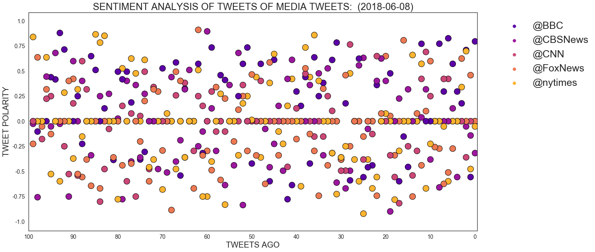
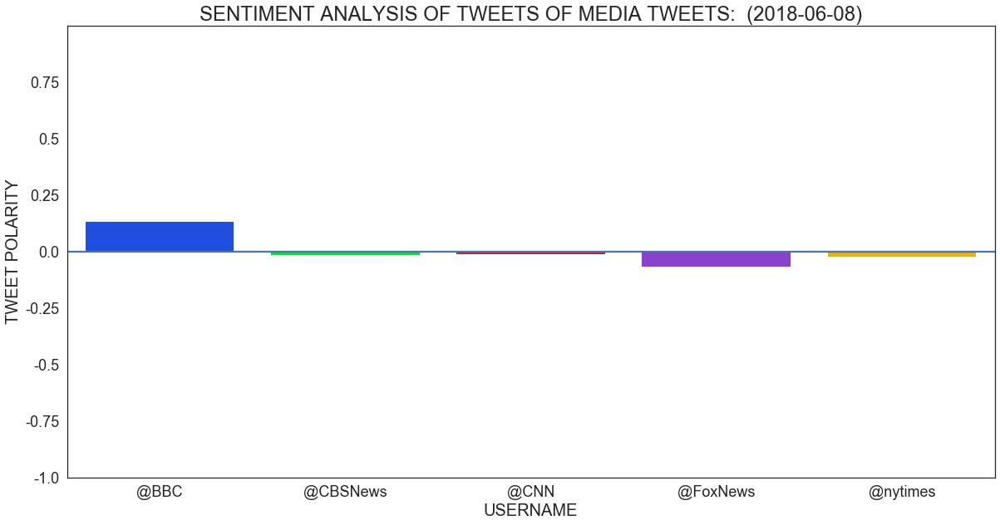

# Distinguishing Sentiments

In this exercise 100 tweets per the following media sources are collected and then processed via Vader analysis. There are two plots in this assignment.  The first plots the "sentiment polarity' of last 100 tweets in relative to their chronalogical order.

The second plots the overall "sentiment polarity" of all tweets in aggregate per media source.  


```python
# Dependencies
import tweepy
import numpy as np
import pandas as pd
from datetime import datetime
import matplotlib.pyplot as plt

# Import and Initialize Sentiment Analyzer
from vaderSentiment.vaderSentiment import SentimentIntensityAnalyzer
analyzer = SentimentIntensityAnalyzer()
import seaborn as sns

# Twitter API Keys
from config import (consumer_key,
                    consumer_secret,
                    access_token,
                    access_token_secret)

# Setup Tweepy API Authentication
auth = tweepy.OAuthHandler(consumer_key, consumer_secret)
auth.set_access_token(access_token, access_token_secret)
api = tweepy.API(auth, parser=tweepy.parsers.JSONParser())
```


```python
# List for dictionaries of results
target_user = ('@BBC', '@CBSNews', '@CNN', '@FoxNews', '@nytimes')
results_list = []


# Loop through each user
for user in target_user:
    counter = 0
    
    # Variables for holding sentiments
    compound_list = []
    positive_list = []
    negative_list = []
    neutral_list = []

    # Loop through pages of tweets
    for x in range(1, 101):

        # Get all tweets from home feed
        public_tweets = api.user_timeline(user, page=x)
        counter += 1

        # Loop through all tweets
        for tweet in public_tweets:

            # Run Vader Analysis on each tweet
            results = analyzer.polarity_scores(tweet["text"])
            compound = results["compound"]
            pos = results["pos"]
            neu = results["neu"]
            neg = results["neg"]


        # Create a dictionary of results
        user_results = {
            "Username": user,
            "Date": tweet["created_at"],
            "Tweets Ago": counter,
            "Compound Score": compound,
            "Postive Score": pos,
            "Neutral Score": neu,
            "Negative Score": neg
        }

        # Append dictionary to list
        results_list.append(user_results)
        

    
```

### Create a DataFrame from the Collected Lists 


```python
# Create DataFrame from Results List
results_df = pd.DataFrame(results_list).round(3)
results_df.reset_index()
results_df.head()
```


<div>
<style scoped>
    .dataframe tbody tr th:only-of-type {
        vertical-align: middle;
    }

    .dataframe tbody tr th {
        vertical-align: top;
    }

    .dataframe thead th {
        text-align: right;
    }
</style>
<table border="1" class="dataframe">
  <thead>
    <tr style="text-align: right;">
      <th></th>
      <th>Compound Score</th>
      <th>Date</th>
      <th>Negative Score</th>
      <th>Neutral Score</th>
      <th>Postive Score</th>
      <th>Tweets Ago</th>
      <th>Username</th>
    </tr>
  </thead>
  <tbody>
    <tr>
      <th>0</th>
      <td>0.796</td>
      <td>Thu Jun 07 16:02:03 +0000 2018</td>
      <td>0.000</td>
      <td>0.530</td>
      <td>0.470</td>
      <td>1</td>
      <td>@BBC</td>
    </tr>
    <tr>
      <th>1</th>
      <td>-0.557</td>
      <td>Wed Jun 06 12:21:20 +0000 2018</td>
      <td>0.153</td>
      <td>0.847</td>
      <td>0.000</td>
      <td>2</td>
      <td>@BBC</td>
    </tr>
    <tr>
      <th>2</th>
      <td>0.710</td>
      <td>Tue Jun 05 10:34:07 +0000 2018</td>
      <td>0.000</td>
      <td>0.763</td>
      <td>0.237</td>
      <td>3</td>
      <td>@BBC</td>
    </tr>
    <tr>
      <th>3</th>
      <td>0.178</td>
      <td>Sun Jun 03 20:42:07 +0000 2018</td>
      <td>0.165</td>
      <td>0.683</td>
      <td>0.153</td>
      <td>4</td>
      <td>@BBC</td>
    </tr>
    <tr>
      <th>4</th>
      <td>0.296</td>
      <td>Sat Jun 02 17:05:04 +0000 2018</td>
      <td>0.086</td>
      <td>0.779</td>
      <td>0.135</td>
      <td>5</td>
      <td>@BBC</td>
    </tr>
  </tbody>
</table>
</div>


### Plot 1:  
Plot of "sentiment polarity' of last 100 tweets per media source sorted by chronalogical order.


```python
x_axis = np.arange(0,101,10)
y_axis = np.arange(-1.25,1.25,.25)
x = results_df['Tweets Ago']
y = results_df['Compound Score']


p = sns.stripplot(x = x , y = y, hue=results_df['Username'], edgecolor='#000000', 
                  size=15, linewidth=1, data= results_df, palette= "plasma")
sns.set(style="white", context="talk")


now = datetime.now()
now = now.strftime("%Y-%m-%d")

p.set_title(f"SENTIMENT ANALYSIS OF TWEETS OF MEDIA TWEETS:  ({now})", fontsize=24)
p.set_ylabel("TWEET POLARITY",fontsize=20)
p.set_xlabel("TWEETS AGO", fontsize=20)
p.set_xticks(x_axis)
p.set_xticklabels(x_axis, fontsize= 14)
p.set_yticklabels(y_axis, fontsize= 14)
p.figure.axes[0].invert_xaxis()
p.figure.set_figwidth(20)
p.figure.set_figheight(10)
plt.legend(bbox_to_anchor=(1.04,1), loc="upper left", fontsize=25, )


plt.show()


```





### Plot 2:  
Plot of the overall "sentiment polarity" of all tweets in aggregate per media source.  


```python
y_axis = np.arange(-1, 1, .25)
x_axis = results_df["Username"].unique()
sns.set(style="white", context="talk")


p2 = sns.barplot(x = results_df["Username"] , y = y,ci=None, palette= "bright")
p2.set_title(f"SENTIMENT ANALYSIS OF TWEETS OF MEDIA TWEETS:  ({now})", fontsize=24)
p2.set_ylabel("TWEET POLARITY",fontsize=20)
p2.set_xlabel("USERNAME", fontsize=20)
p2.set_yticklabels(y_axis, fontsize = 18)
p2.set_xticklabels(x_axis,fontsize = 18)
p2.figure.set_figwidth(20)
p2.figure.set_figheight(10)
p2.axhline(y = 0)
p2.set_ylim(-1, 1)


plt.show()

```





```python
results_df.to_csv("sentiment.csv")

# See it saved!
import os
os.listdir()
```


    ['.ipynb_checkpoints',
     'config.py',
     'sentiment.csv',
     'SocialPy.ipynb',
     '__pycache__']


### Observations

1 - Most tweets from these media sources are neutral.  You see that the compound score for each source is aligned against the origin of the Y axis.

2 - CNN, NYTimes, and CBSNews remained relatively neutral over their past 100 tweets.  BBC is suprisingly positive and FoxNews is negative. This is only representative of the last 100 tweets and also subject to the languaged used the writer of the source.  There is no guarantee that each 100 tweets posted per media resource was even authored by the same person.

3 - Although there is some diversion per media source, they are all still relatively neutral.  
